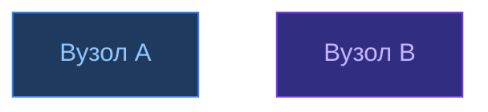

# AGENTS.md — Інструкції для AI-агентів

> Цей файл описує правила побудови, форматування та розширення бази знань **AlphaFold 3**.
> Призначений для AI-агентів (Claude та інших), що працюють з vault.

---

## 1. Структура vault

```
AlphaFold3/
├── 🏠 Головна.md          ← єдина точка входу, в корені
├── AGENTS.md              ← цей файл
├── UA/                    ← УСІ українські нотатки
│   ├── 01_AlphaFold3/     ← нотатки безпосередньо про AF3
│   │   ├── Архітектура/
│   │   ├── Огляд/
│   │   ├── Результати/
│   │   ├── Обмеження/
│   │   ├── Ресурси/
│   │   └── Ілюстрації/
│   └── 02_Концепції/      ← фонові концепції біології та ML
│       ├── Біологія/
│       ├── Машинне-Навчання/
│       └── Структурна-Біоінформатика/
└── EN/                    ← УСІ англійські нотатки
    └── 01_AlphaFold3/
        ├── Architecture/
        ├── Overview/
        ├── Results/
        ├── Limitations/
        └── Resources/
```

### 1.1 Правила структури

- **Мовне розділення**: `UA/` — виключно українська, `EN/` — виключно англійська.
- **Власні назви** (`AlphaFold3`, `Pairformer`, `DockQ`, `RMSD`, `MSA`, `lDDT`) **не перекладаються** в жодній мові.
- **Нумерація папок**: `01_`, `02_` — для визначення порядку в навігації.
- **Корінь vault** містить лише: `🏠 Головна.md`, `AGENTS.md`, `.obsidian/`, `.smart-env/`.
- **Дзеркальна структура**: кожна UA-нотатка має відповідник в EN з тією ж темою.
- **Index/Індекс**: кожна секція `02_Концепції` має файл `Індекс.md` (UA) / `Index.md` (EN).

---

## 2. Мовні правила

### 2.1 Українська (UA/)

| Категорія | Правило | Приклад |
|-----------|---------|---------|
| Папки | Повністю українською | `Архітектура/`, `Біологія/` |
| Файли | Повністю українською | `Дифузійний модуль.md` |
| Власні назви | Залишати латиницею | `Pairformer.md`, `AlphaFold3` |
| Абревіатури | Залишати латиницею | `RMSD`, `MSA`, `lDDT`, `DockQ` |
| H1 заголовок | Українською | `# Дифузійний модуль` |

### 2.2 Англійська (EN/)

| Категорія | Правило | Приклад |
|-----------|---------|---------|
| Папки | Повністю англійською | `Architecture/`, `Results/` |
| Файли | Повністю англійською | `Diffusion Module.md` |
| Власні назви | Залишати латиницею | `Pairformer.md` |
| H1 заголовок | Англійською | `# Diffusion Module` |

---

## 3. Формат нотаток

### 3.1 Frontmatter (обов'язковий)

```yaml
---
cssclasses: [concepts-note]        # або: homepage, diffusion-note, concepts-index
tags: [biology, protein-folding]   # snake_case, тематичні
---
```

**cssclasses:**
- `homepage` — головна сторінка
- `concepts-index` — індекс секції
- `concepts-note` — звичайна концептуальна нотатка
- `diffusion-note` — нотатки з LaTeX-формулами (синій бордер блоків)

### 3.2 Breadcrumb-навігація (перший рядок після H1)

```markdown
# Назва нотатки

[[🏠 Головна]] > [[UA/02_Концепції/Індекс|Концепції]] > Біологія
🇬🇧 [[EN/01_AlphaFold3/Architecture/Diffusion Module|English]]
```

### 3.3 Внутрішні посилання

Завжди **абсолютні від кореня vault**:

```markdown
✅ [[UA/01_AlphaFold3/Архітектура/Pairformer|Pairformer]]
✅ [[EN/01_AlphaFold3/Architecture/Pairformer|Pairformer]]
❌ [[Архітектура/Pairformer]]      ← відносні шляхи ламаються
❌ [[Pairformer]]                  ← Obsidian може знайти не той файл
```

### 3.4 Секція DOI / джерел

Всі наукові твердження завершуються блоком:

```markdown
> Автор et al. (рік). *Назва статті*. Журнал.
> DOI: [10.xxxx/xxxxx](https://doi.org/10.xxxx/xxxxx)
```

---

## 4. Візуалізація (Mermaid)

**Правило**: замість ASCII-діаграм — завжди Mermaid.

### 4.1 Кольорова схема (єдина для всього vault)

```
Вхід/Input:    fill:#1e3a5f, stroke:#3b82f6, color:#93c5fd   (синій)
Trunk/Pair:    fill:#312e81, stroke:#7c3aed, color:#c4b5fd   (фіолетовий)
Дифузія:       fill:#14532d, stroke:#22c55e, color:#86efac   (зелений)
Впевненість:   fill:#7c2d12, stroke:#ea580c, color:#fdba74   (помаранчевий)
Вихід/Output:  fill:#134e4a, stroke:#14b8a6, color:#5eead4   (смарагдовий)
Нейтральний:   fill:#1e293b, stroke:#475569, color:#94a3b8   (сірий)
```

### 4.2 Типи діаграм по задачі

| Задача | Тип Mermaid |
|--------|-------------|
| Пайплайн/потік | `flowchart LR` або `flowchart TD` |
| Хронологія | `timeline` |
| Порівняння | `quadrantChart` |
| Графіки/метрики | `xychart-beta` (bar або line) |
| Структура vault | `flowchart LR` з subgraph |
| Концептуальна карта | `mindmap` |
| Зв'язки між концептами | `flowchart LR` з кольоровими classDef |

### 4.3 Приклад classDef



---

## 5. LaTeX-формули

Використовуються в нотатках з `cssclasses: [diffusion-note]`.

```markdown
Інлайн:  $q(x_t|x_0) = \mathcal{N}(\sqrt{\bar\alpha_t}x_0, (1-\bar\alpha_t)\mathbf{I})$

Блок:
$$\mathcal{L} = \mathbb{E}\bigl[\|\varepsilon - \varepsilon_\theta(\ldots)\|^2\bigr]$$

Виділене (boxed):
$$\boxed{q(x_t|x_0) = \mathcal{N}(\sqrt{\bar\alpha_t}x_0,\,(1-\bar\alpha_t)\mathbf{I})}$$
```

---

## 6. CSS-сніпети (.obsidian/snippets/)

### `homepage.css`
- Градієнтний H1
- Стилізовані навігаційні списки
- Hover-ефекти на таблицях
- Перевизначення стилів Dataview

### `diffusion-note.css`
- Блоки формул: синя ліва рамка
- Блоки джерел `>`: фіолетова рамка
- Monospace для ASCII
- Синій H2, фіолетовий H3

**Підключення** через `appearance.json`:
```json
"enabledCssSnippets": ["homepage", "diffusion-note"]
```

---

## 7. Dataview-запити

### Головна сторінка — всі нотатки vault:
```dataview
TABLE WITHOUT ID
  file.link AS Нотатка,
  file.folder AS Папка,
  length(file.inlinks) AS "← In",
  length(file.outlinks) AS "→ Out"
FROM "UA" OR "EN"
WHERE !contains(file.path, ".obsidian")
SORT file.folder ASC, file.name ASC
```

### EN Home — тільки EN:
```dataview
FROM "EN"
WHERE !contains(file.path, ".obsidian")
  AND file.name != "Home"
```

---

## 8. Homepage plugin

Конфіг: `.obsidian/plugins/homepage/data.json`

```json
{
  "version": 4,
  "openOnStartup": true,
  "defaultNote": "🏠 Головна",
  "view": "Reading view",
  "openWhenEmpty": true,
  "refreshDataview": true
}
```

---

## 9. Правила для нових нотаток

### 9.1 Нотатка в UA/01_AlphaFold3/

1. Frontmatter з `cssclasses` та `tags`
2. H1 українською
3. Breadcrumb + посилання на EN-дзеркало
4. Контент з Mermaid-схемами замість ASCII
5. Таблиці для порівнянь (AF3 vs конкуренти)
6. Блок DOI в кінці
7. Секція `## Пов'язані нотатки` з абсолютними wiki-links

### 9.2 Нотатка в UA/02_Концепції/

1. Frontmatter: `cssclasses: [concepts-note]`
2. Breadcrumb: `[[🏠 Головна]] > [[UA/02_Концепції/Індекс|Концепції]] > Категорія`
3. Визначення концепту
4. Математична формула (якщо є)
5. Mermaid-схема
6. Таблиця: зв'язок з AlphaFold 3
7. DOI джерел
8. Секція `## Пов'язані нотатки`

### 9.3 Після додавання нотатки

- Оновити `UA/02_Концепції/Індекс.md` (додати рядок у таблицю)
- Оновити `🏠 Головна.md` (додати посилання в потрібну секцію)
- Створити EN-дзеркало в `EN/01_AlphaFold3/`
- Оновити `EN/01_AlphaFold3/Home.md`

---

## 10. Заборони

- ❌ **Не використовувати ASCII-діаграми** — замінювати на Mermaid
- ❌ **Не використовувати відносні посилання** — тільки абсолютні від кореня
- ❌ **Не змішувати мови** в одній папці (`UA/` — тільки укр, `EN/` — тільки англ)
- ❌ **Не перекладати власні назви**: AlphaFold, Pairformer, RMSD, MSA, DockQ, lDDT
- ❌ **Не створювати файли в корені vault** (крім `🏠 Головна.md` і `AGENTS.md`)
- ❌ **Не використовувати `<div>` або HTML** всередині wiki-links (Obsidian не рендерить)
- ❌ **Не використовувати bullet-lists** там де достатньо таблиці або prose
