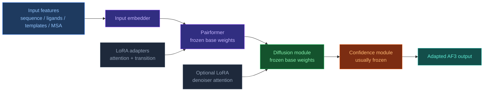

<!-- markdownlint-disable MD013 -->

# AF3 Architecture Overview

[[Home|Home]] > Architecture
🇺🇦 [[UA/1. AlphaFold3/1.2. Архітектура/1.2.1. Загальна архітектура AF3|Українська]]

---

## High-Level Schema

AF3 inherits the general structure of AF2 but with major changes in every component:

```text
Input (sequences, ligands, covalent bonds)
  ↓
Input Embedder (3 blocks)
  ↓ ← Template Module (2 blocks)
  ↓ ← MSA Module (4 blocks)  ← reduced vs AF2
  ↓
Pairformer (48 blocks)  ← replaces Evoformer
  ↓
Diffusion Module (3 + 24 + 3 blocks)  ← replaces Structure Module
  ↓
Confidence Module (4 blocks)
  ↓
Output: 3D atom coordinates
```

## Key Differences from AF2

| Component | AF2 | AF3 |
| --- | --- | --- |
| Main processing block | Evoformer | **Pairformer** |
| Structure generation | Structure Module (torsion angles) | **Diffusion Module** (raw coordinates) |
| MSA processing | Central role | Greatly simplified (4 blocks) |
| Chemical generality | Proteins / complexes only | All molecular types |
| Residue parametrization | Frames + torsion angles | Raw atom coordinates |

## AF3 + LoRA in a custom fork

`LoRA` is not part of the published AF3 inference pipeline, but in a custom fork it can be added as a parameter-efficient adaptation layer on top of frozen AF3 weights.

### Main idea

Instead of updating full weight matrices, the fork keeps base weights frozen and learns small low-rank updates:

$$W' = W + \Delta W, \qquad \Delta W = \frac{\alpha}{r}BA$$

This is most natural in the transformer-like linear projections of the AF3 trunk.

### Where LoRA fits best

| AF3 component | First LoRA target | Why this is the safest starting point |
| --- | --- | --- |
| Pairformer | single-attention `Q/K/V/O` projections | closest analogue to standard transformer adaptation |
| Pairformer transitions | feed-forward / transition linear layers | small domain shift can often be absorbed here |
| Diffusion module | attention projections inside the denoiser | useful later, but more sensitive because diffusion errors accumulate |
| Confidence head | usually leave frozen at first | easiest way to avoid destabilizing calibration |

### Principle diagram for a fork



### Practical fork strategy

1. Freeze the full AF3 model.
2. Add `LoRA` only to Pairformer attention and transition projections.
3. Train on a narrow domain or task-specific dataset.
4. Add LoRA to diffusion attention only if trunk-only adaptation is insufficient.
5. Re-check confidence and structural quality separately after adaptation.

### Why start with Pairformer

- Pairformer is the main latent-processing trunk of AF3.
- Its attention and transition layers are the most direct equivalent of standard transformer blocks.
- LoRA in the trunk can shift the internal conditioning sent into the diffusion module without immediately perturbing the full denoising dynamics.

### Main risks

- If LoRA is inserted too aggressively into the diffusion module, denoising errors may accumulate across timesteps.
- A narrow adaptation dataset can over-specialize interfaces, ligand placements, or nucleic-acid contacts.
- Confidence predictions may become miscalibrated even when geometry improves on the target domain.

## Other PEFT methods for AF3-like models

`LoRA` is only one member of a broader family of parameter-efficient fine-tuning (`PEFT`) methods. For AF3-like models, the main question is not just parameter count, but **where the adaptation pressure enters the system**: in the Pairformer trunk, in the diffusion denoiser, or in the confidence and output layers.

### Comparison at a glance

| Method | Core idea | Best first target in AF3-like models | Main advantage | Main drawback |
| --- | --- | --- | --- | --- |
| `AdaLoRA` | adaptive low-rank budget | Pairformer attention + transitions | better parameter allocation across layers | more moving parts than plain LoRA |
| `DoRA` | decouple direction and magnitude updates | Pairformer attention / MLP projections | can be more stable than LoRA under stronger domain shift | slightly more complex adaptation path |
| `IA3` | learn channel-wise rescaling vectors | attention and feed-forward channels | extremely cheap in trainable parameters | weaker capacity than LoRA/adapters |
| `BitFit` | train only bias terms | upper Pairformer blocks | simplest baseline | often too weak for structural domain adaptation |
| Bottleneck adapters | insert small trainable MLP blocks | after Pairformer attention or transitions | higher expressive power | heavier than LoRA/IA3 |
| Prefix / prompt tuning | learn extra conditioning tokens or vectors | input conditioning before trunk | low intrusion into base weights | less natural for structure models than for LLMs |
| Partial fine-tuning | unfreeze a subset of original layers | upper Pairformer or limited diffusion attention | direct and powerful | highest memory and overfitting risk among these options |

### 1. AdaLoRA

`AdaLoRA` starts from the same low-rank idea as `LoRA`, but does not keep the same rank everywhere. It reallocates adaptation budget toward layers that appear more important during training.

#### Why AdaLoRA can help in AF3-like models

- Not all Pairformer blocks are equally important for a given domain shift.
- Some tasks may require stronger adaptation in pair-to-single coupling, while others need more change in upper trunk blocks.
- Adaptive rank can be useful when the best insertion pattern is unknown at the start.

#### Best use of AdaLoRA in AF3-like models

- Start with Pairformer attention and transition projections.
- Keep the diffusion module frozen during the first experiments.
- Use it when plain LoRA looks under-parameterized in some layers and wasteful in others.

#### AdaLoRA pros

- Better parameter efficiency than assigning the same rank to every target layer.
- More flexible under uneven domain shift across the trunk.
- Good next step after a plain LoRA baseline.

#### AdaLoRA cons

- Harder to reason about and tune than fixed-rank LoRA.
- More training instability risk when the dataset is small.
- Harder to interpret which structural behaviors changed and why.

### 2. DoRA

`DoRA` can be viewed as a LoRA-like method that separates directional change from magnitude scaling of the weight update. In practice, this can make the adaptation less crude than a single low-rank residual.

#### Why DoRA can help in AF3-like models

- AF3-like trunks already encode rich geometry-aware priors.
- Sometimes the model needs a careful redirection of existing features, not a large new residual.
- That makes a magnitude-aware adaptation scheme attractive for moderate but nontrivial domain shifts.

#### Best use of DoRA in AF3-like models

- Pairformer attention projections.
- Pairformer transition MLPs.
- Possibly the highest-level diffusion attention blocks, but only after trunk adaptation is validated.

#### DoRA pros

- Often more stable than plain LoRA when the adaptation must be subtle.
- Can preserve pretrained structure better while still shifting task behavior.
- Useful when you want a stronger method without jumping to full adapters.

#### DoRA cons

- More complex than LoRA to implement and reason about in a custom fork.
- Less standardized in tooling and examples.
- Gains may be small if the domain shift is either tiny or extremely large.

### 3. IA3

`IA3` does not add a full low-rank residual. Instead, it learns multiplicative scaling factors over internal channels, usually in attention and feed-forward pathways.

#### Why IA3 can help in AF3-like models

- AF3-like models have expensive trunks, and a very cheap adaptation method is useful when many domain-specific variants are needed.
- Channel reweighting can be enough when the target domain differs mostly in emphasis, not in basic structural logic.

#### Best use of IA3 in AF3-like models

- Pairformer single-attention channels.
- Feed-forward / transition channels in later trunk blocks.
- As a very low-cost baseline before trying LoRA or adapters.

#### IA3 pros

- Extremely small number of trainable parameters.
- Low memory overhead and simple deployment.
- Good baseline for testing whether the domain needs only mild reweighting.

#### IA3 cons

- Lower expressive power than LoRA, DoRA, or bottleneck adapters.
- May be too weak for ligand-heavy, nucleic-acid-heavy, or strongly shifted interface distributions.
- If the model needs new geometric behavior, channel scaling alone may not be enough.

### 4. BitFit

`BitFit` updates only bias terms and leaves all main weight matrices frozen.

#### Why BitFit can help in AF3-like models

- It is the easiest possible adaptation baseline.
- If even BitFit helps, the target task may only need small recentering of pretrained activations.

#### Best use of BitFit in AF3-like models

- Upper Pairformer blocks.
- Possibly confidence layers when calibration drift is the main problem.

#### BitFit pros

- Minimal implementation effort.
- Very cheap to train and store.
- Useful as a control experiment against stronger methods.

#### BitFit cons

- Usually too weak for meaningful structural adaptation.
- Unlikely to be enough for changing docking behavior or multimolecular interaction patterns.
- Can fail silently: training looks stable but geometry barely improves.

### 5. Bottleneck adapters

Bottleneck adapters insert a small trainable module, typically a down-projection, nonlinearity, and up-projection, into the residual stream.

#### Why bottleneck adapters can help in AF3-like models

- They provide more nonlinear capacity than LoRA-like methods.
- This can matter if the new domain is not just a small redirection of existing features.
- For AF3-like models, this is attractive when pair geometry or cross-entity context needs a stronger rewrite.

#### Best use of bottleneck adapters in AF3-like models

- After Pairformer attention blocks.
- After transition blocks in upper or middle trunk layers.
- More cautiously inside diffusion attention blocks due to repeated denoising sensitivity.

#### Bottleneck adapter pros

- More expressive than LoRA or IA3.
- Can absorb larger domain shifts.
- Easier to target to specific blocks than partial full fine-tuning.

#### Bottleneck adapter cons

- Higher parameter count and memory cost.
- Greater risk of disturbing pretrained latent geometry.
- More invasive changes to the architecture of a custom fork.

### 6. Prefix tuning and prompt-like conditioning

In language models, prefix tuning learns extra virtual tokens. In AF3-like models, the closest analogue is a small learned conditioning set added before or inside the trunk.

#### Why prefix tuning can help in AF3-like models

- It modifies the input-side conditioning rather than rewriting many internal weights.
- That can be attractive when adaptation is mostly about task mode, data regime, or domain identity.

#### Best use of prefix tuning in AF3-like models

- Learned domain tokens before Pairformer input processing.
- Learned conditioning vectors for specific complex types or ligand families.

#### Prefix tuning pros

- Minimal intrusion into pretrained weights.
- Clean separation between base model and task conditioning.
- Attractive when multiple domains share the same base geometry engine.

#### Prefix tuning cons

- Less natural than in autoregressive transformers.
- Harder to guarantee that the conditioning propagates strongly enough through Pairformer and diffusion.
- Often weaker than direct trunk adaptation for structural tasks.

### 7. Partial fine-tuning

Partial fine-tuning is not strictly PEFT in the narrow sense, but in practice it is often the strongest nearby baseline: unfreeze only a selected subset of the original AF3-like weights.

#### Why partial fine-tuning can help in AF3-like models

- Some domains may simply need more capacity than adapters can provide.
- Unfreezing only upper Pairformer blocks can let the model reshape higher-level interaction logic while preserving low-level geometric priors.

#### Best use of partial fine-tuning in AF3-like models

- Top Pairformer blocks.
- Limited diffusion attention layers after trunk adaptation is already tested.
- Confidence head only when calibration under domain shift is the dominant issue.

#### Partial fine-tuning pros

- Stronger adaptation capacity than most PEFT methods.
- Simple conceptual baseline.
- Often easier to debug than stacked adapter mechanisms.

#### Partial fine-tuning cons

- Much higher memory cost.
- Higher overfitting risk on narrow structural datasets.
- Greater chance of damaging pretrained geometry or confidence calibration.

### Practical recommendation for AF3-like forks

For most AF3-like adaptation projects, a sensible order is:

1. `BitFit` or `IA3` as a minimal baseline.
2. `LoRA` as the default practical method.
3. `AdaLoRA` or `DoRA` if plain LoRA is too rigid.
4. Bottleneck adapters if the domain shift is large and LoRA-like methods are too weak.
5. Partial fine-tuning only after the cheaper methods have been tested.

In short: the more your target domain requires **reweighting**, the more `IA3`-like methods are enough; the more it requires **rewriting latent geometry and interaction logic**, the more you should move toward adapters or selective unfreezing.

## Recycling

The model uses **iterative recycling**: part of the output of one pass is fed back into the next pass so that the geometry of the complex can be refined progressively.

### Why recycling is needed

A single pass is often not enough because structure prediction must solve several coupled problems at once:

- local chemistry and stereogeometry;
- intra-chain packing;
- global domain arrangement;
- inter-chain and protein-ligand / protein-RNA interfaces.

An early pass may capture only part of that signal while failing to make all levels mutually consistent.
Recycling lets the model use its own intermediate structural hypothesis as context for the next refinement step.

### What happens conceptually

At a high level, the loop looks like this:

```mermaid
flowchart LR
    IN["Initial features<br/>sequence / ligands / MSA / templates"]:::input --> TRUNK["Input embedder + Pairformer"]:::trunk
    TRUNK --> DIFF["Diffusion module"]:::diffusion
    DIFF --> OUT["Intermediate structure<br/>and updated representations"]:::confidence
    OUT --> REC["Recycling step<br/>feed features back"]:::neutral
    REC --> TRUNK2["Next pass"]:::trunk
    TRUNK2 --> FINAL["Refined structure"]:::output

    classDef input fill:#1e3a5f,stroke:#3b82f6,color:#93c5fd
    classDef trunk fill:#312e81,stroke:#7c3aed,color:#c4b5fd
    classDef diffusion fill:#14532d,stroke:#22c55e,color:#86efac
    classDef confidence fill:#7c2d12,stroke:#ea580c,color:#fdba74
    classDef output fill:#134e4a,stroke:#14b8a6,color:#5eead4
    classDef neutral fill:#1e293b,stroke:#475569,color:#94a3b8
```



The point is not that the model simply restarts several times, but that it reuses its own previous structural context.

### Why it works

- **Global consistency improves gradually**: after one pass, the model already has a partial guess about domain placement, interfaces, and ligand position.
- **Local and global errors can be corrected in stages**: one iteration may improve backbone packing, the next may improve an interface or ligand orientation.
- **The model gets its own hypothesis back as input**: this is close in spirit to iterative self-conditioning.
- **This is especially helpful for hard complexes**, where an error in one region propagates into others.

### Intuition

Recycling can be understood as repeated editing of a draft:

1. the first pass creates a rough but already meaningful structure;
2. the next pass sees that draft;
3. the model corrects poorly aligned contacts, packing, and geometry;
4. the final answer is more stable than after a single pass.

### Where similar ideas appear

- **AlphaFold2** also uses recycling as a core part of iterative structure refinement.
- **AlphaFold-Multimer** keeps the same general logic for complex prediction.
- **Diffusion models** more broadly are also iterative: the object state is refined repeatedly through a sequence of denoising steps.

So recycling in AF3 is an extra layer of iterative refinement on top of learned structural reasoning, not just a blind rerun of the model.

> Abramson et al. (2024). *Accurate structure prediction of biomolecular interactions with AlphaFold 3*. Nature.
> DOI: [10.1038/s41586-024-07487-w](https://doi.org/10.1038/s41586-024-07487-w)
> Jumper et al. (2021). *Highly accurate protein structure prediction with AlphaFold*. Nature.
> DOI: [10.1038/s41586-021-03819-2](https://doi.org/10.1038/s41586-021-03819-2)
> Hu et al. (2021). *LoRA: Low-Rank Adaptation of Large Language Models*. arXiv.
> DOI: [10.48550/arXiv.2106.09685](https://doi.org/10.48550/arXiv.2106.09685)

---

## Related Notes

- [[EN/1. AlphaFold3/1.2. Architecture/1.2.2. Pairformer]]
- [[EN/1. AlphaFold3/1.2. Architecture/1.2.3. Diffusion Module]]
- [[EN/1. AlphaFold3/1.2. Architecture/1.2.5. Model Training]]
- [[EN/2. Concepts/2.2. Machine-Learning/2.2.1. Transformers]]
- [[EN/2. Concepts/2.2. Machine-Learning/2.2.2. Diffusion Models]]

## Tags

`#architecture` `#neural-network` `#transformer`
