# AF3 Architecture Overview

[[Home|Home]] > Architecture
🇺🇦 [[UA/1. AlphaFold3/1.2. Архітектура/1.2.1. Загальна архітектура AF3|Українська]]

---

## High-Level Schema

AF3 inherits the general structure of AF2 but with major changes in every component:

```
Input (sequences, ligands, covalent bonds)
  ↓
Input Embedder (3 blocks)
  ↓ ← Template Module (2 blocks)
  ↓ ← MSA Module (4 blocks)  ← reduced vs AF2
  ↓
Pairformer (48 blocks)  ← replaces Evoformer
  ↓
Diffusion Module (3 + 24 + 3 blocks)  ← replaces Structure Module
  ↓
Confidence Module (4 blocks)
  ↓
Output: 3D atom coordinates
```

## Key Differences from AF2

| Component | AF2 | AF3 |
|---|---|---|
| Main processing block | Evoformer | **Pairformer** |
| Structure generation | Structure Module (torsion angles) | **Diffusion Module** (raw coordinates) |
| MSA processing | Central role | Greatly simplified (4 blocks) |
| Chemical generality | Proteins / complexes only | All molecular types |
| Residue parametrization | Frames + torsion angles | Raw atom coordinates |

## Recycling

The model uses **iterative recycling**: part of the output of one pass is fed back into the next pass so that the geometry of the complex can be refined progressively.

### Why recycling is needed

A single pass is often not enough because structure prediction must solve several coupled problems at once:

- local chemistry and stereogeometry;
- intra-chain packing;
- global domain arrangement;
- inter-chain and protein-ligand / protein-RNA interfaces.

An early pass may capture only part of that signal while failing to make all levels mutually consistent.
Recycling lets the model use its own intermediate structural hypothesis as context for the next refinement step.

### What happens conceptually

At a high level, the loop looks like this:

```mermaid
flowchart LR
    IN["Initial features<br/>sequence / ligands / MSA / templates"]:::input --> TRUNK["Input embedder + Pairformer"]:::trunk
    TRUNK --> DIFF["Diffusion module"]:::diffusion
    DIFF --> OUT["Intermediate structure<br/>and updated representations"]:::confidence
    OUT --> REC["Recycling step<br/>feed features back"]:::neutral
    REC --> TRUNK2["Next pass"]:::trunk
    TRUNK2 --> FINAL["Refined structure"]:::output

    classDef input fill:#1e3a5f,stroke:#3b82f6,color:#93c5fd
    classDef trunk fill:#312e81,stroke:#7c3aed,color:#c4b5fd
    classDef diffusion fill:#14532d,stroke:#22c55e,color:#86efac
    classDef confidence fill:#7c2d12,stroke:#ea580c,color:#fdba74
    classDef output fill:#134e4a,stroke:#14b8a6,color:#5eead4
    classDef neutral fill:#1e293b,stroke:#475569,color:#94a3b8
```



The point is not that the model simply restarts several times, but that it reuses its own previous structural context.

### Why it works

- **Global consistency improves gradually**: after one pass, the model already has a partial guess about domain placement, interfaces, and ligand position.
- **Local and global errors can be corrected in stages**: one iteration may improve backbone packing, the next may improve an interface or ligand orientation.
- **The model gets its own hypothesis back as input**: this is close in spirit to iterative self-conditioning.
- **This is especially helpful for hard complexes**, where an error in one region propagates into others.

### Intuition

Recycling can be understood as repeated editing of a draft:

1. the first pass creates a rough but already meaningful structure;
2. the next pass sees that draft;
3. the model corrects poorly aligned contacts, packing, and geometry;
4. the final answer is more stable than after a single pass.

### Where similar ideas appear

- **AlphaFold2** also uses recycling as a core part of iterative structure refinement.
- **AlphaFold-Multimer** keeps the same general logic for complex prediction.
- **Diffusion models** more broadly are also iterative: the object state is refined repeatedly through a sequence of denoising steps.

So recycling in AF3 is an extra layer of iterative refinement on top of learned structural reasoning, not just a blind rerun of the model.

> Abramson et al. (2024). *Accurate structure prediction of biomolecular interactions with AlphaFold 3*. Nature.
> DOI: [10.1038/s41586-024-07487-w](https://doi.org/10.1038/s41586-024-07487-w)

> Jumper et al. (2021). *Highly accurate protein structure prediction with AlphaFold*. Nature.
> DOI: [10.1038/s41586-021-03819-2](https://doi.org/10.1038/s41586-021-03819-2)

---

## Related Notes
- [[EN/1. AlphaFold3/1.2. Architecture/1.2.2. Pairformer]]
- [[EN/1. AlphaFold3/1.2. Architecture/1.2.3. Diffusion Module]]
- [[EN/1. AlphaFold3/1.2. Architecture/1.2.5. Model Training]]

## Tags
`#architecture` `#neural-network` `#transformer`
