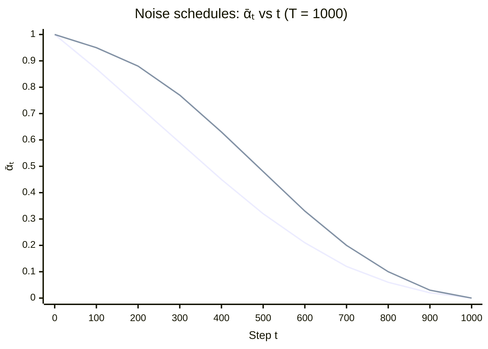
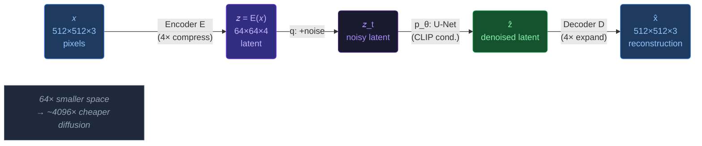
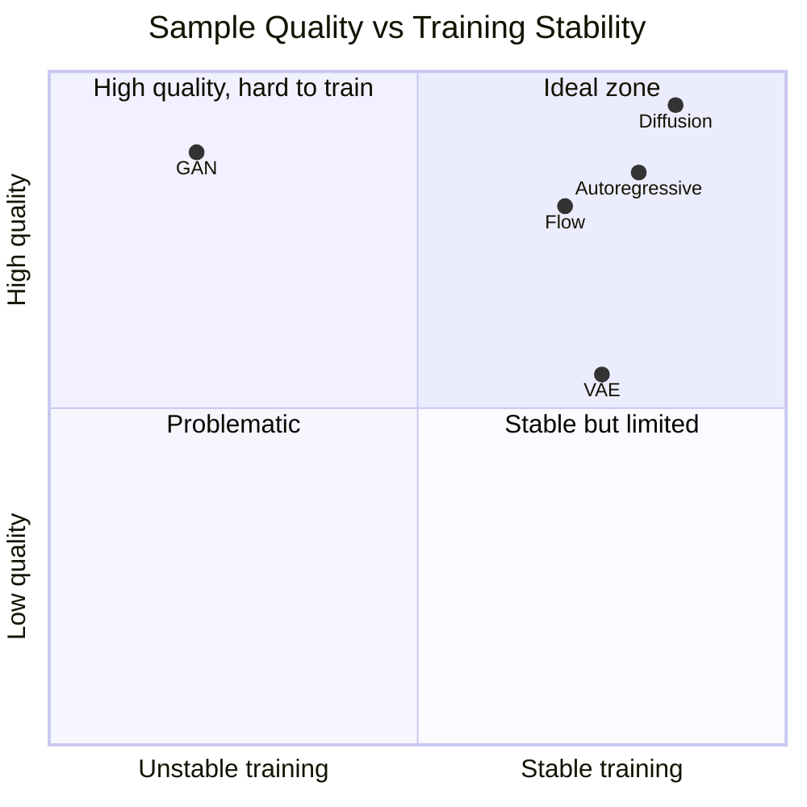
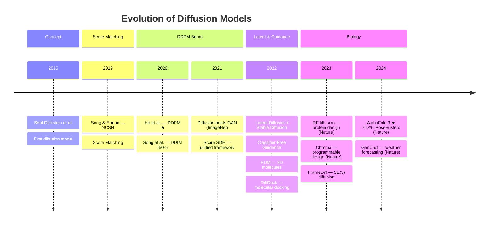
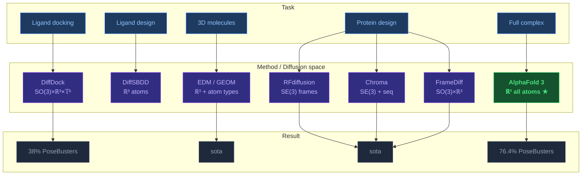
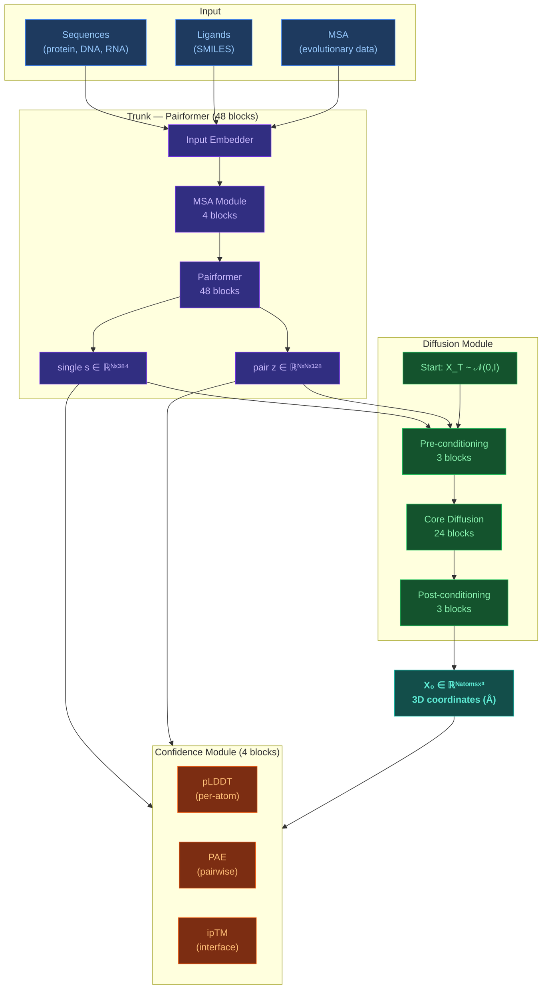
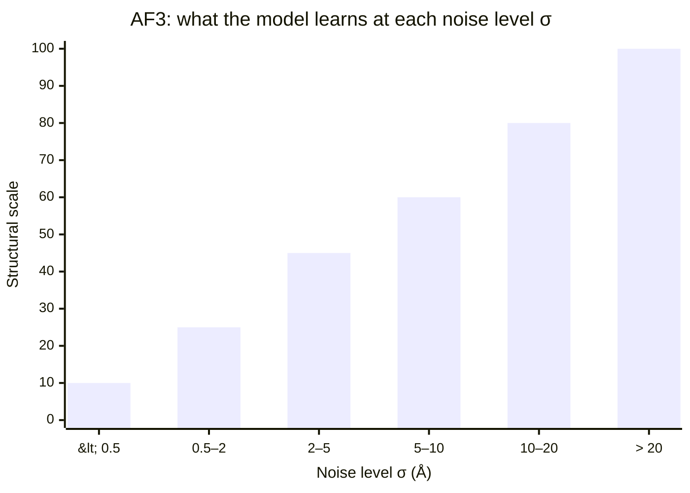

---
cssclasses:
  - math-note
tags:
  - diffusion
  - ddpm
  - score-matching
  - sde
  - generative-models
  - structural-biology
  - latex
---

# Diffusion Models — Theory and Applications

[[Home|Home]] > [[EN/1. AlphaFold3/1.2. Architecture/1.2.3. Diffusion Module]]
🇺🇦 [[UA/1. AlphaFold3/1.2. Архітектура/1.2.4. Дифузійні моделі — теорія та застосування|Українська версія]]

---

## What is a Diffusion Model?

A **diffusion model** learns to generate data by reversing a gradual noising process. The idea comes from non-equilibrium thermodynamics: forward diffusion transforms real data into Gaussian noise, and a neural network learns to invert that process.

> Sohl-Dickstein et al. (2015). ICML. DOI: [10.48550/arXiv.1503.03585](https://doi.org/10.48550/arXiv.1503.03585)
> Ho et al. (2020). NeurIPS. DOI: [10.48550/arXiv.2006.11239](https://doi.org/10.48550/arXiv.2006.11239)

---

## Forward and Reverse Process

```mermaid
flowchart LR
    x0("𝑥₀<br/>clean data"):::clean
    x1("𝑥₁<br/>noise β₁"):::noisy1
    x2("𝑥₂<br/>noise β₂"):::noisy2
    x3("𝑥₃<br/>noise β₃"):::noisy3
    xT("𝑥_T<br/>𝒩(0,I)"):::pure

    x0 -- "q(x₁|x₀)<br/>+β₁ noise" --> x1
    x1 -- "q(x₂|x₁)<br/>+β₂ noise" --> x2
    x2 -- "q(x₃|x₂)<br/>+β₃ noise" --> x3
    x3 -. "..." .-> xT

    xT -- "p_θ(x_{T-1}|x_T)<br/>εθ(xT,T)" --> x3r("𝑥_{T-1}"):::rev
    x3r -- "p_θ<br/>εθ denoises" --> x1r("𝑥₁"):::rev
    x1r -- "p_θ(x₀|x₁)<br/>εθ(x₁,1)" --> x0r("𝑥₀<br/>generated"):::rclean

    classDef clean  fill:#1e3a5f,stroke:#3b82f6,color:#93c5fd
    classDef noisy1 fill:#1e3040,stroke:#475569,color:#94a3b8
    classDef noisy2 fill:#1a2535,stroke:#334155,color:#64748b
    classDef noisy3 fill:#151e2d,stroke:#1e293b,color:#475569
    classDef pure   fill:#0f172a,stroke:#1e293b,color:#334155
    classDef rev    fill:#1a2e1a,stroke:#16a34a,color:#86efac
    classDef rclean fill:#14532d,stroke:#22c55e,color:#4ade80
```



---

## Mathematical Foundations

### Forward process

$$q(x_t \mid x_{t-1}) \;=\; \mathcal{N}\!\Bigl(x_t;\;\sqrt{1-\beta_t}\,x_{t-1},\;\beta_t\,\mathbf{I}\Bigr)$$

**Key property** — closed-form jump from $x_0$ to any $x_t$:

$$\boxed{\;q(x_t \mid x_0) = \mathcal{N}\!\Bigl(x_t;\;\sqrt{\bar\alpha_t}\,x_0,\;(1-\bar\alpha_t)\mathbf{I}\Bigr)\;}$$

where $\bar\alpha_t = \prod_{i=1}^{t}(1-\beta_i)$. Explicit formula: $\;x_t = \sqrt{\bar\alpha_t}\,x_0 + \sqrt{1-\bar\alpha_t}\,\boldsymbol\varepsilon$

### Noise schedules




### Reverse process and loss

$$p_\theta(x_{t-1}\mid x_t) = \mathcal{N}\!\bigl(x_{t-1};\;\mu_\theta(x_t,t),\;\Sigma_\theta(x_t,t)\bigr)$$

$$\mu_\theta(x_t,t) = \frac{1}{\sqrt{\alpha_t}}\!\left(x_t - \frac{\beta_t}{\sqrt{1-\bar\alpha_t}}\,\varepsilon_\theta(x_t,t)\right)$$

$$\boxed{\;\mathcal{L}_\text{simple} = \mathbb{E}_{t,x_0,\boldsymbol\varepsilon}\!\left[\bigl\|\boldsymbol\varepsilon - \varepsilon_\theta\!\bigl(\sqrt{\bar\alpha_t}\,x_0+\sqrt{1-\bar\alpha_t}\,\boldsymbol\varepsilon,\;t\bigr)\bigr\|^2\right]\;}$$

---

## Key Variants

### DDIM — accelerated sampling

DDPM needs $T\approx1000$ steps; **DDIM** generates in **10–50 steps** without retraining:

$$x_{t-1} = \sqrt{\bar\alpha_{t-1}}\underbrace{\!\left(\frac{x_t-\sqrt{1-\bar\alpha_t}\,\varepsilon_\theta}{\sqrt{\bar\alpha_t}}\right)}_{\widehat{x}_0} + \sqrt{1-\bar\alpha_{t-1}-\sigma_t^2}\,\varepsilon_\theta + \sigma_t\boldsymbol\varepsilon$$

$\sigma_t=0$ → deterministic DDIM (50× faster) · $\sigma_t=\sqrt{\beta_t}$ → stochastic DDPM

> Song et al. (2020). ICLR 2021. DOI: [10.48550/arXiv.2010.02502](https://doi.org/10.48550/arXiv.2010.02502)

### Score-Based Models & SDE

$$\text{Forward SDE:}\quad dx = f(x,t)\,dt + g(t)\,dW$$
$$\text{Reverse SDE:}\quad dx = \bigl[f(x,t) - g^2(t)\,\nabla_x\log p_t(x)\bigr]dt + g(t)\,d\bar W$$

Link: $\;s_\theta(x_t,t) = -\varepsilon_\theta(x_t,t)/\sqrt{1-\bar\alpha_t}$

> Song & Ermon (2019). DOI: [10.48550/arXiv.1907.05600](https://doi.org/10.48550/arXiv.1907.05600)
> Song et al. (2021). DOI: [10.48550/arXiv.2011.13456](https://doi.org/10.48550/arXiv.2011.13456)

### Latent Diffusion Models (LDM)



> Rombach et al. (2022). CVPR. DOI: [10.48550/arXiv.2112.10752](https://doi.org/10.48550/arXiv.2112.10752)

### Classifier-Free Guidance (CFG)

$$\tilde\varepsilon_\theta(x_t,c) = \varepsilon_\theta(x_t,\varnothing) + w\cdot\bigl(\varepsilon_\theta(x_t,c)-\varepsilon_\theta(x_t,\varnothing)\bigr)$$

$w=1$: conditional · $w>1$: amplify condition · $w=0$: unconditional

> Ho & Salimans (2022). DOI: [10.48550/arXiv.2207.12598](https://doi.org/10.48550/arXiv.2207.12598)


---

## Comparison of Generative Models



| Model | Quality | Diversity | Inference | Training |
|-------|---------|-----------|-----------|----------|
| **Diffusion** | ✅ Best | ✅ Excellent | ❌ $T$ steps | ✅ Stable |
| GAN | ✅ High | ⚠️ Mode collapse | ✅ One step | ❌ Unstable |
| VAE | ⚠️ Blurry | ✅ Good | ✅ Fast | ✅ Stable |
| Flow | ✅ Exact | ✅ Good | ⚠️ Medium | ⚠️ Invertibility |
| AR | ✅ High | ✅ Good | ❌ Sequential | ✅ Stable |

> Dhariwal & Nichol (2021). NeurIPS. DOI: [10.48550/arXiv.2105.05233](https://doi.org/10.48550/arXiv.2105.05233)

---

## Timeline




---

## Applications in Structural Biology



### Key methods

**AlphaFold 3** — $p_\theta(\mathbf{X}_0 \mid s, z) = \int p_\theta(\mathbf{X}_0 \mid \mathbf{X}_T,s,z)\;p(\mathbf{X}_T)\;d\mathbf{X}_T$ · DOI: [10.1038/s41586-024-07487-w](https://doi.org/10.1038/s41586-024-07487-w)

**DiffDock** — $s_\theta(x_t,t,\mathcal{P})\approx\nabla_x\log p_t(\text{pose}\mid\mathcal{P})$ in $\mathrm{SO}(3)\times\mathbb{R}^3\times\mathbb{T}^k$ · DOI: [10.48550/arXiv.2210.01776](https://doi.org/10.48550/arXiv.2210.01776)

**RFdiffusion** — $R_t = R_0\cdot\exp(\sqrt{t}\,\Omega)$, $\Omega\sim\mathrm{IGSO}(3)$ · DOI: [10.1038/s41586-023-06415-8](https://doi.org/10.1038/s41586-023-06415-8)

**EDM** — $E(3)$-equivariant: $\mathcal{L}=\mathbb{E}[\|\boldsymbol\varepsilon-\varepsilon_\theta(\mathbf{x}_t,\mathbf{h}_t,t)\|^2]$, $\;\mathbf{x}\in\mathbb{R}^{N\times3}$ · DOI: [10.48550/arXiv.2203.17003](https://doi.org/10.48550/arXiv.2203.17003)

**Chroma** — DOI: [10.1038/s41586-023-06728-8](https://doi.org/10.1038/s41586-023-06728-8) · **RFAA** — DOI: [10.1126/science.adl2528](https://doi.org/10.1126/science.adl2528)

---

## Beyond Biology

| System | Architecture | Backbone | Year |
|--------|-------------|----------|------|
| DALL-E 2 | CLIP + DDPM | U-Net | 2022 |
| **Stable Diffusion** | LDM + CLIP | U-Net | 2022 |
| Imagen | Cascaded + T5 | U-Net | 2022 |
| **FLUX.1** | Flow matching | DiT | 2024 |
| **GenCast** | Diffusion | Graph+Transformer | 2024 |

> Imagen DOI: [10.48550/arXiv.2205.11487](https://doi.org/10.48550/arXiv.2205.11487) · GenCast DOI: [10.1038/s41586-024-08252-9](https://doi.org/10.1038/s41586-024-08252-9) · MRI DOI: [10.48550/arXiv.2111.08005](https://doi.org/10.48550/arXiv.2111.08005)


---

## How Diffusion Works in AF3

### Pipeline architecture



### Noise schedule

$$\log\sigma \sim \mathcal{N}(\mu_P,\sigma_P^2),\quad \mu_P=-1.2,\;\sigma_P=1.5 \qquad \mathbf{X}_\text{noisy} = \mathbf{X}_\text{true} + \sigma\boldsymbol\varepsilon$$

### Multi-scale learning



| Level σ | Scale | What is learned |
|---------|-------|-----------------|
| $<0.5$ Å | Atomic | Bond lengths, valence angles, peptide planarity |
| $0.5$–$5$ Å | Local | Side-chain conformations ($\chi$-angles), loops, rings |
| $5$–$20$ Å | Domain | Relative domain positions, subunit orientations |
| $>20$ Å | Global | Chain orientation, multimer stoichiometry |

### Conditioning

$$\varepsilon_\theta\!\bigl(\mathbf{X}_t,\sigma,\underbrace{s\in\mathbb{R}^{N\times384}}_{\text{single}},\underbrace{z\in\mathbb{R}^{N\times N\times128}}_{\text{pair}}\bigr) \approx \frac{\mathbf{X}_t-\mathbf{X}_0}{\sigma}$$

### Inference pseudocode

```python
X = torch.randn(N_atoms, 3) * sigma_max       # start: pure Gaussian noise

for sigma in logspace(sigma_max, sigma_min, steps=200):
    X0_pred = model(X, sigma, s, z)           # predict X₀
    score   = (X0_pred - X) / sigma**2        # ∇ log p(X)
    X       = X - step_size * score           # Euler/Heun step
    X      += noise_scale * randn_like(X)     # Langevin noise

return X   # 3D atom coordinates (Å)
```

### Generativity and uncertainty

$$p_\theta(\mathbf{X}_0) = \int p_\theta(\mathbf{X}_0\mid\mathbf{X}_T)\;p(\mathbf{X}_T)\;d\mathbf{X}_T$$

- **pLDDT $<50$** = genuine structural disorder, not error. Local stereochemistry remains correct.
- Multiple seeds → different conformations sampled from $p_\theta$
- **Antibodies**: accuracy keeps improving up to 1000 seeds ($p=2\times10^{-5}$)

---

## Related Notes

- [[EN/1. AlphaFold3/1.2. Architecture/1.2.3. Diffusion Module]]
- [[EN/1. AlphaFold3/1.2. Architecture/1.2.1. AF3 Architecture Overview]]
- [[EN/1. AlphaFold3/1.2. Architecture/1.2.5. Model Training]]
- [[EN/1. AlphaFold3/1.3. Results/1.3.2. Confidence Scores]]
- [[EN/1. AlphaFold3/1.4. Limitations/1.4.1. Model Limitations]]
