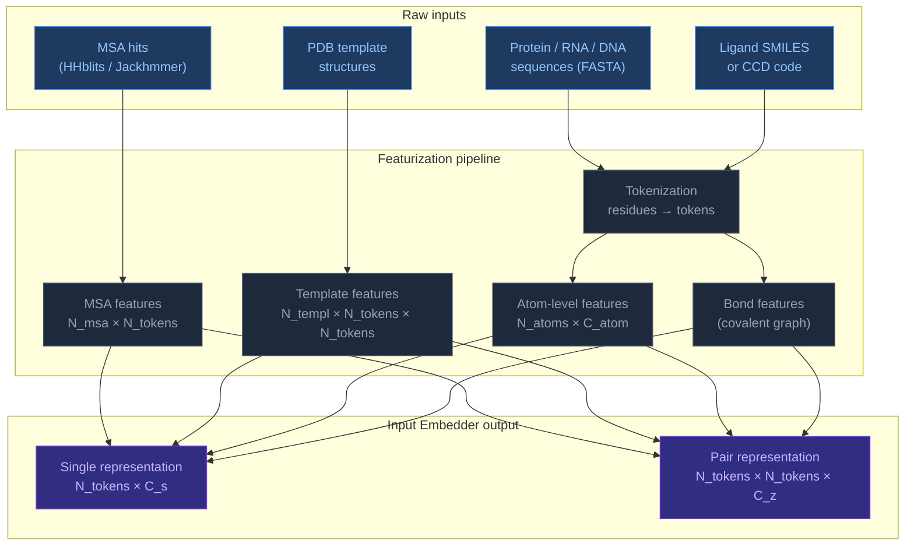
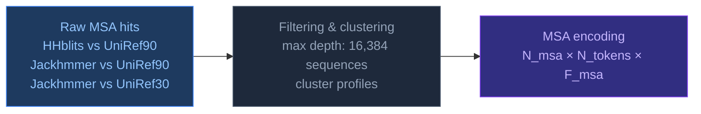
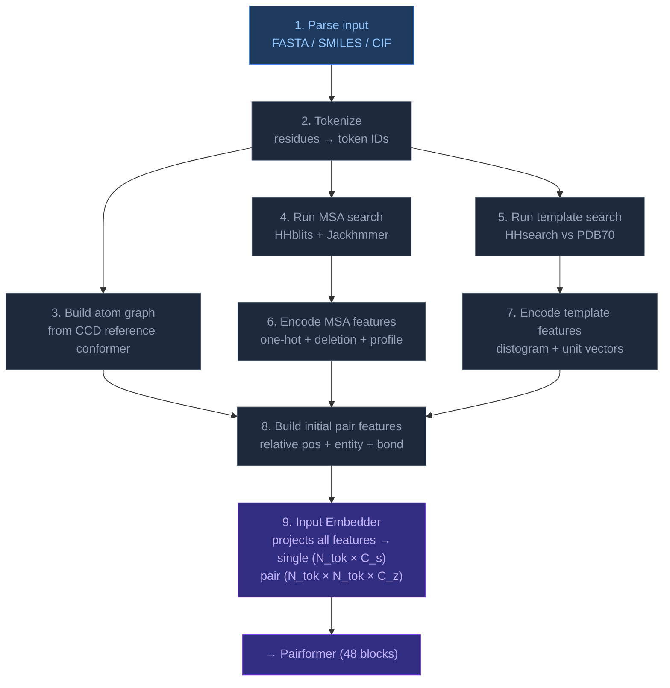

# 1.2.6. Featurization

[[Home|Home]] > [[EN/1. AlphaFold3/1.2. Architecture/1.2.1. AF3 Architecture Overview|Architecture]]
🇺🇦 [[UA/1. AlphaFold3/1.2. Архітектура/1.2.6. Featurization|Українська]]

> **Featurization** is the process of converting raw biological inputs — sequences, ligands, templates, MSA — into the numerical tensor representations that AF3's neural network can process. It is the first and most structurally complex stage of the AF3 pipeline.

---

## Overview: what goes in, what comes out



---

## 1. Tokenization

AF3 uses a **token-per-residue / token-per-ligand-atom** scheme — different from AF2's purely residue-based approach.

| Entity type | Token granularity | Notes |
|---|---|---|
| Standard amino acid | 1 token per residue | 20 standard + unknown + gap = 22 types |
| Modified amino acid | 1 token per residue | Treated as unknown or mapped to CCD |
| RNA nucleotide | 1 token per nucleotide | A, C, G, U + unknown |
| DNA nucleotide | 1 token per nucleotide | DA, DC, DG, DT + unknown |
| Ligand (small molecule) | 1 token per **heavy atom** | Each atom is a separate token |
| Ion | 1 token | Single-atom entity |
| Water | Excluded | Not modeled explicitly |

---

## 2. Per-token input features

Each token carries a feature vector built from multiple sources:

### 2.1 Sequence features

| Feature | Dimension | Description |
|---|---|---|
| `restype` | 32 | One-hot over residue/nucleotide/atom type |
| `token_index` | 1 | Integer position in chain |
| `entity_id` | 1 | Which chain/entity this token belongs to |
| `sym_id` | 1 | Symmetry copy index (for homo-oligomers) |
| `residue_index` | 1 | Residue number from sequence |
| `is_protein` / `is_rna` / `is_dna` / `is_ligand` | 4 × 1 | Entity type flags |

### 2.2 Atom-level features (per token → per atom)

Each token is associated with a **reference atom frame** from the CCD (Chemical Component Dictionary):

| Feature | Description |
|---|---|
| `ref_pos` | Ideal 3D atom coordinates from CCD (Å) — used to define local frame |
| `ref_mask` | Which atoms are present in this token |
| `ref_element` | Element one-hot (H, C, N, O, S, P, …) — 128 elements |
| `ref_charge` | Formal charge of each atom |
| `ref_atom_name_chars` | 4 one-hot characters encoding atom name (CA, CB, N, …) |

These reference positions define a **local coordinate frame per token** that the diffusion module uses to place atoms in 3D space.

---

## 3. MSA features

Multiple Sequence Alignment provides **evolutionary co-variation signal** — which positions mutate together — encoded as:



| Feature | Dim | Description |
|---|---|---|
| `msa` | N_msa × N_tok × 32 | One-hot residue type per MSA row |
| `has_deletion` | N_msa × N_tok × 1 | Binary: gap follows this position |
| `deletion_value` | N_msa × N_tok × 1 | Log-scale deletion count |
| `profile` | N_tok × 32 | Amino acid frequency at each position across MSA |
| `deletion_mean` | N_tok × 1 | Mean deletion count per position |

**AF3 key change vs AF2:** MSA depth is capped and MSA is processed by only **4 MSA stack blocks** (vs 48 in AF2 Evoformer). MSA is used to enrich the initial single representation but does not jointly update pair representation throughout the trunk.

---

## 4. Template features

Structural templates from PDB provide **3D geometric priors** for known folds:

| Feature | Dim | Description |
|---|---|---|
| `template_restype` | N_templ × N_tok × 32 | Residue type in template |
| `template_pseudo_beta_mask` | N_templ × N_tok × 1 | Mask for Cβ positions |
| `template_backbone_frame_mask` | N_templ × N_tok × 1 | Valid backbone frame flags |
| `template_distogram` | N_templ × N_tok × N_tok × 39 | Binned Cβ–Cβ distances (2–22 Å, 38 bins + far) |
| `template_unit_vector` | N_templ × N_tok × N_tok × 3 | Direction between Cβ atoms |
| `template_sequence_mask` | N_templ × N_tok × 1 | Aligned vs gapped positions |

Template search pipeline:


---

## 5. Pair features (initial)

Before entering Pairformer, an initial **pair representation** is constructed from:

| Feature | Dim | Source |
|---|---|---|
| Relative position encoding | N_tok × N_tok × 64 | Clipped residue index differences |
| Entity + chain encoding | N_tok × N_tok × C | Same chain? Same entity? Asymmetric unit? |
| Token distance bins | N_tok × N_tok × 39 | Binned sequence separation |
| Bond features | N_tok × N_tok × 1 | Are two tokens covalently bonded? |

The **relative position encoding** is particularly important for ligands — since ligand atoms have no meaningful sequence index, the encoding must handle heterogeneous entities (polymer chain vs small molecule atom) gracefully.

---

## 6. Covalent bond graph

AF3 explicitly encodes **covalent bonds** between atoms — critical for ligand featurization:

| Feature | Description |
|---|---|
| `bonds` | Sparse edge list: (atom_i, atom_j, bond_type) |
| Bond types | Single, double, triple, aromatic |
| Source | CCD definition for standard residues and ligands |
| Cross-chain bonds | Explicit disulfide bonds, glycosidic bonds, metal coordination |

This bond graph feeds into the **Input Embedder** to create initial atom-level representations before aggregation into token representations.

---

## 7. Full featurization pipeline (step-by-step)



---

## 8. How to run featurization (practical)

AF3 featurization runs through the **AlphaFold Server** (no local install) or via the open-source implementation. Below is the conceptual workflow for local pipelines based on the published code.

### 8.1 Input preparation

```python
# Minimal input: a dict describing each chain
input_dict = {
    "sequences": [
        {
            "proteinChain": {
                "sequence": "MTEYKLVVVGAGGVGKSALTIQLIQNHFVDE",
                "count": 1
            }
        },
        {
            "ligand": {
                "ccdCodes": ["ATP"]   # or "smiles": "..."
            }
        }
    ]
}
```

Accepted input types per chain:

| Type | Key | Format |
|---|---|---|
| Protein | `proteinChain` | One-letter AA sequence |
| RNA | `rnaSequence` | A/C/G/U sequence |
| DNA | `dnaSequence` | A/C/G/T sequence |
| Ligand (CCD) | `ligand` → `ccdCodes` | 3-letter CCD code, e.g. `ATP`, `HEM` |
| Ligand (SMILES) | `ligand` → `smiles` | SMILES string |
| Ion | `ligand` → `ccdCodes` | e.g. `MG`, `ZN`, `CA` |

### 8.2 MSA search (local pipeline)

```bash
# Step 1: Search UniRef90 with HHblits
hhblits -i query.fasta \
        -d /databases/UniRef90 \
        -oa3m query_uniref90.a3m \
        -n 3 -e 0.001

# Step 2: Search UniRef30 with HHblits (distant homologs)
hhblits -i query.fasta \
        -d /databases/UniRef30 \
        -oa3m query_uniref30.a3m \
        -n 3 -e 0.001

# Step 3: Jackhmmer search on UniRef90
jackhmmer --noali --F1 0.0005 --F2 0.00005 --F3 0.0000005 \
          --incE 0.0001 -E 0.0001 --cpu 8 -N 1 \
          query.fasta /databases/uniprot_sprot.fasta \
          -A query_uniprot.sto
```

### 8.3 Template search

```bash
# Build HHM profile from MSA
hhmake -i query_uniref90.a3m -o query.hhm

# Search PDB70
hhsearch -i query.hhm \
         -d /databases/pdb70 \
         -o query_templates.hhr \
         -z 500 -b 500 -B 500 -Z 500
```

### 8.4 Feature pipeline dimensions

For a complex with:
- Protein: L_prot residues
- Ligand: N_lig heavy atoms
- Total tokens: `N_tok = L_prot + N_lig`

| Tensor | Shape | dtype |
|---|---|---|
| `single` (after Input Embedder) | `N_tok × 384` | float32 |
| `pair` (after Input Embedder) | `N_tok × N_tok × 128` | float32 |
| `msa` | `N_msa × N_tok × 64` | float32 |
| `atom_positions` (ref) | `N_atoms × 3` | float32 |
| `atom_mask` | `N_atoms` | bool |

---

## 9. Key differences from AF2 featurization

| Aspect | AF2 | AF3 |
|---|---|---|
| Token = | Residue | Residue **or** heavy atom (ligand) |
| Ligand encoding | Not supported | CCD reference conformer + atom features |
| MSA blocks in trunk | 48 (full Evoformer) | 4 (separate MSA module, then discarded) |
| Template features | Distogram + torsion angles | Distogram + unit vectors (no torsion) |
| Bond features | Implicit (via residue graph) | Explicit covalent bond graph |
| Atom-level features | Via torsion angle expansion | Per-atom element, charge, name |
| Nucleic acid support | Partially (AF2-Multimer) | Native: DNA, RNA, modified bases |

---

> Abramson et al. (2024). *Accurate structure prediction of biomolecular interactions with AlphaFold 3*. Nature, 630, 493–500.
> DOI: [10.1038/s41586-024-07487-w](https://doi.org/10.1038/s41586-024-07487-w)

---

## 10. Featurization in Python

The sections below show how to reproduce AF3 featurization steps using standard Python libraries — useful for understanding the pipeline, building custom preprocessing, or working with open-source AF3-compatible code.

### 10.1 Environment setup

All featurization functions in Sections 10 and 11 depend on four libraries. `numpy` handles all tensor operations. `rdkit` generates 3-D conformers for ligands from SMILES strings. `gemmi` reads mmCIF and legacy PDB files, and also provides access to the CCD for bond connectivity. `biopython` is an optional dependency used by some MSA wrappers.

```python
# pip install numpy biopython rdkit-pypi gemmi
import numpy as np
from rdkit import Chem
from rdkit.Chem import AllChem
import gemmi
```

### 10.2 Tokenization — protein sequence

AF3 represents each amino acid as an integer index drawn from a 22-symbol alphabet: 20 standard residues (A–Y in RESTYPE_ORDER order), one catch-all unknown symbol `X` (index 20), and a gap character `-` (index 21). `tokenize_sequence` maps a raw string to that integer array; `one_hot_sequence` expands it to a `(L, 22)` float32 matrix where each row has exactly one `1.0`. This matrix is the `protein_restype` feature that feeds into the AF3 Input Embedder.

```python
RESTYPE_ORDER = {
    'A':0,'R':1,'N':2,'D':3,'C':4,'Q':5,'E':6,'G':7,'H':8,'I':9,
    'L':10,'K':11,'M':12,'F':13,'P':14,'S':15,'T':16,'W':17,'Y':18,
    'V':19,'X':20,'-':21,
}
NUM_RES_TYPES = 22

def tokenize_sequence(seq: str) -> np.ndarray:
    """
    Convert a protein sequence string to an integer token array.

    Maps each amino acid character to its index in RESTYPE_ORDER (0–19 for
    standard residues, 20 for unknown 'X', 21 for gap '-').  Unknown
    characters are silently mapped to index 20 ('X').

    Args:
        seq: Protein sequence using the standard one-letter amino acid code.
             Case-insensitive; any character not in RESTYPE_ORDER → 'X'.

    Returns:
        np.ndarray of shape (L,) and dtype int32, where L = len(seq).

    Example:
        tokenize_sequence("ACD")  →  array([0, 4, 3], dtype=int32)
    """
    return np.array(
        [RESTYPE_ORDER.get(aa, RESTYPE_ORDER['X']) for aa in seq.upper()],
        dtype=np.int32
    )

def one_hot_sequence(seq: str) -> np.ndarray:
    """
    One-hot encode a protein sequence over the 22-type AF3 residue alphabet.

    Calls tokenize_sequence internally, then scatters a 1.0 at each
    [position, token_index] location in an (L, 22) zero matrix.
    The encoding is compatible with AF3's 'restype' input feature.

    Args:
        seq: Protein sequence string (any case).

    Returns:
        np.ndarray of shape (L, 22) and dtype float32.
        Columns 0–19: standard amino acids (same order as RESTYPE_ORDER).
        Column 20: unknown / non-standard residue ('X').
        Column 21: gap character ('-').

    Example:
        one_hot_sequence("AG")
        → array([[1,0,...,0],   # A at index 0
                 [0,0,...,0,1,...]], shape=(2,22))
    """
    tokens = tokenize_sequence(seq)
    oh = np.zeros((len(tokens), NUM_RES_TYPES), dtype=np.float32)
    oh[np.arange(len(tokens)), tokens] = 1.0
    return oh

seq = "MTEYKLVVVGAGGVGKSALTIQLIQNHFVDE"
print(one_hot_sequence(seq).shape)   # (31, 22)
```

### 10.3 Tokenization — ligand atoms from SMILES

Unlike residues, ligand atoms do not map to a fixed alphabet — they are described by element type, formal charge, and 3-D position. AF3 assigns one token per heavy atom, so a ligand with N heavy atoms contributes N tokens to the full token sequence. The reference 3-D geometry comes from an MMFF94-minimised conformer generated by RDKit (mirroring the CCD ideal conformer used for standard residues). Bond connectivity is encoded as an undirected COO-format edge list where each bond is stored in both directions so downstream graph layers see symmetric neighborhoods.

```python
ELEMENT_ORDER = {
    'H':0,'C':1,'N':2,'O':3,'S':4,'P':5,
    'F':6,'Cl':7,'Br':8,'I':9,'other':10
}

def tokenize_ligand(smiles: str) -> dict:
    """
    Convert a SMILES string to per-heavy-atom token features for AF3.

    Pipeline:
        1. Parse SMILES with RDKit → RWMol object.
        2. Add explicit hydrogens (required for 3-D embedding).
        3. Embed with ETKDGv3 (distance-geometry seeded with ETKDG
           parameters) to generate initial 3-D coordinates.
        4. Minimise with MMFF94 force field to obtain a reasonable
           reference conformer (mirrors the CCD ideal conformer used
           by AF3 for standard residues).
        5. Remove hydrogens — AF3 featurizes heavy atoms only.
        6. Collect per-atom element index, formal charge, and 3-D
           position; build an undirected COO-format bond graph.

    Bond types are encoded as integers:
        1 = single, 2 = double, 3 = triple, 4 = aromatic.
    Each bond is stored in both directions so bond_index[:, k] and
    bond_index[:, k+1] form an undirected edge pair.

    Args:
        smiles: Valid SMILES string (e.g. canonical SMILES from PubChem).
                Isomeric and aromatic notation are both supported.

    Returns:
        dict with keys:
            'atom_elements' : (N,)      int32  — ELEMENT_ORDER index per atom.
            'atom_charges'  : (N,)      int32  — formal charge per atom.
            'ref_pos'       : (N, 3)    float32 — MMFF-optimised coordinates (Å).
            'bond_index'    : (2, 2*B)  int64  — COO edge list, undirected.
            'bond_type'     : (2*B,)    int32  — bond type per directed edge.
        where N = number of heavy atoms, B = number of bonds.

    Raises:
        ValueError: If RDKit cannot parse the SMILES string.
        RuntimeError: If 3-D embedding fails (try a different conformer seed).

    Example:
        feats = tokenize_ligand("c1ccccc1")   # benzene
        feats['ref_pos'].shape    # (6, 3)
        feats['bond_index'].shape # (2, 12)
    """
    mol = Chem.MolFromSmiles(smiles)
    mol = Chem.AddHs(mol)
    AllChem.EmbedMolecule(mol, AllChem.ETKDGv3())
    AllChem.MMFFOptimizeMolecule(mol)
    mol = Chem.RemoveHs(mol)          # heavy atoms only

    conf = mol.GetConformer()
    elements, charges, positions = [], [], []
    for atom in mol.GetAtoms():
        elements.append(ELEMENT_ORDER.get(atom.GetSymbol(), 10))
        charges.append(atom.GetFormalCharge())
        p = conf.GetAtomPosition(atom.GetIdx())
        positions.append([p.x, p.y, p.z])

    bond_type_map = {
        Chem.rdchem.BondType.SINGLE: 1, Chem.rdchem.BondType.DOUBLE: 2,
        Chem.rdchem.BondType.TRIPLE: 3, Chem.rdchem.BondType.AROMATIC: 4,
    }
    src, dst, btypes = [], [], []
    for bond in mol.GetBonds():
        i, j = bond.GetBeginAtomIdx(), bond.GetEndAtomIdx()
        bt = bond_type_map.get(bond.GetBondType(), 1)
        src += [i, j]; dst += [j, i]; btypes += [bt, bt]

    return {
        'atom_elements': np.array(elements,  dtype=np.int32),
        'atom_charges':  np.array(charges,   dtype=np.int32),
        'ref_pos':       np.array(positions, dtype=np.float32),
        'bond_index':    np.array([src, dst], dtype=np.int64),
        'bond_type':     np.array(btypes,    dtype=np.int32),
    }

atp_smiles = "c1nc(c2c(n1)n(cn2)[C@@H]3[C@@H]([C@@H]([C@H](O3)COP(=O)(O)OP(=O)(O)OP(=O)(O)O)O)O)N"
lig = tokenize_ligand(atp_smiles)
print(lig['ref_pos'].shape)    # (N_heavy_atoms, 3)
print(lig['bond_index'].shape) # (2, N_bonds * 2)
```

### 10.4 MSA parsing and encoding — A3M format

An A3M file is a FASTA variant produced by HHblits or Jackhmmer. Uppercase letters and `-` mark aligned columns that correspond to query token positions. Lowercase letters mark insertions — residues present in the homolog but absent from the query — and are excluded from the token-level representation. Instead, their count is accumulated and stored as a log-scaled `deletion_value` feature for the following aligned position. `parse_a3m` reads the raw file preserving case; `encode_msa` then performs the column-by-column decoding, pads all rows to `query_len`, one-hot-encodes the result, and computes the per-position amino acid frequency `profile` by averaging over all MSA rows.

```python
def parse_a3m(path: str) -> tuple[list[str], list[str]]:
    """
    Parse an A3M-format multiple sequence alignment file.

    A3M is a variant of FASTA where:
        - Uppercase letters and '-' represent aligned (token) columns.
        - Lowercase letters represent insertions relative to the query
          and do not correspond to query token positions.

    The function preserves both upper- and lowercase characters so that
    downstream encode_msa() can distinguish insertions from aligned positions.

    Args:
        path: Path to the .a3m file produced by HHblits or Jackhmmer.

    Returns:
        Tuple (names, sequences) where:
            names     : list[str] — FASTA header lines (without '>').
            sequences : list[str] — raw sequence strings (mixed case).
        Both lists have the same length; index 0 is always the query.

    Notes:
        - Multi-line sequences are concatenated automatically.
        - Empty lines are ignored.
        - The function does NOT strip lowercase insertions; pass the
          output to encode_msa() for that step.
    """
    names, seqs, name, buf = [], [], None, []
    with open(path) as fh:
        for line in fh:
            line = line.rstrip()
            if line.startswith('>'):
                if name is not None:
                    seqs.append(''.join(buf))
                name = line[1:]; names.append(name); buf = []
            else:
                buf.append(line)
    if name is not None:
        seqs.append(''.join(buf))
    return names, seqs

def encode_msa(seqs: list[str], query_len: int) -> dict:
    """
    Encode A3M MSA sequences into AF3-style numerical feature tensors.

    For each sequence the function:
        1. Iterates character by character.
        2. Skips lowercase letters (insertions), accumulating a
           'pending' counter for the following aligned position.
        3. For '-' (deletion): appends token 21, sets has_deletion=1,
           records log1p(pending) as deletion_value.
        4. For uppercase letters: appends the RESTYPE_ORDER index,
           sets has_deletion=0, records log1p(pending).
        5. Pads or trims each row to exactly query_len positions.

    The log1p transform compresses the deletion count into a bounded
    range while preserving the distinction between 0 and >0 deletions.

    Args:
        seqs:      List of raw A3M sequences from parse_a3m().
                   Index 0 should be the query (all uppercase, no '-').
        query_len: Number of token positions in the query sequence.
                   All output arrays are padded/trimmed to this length.

    Returns:
        dict with keys:
            'msa'            : (N, L, 22)  float32 — one-hot residue type.
            'has_deletion'   : (N, L)      int32   — 1 if a deletion precedes
                                                     this position.
            'deletion_value' : (N, L)      float32 — log1p(deletion count).
            'profile'        : (L, 22)     float32 — mean one-hot over all N
                                                     rows (per-position AA freq).
        where N = len(seqs), L = query_len.

    Notes:
        - Sequences longer than query_len are silently trimmed.
        - Sequences shorter (after insertion removal) are padded with
          gap token (21) and zero deletion values.
        - Cap input to ~2048 sequences before calling to avoid OOM.
    """
    msa_t, has_d, del_v = [], [], []
    for seq in seqs:
        tokens, h_del, d_val, pending = [], [], [], 0
        for ch in seq:
            if ch.islower():
                pending += 1
            elif ch == '-':
                tokens.append(21); h_del.append(1)
                d_val.append(float(np.log1p(pending))); pending = 0
            else:
                tokens.append(RESTYPE_ORDER.get(ch.upper(), 20))
                h_del.append(0)
                d_val.append(float(np.log1p(pending))); pending = 0
        pad = query_len - len(tokens)
        tokens  = (tokens  + [21]  * max(pad, 0))[:query_len]
        h_del   = (h_del   + [0]   * max(pad, 0))[:query_len]
        d_val   = (d_val   + [0.0] * max(pad, 0))[:query_len]
        msa_t.append(tokens); has_d.append(h_del); del_v.append(d_val)

    msa_arr = np.array(msa_t, dtype=np.int32)           # (N, L)
    oh = np.zeros((*msa_arr.shape, NUM_RES_TYPES), dtype=np.float32)
    oh[np.arange(msa_arr.shape[0])[:, None],
       np.arange(query_len)[None, :],
       msa_arr] = 1.0

    return {
        'msa':            oh,                              # (N, L, 22)
        'has_deletion':   np.array(has_d, dtype=np.int32),# (N, L)
        'deletion_value': np.array(del_v, dtype=np.float32),# (N, L)
        'profile':        oh.mean(axis=0),                 # (L, 22)
    }

# Usage:
# names, seqs = parse_a3m("query.a3m")
# msa_feats   = encode_msa(seqs[:2048], query_len=31)
# print(msa_feats['msa'].shape)    # (N_msa, 31, 22)
```

### 10.5 Template features — Cβ distogram

A distogram is a one-hot-encoded pairwise distance matrix. For each pair of residues `(i, j)`, the Cβ–Cβ Euclidean distance is computed and placed into one of 38 equal-width bins spanning 2–22 Å, plus an overflow bin for pairs farther apart than 22 Å — 39 channels total. This is the primary geometric signal that the AF3 Template Embedder uses to inject structural knowledge from the template into the initial pair representation. `get_cb_positions` extracts the coordinates from the structure, using Cα as a fallback for glycine (which has no Cβ) and `NaN` for residues absent from the model.

```python
def get_cb_positions(cif_path: str, chain_id: str = 'A') -> np.ndarray:
    """
    Extract Cβ (or Cα for glycine) coordinates from an mmCIF/PDB structure.

    Cβ is the standard pseudo-atom used to represent residue position in
    AF3 template features because it captures side-chain direction without
    requiring full side-chain coordinates.  Glycine has no Cβ, so Cα is
    used as the fallback — this is the same convention used in AF2/AF3.

    For each residue in the polymer chain, the function tries:
        1. Atom named 'CB'  (all residues except Gly).
        2. Atom named 'CA'  (fallback for Gly, and any residue missing CB).
        3. If neither is present: inserts a [NaN, NaN, NaN] row so that
           the output length always equals the number of polymer residues.

    Args:
        cif_path: Path to an mmCIF or legacy PDB file readable by gemmi.
        chain_id: One-character chain identifier (default 'A').

    Returns:
        np.ndarray of shape (L, 3) and dtype float32, where L is the
        number of polymer residues in the specified chain.
        Rows with missing atoms contain np.nan in all three coordinates.

    Notes:
        - Iterates over all residues in get_polymer(), which excludes
          water and HETATM ligands automatically.
        - NaN rows are propagated into cb_distogram() and
          backbone_unit_vectors() as masked (zero-weight) pairs.
    """
    st = gemmi.read_structure(cif_path)
    positions = []
    for res in st[0][chain_id]:
        atom = res.find_atom('CB', '\0') or res.find_atom('CA', '\0')
        if atom:
            p = atom.pos
            positions.append([p.x, p.y, p.z])
        else:
            positions.append([np.nan, np.nan, np.nan])
    return np.array(positions, dtype=np.float32)

def cb_distogram(cb_pos: np.ndarray,
                 min_d: float = 2.0,
                 max_d: float = 22.0,
                 n_bins: int = 38) -> np.ndarray:
    """
    Compute a one-hot binned Cβ–Cβ distance matrix (AF3 template feature).

    Distances are binned into n_bins equal-width bins spanning [min_d, max_d]
    plus one overflow bin for pairs farther apart than max_d ('far' bin).
    This matches the AF3 paper's 38 distance bins from 2 to 22 Å, yielding
    39 channels total.

    The distogram is the primary pairwise geometric signal passed through
    the Template Embedder into the initial pair representation.

    Args:
        cb_pos: (L, 3) float32 array of Cβ/Cα positions from
                get_cb_positions().  NaN rows = missing residues.
        min_d:  Lower bound of the first bin in Å (default 2.0).
        max_d:  Upper bound of the last regular bin in Å (default 22.0).
        n_bins: Number of regular distance bins (default 38).
                Total output channels = n_bins + 1.

    Returns:
        np.ndarray of shape (L, L, n_bins+1) and dtype float32.
        distogram[i, j, k] = 1.0 if the Cβ–Cβ distance between residues
        i and j falls in bin k, else 0.0.
        Pairs involving a NaN residue are zeroed out entirely (all bins 0).

    Notes:
        - Self-pairs (i == j, distance = 0) land in bin 0, which spans
          [0, min_d); this is expected and does not affect training.
        - The symmetric distogram (dg[i,j] == dg[j,i]) is produced
          naturally because pairwise distances are symmetric.
    """
    diff = cb_pos[:, None] - cb_pos[None, :]       # (L, L, 3)
    dist = np.sqrt(np.nansum(diff**2, axis=-1))    # (L, L)
    bins = np.linspace(min_d, max_d, n_bins + 1)
    idx  = np.clip(np.digitize(dist, bins) - 1, 0, n_bins)
    L    = len(cb_pos)
    dg   = np.zeros((L, L, n_bins + 1), dtype=np.float32)
    dg[np.arange(L)[:, None], np.arange(L)[None, :], idx] = 1.0
    dg[np.isnan(dist)] = 0.0                       # mask missing residues
    return dg   # (L, L, 39)

# Usage:
# cb = get_cb_positions("template.cif", chain_id="A")
# dg = cb_distogram(cb)
# print(dg.shape)   # (L, L, 39)
```

### 10.6 Initial pair features — relative position encoding

The pair representation is an `(L, L, C_z)` tensor that captures pairwise relationships between every token combination. One of its initial components is a relative position encoding: for each pair `(i, j)` the signed index difference `i − j` is clipped to `[−max_rel, +max_rel]` and one-hot encoded. This gives the model a translation-invariant notion of sequence proximity without relying on absolute positions. Pairs farther apart than `max_rel` positions all collapse to the same boundary bin, which teaches the model that sequence distance beyond a threshold carries no additional information. For heterogeneous inputs (protein residues + ligand atoms), ligand tokens receive large sentinel index values so that protein–ligand pairs always land in that boundary bin.

```python
def relative_position_encoding(seq_len: int,
                                max_rel: int = 32) -> np.ndarray:
    """
    Build the AF3 relative position encoding for the initial pair representation.

    Computes the signed difference between every pair of residue indices,
    clips it to the range [-max_rel, max_rel], then one-hot encodes the
    result into 2*max_rel+1 bins.  This gives the model a translation-
    invariant sense of sequence separation without using absolute positions.

    Pairs separated by more than max_rel positions all map to the same
    boundary bin, so the model learns that 'far apart in sequence' is
    a single category rather than a continuous gradient.

    For heterogeneous inputs (protein + ligand atoms), ligand atom tokens
    are assigned large sentinel index values so that protein–ligand pairs
    always fall in the boundary bin, signalling 'different entity type'.

    Args:
        seq_len: Total number of tokens L (residues + ligand heavy atoms).
        max_rel: Half-width of the clipping window (default 32, as in AF3).
                 Output has 2*max_rel+1 channels.

    Returns:
        np.ndarray of shape (L, L, 2*max_rel+1) and dtype float32.
        rel_pos[i, j, k] = 1.0 if clip(i-j, -max_rel, max_rel)+max_rel == k.

    Example:
        rpe = relative_position_encoding(seq_len=5, max_rel=2)
        # rpe.shape == (5, 5, 5)
        # rpe[0, 0] == [0, 0, 1, 0, 0]  (diff=0, centre bin)
        # rpe[0, 4] == [1, 0, 0, 0, 0]  (diff=-4, clipped to -2, bin 0)
    """
    idx  = np.arange(seq_len)
    diff = np.clip(idx[:, None] - idx[None, :], -max_rel, max_rel)
    diff += max_rel                                # shift to [0, 2*max_rel]
    n_bins = 2 * max_rel + 1
    oh = np.zeros((seq_len, seq_len, n_bins), dtype=np.float32)
    oh[np.arange(seq_len)[:, None],
       np.arange(seq_len)[None, :],
       diff] = 1.0
    return oh   # (31, 31, 65) for seq_len=31, max_rel=32

print(relative_position_encoding(31).shape)   # (31, 31, 65)
```

### 10.7 Full feature dict — putting it all together

`build_feature_dict` is the single entry point that wires all previous functions together. It always produces sequence and relative-position features. The three optional inputs — ligand SMILES, MSA A3M path, template mmCIF path — are each processed only if provided, so the caller can mix and match freely. The returned flat dictionary maps feature names directly to numpy arrays, mirroring the tensor dict that AF3's Input Embedder receives. Note that ligand atom tokens are not yet concatenated with protein tokens here; that concatenation happens inside the Input Embedder.

```python
def build_feature_dict(
    protein_seq:       str,
    ligand_smiles:     str | None = None,
    msa_a3m_path:      str | None = None,
    template_cif_path: str | None = None,
) -> dict:
    """
    Assemble a complete AF3-compatible feature dictionary from raw inputs.

    This is the top-level entry point for the Section 10 pipeline.
    It calls all lower-level featurization functions in order and
    merges their outputs into a single flat dictionary, mirroring the
    structure of the tensor dict passed into the AF3 Input Embedder.

    Args:
        protein_seq:       One-letter protein sequence string (required).
        ligand_smiles:     SMILES string for a small-molecule ligand.
                           If None, no ligand features are added.
        msa_a3m_path:      Path to an A3M file from HHblits/Jackhmmer.
                           If None, MSA features are omitted (no_msa mode).
        template_cif_path: Path to an mmCIF/PDB template structure.
                           If None, template distogram is omitted.

    Returns:
        dict with a subset of the following keys depending on inputs:
            'protein_restype'       : (L, 22)      float32
            'rel_pos_encoding'      : (L, L, 65)   float32
            'ligand_atom_elements'  : (N_lig,)      int32    ← if ligand given
            'ligand_atom_charges'   : (N_lig,)      int32    ← if ligand given
            'ligand_ref_pos'        : (N_lig, 3)    float32  ← if ligand given
            'ligand_bond_index'     : (2, 2*B)      int64    ← if ligand given
            'ligand_bond_type'      : (2*B,)        int32    ← if ligand given
            'msa'                   : (N, L, 22)    float32  ← if MSA given
            'has_deletion'          : (N, L)        int32    ← if MSA given
            'deletion_value'        : (N, L)        float32  ← if MSA given
            'profile'               : (L, 22)       float32  ← if MSA given
            'template_distogram'    : (L, L, 39)    float32  ← if template given

    Notes:
        - L = len(protein_seq).  Ligand atoms are NOT included in L here;
          the full N_tok = L + N_lig concatenation happens inside the
          Input Embedder, not in this function.
        - MSA is capped at 2048 rows internally.
        - All optional inputs can be combined freely.
    """
    feats = {}
    L = len(protein_seq)

    # 1. Protein one-hot + relative position encoding
    feats['protein_restype']  = one_hot_sequence(protein_seq)   # (L, 22)
    feats['rel_pos_encoding'] = relative_position_encoding(L)   # (L, L, 65)

    # 2. Ligand atom features
    if ligand_smiles:
        lig = tokenize_ligand(ligand_smiles)
        feats.update({f'ligand_{k}': v for k, v in lig.items()})

    # 3. MSA features
    if msa_a3m_path:
        names, seqs = parse_a3m(msa_a3m_path)
        feats.update(encode_msa(seqs[:2048], L))

    # 4. Template distogram
    if template_cif_path:
        cb = get_cb_positions(template_cif_path)
        feats['template_distogram'] = cb_distogram(cb)   # (L, L, 39)

    return feats


# Demo (no MSA/template files needed)
feats = build_feature_dict(
    protein_seq   = "MTEYKLVVVGAGGVGKSALTIQLIQNHFVDE",
    ligand_smiles = "c1ccc(cc1)C(=O)O",   # benzoic acid
)
for k, v in feats.items():
    shape = v.shape if hasattr(v, 'shape') else type(v).__name__
    print(f"  {k:<35s} {shape}")
# protein_restype                     (31, 22)
# rel_pos_encoding                    (31, 31, 65)
# ligand_atom_elements                (7,)
# ligand_ref_pos                      (7, 3)
# ligand_bond_index                   (2, 14)
```

---

## 11. Featurization from FASTA + mmCIF only

### 11.0 What is possible without MSA search?

A FASTA file provides the sequence; an mmCIF file provides experimental (or predicted) 3D coordinates. Together they cover **all featurization steps except evolutionary MSA**.

| Feature group | FASTA only | FASTA + mmCIF | Requires MSA search |
|---|---|---|---|
| Sequence one-hot (`restype`) | ✅ | ✅ | — |
| Relative position encoding | ✅ | ✅ | — |
| Token / entity metadata | ✅ | ✅ | — |
| Ligand atom features + bond graph | ✅ (if SMILES known) | ✅ (from HETATM) | — |
| Cβ distogram (template) | ❌ | ✅ | — |
| Backbone unit vectors | ❌ | ✅ | — |
| pLDDT per residue (if AlphaFoldDB) | ❌ | ✅ | — |
| MSA profile + coevolution signal | ❌ | ❌ | ✅ HHblits/Jackhmmer |
| `has_deletion` / `deletion_value` | ❌ | ❌ | ✅ |

**AF3 server supports `no_msa` mode** — submitting a sequence without MSA is valid and the model degrades gracefully (lower accuracy for orphan proteins, acceptable for well-studied targets with good templates).

---

### 11.1 Parse FASTA

`parse_fasta` is intentionally minimal: it handles all common FASTA variants (single record, multi-record, multi-line sequences) without validating residue characters. Non-standard characters pass through unchanged and will be silently mapped to unknown token `X` during tokenization. The function returns a list of `(header, sequence)` pairs so the caller can choose which record to process — by convention the first record is always the query.

```python
from pathlib import Path

def parse_fasta(path: str) -> list[tuple[str, str]]:
    """
    Parse a FASTA or multi-FASTA file into (header, sequence) pairs.

    Handles the most common FASTA variants:
        - Single-sequence files.
        - Multi-record files (one record per '>header' line).
        - Multi-line sequences (lines are concatenated per record).
        - Blank lines between records (ignored).
        - Mixed case (converted to uppercase for sequence data).

    Args:
        path: Absolute or relative path to the FASTA file.
              The file is read as UTF-8 text.

    Returns:
        list of (header, sequence) tuples where:
            header   : str — everything after '>' on the header line,
                       with leading/trailing whitespace stripped.
            sequence : str — concatenated sequence in uppercase,
                       with no whitespace.
        Returns an empty list if the file contains no records.

    Notes:
        - Does NOT validate sequence characters; non-standard residue
          codes are kept as-is and will map to 'X' during tokenization.
        - Header lines may contain arbitrary metadata (UniProt format,
          NCBI format, custom tags) — only the raw string is returned.

    Example:
        records = parse_fasta("query.fasta")
        header, seq = records[0]
        # header → "sp|P01116|RASK_HUMAN KRAS ..."
        # seq    → "MTEYKLVVVGAGGVGKSALT..."
    """
    records = []
    header, buf = None, []
    for line in Path(path).read_text().splitlines():
        line = line.strip()
        if not line:
            continue
        if line.startswith('>'):
            if header is not None:
                records.append((header, ''.join(buf)))
            header, buf = line[1:], []
        else:
            buf.append(line.upper())
    if header is not None:
        records.append((header, ''.join(buf)))
    return records

# Example
records = parse_fasta("query.fasta")
for header, seq in records:
    print(f">{header}  len={len(seq)}")
    print(f"  {seq[:60]}{'...' if len(seq) > 60 else ''}")
```

---

### 11.2 Extract sequence from mmCIF (cross-check with FASTA)

Before building template features it is important to confirm that the sequence stored in the mmCIF matches the FASTA. Mismatches are common: crystal structures often omit disordered loops that appear in the canonical sequence, and recombinant constructs may include expression tags absent from the canonical record. `sequence_from_mmcif` first reads the `_entity_poly` table, which stores the full canonical sequence including missing residues. If that lookup fails, it falls back to iterating over the modelled residues. The cross-check that follows detects mismatches early, before any padding or trimming is needed downstream.

```python
import gemmi

def sequence_from_mmcif(cif_path: str, chain_id: str = 'A') -> str:
    """
    Extract the canonical one-letter amino acid sequence from an mmCIF file.

    Two-stage strategy:
        1. Primary: reads the '_entity_poly' table which stores the full
           canonical sequence including residues absent from the model
           (disordered regions, expression tags, etc.).  This is the
           authoritative sequence and should match the corresponding
           UniProt/FASTA entry.
        2. Fallback: if no suitable polymer entity is found, iterates
           over the model residues in the specified chain and maps
           three-letter codes to one-letter codes using gemmi's
           tabulated residue database.  Non-standard residues map to 'X'.

    Args:
        cif_path: Path to an mmCIF file (PDB format also accepted by gemmi).
        chain_id: One-character chain identifier to use in the fallback path.
                  Ignored when the primary path succeeds (entity-level lookup
                  is chain-independent).

    Returns:
        str — one-letter amino acid sequence.  Non-standard residues are
        represented as 'X'.  Length equals the full canonical sequence
        (primary path) or the number of modelled residues (fallback).

    Notes:
        - Use this function to cross-check sequence length against a FASTA
          before building template features.  A mismatch usually indicates
          missing density (disordered loops) or a truncated construct.
        - Only PeptideL and PeptideD polymer types are matched in the
          primary path; DNA/RNA chains are skipped.
    """
    st = gemmi.read_structure(cif_path)

    # Prefer the sequence stored in the mmCIF header (complete, no gaps)
    for entity in st.entities:
        if entity.entity_type == gemmi.EntityType.Polymer:
            if entity.polymer_type in (
                gemmi.PolymerType.PeptideL,
                gemmi.PolymerType.PeptideD,
            ):
                seq = entity.full_sequence         # list of 3-letter codes
                return ''.join(
                    gemmi.Entity.first_conformer_sequence(entity)
                )

    # Fallback: reconstruct from model residues
    model = st[0]
    chain = model[chain_id]
    aa_map = {v: k for k, v in gemmi.one_letter_code.__dict__.items()
              if isinstance(v, str) and len(v) == 3}
    seq = []
    for res in chain.get_polymer():
        one = gemmi.find_tabulated_residue(res.name).one_letter_code
        seq.append(one if one != ' ' else 'X')
    return ''.join(seq)

# Verify FASTA matches structure
_, fasta_seq = parse_fasta("query.fasta")[0]
mmcif_seq    = sequence_from_mmcif("structure.cif", chain_id="A")

if fasta_seq == mmcif_seq:
    print("✅ FASTA and mmCIF sequences match")
else:
    # Common causes: missing residues in density, non-standard residues
    print(f"⚠️  Mismatch: FASTA len={len(fasta_seq)}, mmCIF len={len(mmcif_seq)}")
```

---

### 11.3 Extract ALL atom features from mmCIF

When a ligand is present in the mmCIF as a HETATM record, there is no need to provide a separate SMILES string — all atom coordinates, element types, and formal charges are already in the file. `extract_polymer_atom_features` collects the same data for the polymer backbone, useful for building custom atom-level features. `extract_ligand_features_from_mmcif` handles HETATM residues: it skips water, collects heavy atoms, and attempts a CCD bond-graph lookup via gemmi. If the CCD entry is not found (e.g. for a proprietary or non-standard ligand), the function still returns atom coordinates and element features — the bond graph is simply left empty rather than raising an error.

This replaces the CCD-lookup step: atom positions, elements, charges, and bonds come directly from the structure file.

```python
import numpy as np
import gemmi

def extract_polymer_atom_features(cif_path: str,
                                  chain_id: str = 'A') -> dict:
    """
    Extract per-residue, per-atom features from an mmCIF polymer chain.

    For each residue in the polymer, collects all atoms (including
    hydrogens — callers should filter if needed) with their element
    type, formal charge, and 3-D coordinates from the first model/
    first conformer in the file.

    This function provides the data that AF3's Input Embedder receives
    as 'atom-level features' before aggregation into token representations
    via the AtomTransformer block.

    Args:
        cif_path: Path to an mmCIF or legacy PDB structure file.
        chain_id: One-character chain identifier (default 'A').

    Returns:
        list of dicts, one per polymer residue, each containing:
            'resname' : str  — three-letter residue code (e.g. 'ALA').
            'seqnum'  : int  — sequence number from the structure file.
            'atoms'   : list[dict] — one dict per atom with keys:
                'name'    : str  — PDB atom name (e.g. 'CA', 'CB').
                'element' : int  — ELEMENT_ORDER index (10 = other).
                'charge'  : int  — formal charge.
                'pos'     : list[float, float, float] — x, y, z in Å.

    Notes:
        - Alternate conformers: gemmi returns the first conformer by default.
        - Hydrogen atoms are included; filter by element != 0 to remove them.
        - For ligand (HETATM) features use extract_ligand_features_from_mmcif().
    """
    ELEMENT_ORDER = {
        'H':0,'C':1,'N':2,'O':3,'S':4,'P':5,
        'F':6,'CL':7,'BR':8,'I':9
    }
    st    = gemmi.read_structure(cif_path)
    chain = st[0][chain_id]

    residue_data = []
    for res in chain.get_polymer():
        atoms = []
        for atom in res:
            el  = atom.element.name.upper()
            pos = atom.pos
            atoms.append({
                'name':    atom.name,
                'element': ELEMENT_ORDER.get(el, 10),
                'charge':  int(atom.charge),
                'pos':     [pos.x, pos.y, pos.z],
            })
        residue_data.append({
            'resname': res.name,
            'seqnum':  res.seqid.num,
            'atoms':   atoms,
        })

    return residue_data   # list of dicts, one per residue


def extract_ligand_features_from_mmcif(cif_path: str) -> list[dict]:
    """
    Extract ligand (HETATM / non-polymer) atom features from an mmCIF file.

    Iterates over all chains and residues in the first model, selecting
    entities of type NonPolymer (HETATM records in legacy PDB notation).
    Water molecules (HOH/WAT/H2O) are skipped.  Hydrogen atoms are
    excluded — AF3 featurizes heavy atoms only.

    For each ligand residue the function attempts to look up bond
    connectivity from the CCD (Chemical Component Dictionary) embedded
    in the gemmi library.  If the CCD entry is not found (e.g. for
    non-standard or proprietary ligands), coordinates and atom features
    are still returned but bond_index/bond_type will be empty arrays.

    Bond types from CCD value_order:
        SING → 1,  DOUB → 2,  TRIP → 3,  AROM / DELOC → 4.
    Each bond is stored in both directions (undirected COO format).

    Args:
        cif_path: Path to an mmCIF or legacy PDB structure file.

    Returns:
        list of dicts, one per non-water ligand residue, each with:
            'ccd_code'      : str            — 3-letter CCD residue name.
            'ref_pos'       : (N, 3) float32 — heavy-atom coordinates (Å).
            'atom_elements' : (N,)   int32   — ELEMENT_ORDER index per atom.
            'atom_charges'  : (N,)   int32   — formal charge per atom.
            'bond_index'    : (2, 2*B) int64 — COO undirected edge list.
            'bond_type'     : (2*B,) int32   — bond type per directed edge.
        where N = heavy atoms, B = bonds.  Returns [] if no ligands found.

    Notes:
        - Multiple copies of the same ligand (e.g. two ATP molecules) each
          produce a separate dict entry.
        - Coordinates are taken from the observed structure, not the CCD
          ideal conformer.  This is intentional: the structure provides a
          more realistic starting geometry for downstream use.
    """
    ELEMENT_ORDER = {
        'H':0,'C':1,'N':2,'O':3,'S':4,'P':5,
        'F':6,'CL':7,'BR':8,'I':9
    }
    BOND_ORDER_MAP = {
        gemmi.BondType.Single:   1,
        gemmi.BondType.Double:   2,
        gemmi.BondType.Triple:   3,
        gemmi.BondType.Aromatic: 4,
        gemmi.BondType.Deloc:    4,   # delocalized → treat as aromatic
    }

    st      = gemmi.read_structure(cif_path)
    results = []

    for chain in st[0]:
        for res in chain:
            if res.entity_type != gemmi.EntityType.NonPolymer:
                continue
            # Skip water molecules
            if res.name in ('HOH', 'WAT', 'H2O'):
                continue

            # Collect heavy atoms only
            heavy = [a for a in res if a.element != gemmi.Element('H')]
            if not heavy:
                continue

            positions, elements, charges = [], [], []
            name_to_idx = {}
            for i, atom in enumerate(heavy):
                el = atom.element.name.upper()
                elements.append(ELEMENT_ORDER.get(el, 10))
                charges.append(int(atom.charge))
                p = atom.pos
                positions.append([p.x, p.y, p.z])
                name_to_idx[atom.name] = i

            # Bond graph from CCD via gemmi
            src, dst, btypes = [], [], []
            ccd = gemmi.cif.read(gemmi.expand_if_pdbid(res.name)
                                 ).find_block(res.name)  # may fail for unknown
            if ccd:
                for row in ccd.find('_chem_comp_bond.',
                                    ['atom_id_1', 'atom_id_2', 'value_order']):
                    a1, a2, order = row[0], row[1], row[2].upper()
                    if a1 in name_to_idx and a2 in name_to_idx:
                        i, j = name_to_idx[a1], name_to_idx[a2]
                        bt = {'SING':1,'DOUB':2,'TRIP':3,'AROM':4}.get(order,1)
                        src += [i, j]; dst += [j, i]; btypes += [bt, bt]

            results.append({
                'ccd_code':      res.name,
                'ref_pos':       np.array(positions, dtype=np.float32),
                'atom_elements': np.array(elements,  dtype=np.int32),
                'atom_charges':  np.array(charges,   dtype=np.int32),
                'bond_index':    np.array([src, dst], dtype=np.int64)
                                 if src else np.zeros((2,0), dtype=np.int64),
                'bond_type':     np.array(btypes,    dtype=np.int32)
                                 if btypes else np.zeros(0, dtype=np.int32),
            })

    return results
```

---

### 11.4 Template features from mmCIF (self-template)

The distogram alone encodes distance but not direction. `backbone_unit_vectors` computes the unit vector from each residue j toward each residue i, providing the directional complement. Together, the distogram and unit vectors give the Template Embedder a complete local geometric description of the backbone — equivalent to what AF3 would obtain from a PDB template search. `plddt_from_mmcif` reads per-residue confidence scores from the B-factor field, which AlphaFoldDB uses to store pLDDT values. A simple heuristic (all values ≤ 100) distinguishes pLDDT from real crystallographic B-factors. The pLDDT array is not a featurization input per se, but is useful for masking low-confidence regions before downstream analysis.

When you have no external PDB templates, use the **mmCIF itself as the template** — this is valid when the structure is known (e.g. AlphaFoldDB prediction as prior, or a homolog structure).

```python
def backbone_unit_vectors(cb_pos: np.ndarray) -> np.ndarray:
    """
    Compute pairwise Cβ–Cβ unit direction vectors for all residue pairs.

    This is the second AF3 template feature alongside the distogram.
    Where the distogram encodes *how far* two residues are, the unit
    vector encodes *which direction* one lies relative to the other.
    Together they give the Template Embedder a complete local geometric
    picture of the template backbone.

    Algorithm:
        1. Compute raw difference vectors: diff[i,j] = cb_pos[i] - cb_pos[j].
        2. Compute Euclidean norms; replace zeros with 1.0 to avoid NaN
           on the diagonal (self-pairs) without affecting off-diagonal values.
        3. Divide diff by norms to get unit vectors.
        4. Zero out any pair (i, j) where either residue has NaN coordinates
           (missing atoms), producing a clean masked output.

    Args:
        cb_pos: (L, 3) float32 array from get_cb_positions().
                NaN rows represent residues absent from the structure.

    Returns:
        np.ndarray of shape (L, L, 3) and dtype float32.
        unit[i, j] is the unit vector from residue j toward residue i.
        Self-pairs (i == j) yield the zero vector after masking.
        Pairs involving a missing residue are zeroed out entirely.

    Notes:
        - The direction convention (i − j) matches the AF3 paper's
          definition of inter-residue frame vectors.
        - This tensor is NOT symmetric: unit[i,j] = −unit[j,i].
    """
    diff = cb_pos[:, None, :] - cb_pos[None, :, :]   # (L, L, 3)
    dist = np.sqrt(np.nansum(diff**2, axis=-1, keepdims=True))
    # Avoid division by zero for self-pairs and missing residues
    dist = np.where(dist == 0, 1.0, dist)
    unit = diff / dist                                 # (L, L, 3)
    # Zero out pairs where either residue is missing
    mask = ~np.isnan(cb_pos).any(axis=-1)              # (L,)
    valid = mask[:, None] & mask[None, :]              # (L, L)
    unit[~valid] = 0.0
    return unit.astype(np.float32)


def plddt_from_mmcif(cif_path: str,
                     chain_id: str = 'A') -> np.ndarray | None:
    """
    Extract per-residue pLDDT confidence scores from an mmCIF B-factor column.

    AlphaFoldDB and AF3 server outputs encode pLDDT in the isotropic
    B-factor (b_iso) field of each Cα atom, in the range [0, 100].
    This function reads those values and applies a heuristic to
    distinguish AF-style predictions from experimental structures with
    real B-factors (which often exceed 100 for flexible regions).

    Heuristic:
        If all non-NaN B-factor values lie in [0, 100], treat them as
        pLDDT scores and return the array.  Otherwise return None.
        Note: this heuristic can misclassify very well-diffracting
        crystals where all B-factors happen to be ≤ 100; always
        cross-check with the file source before relying on pLDDT.

    pLDDT interpretation (AF3 colour scheme):
        > 90   → dark blue   → very high confidence
        70–90  → light blue  → confident
        50–70  → yellow      → low confidence, use with caution
        < 50   → orange      → very low, likely disordered

    Args:
        cif_path: Path to an mmCIF file (AlphaFoldDB or AF3 server output).
        chain_id: One-character chain identifier (default 'A').

    Returns:
        np.ndarray of shape (L,) and dtype float32 with pLDDT values,
        or None if the B-factors do not appear to be pLDDT scores.
        Residues with missing Cα atoms receive np.nan.

    Notes:
        - Only Cα atoms are sampled (one per residue); side-chain atoms
          store the same value in AF outputs but are not read here.
        - pLDDT is NOT a direct input to the AF3 featurization pipeline;
          it is a useful diagnostic for masking low-confidence regions
          before downstream analysis.
    """
    st    = gemmi.read_structure(cif_path)
    chain = st[0][chain_id]
    plddt = []
    for res in chain.get_polymer():
        ca = res.find_atom('CA', '\0')
        if ca:
            plddt.append(ca.b_iso)
        else:
            plddt.append(float('nan'))
    values = np.array(plddt, dtype=np.float32)
    # Heuristic: real B-factors are rarely all in [0, 100] with no values > 100
    if np.nanmax(values) <= 100.0 and np.nanmin(values) >= 0.0:
        return values
    return None   # likely real B-factors, not pLDDT
```

---

### 11.5 Full pipeline — FASTA + mmCIF only

`featurize_from_fasta_and_mmcif` is the single call that runs the entire no-MSA pipeline. It accepts a FASTA path and an mmCIF path, orchestrates all the functions from sections 11.1–11.4 in the correct order, and handles the one practical complication: sequence length mismatch. When the structure is shorter than the FASTA (disordered residues, truncated constructs) the missing positions are padded with `NaN` Cβ rows, which propagate into the distogram and unit vectors as all-zero (masked) pairs. The `template_seq_mask` feature records which positions have real coordinates so downstream attention layers can distinguish present from absent residues.

```python
def featurize_from_fasta_and_mmcif(
    fasta_path:  str,
    mmcif_path:  str,
    chain_id:    str = 'A',
    max_rel_pos: int = 32,
) -> dict:
    """
    Build a complete AF3-compatible feature dict from only a FASTA and mmCIF file.

    This is the top-level entry point for the Section 11 (no-MSA) pipeline.
    It covers all featurization steps that do not require external database
    searches, making it suitable for:
        - Offline / air-gapped environments.
        - Quick prototyping and debugging.
        - Re-featurizing existing structures (e.g. AlphaFoldDB entries).
        - AF3 'no_msa' server submissions prepared locally.

    Pipeline steps (in order):
        1. Parse FASTA → sequence string and length L.
        2. Build protein_restype (L, 22) and rel_pos_encoding (L, L, 65).
        3. Extract Cβ positions from mmCIF; align length to FASTA L
           by padding with NaN rows or trimming if lengths differ.
        4. Compute template_distogram (L, L, 39) and
           template_unit_vectors (L, L, 3) from Cβ positions.
        5. Build template_seq_mask (L,): 1.0 where Cβ is present, 0.0 where NaN.
        6. Attempt to read pLDDT from B-factor column (AlphaFoldDB only).
        7. Extract ligand features from all HETATM residues.

    Args:
        fasta_path:  Path to a FASTA file containing at least one record.
                     Only the first record is used.
        mmcif_path:  Path to an mmCIF (or legacy PDB) structure file.
                     Can be an experimental PDB entry, an AlphaFoldDB
                     prediction, or any AF3 server output.
        chain_id:    Chain to extract backbone and ligand features from.
                     Default 'A'; must match the chain in the mmCIF.
        max_rel_pos: Half-width for relative position encoding (default 32).
                     Produces 2*max_rel_pos+1 = 65 channels in the output.

    Returns:
        dict with keys:
            'protein_restype'       : (L, 22)      float32 — one-hot sequence.
            'rel_pos_encoding'      : (L, L, 65)   float32 — clipped index diffs.
            'template_cb_pos'       : (L, 3)        float32 — raw Cβ coords (Å).
            'template_distogram'    : (L, L, 39)   float32 — binned Cβ distances.
            'template_unit_vectors' : (L, L, 3)    float32 — Cβ direction vectors.
            'template_seq_mask'     : (L,)          float32 — 1 = residue present.
            'plddt'                 : (L,) float32 or None — only for AF outputs.
            'ligands'               : list[dict]           — one per HETATM ligand.

    Raises:
        ValueError: If the FASTA file is empty or unreadable.

    Notes:
        - MSA features (msa, has_deletion, deletion_value, profile) are
          intentionally absent.  The AF3 model degrades gracefully without
          them; accuracy loss is largest for orphan proteins with no structural
          template, minimal for well-studied targets.
        - Length mismatch between FASTA and mmCIF is handled by padding with
          NaN (missing residues) or trimming.  A warning is printed but no
          exception is raised.
        - Ligand bond graphs may be incomplete for unknown CCD codes; the
          function continues rather than raising an exception in that case.
    """
    # ── 1. Sequence from FASTA ─────────────────────────────────────
    records = parse_fasta(fasta_path)
    if not records:
        raise ValueError(f"No sequences found in {fasta_path}")
    header, seq = records[0]
    L = len(seq)
    print(f"Sequence: {header}  ({L} residues)")

    # ── 2. Sequence features ───────────────────────────────────────
    feats = {
        'protein_restype':  one_hot_sequence(seq),            # (L, 22)
        'rel_pos_encoding': relative_position_encoding(L, max_rel_pos),  # (L, L, 65)
    }

    # ── 3. Backbone features from mmCIF ────────────────────────────
    cb_pos = get_cb_positions(mmcif_path, chain_id=chain_id)  # (L_struct, 3)

    # Align structure length to FASTA length (handle missing residues)
    mmcif_seq = sequence_from_mmcif(mmcif_path, chain_id=chain_id)
    if len(mmcif_seq) != L:
        print(f"⚠  Length mismatch: FASTA={L}, mmCIF={len(mmcif_seq)}")
        print(   "   Padding/trimming to FASTA length.")
        pad = L - len(cb_pos)
        if pad > 0:
            cb_pos = np.vstack([
                cb_pos,
                np.full((pad, 3), np.nan, dtype=np.float32)
            ])
        else:
            cb_pos = cb_pos[:L]

    seq_mask = (~np.isnan(cb_pos).any(axis=-1)).astype(np.float32)  # (L,)

    feats['template_cb_pos']       = cb_pos                          # (L, 3)
    feats['template_distogram']    = cb_distogram(cb_pos)            # (L, L, 39)
    feats['template_unit_vectors'] = backbone_unit_vectors(cb_pos)   # (L, L, 3)
    feats['template_seq_mask']     = seq_mask                        # (L,)

    # ── 4. pLDDT (if AlphaFoldDB mmCIF) ───────────────────────────
    plddt = plddt_from_mmcif(mmcif_path, chain_id=chain_id)
    if plddt is not None:
        feats['plddt'] = plddt[:L]
        print(f"pLDDT: mean={float(np.nanmean(plddt)):.1f}  "
              f"min={float(np.nanmin(plddt)):.1f}  "
              f"max={float(np.nanmax(plddt)):.1f}")
    else:
        feats['plddt'] = None
        print("pLDDT: not detected (real B-factors or missing)")

    # ── 5. Ligand features from HETATM ─────────────────────────────
    feats['ligands'] = extract_ligand_features_from_mmcif(mmcif_path)
    for lig in feats['ligands']:
        n = len(lig['atom_elements'])
        b = lig['bond_index'].shape[1] // 2
        print(f"Ligand {lig['ccd_code']}: {n} heavy atoms, {b} bonds")

    # ── 6. Summary ─────────────────────────────────────────────────
    print("\nFeature shapes:")
    for k, v in feats.items():
        if k == 'ligands':
            print(f"  {'ligands':<35s} {len(v)} entries")
        elif v is None:
            print(f"  {k:<35s} None")
        else:
            print(f"  {k:<35s} {v.shape}")

    return feats


# ── Usage ──────────────────────────────────────────────────────────
feats = featurize_from_fasta_and_mmcif(
    fasta_path = "query.fasta",
    mmcif_path = "AF-P01116-F1-model_v4.cif",   # AlphaFoldDB KRAS
    chain_id   = "A",
)

# Expected output for KRAS (189 residues):
# Sequence: sp|P01116|RASK_HUMAN  (189 residues)
# pLDDT: mean=88.3  min=41.2  max=98.1
# Ligand GDP: 27 heavy atoms, 28 bonds
#
# Feature shapes:
#   protein_restype                     (189, 22)
#   rel_pos_encoding                    (189, 189, 65)
#   template_cb_pos                     (189, 3)
#   template_distogram                  (189, 189, 39)
#   template_unit_vectors               (189, 189, 3)
#   template_seq_mask                   (189,)
#   plddt                               (189,)
#   ligands                             1 entries
```

---

### 11.6 What is missing vs full AF3 featurization

| Feature group | FASTA + mmCIF | Full AF3 |
|---|---|---|
| Sequence one-hot | ✅ | ✅ |
| Relative position encoding | ✅ | ✅ |
| Template Cβ distogram | ✅ (from mmCIF) | ✅ (from PDB search) |
| Template unit vectors | ✅ | ✅ |
| Ligand atom features | ✅ (from HETATM) | ✅ (from CCD) |
| Ligand bond graph | ⚠️ partial (CCD lookup may fail for unknowns) | ✅ |
| pLDDT (if AlphaFoldDB) | ✅ (B-factor column) | N/A |
| **MSA profile** | ❌ | ✅ |
| **`has_deletion`** | ❌ | ✅ |
| **Coevolutionary signal** | ❌ | ✅ |

The missing MSA features have the largest effect on **orphan proteins** (no known homologs). For proteins with good structural coverage in AlphaFoldDB or PDB, `no_msa` mode still yields high-quality predictions — the template distogram compensates for the absent evolutionary signal.

---

### 11.7 What additional data is needed for full MSA mode?

Running AF3 with MSA features requires three external sequence databases and two search tools. Without them, only the `no_msa` pipeline from sections 11.1–11.6 is available.

**Databases**

| Database | Size on disk | Used by | Purpose |
|---|---|---|---|
| UniRef90 | ~150 GB | HHblits (pass 1) | Primary homolog search, high-identity clusters |
| UniRef30 | ~50 GB | HHblits (pass 2) | Broader coverage, more distant homologs |
| UniProt | ~300 GB | Jackhmmer | Full evolutionary depth, rare homologs |
| PDB70 | ~10 GB | HHsearch | Structural template search |

Total storage requirement: **~500–600 GB**.

**Search tools**

```bash
# HHblits — iterative profile-vs-profile search
hhblits -i query.fasta -d /data/UniRef90/UniRef90 \
        -oa3m query_uniref90.a3m -n 3 -e 0.001 -cpu 8

# Second pass against UniRef30
hhblits -i query.fasta -d /data/UniRef30/UniRef30 \
        -oa3m query_uniref30.a3m -n 3 -e 0.001 -cpu 8

# Jackhmmer — HMM-vs-sequence search against full UniProt
jackhmmer --cpu 8 -N 1 --noali \
          --tblout query_uniprot.tbl \
          -A query_uniprot.sto \
          query.fasta /data/UniProt/uniprot.fasta

# Convert Stockholm → A3M
reformat.pl sto a3m query_uniprot.sto query_uniprot.a3m

# HHsearch — template search against PDB70
hhsearch -i query_uniref90.a3m -d /data/pdb70/pdb70 \
         -o templates.hhr -cpu 8
```

**Output files fed into featurization**

| File | Shape after encoding | Fed into |
|---|---|---|
| `query_uniref90.a3m` | `(N₁, L, 22)` | `encode_msa()` |
| `query_uniref30.a3m` | `(N₂, L, 22)` | `encode_msa()` |
| `query_uniprot.a3m` | `(N₃, L, 22)` | `encode_msa()` |
| `templates.hhr` + PDB70 | `(N_templ, L, L, 39)` | Template Embedder |

The three A3M files are merged and capped at 2048 sequences before calling `encode_msa()`. AF3 uses only 4 MSA processing blocks (versus 48 Evoformer blocks in AF2), so diminishing returns set in quickly beyond ~512 sequences.

**Features enabled by MSA that are absent in no_msa mode**

| Feature | Tensor shape | What it encodes |
|---|---|---|
| `msa` | `(N, L, 22)` | Per-sequence residue identity across all homologs |
| `has_deletion` | `(N, L)` | Whether an insertion precedes each aligned position |
| `deletion_value` | `(N, L)` | log1p-scaled insertion count |
| `profile` | `(L, 22)` | Per-position amino acid frequency across the MSA |

**Practical alternative — ColabFold MSA server**

If local database installation is not feasible, the ColabFold MSA server provides precomputed A3M files without any local setup:

```python
import requests

def fetch_msa_colabfold(sequence: str, email: str) -> str:
    """
    Fetch A3M MSA from the ColabFold MMseqs2 server.
    Returns raw A3M string. Free for non-commercial use.
    API: https://colabfold.mmseqs.com
    """
    url = "https://api.colabfold.com/msa"
    resp = requests.post(url, json={
        "q":     sequence,
        "mode":  "env",      # UniRef30 + ColabFoldDB
        "email": email,
    })
    resp.raise_for_status()
    return resp.text   # raw A3M content

# Usage
a3m_text = fetch_msa_colabfold(
    sequence = "MTEYKLVVVGAGGVGKSALTIQLIQNHFVDE",
    email    = "you@example.com",
)
with open("query_colabfold.a3m", "w") as f:
    f.write(a3m_text)

# Then feed into existing pipeline:
names, seqs = parse_a3m("query_colabfold.a3m")
msa_feats   = encode_msa(seqs[:2048], query_len=31)
```

---

> Abramson et al. (2024). *Accurate structure prediction of biomolecular interactions with AlphaFold 3*. Nature, 630, 493–500.
> DOI: [10.1038/s41586-024-07487-w](https://doi.org/10.1038/s41586-024-07487-w)

## Related Notes
