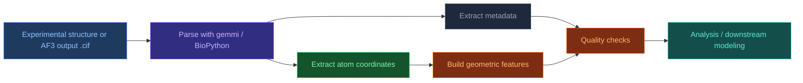

# Working with mmCIF Files

[[Home|Home]] > [[EN/1. AlphaFold3/1.5. Resources/1.5.1. Key Terms|Resources]]
🇺🇦 [[UA/1. AlphaFold3/1.5. Ресурси/1.5.4. Робота з mmCIF файлами|Українська]]

---

## What is mmCIF?

**mmCIF** (macromolecular Crystallographic Information File) is the official PDB format since 2014. Built on the **CIF** standard (Crystallographic Information File) developed by IUCr. It replaced the legacy PDB format (`.pdb`), which had limits on atom count and chain IDs.

### mmCIF vs Legacy PDB

| | mmCIF / `.cif` | PDB legacy / `.pdb` |
|---|---|---|
| Status | Official PDB standard | Deprecated, still supported |
| Max atoms | Unlimited | ~99,999 |
| Max chains | Unlimited | 62 (A-Z, 0-9) |
| Structure | Key-value + tables | Fixed-width columns |
| Metadata | Full (experiment, authors...) | Limited |
| Large complexes | ✅ | ❌ |

---

## mmCIF workflow in AF3 pipelines



---

## mmCIF File Structure

```text
data_1ABC                          <- data block (structure name)
#
_entry.id                1ABC      <- single-value field
_struct.title            'Human hemoglobin'
_exptl.method            'X-RAY DIFFRACTION'
_refine.ls_d_res_high    1.74      <- resolution (A)
#
loop_                              <- table start
_atom_site.group_PDB               <- column names...
_atom_site.id
_atom_site.type_symbol
_atom_site.label_atom_id
_atom_site.label_comp_id
_atom_site.label_asym_id
_atom_site.label_seq_id
_atom_site.Cartn_x
_atom_site.Cartn_y
_atom_site.Cartn_z
_atom_site.occupancy
_atom_site.B_iso_or_equiv
ATOM  1  N  N   MET A 1   11.751  26.466  21.000  1.00  30.00
ATOM  2  C  CA  MET A 1   12.501  25.322  20.500  1.00  28.00
HETATM 1000 C  C1 HEM A .  15.100  18.200  12.300  1.00  20.00
```

### Key `_atom_site` fields

| Field | Description | Example |
|-------|-------------|---------|
| `group_PDB` | Record type | `ATOM` (polymer) / `HETATM` (ligand) |
| `label_asym_id` | Chain ID | `A`, `B` |
| `label_comp_id` | Three-letter residue code | `MET`, `HEM`, `ATP` |
| `label_seq_id` | Residue sequence number | `1`, `42` |
| `label_atom_id` | Atom name | `CA`, `N`, `O`, `CB` |
| `type_symbol` | Chemical element | `C`, `N`, `O`, `S`, `FE` |
| `Cartn_x/y/z` | Coordinates (A) | `11.751` |
| `occupancy` | Occupancy (0-1) | `1.00` |
| `B_iso_or_equiv` | B-factor / pLDDT in AF3 | `30.00` |

---

## Reading via BioPython — MMCIFParser

```python
from Bio.PDB import MMCIFParser
import numpy as np

parser = MMCIFParser(QUIET=True)
structure = parser.get_structure("1abc", "1abc.cif")

# Hierarchy: Structure -> Model -> Chain -> Residue -> Atom
model = structure[0]  # first model (NMR may have several)

for chain in model:
    residues = list(chain.get_residues())
    aa_res = [r for r in residues if r.id[0] == " "]
    hetatm = [r for r in residues if r.id[0].startswith("H")]
    water = [r for r in residues if r.id[0] == "W"]

    print(f"Chain {chain.id}: "
          f"{len(aa_res)} AA, {len(hetatm)} HETATM, {len(water)} waters")

    for residue in aa_res[:2]:
        print(f"  {residue.resname} {residue.id[1]}")
        for atom in residue:
            print(f"    {atom.name:4s}  xyz={atom.coord}  B={atom.bfactor:.1f}")
```

---

## Reading via gemmi (recommended for large structures)

`gemmi` is often 5-20x faster than BioPython and has a cleaner API for structural analysis.

```python
import gemmi

st = gemmi.read_structure("1abc.cif")

print(f"Name:       {st.name}")
print(f"Resolution: {st.resolution:.2f} A")
print(f"Models:     {len(st)}")

model = st[0]
for chain in model:
    print(f"\nChain {chain.name}: {len(chain)} residues")
    for res in chain:
        is_ligand = not res.is_water() and res.entity_type != gemmi.EntityType.Polymer
        tag = "[LIG]" if is_ligand else ""
        print(f"  {res.name:4s} {str(res.seqid):5s} {tag}")
        for atom in res:
            print(f"    {atom.name:4s}  "
                  f"({atom.pos.x:7.3f}, {atom.pos.y:7.3f}, {atom.pos.z:7.3f})  "
                  f"B={atom.b_iso:.1f}  occ={atom.occ:.2f}")
```

---

## Extracting experiment metadata

```python
from Bio.PDB.MMCIF2Dict import MMCIF2Dict

d = MMCIF2Dict("1abc.cif")

# General information
print("ID:              ", d.get("_entry.id", ["?"])[0])
print("Title:           ", d.get("_struct.title", ["?"])[0])
print("Method:          ", d.get("_exptl.method", ["?"]))
print("Resolution (A):  ", d.get("_refine.ls_d_res_high", ["?"])[0])
print("R-free:          ", d.get("_refine.ls_R_factor_R_free", ["?"])[0])
print("Deposition date: ", d.get("_pdbx_database_status.recvd_initial_deposition_date", ["?"])[0])

# Authors
authors = d.get("_citation_author.name", [])
print("Authors:", "; ".join(authors[:3]), "..." if len(authors) > 3 else "")

# Organism(s)
organisms = d.get("_entity_src_nat.pdbx_organism_scientific", [])
print("Organisms:", set(organisms))
```

---

## Extracting coordinates as NumPy arrays

```python
import gemmi
import numpy as np

def get_backbone_coords(cif_path: str, chain_id: str) -> dict[str, np.ndarray]:
    """
    Return N, CA, C, O coordinates for each residue as arrays of shape (N, 3).
    """
    st = gemmi.read_structure(cif_path)
    chain = st[0][chain_id]

    backbone = {"N": [], "CA": [], "C": [], "O": []}

    for residue in chain:
        if residue.entity_type != gemmi.EntityType.Polymer:
            continue
        for atom_name in backbone:
            atom = residue.find_atom(atom_name, "\0")
            if atom:
                backbone[atom_name].append([atom.pos.x, atom.pos.y, atom.pos.z])
            else:
                backbone[atom_name].append([np.nan, np.nan, np.nan])

    return {k: np.array(v) for k, v in backbone.items()}

bb = get_backbone_coords("1abc.cif", "A")
print(f"CA atoms: {(~np.isnan(bb['CA'][:, 0])).sum()}")

# Radius of gyration (compactness)
ca = bb["CA"]
ca_clean = ca[~np.isnan(ca[:, 0])]
centroid = ca_clean.mean(axis=0)
rg = np.sqrt(((ca_clean - centroid) ** 2).sum(axis=1).mean())
print(f"Radius of gyration Rg = {rg:.2f} A")
```

---

## Interface contact analysis

```python
import gemmi
import numpy as np
from itertools import product

def find_interface_residues(
    cif_path: str,
    chain_a: str,
    chain_b: str,
    cutoff_ang: float = 5.0,
) -> tuple[list, list]:
    """
    Find interface residues between two chains.
    Contact = any heavy-atom pair within cutoff_ang A.
    """
    st = gemmi.read_structure(cif_path)
    model = st[0]

    def get_atoms(chain_id):
        atoms = []
        for res in model[chain_id]:
            for atom in res:
                if atom.element != gemmi.Element("H"):
                    atoms.append((res, atom))
        return atoms

    atoms_a = get_atoms(chain_a)
    atoms_b = get_atoms(chain_b)

    iface_a, iface_b = set(), set()
    for (res_a, at_a), (res_b, at_b) in product(atoms_a, atoms_b):
        pa = np.array([at_a.pos.x, at_a.pos.y, at_a.pos.z])
        pb = np.array([at_b.pos.x, at_b.pos.y, at_b.pos.z])
        if np.linalg.norm(pa - pb) <= cutoff_ang:
            iface_a.add((res_a.name, str(res_a.seqid)))
            iface_b.add((res_b.name, str(res_b.seqid)))

    return sorted(iface_a), sorted(iface_b)

iface_a, iface_b = find_interface_residues("1abc.cif", "A", "B")
print(f"Interface A: {len(iface_a)} residues -> {iface_a[:5]}")
print(f"Interface B: {len(iface_b)} residues -> {iface_b[:5]}")
```

---

## Parsing AlphaFold 3 output

AF3 writes predicted structures to `.cif` with confidence metrics in B-factors and related fields.

```python
import gemmi
from Bio.PDB.MMCIF2Dict import MMCIF2Dict

def parse_af3_output(cif_path: str):
    st = gemmi.read_structure(cif_path)
    _ = MMCIF2Dict(cif_path)

    # pLDDT by residue (CA B-factor in AF outputs)
    print(f"\n{'Chain':<8} {'Residue':<10} {'pLDDT':>6}")
    print("-" * 28)
    for chain in st[0]:
        for res in chain:
            ca = res.find_atom("CA", "\0")
            if ca:
                category = (
                    "high" if ca.b_iso >= 70 else
                    "medium" if ca.b_iso >= 50 else
                    "low"
                )
                print(f"{chain.name:<8} {res.name} {str(res.seqid):<6} {ca.b_iso:>6.1f}  {category}")

    print("\n--- Mean pLDDT ---")
    for chain in st[0]:
        scores = [res.find_atom("CA", "\0").b_iso for res in chain if res.find_atom("CA", "\0")]
        if scores:
            print(f"  Chain {chain.name}: {sum(scores)/len(scores):.1f}")
```

---

## Downloading structures from PDB

```python
import gemmi
import urllib.request
from pathlib import Path

def fetch_pdb(pdb_id: str, save_dir: str = ".") -> str:
    """Download mmCIF file from RCSB PDB."""
    pdb_id = pdb_id.lower()
    url = f"https://files.rcsb.org/download/{pdb_id}.cif"
    path = Path(save_dir) / f"{pdb_id}.cif"

    if not path.exists():
        urllib.request.urlretrieve(url, path)
        print(f"Downloaded: {path}")
    else:
        print(f"Already exists: {path}")
    return str(path)

cif_path = fetch_pdb("1ABC")
st = gemmi.read_structure(cif_path)
print(f"Loaded: {st.name}, resolution {st.resolution:.2f} A")
```

---

## Writing/modifying mmCIF via gemmi

```python
import gemmi

st = gemmi.read_structure("input.cif")

# Remove water molecules
for model in st:
    for chain in model:
        chain.remove_waters()

# Keep only chain A
model = st[0]
chains_to_remove = [c.name for c in model if c.name != "A"]
for name in chains_to_remove:
    model.remove_chain(name)

# Save result
st.update_mmcif_block()
st.make_mmcif_document().write_file("chain_A_only.cif")
print("Saved chain_A_only.cif")
```

---

## FASTA vs mmCIF

| | FASTA | mmCIF |
|---|---|---|
| Content | Sequence (1D) | Full 3D structure |
| Metadata | Minimal | Rich (method, resolution, authors) |
| Size | Kilobytes | Megabytes |
| AF3 role | **Input** | **Output** |
| Main libraries | `BioPython SeqIO` | `gemmi`, `BioPython PDB` |
| Parsing speed | Instant | `gemmi` >> BioPython |

---

## Install dependencies

```bash
pip install biopython gemmi numpy
```

---

## Related Notes

- [[EN/1. AlphaFold3/1.5. Resources/1.5.3. Working with FASTA Files]]
- [[EN/1. AlphaFold3/1.3. Results/1.3.2. Confidence Scores]]
- [[EN/1. AlphaFold3/1.5. Resources/1.5.1. Key Terms]]
