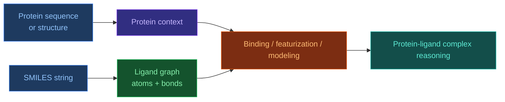

# Working with SMILES Files

[[Home|Home]] > Resources
🇺🇦 [[UA/1. AlphaFold3/1.5. Ресурси/1.5.5. Робота з SMILES файлами|Українська]]

> The correct name is **SMILES** (`Simplified Molecular Input Line Entry System`), not `SMILE`. It is a textual representation of chemical structure that encodes a molecule as a single line.

## What SMILES is and why it is needed

SMILES is useful because it provides a compact, machine-readable description of a molecule without requiring full 3D coordinates upfront.
In one line it can encode:

- atomic composition;
- bond order;
- branching;
- rings;
- aromaticity;
- and, when needed, stereochemistry.

That makes SMILES a standard format for:

- small-molecule databases;
- ligand exchange between cheminformatics tools;
- search, filtering, and canonicalization;
- building atom-and-bond graphs before ML featurization.

## How SMILES works

Conceptually, SMILES is a linear notation for a molecular graph.

- Atoms are written as element symbols: `C`, `N`, `O`, `Cl`.
- Bonds may be explicit: `-`, `=`, `#`, or left implicit.
- Branches are encoded with parentheses: `CC(O)C`.
- Rings are marked with digits: `C1CCCCC1`.
- Stereochemistry can be indicated with `@`, `/`, `\`.

## Short examples

| Molecule | SMILES | What the string shows |
| --- | --- | --- |
| Ethanol | `CCO` | two carbons and a terminal oxygen |
| Benzene | `c1ccccc1` | aromatic ring |
| Acetic acid | `CC(=O)O` | carbonyl + hydroxyl |
| Glycine | `NCC(=O)O` | amine + carboxyl |

## How to work with SMILES in practice

### 1. Syntax validation

The first step is to check whether the string parses correctly.
In Python, this is usually done with `RDKit`.

```python
from rdkit import Chem

smiles = "CC(=O)O"
mol = Chem.MolFromSmiles(smiles)

if mol is None:
    raise ValueError("Invalid SMILES")

print("Atoms:", mol.GetNumAtoms())
print("Bonds:", mol.GetNumBonds())
```

### 2. Canonical SMILES

The same molecule can have multiple valid SMILES strings.
That is why **canonical SMILES** is often used for standardization.

```python
from rdkit import Chem

smiles = "OC(=O)C"
mol = Chem.MolFromSmiles(smiles)
canonical = Chem.MolToSmiles(mol, canonical=True)
print(canonical)  # CC(=O)O
```

### 3. Generating 2D/3D representations

SMILES by itself does not contain a full experimental 3D pose.
But it can be used to:

- build the molecular graph;
- generate a 2D depiction;
- estimate a 3D conformer algorithmically.

```python
from rdkit import Chem
from rdkit.Chem import AllChem

smiles = "c1ccccc1O"
mol = Chem.MolFromSmiles(smiles)
mol = Chem.AddHs(mol)
AllChem.EmbedMolecule(mol, randomSeed=7)
AllChem.UFFOptimizeMolecule(mol)

print("Conformers:", mol.GetNumConformers())
```

## What SMILES does not encode well, or not at all

SMILES is very useful, but it is not a complete substitute for a structural file.

It does not directly provide:

- an experimental 3D bound pose;
- binding-pocket context;
- protein environment;
- reliable preferred bound conformation;
- full solvent or protonation context in a specific environment.

So SMILES is very good at describing **the chemistry of the molecule**, but not the full biophysical context of binding.

## How SMILES is related to proteins

SMILES does not describe the protein itself, but the small molecule that interacts with the protein.
In a `protein + ligand` setup, two different input types are typically used:

- the protein is usually given as sequence (`FASTA`) or structure (`mmCIF`);
- the ligand is often given as `SMILES`, `CCD code`, or explicit 3D coordinates.

So SMILES is a way to provide the **chemical identity of the ligand**, while the protein defines the **biological target context**.



## How SMILES is related to AlphaFold 3

In AF3 or AF3-like pipelines, SMILES matters as an input to **ligand featurization**.
The practical logic is:

1. SMILES is parsed into a molecular graph.
2. Atoms, bond types, charges, and related features are extracted.
3. Those features are converted into tensor representations of the ligand.
4. The model then reasons over the ligand representation together with protein context.

Within this knowledge base, this is already reflected in the featurization note: a ligand can enter as `SMILES` or as a `CCD code`, and is then tokenized at the atom level. This matters in AF3 because the model is not protein-only; it reasons over multimolecular systems where a small molecule is part of the complex.

## When to use SMILES versus mmCIF / CCD

| Format | Best used when | What it gives |
| --- | --- | --- |
| `SMILES` | only the chemistry of the ligand is known | atom-and-bond graph |
| `CCD code` | the ligand is standard and present in PDB CCD | standardized chemical identity |
| `mmCIF` | a concrete complex structure already exists | actual coordinates in structural context |

So:

- `SMILES` is good for describing **what molecule it is**;
- `mmCIF` is good for describing **where that molecule sits in a structure**.

## Additional examples of SMILES usage

- searching chemical databases for analogs;
- generating molecular descriptors;
- building fingerprint representations;
- training ligand ML models;
- preparing inputs for docking or ligand-aware structure modeling.

## Related Notes

- [[EN/2. Concepts/2.1. Biology/2.1.3. Ligands and Small Molecules|Ligands and Small Molecules]]
- [[EN/1. AlphaFold3/1.2. Architecture/1.2.6. Featurization|Featurization]]
- [[EN/1. AlphaFold3/1.5. Resources/1.5.4. Working with mmCIF Files|Working with mmCIF Files]]
- [[EN/3. Models/3.5. DiffDock|DiffDock]]

> Weininger (1988). *SMILES, a chemical language and information system. 1. Introduction to methodology and encoding rules*. Journal of Chemical Information and Computer Sciences.
> DOI: [10.1021/ci00057a005](https://doi.org/10.1021/ci00057a005)

> O'Boyle (2012). *Open Babel: An open chemical toolbox*. Journal of Cheminformatics.
> DOI: [10.1186/1758-2946-3-33](https://doi.org/10.1186/1758-2946-3-33)

> Abramson et al. (2024). *Accurate structure prediction of biomolecular interactions with AlphaFold 3*. Nature.
> DOI: [10.1038/s41586-024-07487-w](https://doi.org/10.1038/s41586-024-07487-w)
