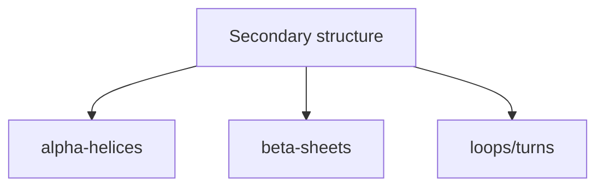

# Protein Folding

[[Home|Home]] > [[EN/Index|Concepts]] > Biology
🇺🇦 [[UA/2. Концепції/2.1. Біологія/2.1.1. Згортання білків|Українська]]

Protein folding is the process by which an amino acid sequence adopts a stable 3D conformation with low free energy.

$$\Delta G_{fold} = \Delta H - T\Delta S$$

## Levels of structural organization

| Level | Description | Typical motif |
|---|---|---|
| Primary | Amino acid sequence | `MKT...` |
| Secondary | Local backbone patterns | alpha-helix, beta-sheet |
| Tertiary | 3D fold of one chain | globular domain |
| Quaternary | Multi-chain assembly | dimer, tetramer |

## Driving forces of folding

- Hydrophobic effect (burial of non-polar residues)
- Hydrogen bonding in backbone and side chains
- Electrostatic and salt-bridge interactions
- van der Waals packing

## Levinthal's paradox

A protein cannot sample all conformations by brute force. Folding follows guided pathways rather than exhaustive search.

## Free-energy funnel

![[EN/1. AlphaFold3/1.6. Illustrations/diffusion-bio-landscape.excalidraw]]

## Secondary structure classes

## Link to AlphaFold 3

AF3 predicts structure directly in coordinate space and can represent both ordered and disordered regions with confidence estimates.

## Related Notes

- [[EN/2. Concepts/2.3. Structural-Bioinformatics/2.3.1. RMSD|RMSD]]
- [[EN/2. Concepts/2.3. Structural-Bioinformatics/2.3.2. lDDT|lDDT]]
- [[EN/1. AlphaFold3/1.2. Architecture/1.2.3. Diffusion Module|Diffusion Module]]
