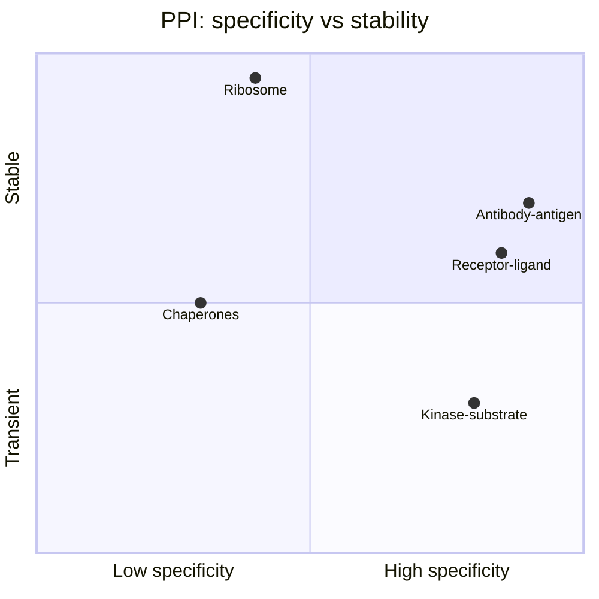
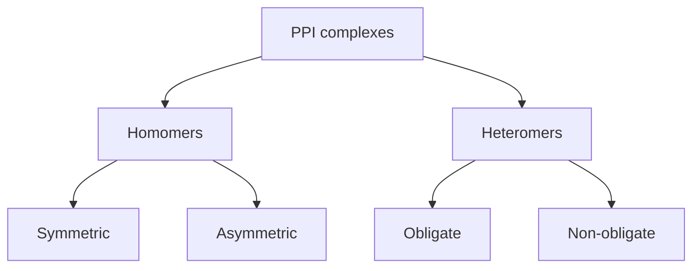

# Protein-Protein Interactions

[[Home|Home]] > [[EN/Index|Concepts]] > Biology
🇺🇦 [[UA/2. Концепції/2.1. Біологія/2.1.2. Білок-білок взаємодії|Українська]]

Most cellular processes are driven by complexes, not isolated proteins. PPI is central for signaling, regulation, replication, and immunity.

## PPI types by stability

## Interface metrics

Buried surface area (BSA):

$$\mathrm{BSA} = \frac{1}{2}\bigl[\mathrm{SASA}(A) + \mathrm{SASA}(B) - \mathrm{SASA}(AB)\bigr]$$

| Complex type | BSA (A^2) | Example |
|---|---:|---|
| Weak interaction | 500-1000 | signaling peptides |
| Typical heterodimer | 1000-2000 | many PPIs |
| Stable large complex | 2000-5000 | antibody-antigen |
| Permanent assembly | >5000 | ribosome |

## Forces at interfaces

$$\Delta G_{bind} = \Delta G_{elec} + \Delta G_{vdW} + \Delta G_{hphob} + \Delta G_{HB} + \Delta G_{sol}$$

Hot spots are residues where mutation strongly reduces affinity (often Trp, Arg, Tyr).

## Symmetry classes

## AlphaFold 3 and PPI

| Metric | Meaning | Typical threshold |
|---|---|---|
| ipTM | Interface model quality | >0.8 good |
| pDockQ | Docking confidence | >0.5 useful |
| Interface PAE | Interface localization error | <5 A good |

## Related Notes

- [[EN/2. Concepts/2.3. Structural-Bioinformatics/2.3.3. DockQ|DockQ]]
- [[EN/2. Concepts/2.3. Structural-Bioinformatics/2.3.1. RMSD|RMSD]]
- [[EN/1. AlphaFold3/1.3. Results/1.3.1. Accuracy Across Complex Types|AF3 Results]]
