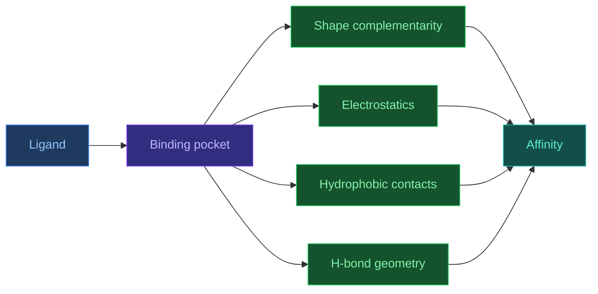
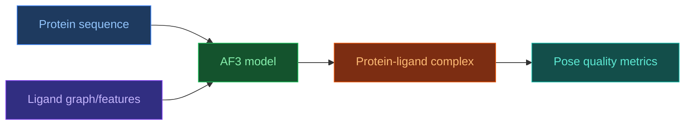

# Ligands and Small Molecules

[[Home|Home]] > [[EN/Index|Concepts]] > Biology
🇺🇦 [[UA/2. Концепції/2.1. Біологія/2.1.3. Ліганди та малі молекули|Українська]]

Ligands are small molecules binding to macromolecular targets, usually in specific binding pockets.

## Ligand classes

| Class | Typical size | Example |
|---|---:|---|
| Ion | 1 atom | Ca2+, Zn2+ |
| Cofactor | 10-100 atoms | NAD, FAD |
| Metabolite | 10-60 atoms | ATP, glucose |
| Drug-like | 20-70 atoms | kinase inhibitor |

## Binding thermodynamics

$$\Delta G = -RT\ln K_a = RT\ln K_d$$

Lower $K_d$ means stronger affinity.

## Lipinski Rule of Five

| Property | Rule |
|---|---|
| Molecular weight | <= 500 |
| logP | <= 5 |
| H-bond donors | <= 5 |
| H-bond acceptors | <= 10 |

## Binding pocket

Key geometric and physicochemical factors:
- shape complementarity
- hydrophobic pattern
- charge distribution
- H-bond geometry

## AF3 and ligand complexes

AF3 significantly improves protein-ligand complex modeling and reports strong benchmark gains on PoseBusters-like tasks.

## Related Notes

- [[EN/2. Concepts/2.3. Structural-Bioinformatics/2.3.3. DockQ|DockQ]]
- [[EN/2. Concepts/2.3. Structural-Bioinformatics/2.3.1. RMSD|RMSD]]
- [[EN/1. AlphaFold3/1.3. Results/1.3.1. Accuracy Across Complex Types|AF3 Results]]
