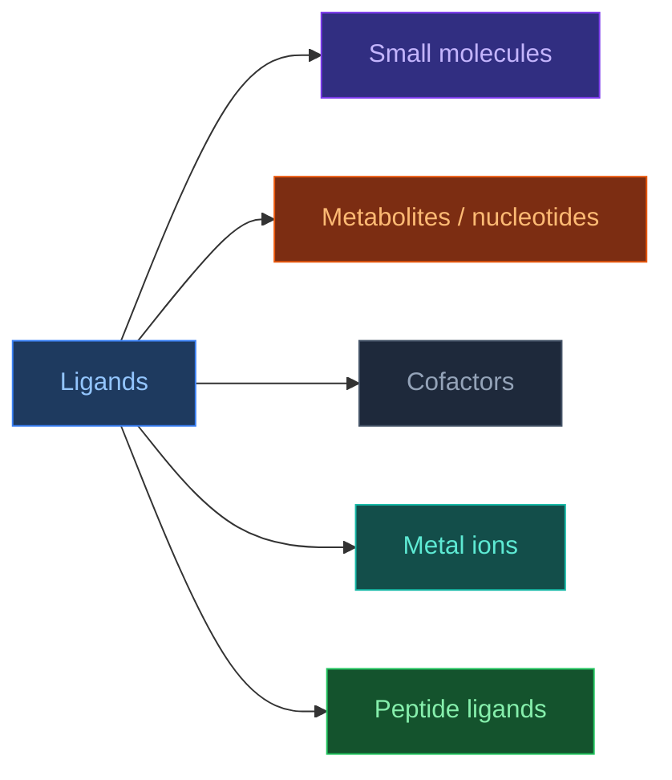
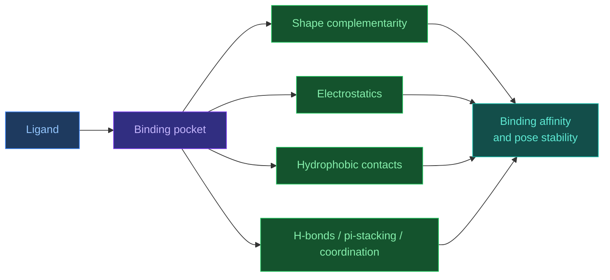
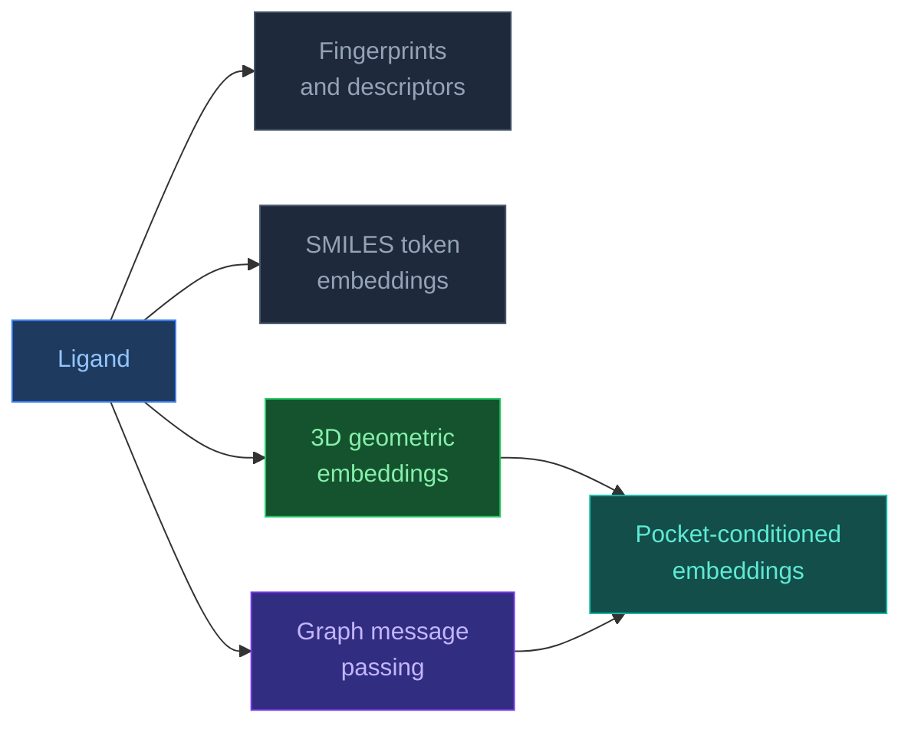

# Ligands and Small Molecules

[[Home|Home]] > [[EN/Index|Concepts]] > Biology
🇺🇦 [[UA/2. Концепції/2.1. Біологія/2.1.3. Ліганди та малі молекули|Українська]]

> A **ligand** is a molecule or ion that binds to a biomolecular target such as a protein, nucleic acid, or complex. In structural biology, a ligand is not just a passive passenger, but an active factor that can reshape conformation, function, stability, and specificity.

## Why ligands matter so much

In many biological systems, function is determined not only by the macromolecule itself, but by its ligand-bound state.
A ligand can:

- activate or inhibit an enzyme;
- stabilize a specific protein conformation;
- trigger signaling through receptor binding;
- serve as a cofactor required for catalysis;
- alter specificity of protein-protein or protein-nucleic-acid interactions.

So protein structure without ligand context is often incomplete from a functional point of view.

## What counts as a ligand

In a broad sense, a ligand is not only a `drug-like small molecule`.
Ligands also include:

- small organic molecules;
- metabolites;
- nucleotides (`ATP`, `GTP`, `NAD+`);
- cofactors (`heme`, `FAD`, `PLP`);
- ions (`Zn2+`, `Mg2+`, `Ca2+`);
- short peptides;
- and, in some contexts, even other macromolecular partners under receptor-ligand logic.

## Main classes

| Class | Typical size | Examples | Typical role |
|---|---|---|---|
| `Drug-like small molecules` | ~150–600 Da | kinase inhibitors, anti-infectives | protein modulation |
| `Metabolites` | small to medium | ATP, glucose, SAM | cellular chemistry |
| `Cofactors` | small to medium | heme, FAD, NAD+ | catalysis, electron transfer |
| `Ions` | 1 atom | Zn2+, Mg2+, Ca2+ | catalysis, stabilization, coordination |
| `Peptide ligands` | a few to dozens of aa | hormones, signaling peptides | receptor binding |

## Why ligand binding happens

Binding is not simple sticking, but a consequence of lowering the free energy of the system:

$$\Delta G_{\text{bind}} = \Delta H - T\Delta S$$

and also:

$$\Delta G_{\text{bind}} = RT \ln K_d$$

or equivalently:

$$\Delta G_{\text{bind}} = -RT \ln K_a$$

where:

- $K_d$ is the dissociation constant;
- $K_a$ is the association constant.

Lower $K_d$ means stronger affinity.

## Affinity interpretation

| Affinity | Typical $K_d$ | Intuition |
|---|---|---|
| Very weak | `> 1 mM` | fragments, unstable binding |
| Weak | `1–100 µM` | early hits |
| Moderate | `0.1–1 µM` | optimized leads |
| High | `1–100 nM` | strong drug-like binders |
| Very high | `< 1 nM` | extremely tight binding |

## Forces that keep a ligand in the pocket

Ligand binding is usually a sum of several contributions:

- shape complementarity;
- hydrophobic effect;
- hydrogen bonds;
- electrostatics;
- pi-stacking;
- cation-pi interactions;
- metal coordination;
- desolvation balance.

## Binding pocket

The binding pocket matters as much as the ligand itself.
It is commonly described by:

- volume and shape;
- polarity;
- donor/acceptor arrangement;
- hydrophobic core;
- structural waters or metals;
- conformational flexibility.

One reason docking is hard is that the pocket is often not rigid: the protein can adapt to the ligand.

## Drug-likeness and Lipinski's Rule of Five

For many orally active compounds, a useful heuristic is the `Rule of Five`:

$$M_w \leq 500,\quad \log P \leq 5,\quad \mathrm{HBD} \leq 5,\quad \mathrm{HBA} \leq 10$$

where:

- `HBD` means hydrogen bond donors;
- `HBA` means hydrogen bond acceptors.

This is not a law of nature, but a medicinal-chemistry rule of thumb.
There are many exceptions:

- macrocycles;
- natural products;
- transporter-dependent compounds;
- covalent inhibitors;
- peptide-like drugs.

## Main approaches to modeling ligand binding

| Approach | What it does | Strengths | Limitations |
|---|---|---|---|
| `Classical docking` | Searches for poses in a pocket + scoring | speed, interpretability | often simplified physics |
| [[EN/3. Models/3.5. DiffDock]] | Generates poses via diffusion | multiple plausible poses, modern generative setup | still a narrow docking task |
| [[EN/3. Models/3.2. AlphaFold3]] | Models the full biomolecular complex | unified context for protein + ligand + other entities | heavier generalist setup |
| `MD / free-energy methods` | Refines dynamics and energetics | stronger physical detail | expensive and slow |

## Two meanings of "embedding" in chemistry

In ligand and molecular modeling, the word **embedding** is used in two different but related senses:

- **Representation-learning embedding**: a vector, tensor, graph state, or geometric latent representation used by an ML model to encode a molecule or ligand.
- **Physics-based embedding**: a partition of a biochemical system into an active region and an environment treated at different levels of theory, such as `QM/MM`, `ONIOM`, fragment methods, or density-based embedding.

The Frontiers review added here is mainly about the second meaning: embedding as a multi-scale strategy for large biochemical systems. For AF3 and docking models, however, users often mean the first meaning: how the ligand is encoded before or inside the neural network.

## Common molecule and ligand embedding methods

| Method family | Main object | What it captures well | Main weakness | Typical use |
|---|---|---|---|---|
| `Fingerprints / descriptors` | Whole-molecule bit vector or feature vector | substructures, simple physchem priors, cheap similarity search | weak 3D awareness, weak protein-context modeling | screening, QSAR baselines |
| `SMILES token embeddings` | 1D token sequence | syntax, recurring motifs, scalable pretraining | ambiguous 3D geometry, atom order sensitivity | generative chemistry, sequence-style pretraining |
| `Graph neural embeddings` | atom-bond graph | local chemistry, bond topology, neighborhood context | needs pooling for whole-molecule tasks, limited without 3D features | property prediction, ligand encoders |
| `3D geometric embeddings` | conformer with coordinates | stereochemistry, distances, spatial constraints | depends on conformation quality | docking, pose scoring, conformation-aware prediction |
| `Pocket-conditioned embeddings` | ligand + receptor context | binding-site complementarity, pose-dependent interactions | harder training setup, depends on pocket quality | docking, pose generation, complex modeling |

In practice, modern ligand modeling often stacks these ideas instead of choosing only one. For example, a pipeline may start from `SMILES`, build a molecular graph, generate a conformer, and then compute a pocket-conditioned representation against a protein binding site.

## AF3 and ligands

AF3 is important because the ligand is not treated as an external addon to the protein, but as part of a shared representation of the whole complex.
This allows:

- ligand binding to be modeled in full-system context;
- mutual influence between ligand pose and protein conformation;
- mixed `protein + nucleic acid + ligand` systems to be handled jointly.

In practice, AF3 is especially interesting as a unified complex predictor, while specialized docking methods such as [[EN/3. Models/3.5. DiffDock]] still retain advantages in narrowly defined ligand-docking setups.

## Why ligands remain a hard problem

- **Chemical diversity**: ligand space is far more heterogeneous than the protein alphabet.
- **Conformational freedom**: torsional degrees of freedom make correct pose search difficult.
- **Protein flexibility**: the pocket may change shape upon binding.
- **Solvent effects**: water and ions often matter critically.
- **Stereochemistry**: a geometrically plausible pose can still be chemically wrong.

## Additional examples of ligand-centered use cases

- **Enzymology**: substrate, product, competitive inhibitor.
- **Signaling**: hormone or small-molecule agonist/antagonist for a receptor.
- **Structural stabilization**: heme, metal, cofactor.
- **Drug discovery**: hit finding, lead optimization, pose refinement.
- **Chemical biology**: probe molecules for perturbing or labeling proteins.

## Related Notes

- [[EN/2. Concepts/2.3. Structural-Bioinformatics/2.3.3. DockQ|DockQ]]
- [[EN/2. Concepts/2.3. Structural-Bioinformatics/2.3.1. RMSD|RMSD]]
- [[EN/3. Models/3.5. DiffDock|DiffDock]]
- [[EN/3. Models/3.2. AlphaFold3|AlphaFold3]]
- [[EN/1. AlphaFold3/1.2. Architecture/1.2.6. Featurization|Featurization]]
- [[EN/1. AlphaFold3/1.5. Resources/1.5.5. Working with SMILES Files|Working with SMILES Files]]
- [[EN/1. AlphaFold3/1.3. Results/1.3.1. Accuracy Across Complex Types|Accuracy Across Complex Types]]
- [[EN/1. AlphaFold3/1.5. Resources/1.5.4. Working with mmCIF Files|Working with mmCIF Files]]

> Lipinski et al. (2001). *Experimental and computational approaches to estimate solubility and permeability in drug discovery and development settings*. Advanced Drug Delivery Reviews.
> DOI: [10.1016/S0169-409X(00)00129-0](https://doi.org/10.1016/S0169-409X(00)00129-0)

> Abramson et al. (2024). *Accurate structure prediction of biomolecular interactions with AlphaFold 3*. Nature.
> DOI: [10.1038/s41586-024-07487-w](https://doi.org/10.1038/s41586-024-07487-w)

> Corso et al. (2023). *DiffDock: Diffusion Steps, Twists, and Turns for Molecular Docking*. ICLR.
> DOI: [10.48550/arXiv.2210.01776](https://doi.org/10.48550/arXiv.2210.01776)

> Weininger (1988). *SMILES, a chemical language and information system. 1. Introduction to methodology and encoding rules*. Journal of Chemical Information and Computer Sciences.
> DOI: [10.1021/ci00057a005](https://doi.org/10.1021/ci00057a005)

> Rogers and Hahn (2010). *Extended-Connectivity Fingerprints*. Journal of Chemical Information and Modeling.
> DOI: [10.1021/ci100050t](https://doi.org/10.1021/ci100050t)

> Gilmer et al. (2017). *Neural Message Passing for Quantum Chemistry*. ICML.
> DOI: [10.48550/arXiv.1704.01212](https://doi.org/10.48550/arXiv.1704.01212)

> Cheng et al. (2020). *Application of Quantum Computing to Biochemical Systems: A Look to the Future*. Frontiers in Chemistry.
> DOI: [10.3389/fchem.2020.587143](https://doi.org/10.3389/fchem.2020.587143)
