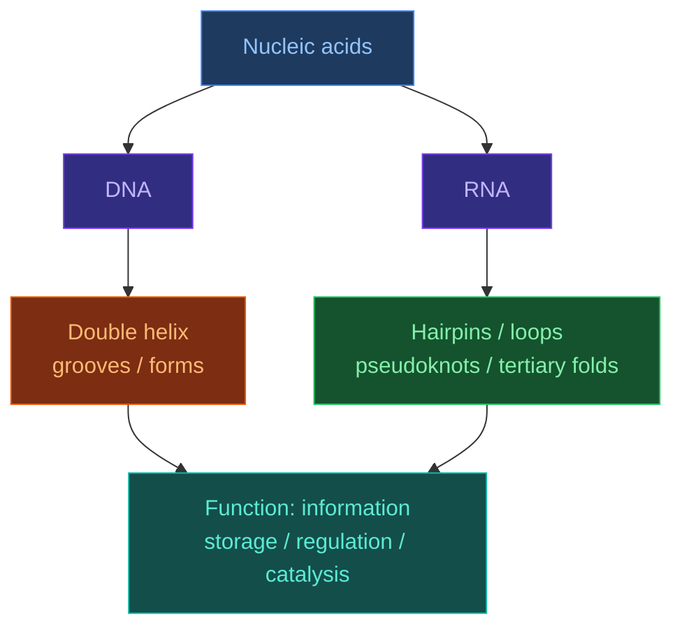

# Nucleic Acids

[[Home|Home]] > [[EN/Index|Concepts]] > Biology
🇺🇦 [[UA/2. Концепції/2.1. Біологія/2.1.4. Нуклеїнові кислоти|Українська]]

> **Nucleic acids** are not only information carriers. Their function depends on the combination of sequence, secondary structure, three-dimensional folding, ionic environment, and interactions with proteins and ligands.

## Why nucleic-acid structure matters so much

For DNA and RNA, sequence alone does not fully determine biological effect.
Critical factors include:

- spatial organization of the chain;
- accessibility of grooves, loops, and motifs;
- complementary base-pairing potential;
- binding to proteins, ions, and small molecules.

That is why the same sequence can behave differently in different environments, and why prediction for DNA/RNA is often harder than for globular proteins.

## Basic chemical logic

Each nucleotide contains:

- a nitrogenous base;
- a sugar;
- a phosphate group.

The DNA/RNA distinction already starts at the sugar level:

- DNA uses `2'-deoxyribose`;
- RNA uses `ribose` with a `2'-OH`, increasing reactivity and structural flexibility.

## DNA versus RNA

| Property | DNA | RNA |
|---|---|---|
| Sugar | 2'-deoxyribose | Ribose |
| Bases | A, T, G, C | A, U, G, C |
| Typical organization | Often double-stranded | Often single-stranded |
| Typical geometry | B-form | Locally A-like geometry |
| Stability | Higher | Lower because of 2'-OH |
| Typical roles | Information storage | Information, regulation, catalysis |

## Structural hierarchy

### DNA

For DNA, important features include:

- the double helix;
- major and minor grooves;
- alternative forms (`A-DNA`, `B-DNA`, `Z-DNA`);
- local deformations at protein-binding sites.

### RNA

For RNA, especially important are:

- secondary motifs;
- tertiary contacts;
- involvement of ions such as `Mg2+`;
- pseudoknots and other non-canonical pairing patterns.

## RNA secondary structure

In simplified energetic models, RNA folding is often written as a sum of stacking and loop contributions:

$$\Delta G_\text{fold}^{\text{RNA}} = \sum_i \Delta G_i^{\text{stack}} + \sum_j \Delta G_j^{\text{loop}} + \Delta G^{\text{init}}$$

Typical motifs include:

- `hairpin / stem-loop`;
- `bulge`;
- `internal loop`;
- `junction`;
- `pseudoknot`.

These motifs are functionally important in riboswitches, tRNA, ribozymes, and many regulatory RNAs.

## Non-canonical interactions

Unlike the simplified `A-U` and `G-C` picture, real RNA contains a large class of non-canonical base pairs and tertiary contacts.
These often underlie:

- catalysis;
- specific protein-RNA recognition;
- complex 3D folding.

So RNA prediction cannot be reduced to simple Watson-Crick pairing alone.

## Why nucleic acids are hard for ML models

- **Fewer high-quality structural data** than for proteins.
- **Higher conformational plasticity**, especially for RNA.
- **Strong environmental dependence**: ions, pH, ligands, proteins.
- **Non-canonical contacts** often matter more than simple sequence logic suggests.
- **MSA signal** for RNA/DNA is often less straightforward than for many protein families.

## AlphaFold 3 and nucleic acids

AF3 is important because it treats nucleic acids not as a side case but as one of the core entity types in unified biomolecular modeling.
In practice, this means:

- modeling `protein-DNA` and `protein-RNA` complexes;
- handling mixed `protein + nucleic acid + ligand` systems;
- broader coverage than earlier protein-centric approaches.

At the same time, RNA remains one of the hardest regimes because of flexibility and complex tertiary packing physics.

## Related approaches and methods

| Approach | What it models | Typical strength | Typical limitation |
|---|---|---|---|
| [[EN/1. AlphaFold3/1.2. Architecture/1.2.1. AF3 Architecture Overview]] | General biomolecular complexes | One model for mixed systems | Hard RNA regimes remain difficult |
| RNA secondary structure prediction | Pairing and local motifs | Strong for stem-loop logic | Weaker for full 3D |
| RNA tertiary modeling | RNA 3D folding | Better focus on RNA geometry | Less universal |
| Protein-DNA / protein-RNA docking | Interaction interfaces | Useful for specialized tasks | Often not universal end-to-end |

## Related Notes

- [[EN/2. Concepts/2.1. Biology/2.1.1. Protein Folding|Protein Folding]]
- [[EN/2. Concepts/2.3. Structural-Bioinformatics/2.3.4. MSA|MSA]]
- [[EN/1. AlphaFold3/1.3. Results/1.3.1. Accuracy Across Complex Types|Accuracy Across Complex Types]]
- [[EN/1. AlphaFold3/1.4. Limitations/1.4.1. Model Limitations|Model Limitations]]

> Watson and Crick (1953). *Molecular structure of nucleic acids*. Nature.
> DOI: [10.1038/171737a0](https://doi.org/10.1038/171737a0)

> Leontis and Westhof (2001). *Geometric nomenclature and classification of RNA base pairs*. RNA.
> DOI: [10.1017/S1355838201002515](https://doi.org/10.1017/S1355838201002515)

> Abramson et al. (2024). *Accurate structure prediction of biomolecular interactions with AlphaFold 3*. Nature.
> DOI: [10.1038/s41586-024-07487-w](https://doi.org/10.1038/s41586-024-07487-w)
