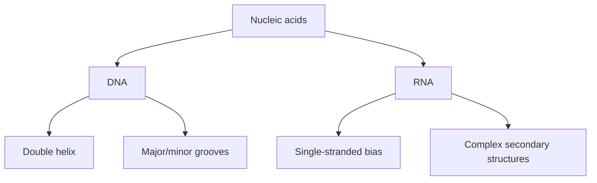

# Nucleic Acids

[[Home|Home]] > [[EN/Index|Concepts]] > Biology
🇺🇦 [[UA/2. Концепції/2.1. Біологія/2.1.4. Нуклеїнові кислоти|Українська]]

DNA and RNA are sequence polymers with strong structure-function coupling.

## Structural organization

## DNA vs RNA key differences

| Property | DNA | RNA |
|---|---|---|
| Sugar | Deoxyribose | Ribose |
| Base | Thymine | Uracil |
| Typical form | Double helix | Single-stranded with folds |
| Stability | Higher | Lower |

## RNA secondary structure

Common motifs: hairpins, internal loops, bulges, pseudoknots.

## AlphaFold 3 and nucleic acids

AF3 extends modeling to protein-DNA, protein-RNA, and mixed complexes in one unified framework.

## Related Notes

- [[EN/2. Concepts/2.3. Structural-Bioinformatics/2.3.2. lDDT|lDDT]]
- [[EN/2. Concepts/2.3. Structural-Bioinformatics/2.3.4. MSA|MSA]]
- [[EN/1. AlphaFold3/1.3. Results/1.3.1. Accuracy Across Complex Types|AF3 Results]]
