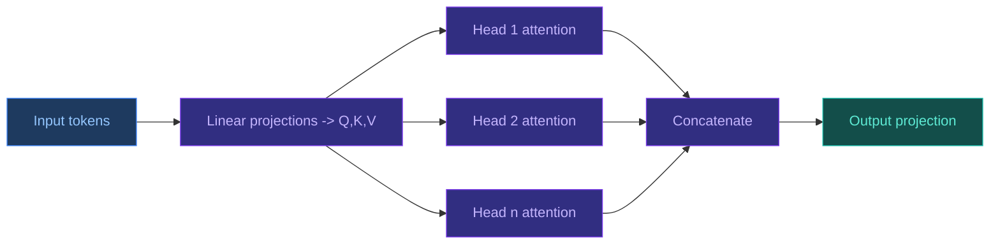

# Transformers in Structural Biology

[[Home|Home]] > [[EN/Index|Concepts]] > Machine Learning
🇺🇦 [[UA/2. Концепції/2.2. Машинне-Навчання/2.2.1. Трансформери|Українська]]

Transformers model long-range dependencies with attention and scale well to biological sequence/structure tasks.

## Attention mechanism

### Self-attention

$$\mathrm{Attention}(Q,K,V)=\mathrm{softmax}\!\left(\frac{QK^T}{\sqrt{d_k}}\right)V$$

### Multi-head attention

Multiple attention heads capture different interaction patterns simultaneously.

$$\mathrm{MHA}(X)=\mathrm{Concat}(\mathrm{head}_1,\ldots,\mathrm{head}_h)W_O$$

$$\mathrm{head}_i=\mathrm{Attention}(XW_Q^i,\,XW_K^i,\,XW_V^i)$$

Complexity: $O(N^2 d)$ with sequence length $N$.

## Why Attention is needed (rationale)

### Limitation of RNN/CNN baselines

- `RNN` models suffer from long gradient paths for distant tokens.
- `CNN` models are local by design; long-range dependencies require deep stacks.
- In proteins, residues far apart in sequence can be neighbors in 3D, so global interactions are essential.

### Core idea

Each token attends to every other token through similarity weights:

$$s_{ij}=\frac{q_i^\top k_j}{\sqrt{d_k}}, \qquad
\alpha_{ij}=\frac{\exp(s_{ij})}{\sum_{m=1}^{N}\exp(s_{im})}, \qquad
y_i=\sum_{j=1}^{N}\alpha_{ij}v_j$$

This creates a one-hop interaction path between any two positions.

### Why divide by $\sqrt{d_k}$

Without scaling, dot-products grow with dimension, softmax saturates, and gradients become unstable.
The $\sqrt{d_k}$ factor keeps logits in a trainable range.

## Intuitive example

Suppose token `i` is residue 35 and token `j` is residue 182.
They are far apart in sequence but may form a direct 3D contact.
Attention can assign a high weight $\alpha_{35,182}$ despite the sequence distance.

Toy score example for one query:

$$s=[1.2,\;0.1,\;2.0], \qquad \alpha=\mathrm{softmax}(s)\approx[0.28,\;0.09,\;0.63]$$

So the third token dominates the output mixture.



## PyTorch implementation example

Minimal implementation of `scaled dot-product attention` and `multi-head self-attention`.

```python
import torch
import torch.nn as nn
import torch.nn.functional as F


def scaled_dot_product_attention(q, k, v, mask=None, dropout_p=0.0, training=False):
    """
    q, k, v: [batch, heads, seq_len, head_dim]
    mask: broadcastable to [batch, heads, seq_len, seq_len]
          values: 1 for keep, 0 for block
    """
    d_k = q.size(-1)
    scores = torch.matmul(q, k.transpose(-2, -1)) / (d_k ** 0.5)

    if mask is not None:
        scores = scores.masked_fill(mask == 0, float("-inf"))

    attn = F.softmax(scores, dim=-1)
    attn = F.dropout(attn, p=dropout_p, training=training)
    out = torch.matmul(attn, v)
    return out, attn


class MultiHeadSelfAttention(nn.Module):
    def __init__(self, d_model: int, num_heads: int, dropout: float = 0.1):
        super().__init__()
        assert d_model % num_heads == 0, "d_model must be divisible by num_heads"
        self.d_model = d_model
        self.num_heads = num_heads
        self.head_dim = d_model // num_heads

        self.q_proj = nn.Linear(d_model, d_model)
        self.k_proj = nn.Linear(d_model, d_model)
        self.v_proj = nn.Linear(d_model, d_model)
        self.out_proj = nn.Linear(d_model, d_model)
        self.dropout = dropout

    def _split_heads(self, x):
        # x: [batch, seq_len, d_model] -> [batch, heads, seq_len, head_dim]
        bsz, seq_len, _ = x.shape
        x = x.view(bsz, seq_len, self.num_heads, self.head_dim)
        return x.transpose(1, 2)

    def _merge_heads(self, x):
        # x: [batch, heads, seq_len, head_dim] -> [batch, seq_len, d_model]
        bsz, _, seq_len, _ = x.shape
        x = x.transpose(1, 2).contiguous()
        return x.view(bsz, seq_len, self.d_model)

    def forward(self, x, mask=None, return_attn=False):
        q = self._split_heads(self.q_proj(x))
        k = self._split_heads(self.k_proj(x))
        v = self._split_heads(self.v_proj(x))

        context, attn = scaled_dot_product_attention(
            q, k, v, mask=mask, dropout_p=self.dropout, training=self.training
        )
        out = self.out_proj(self._merge_heads(context))
        if return_attn:
            return out, attn
        return out


if __name__ == "__main__":
    torch.manual_seed(7)
    x = torch.randn(2, 128, 256)  # [batch, seq_len, d_model]
    mha = MultiHeadSelfAttention(d_model=256, num_heads=8, dropout=0.1)
    y, attn = mha(x, return_attn=True)
    print("output:", y.shape)      # [2, 128, 256]
    print("attn:", attn.shape)     # [2, 8, 128, 128]
```

## Standard transformer vs bio variants

| Variant | Input | Output | Typical use |
|---|---|---|---|
| NLP transformer | token sequence | contextual embeddings | language tasks |
| Protein LM | amino acids | sequence embeddings | pLM pretraining |
| Pairformer | sequence + pair tensors | updated pair/sequence reps | AF3 trunk |

## Pairformer in AlphaFold 3

### What changed vs AF2

- richer pair updates
- stronger sequence-pair coupling
- improved handling of hetero-complexes

### Pair representation update

$$z_{ij} \leftarrow z_{ij} + \mathrm{TriangleAtt}(z) + \mathrm{TriangleMult}(z) + \mathrm{Transition}(z)$$

AF3 heavily relies on pairwise latent tensors for geometry-aware conditioning.

## Invariant Point Attention (IPA)

IPA injects 3D-aware attention while preserving coordinate frame consistency.

$$a_{ij}=\mathrm{softmax}\!\left(
\frac{q_i^\top k_j}{d} + b_{ij}
- \frac{\gamma}{2}\sum_p \left\|T_i\mathbf{q}_i^p - T_j\mathbf{k}_j^p\right\|^2
\right)$$


> Vaswani et al. (2017). *Attention Is All You Need*. NeurIPS.
> DOI: [10.48550/arXiv.1706.03762](https://doi.org/10.48550/arXiv.1706.03762)

> Jumper et al. (2021). *Highly accurate protein structure prediction with AlphaFold*. Nature 596.
> DOI: [10.1038/s41586-021-03819-2](https://doi.org/10.1038/s41586-021-03819-2)

## Related Notes

- [[EN/1. AlphaFold3/1.2. Architecture/1.2.2. Pairformer|Pairformer]]
- [[EN/2. Concepts/2.2. Machine-Learning/2.2.4. Geometric Deep Learning|Geometric Deep Learning]]
- [[EN/2. Concepts/2.2. Machine-Learning/2.2.3. Protein Language Models|Protein Language Models]]
