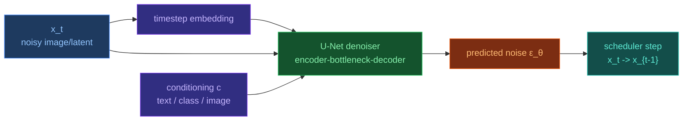

# Diffusion Models

[[Home|Home]] > [[EN/Index|Concepts]] > Machine Learning
🇺🇦 [[UA/2. Концепції/2.2. Машинне-Навчання/2.2.2. Дифузійні моделі|Українська]]

Diffusion models generate samples by reversing gradual noise injection.

$$q(x_t|x_0)=\mathcal{N}(\sqrt{\bar\alpha_t}x_0,(1-\bar\alpha_t)I)$$

## Brief overview

- Forward process: data to Gaussian noise
- Reverse process: denoising model learns to reconstruct samples
- Training target: noise prediction or score prediction

## In AlphaFold 3 context

AF3 uses diffusion in coordinate space to sample atom positions conditioned on Pairformer representations.

![[EN/1. AlphaFold3/1.6. Illustrations/diffusion-forward-reverse.excalidraw]]

## U-Net in image diffusion

`U-Net` is an encoder-decoder architecture with skip connections between symmetric resolution levels:

- **Encoder path**: downsampling with increasing channel depth.
- **Bottleneck**: compact global representation.
- **Decoder path**: upsampling back to target resolution.
- **Skip connections**: preserve fine spatial details and improve reconstruction.

In image diffusion (DDPM/latent diffusion), U-Net typically parameterizes $\varepsilon_\theta(x_t, t, c)$ or $v_\theta(\cdot)$.

## Comparison: AF3 diffusion vs image diffusion (U-Net)

| Aspect | AF3 diffusion | Image diffusion (U-Net) |
|---|---|---|
| State space | 3D atomic coordinates $\mathbb{R}^{N\times3}$ | Pixels or latent maps $\mathbb{R}^{H\times W\times C}$ |
| What is denoised | Molecular complex geometry | Image/latent tensor |
| Core denoiser | AF3 geometry-aware module with Pairformer conditioning | U-Net (encoder-decoder + skip connections) |
| Conditioning | Single/pair representations, molecule types, structural context | Text, class labels, image conditioning (often via cross-attention) |
| Symmetry constraints | Strong $SE(3)$ consistency requirements in 3D | Primarily 2D grid inductive bias; full rotation equivariance is usually not explicit |
| Training target | Noise/score in coordinate space + structural constraints | Noise $\varepsilon$, velocity $v$, or score in 2D/latent space |
| Output | 3D biomolecular complex structure | Synthesized image |
| Typical metrics | RMSD, lDDT/pLDDT, DockQ, clash/contact quality | FID, CLIP score, human preference |

In short, both use reverse diffusion, but the **inductive biases** differ: AF3 prioritizes physically consistent 3D geometry, while image diffusion prioritizes multi-scale 2D structure and semantic conditioning.

## Key references

- Sohl-Dickstein et al. (2015)
- Ho et al. (2020)
- Song et al. (2021)

## Related Notes

- [[EN/1. AlphaFold3/1.2. Architecture/1.2.4. Diffusion Models — Theory and Applications|Theory and Applications]]
- [[EN/1. AlphaFold3/1.2. Architecture/1.2.3. Diffusion Module|Diffusion Module]]
