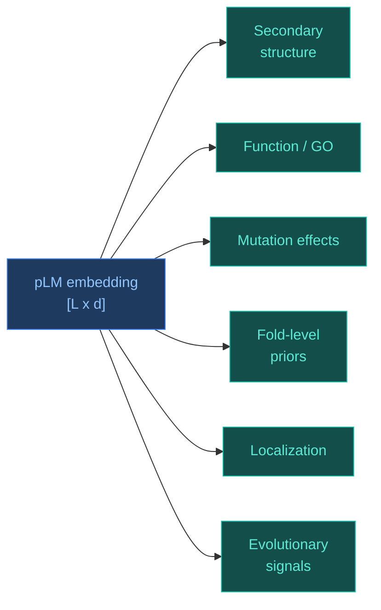

# Protein Language Models (pLM)

[[Home|Home]] > [[EN/Index|Concepts]] > Machine Learning
🇺🇦 [[UA/2. Концепції/2.2. Машинне-Навчання/2.2.3. Білкові мовні моделі|Українська]]

> A **protein language model** (`pLM`) is trained on large corpora of protein sequences without manual labels and learns to predict amino-acid context. Because of that objective, it absorbs statistical regularities that reflect evolutionary, biophysical, and partially structural constraints.

---

## Why is this possible at all?

The idea works not because proteins are literally "text", but because protein sequences are not random strings.

### 1. Sequences are constrained by physics and evolution

A functional protein must:

- fold into a stable 3D structure;
- maintain compatible physicochemical residue patterns;
- survive evolutionary selection;
- often preserve motifs, active sites, and interface signatures.

So natural proteins occupy only a narrow subset of the full combinatorial sequence space.

### 2. Context carries biological signal

The probability of observing a residue at position $i$ depends on nearby and distant positions:

$$p(x_i \mid x_{\setminus i})$$

or in the autoregressive form:

$$p(x)=\prod_{i=1}^{L} p(x_i \mid x_{<i})$$

If a model becomes good at restoring masked residues or predicting the next residue, it is forced to encode:

- local motifs;
- long-range dependencies;
- family-level similarity;
- signals related to structure and function.

### 3. Scale compensates for missing labels

There are far fewer structure/function labels than raw sequences.
Self-supervised learning exploits this asymmetry: the model learns from unlabeled sequence corpora first, and the resulting representations are reused for downstream tasks.

### 4. Evolution leaves a statistical trace

When similar substitutions repeatedly appear in similar structural or functional contexts, the model starts to generalize those regularities.
That is why pLM embeddings often contain information about fold, conservation, mutation effects, and parts of function.

## From NLP to proteins

The analogy to NLP is useful, but incomplete.

| NLP | Proteins |
| --- | --- |
| Tokens | Amino acids or subsequences |
| Word context | Sequence and evolutionary context |
| Grammar | Biophysical and evolutionary constraints |
| Semantics | Structure, function, interactions |
| Masked token | Masked residue |

The core difference is that protein "meaning" is realized through 3D structure, dynamics, and interactions, not only linear context.

## Main approaches

### 1. `Autoregressive` models

The model reads left-to-right and estimates:

$$p(x)=\prod_{i=1}^{L} p(x_i \mid x_{<i})$$

Strengths:

- natural for sequence generation;
- convenient for conditional design after fine-tuning.

Limitations:

- weaker bidirectional context than masked encoders;
- often less convenient as a universal residue-level encoder.

Examples:

- `UniRep`;
- `ProtGPT2`;
- `ProGen`.

### 2. `Masked language modeling` — bidirectional encoders

The model receives a sequence with masked positions and reconstructs the hidden residues:

$$\mathcal{L}_{\mathrm{MLM}}=-\mathbb{E}\left[\log p_\theta(x_i \mid x_{\setminus i})\right]$$

Strengths:

- use context from both sides;
- produce strong embeddings for classification, localization, and mutation scoring.

Examples:

- `ESM-1 / ESM-2`;
- `ProtBert`;
- `ProtT5`.

### 3. `MSA-aware` models

Here the input is not a single sequence but a `multiple sequence alignment` (`MSA`).
These models learn across rows and columns of an alignment, combining pLM ideas with classical evolutionary signal.

Strengths:

- stronger access to coevolution;
- particularly useful for contacts and structure.

Limitations:

- require MSA construction, so they are not fully `single-sequence`;
- more expensive in practice.

Example:

- `MSA Transformer`.

### 4. `Protein-specific multitask` approaches

Some models go beyond pure MLM and add protein-native objectives.
For example, `ProteinBERT` combines language modeling with protein-level prediction tasks, including functional annotation.

Strengths:

- better alignment between local and global representations;
- useful for function-centric tasks.

### 5. `Sequence-to-structure coupled` models

There is a separate class of systems where a pLM acts as the sequence encoder for structure prediction.
The best-known example is `ESMFold`, which predicts structure from single-sequence signal without a full MSA pipeline.

## What do pLM embeddings actually encode?

Embeddings are not a structure by themselves, but they often encode signals useful for:

- secondary structure;
- solvent exposure;
- subcellular localization;
- family membership;
- residue importance;
- mutation effect prediction;
- coarse fold-level priors.

The deeper reason is that the model compresses into a vector whatever is useful for context prediction.
In proteins, that context is shaped not only by local sequence patterns but also by structure and function constraints.

## Properties of pLMs

- **Self-supervised scalability**: they can learn from extremely large sequence databases without manual labels.
- **Transfer learning**: one pretrained model can support many downstream tasks.
- **Single-sequence capability**: many pLMs remain useful without MSA, which matters for rare or novel proteins.
- **Zero-shot behavior**: some models score mutation effects without task-specific retraining.
- **Representation reuse**: the same embedding can support residue-level and protein-level prediction.
- **Multimodal compatibility**: pLM embeddings combine well with structural, graph, and geometric models.

## Limitations

- **Sequence is not the whole mechanism**: pLMs do not contain an explicit physical model of energy, solvent, or kinetics.
- **Weaker multimer / ligand awareness**: sequence-only models often miss inter-chain and ligand-dependent effects.
- **Dataset bias**: training corpora cover some protein families much better than others.
- **Quadratic attention cost**: long sequences remain expensive for full attention.
- **Representation is not causality**: a useful embedding does not imply mechanistic biochemical understanding.
- **Generation does not guarantee function**: plausible sequences still require structural and experimental validation.

## Other related approaches and methods

The list below includes both classical pLMs and neighboring methods that often appear in the same practical pipelines.

| Approach / method | Type | What it does | Examples |
| --- | --- | --- | --- |
| `Single-sequence pLM` | sequence-only pretraining | Learns embeddings from raw sequences | ESM-2, ProtT5 |
| `MSA-based models` | family-aware sequence modeling | Uses coevolution through alignments | [[EN/2. Concepts/2.3. Structural-Bioinformatics/2.3.4. MSA]], MSA Transformer |
| `Generative pLM` | sequence generation | Generates new protein sequences | ProGen, ProtGPT2 |
| `pLM + structure head` | sequence-to-structure | Predicts 3D structure from embeddings | ESMFold |
| `Inverse folding` | structure-conditioned design | Generates sequence for a target structure | ProteinMPNN |
| `Geometric models` | structure-native learning | Works directly with 3D geometry | EGNN, SE(3) models |

### Short cases of important families

- **`ProtTrans`**:
  a large family of protein LMs (`BERT`, `T5`, `XLNet`) showing that raw embeddings already support structure- and function-related tasks.
- **`ProteinBERT`**:
  a protein-specific architecture that jointly models local sequence and global protein-level information.
- **`MSA Transformer`**:
  a bridge between pLMs and classical evolutionary modeling.
- **`ESM-2`**:
  a strong bidirectional transformer encoder for general-purpose protein embeddings.
- **`ESMFold`**:
  an example of using a pLM as the core of single-sequence structure prediction.
- **`ProGen` / `ProtGPT2`**:
  generative models for de novo protein sequence design.
- **`ProteinMPNN`**:
  not a classical pLM, but an important neighboring method for structure-conditioned sequence design.

## pLMs in the broader context of AlphaFold-like systems

For structural biology tasks, pLMs matter for two main reasons:

- they provide a strong `single-sequence prior` when MSA is weak or expensive;
- they can serve as an upstream source of features for structural and geometric models.

So pLMs do not replace all of structural biology, but they substantially reduce dependence on manual features and expensive evolutionary preprocessing in part of the design space.

## Related Notes

- [[EN/2. Concepts/2.2. Machine-Learning/2.2.1. Transformers|Transformers]]
- [[EN/2. Concepts/2.3. Structural-Bioinformatics/2.3.4. MSA|MSA]]
- [[EN/2. Concepts/2.2. Machine-Learning/2.2.4. Geometric Deep Learning|Geometric Deep Learning]]
- [[EN/1. AlphaFold3/1.2. Architecture/1.2.1. AF3 Architecture Overview|AF3 Architecture Overview]]

> Rao et al. (2019). *Evaluating Protein Transfer Learning with TAPE*. NeurIPS.
> DOI: [10.48550/arXiv.1906.08230](https://doi.org/10.48550/arXiv.1906.08230)

> Rives et al. (2021). *Biological structure and function emerge from scaling unsupervised learning to 250 million protein sequences*. PNAS.
> DOI: [10.1073/pnas.2016239118](https://doi.org/10.1073/pnas.2016239118)

> Rao et al. (2021). *MSA Transformer*. ICML.
> DOI: [10.48550/arXiv.2104.02180](https://doi.org/10.48550/arXiv.2104.02180)

> Elnaggar et al. (2022). *ProtTrans: Toward Understanding the Language of Life Through Self-Supervised Learning*. IEEE TPAMI.
> DOI: [10.1109/TPAMI.2021.3095381](https://doi.org/10.1109/TPAMI.2021.3095381)

> Brandes et al. (2022). *ProteinBERT: a universal deep-learning model of protein sequence and function*. Bioinformatics.
> DOI: [10.1093/bioinformatics/btac020](https://doi.org/10.1093/bioinformatics/btac020)

> Meier et al. (2021). *Language models enable zero-shot prediction of the effects of mutations on protein function*. NeurIPS.
> DOI: [10.48550/arXiv.2107.04680](https://doi.org/10.48550/arXiv.2107.04680)

> Lin et al. (2023). *Evolutionary-scale prediction of atomic-level protein structure with a language model*. Science.
> DOI: [10.1126/science.ade2574](https://doi.org/10.1126/science.ade2574)

> Madani et al. (2023). *Large language models generate functional protein sequences across diverse families*. Nature Biotechnology.
> DOI: [10.1038/s41587-022-01618-2](https://doi.org/10.1038/s41587-022-01618-2)

> Ferruz et al. (2022). *ProtGPT2 is a deep unsupervised language model for protein design*. Nature Communications.
> DOI: [10.1038/s41467-022-32007-7](https://doi.org/10.1038/s41467-022-32007-7)

> Alley et al. (2019). *Unified rational protein engineering with sequence-based deep representation learning*. Nature Methods.
> DOI: [10.1038/s41592-019-0598-1](https://doi.org/10.1038/s41592-019-0598-1)

> Dauparas et al. (2022). *Robust deep learning-based protein sequence design using ProteinMPNN*. Science.
> DOI: [10.1126/science.add2187](https://doi.org/10.1126/science.add2187)
