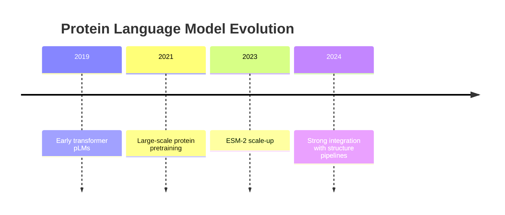

# Protein Language Models (pLM)

[[Home|Home]] > [[EN/Index|Concepts]] > Machine Learning
🇺🇦 [[UA/2. Концепції/2.2. Машинне-Навчання/2.2.3. Білкові мовні моделі|Українська]]

Protein language models learn latent representations from large unlabeled sequence corpora.

## From NLP to proteins

Tokens are amino acids; context captures biochemical and evolutionary constraints.

## Architecture evolution

| Generation | Core idea | Example |
|---|---|---|
| RNN/CNN | local context | early protein models |
| Transformer | global context | ESM-1/2 |
| Large pLM | scaling + pretraining | ESM-2, ProtT5 |

## ESM-2 architecture

Transformer stack with masked token prediction objective over massive protein datasets.

## What embeddings encode

- residue environment
- long-range dependencies
- functional constraints
- fold-level priors

## pLM in AlphaFold 3

pLM-style priors complement alignment signal and improve robustness in low-MSA settings.

## Related Notes

- [[EN/2. Concepts/2.3. Structural-Bioinformatics/2.3.4. MSA|MSA]]
- [[EN/1. AlphaFold3/1.2. Architecture/1.2.2. Pairformer|Pairformer]]
