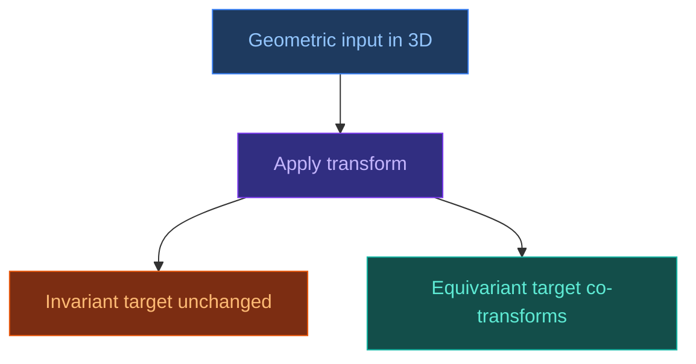

# Geometric Deep Learning

[[Home|Home]] > [[EN/Index|Concepts]] > Machine Learning
🇺🇦 [[UA/2. Концепції/2.2. Машинне-Навчання/2.2.4. Геометричне глибоке навчання|Українська]]

Geometric deep learning integrates physical symmetries directly into model design.

## Symmetries in molecular modeling

3D molecular data is transformed by translation, rotation, and reflection; predictions should remain physically consistent.

## Invariance vs equivariance

| Property | Definition | Example |
| --- | --- | --- |
| Invariant | output unchanged under transform | scalar energy |
| Equivariant | output transforms predictably | coordinates, vectors |

## Symmetry groups in biomolecular ML

- E(3): Euclidean group in 3D
- SE(3): rotations + translations



## Graph neural networks for molecules

Molecules are naturally represented as graphs: atoms as nodes, bonds as edges.

## SE(3)-Transformer and EGNN

These architectures improve 3D prediction quality by enforcing geometric constraints.

## AlphaFold 3 and geometric equivariance

AF3 diffusion and structural modules benefit from geometry-aware representations and updates.

```mermaid
flowchart LR
    ATOMS[Atoms / residues]:::input --> GRAPH[Graph representation]:::trunk
    GRAPH --> GEO[SE(3)-aware model]:::diffusion
    GEO --> XYZ[3D coordinate prediction]:::output

    classDef input fill:#1e3a5f,stroke:#3b82f6,color:#93c5fd
    classDef trunk fill:#312e81,stroke:#7c3aed,color:#c4b5fd
    classDef diffusion fill:#14532d,stroke:#22c55e,color:#86efac
    classDef confidence fill:#7c2d12,stroke:#ea580c,color:#fdba74
    classDef output fill:#134e4a,stroke:#14b8a6,color:#5eead4
    classDef neutral fill:#1e293b,stroke:#475569,color:#94a3b8
```

## Related Notes

- [[EN/1. AlphaFold3/1.2. Architecture/1.2.3. Diffusion Module|Diffusion Module]]
- [[EN/2. Concepts/2.2. Machine-Learning/2.2.1. Transformers|Transformers]]
