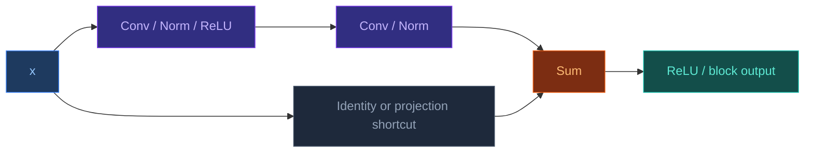

# ResNet

[[Home|Home]] > [[EN/Index|Concepts]] > Machine Learning
🇺🇦 [[UA/2. Концепції/2.2. Машинне-Навчання/2.2.5. ResNet|Українська]]

> **ResNet** (`Residual Network`) is a family of deep convolutional networks in which each block learns a residual transform $F(x)$ and adds it back to the input tensor $x$. This shortcut path makes signal and gradient propagation much easier in very deep models.

## Core idea

In a plain CNN, a block tries to approximate a mapping $H(x)$ directly.
In ResNet, the block learns only a correction term:

$$y = F(x; W) + x$$

where $F(x; W)$ is a stack of convolutions, normalization layers, and nonlinearities.

If tensor dimensions change, the shortcut becomes a projection:

$$y = F(x; W) + W_s x$$

This parameterization is useful when the target mapping is close to identity or differs from it only by a small update.

## ResNet architecture

A typical ResNet consists of:

- an input `stem`: large convolution + downsampling;
- several residual `stages`;
- global average pooling;
- a final classifier head.


## Residual block

The two most common block designs are:

- `BasicBlock`:
  two `3x3` convolutions, typical for ResNet-18/34.
- `Bottleneck`:
  `1x1 -> 3x3 -> 1x1`, typical for ResNet-50/101/152.



## Properties

- **Improved gradient flow**: the identity path provides a short route for forward and backward propagation.
- **Depth scalability**: ResNet made it practical to train much deeper CNNs than plain convolutional stacks.
- **Feature reuse**: each block adds a correction to the current representation instead of rebuilding features from scratch.
- **Flexible variants**: pre-activation ResNet, Wide ResNet, and ResNeXt modify normalization order, width, or cardinality.
- **General design pattern**: residual updates became a standard optimization motif beyond CNNs, including transformers and graph neural networks.

## Minimal PyTorch example

```python
import torch
import torch.nn as nn


class BasicBlock(nn.Module):
    expansion = 1

    def __init__(self, in_channels: int, out_channels: int, stride: int = 1):
        super().__init__()
        self.conv1 = nn.Conv2d(
            in_channels, out_channels, kernel_size=3, stride=stride, padding=1, bias=False
        )
        self.bn1 = nn.BatchNorm2d(out_channels)
        self.relu = nn.ReLU(inplace=True)
        self.conv2 = nn.Conv2d(
            out_channels, out_channels, kernel_size=3, stride=1, padding=1, bias=False
        )
        self.bn2 = nn.BatchNorm2d(out_channels)

        if stride != 1 or in_channels != out_channels:
            self.shortcut = nn.Sequential(
                nn.Conv2d(in_channels, out_channels, kernel_size=1, stride=stride, bias=False),
                nn.BatchNorm2d(out_channels),
            )
        else:
            self.shortcut = nn.Identity()

    def forward(self, x):
        identity = self.shortcut(x)
        out = self.relu(self.bn1(self.conv1(x)))
        out = self.bn2(self.conv2(out))
        out = out + identity
        return self.relu(out)


if __name__ == "__main__":
    x = torch.randn(2, 64, 56, 56)
    block = BasicBlock(64, 64)
    y = block(x)
    print(y.shape)  # [2, 64, 56, 56]
```

## Applications

- **Image classification**: the canonical use case that established ResNet as a standard backbone.
- **Detection / localization**: deep residual features work well as the feature extractor for detectors.
- **Semantic / instance segmentation**: ResNet encoders are common in segmentation pipelines.
- **Transfer learning**: pretrained ResNets are widely used as generic feature extractors.

## Relation to AlphaFold 3

AlphaFold 3 is not a ResNet architecture: its trunk is built around attention, pair updates, and diffusion.
However, the broader idea of **residual updates** is shared across modern deep learning systems: deep blocks learn corrections to a representation, which helps optimization and stabilizes training.

## Related Notes

- [[EN/2. Concepts/2.2. Machine-Learning/2.2.1. Transformers|Transformers]]
- [[EN/2. Concepts/2.2. Machine-Learning/2.2.4. Geometric Deep Learning|Geometric Deep Learning]]
- [[EN/1. AlphaFold3/1.2. Architecture/1.2.2. Pairformer|Pairformer]]

> He et al. (2016). *Deep Residual Learning for Image Recognition*. CVPR.
> DOI: [10.1109/CVPR.2016.90](https://doi.org/10.1109/CVPR.2016.90)

> He et al. (2016). *Identity Mappings in Deep Residual Networks*. ECCV.
> DOI: [10.48550/arXiv.1603.05027](https://doi.org/10.48550/arXiv.1603.05027)

> Zagoruyko and Komodakis (2016). *Wide Residual Networks*. BMVC.
> DOI: [10.48550/arXiv.1605.07146](https://doi.org/10.48550/arXiv.1605.07146)
