# U-Net

[[Home|Home]] > [[EN/Index|Concepts]] > Machine Learning
🇺🇦 [[UA/2. Концепції/2.2. Машинне-Навчання/2.2.6. U-Net|Українська]]

> **U-Net** is an `encoder-decoder` architecture designed for dense prediction, especially biomedical image segmentation. Its core idea is to combine multi-scale context with precise local detail through skip connections between symmetric levels of the contracting and expanding paths.

## Core idea

U-Net has two symmetric parts:

- the `contracting path` (`encoder`) gradually reduces spatial resolution and increases channel depth;
- the `expanding path` (`decoder`) restores resolution;
- skip connections pass high-detail features from the encoder to the decoder.

This allows the model to combine global context with accurate object boundaries.

## U-Net architecture

A typical encoder block performs `Conv -> Conv -> Downsample`, while a decoder block performs `Upsample -> Concat -> Conv -> Conv`.

```mermaid
flowchart LR
    IN["Input image / feature map"]:::input --> E1["Encoder 1<br/>Conv + Conv"]:::trunk
    E1 --> D1["Downsample"]:::neutral
    D1 --> E2["Encoder 2<br/>Conv + Conv"]:::trunk
    E2 --> D2["Downsample"]:::neutral
    D2 --> B["Bottleneck"]:::diffusion
    B --> U2["Upsample"]:::neutral
    E2 --> S2["Skip features"]:::confidence
    U2 --> C2["Concat"]:::confidence
    S2 --> C2
    C2 --> DEC2["Decoder 2<br/>Conv + Conv"]:::trunk
    DEC2 --> U1["Upsample"]:::neutral
    E1 --> S1["Skip features"]:::confidence
    U1 --> C1["Concat"]:::confidence
    S1 --> C1
    C1 --> DEC1["Decoder 1<br/>Conv + Conv"]:::trunk
    DEC1 --> OUT["Segmentation mask / dense output"]:::output

    classDef input fill:#1e3a5f,stroke:#3b82f6,color:#93c5fd
    classDef trunk fill:#312e81,stroke:#7c3aed,color:#c4b5fd
    classDef diffusion fill:#14532d,stroke:#22c55e,color:#86efac
    classDef confidence fill:#7c2d12,stroke:#ea580c,color:#fdba74
    classDef output fill:#134e4a,stroke:#14b8a6,color:#5eead4
    classDef neutral fill:#1e293b,stroke:#475569,color:#94a3b8
```



## Key block relation

At a simplified decoder level:

$$u_l = \mathrm{Up}(h_{l+1}), \qquad
c_l = \mathrm{Concat}(u_l, s_l), \qquad
h_l = f_l(c_l)$$

where:

- $h_{l+1}$ is the deeper representation;
- $s_l$ is the skip feature tensor from the encoder;
- $\mathrm{Up}$ is upsampling or transpose convolution;
- $f_l$ is a local convolution stack.

## Properties

- **Multi-scale reasoning**: the encoder captures broad context while the decoder recovers spatial detail.
- **Accurate localization**: skip connections preserve boundary and fine-structure information.
- **Good small-data behavior**: U-Net was created for biomedical settings where labeled data are often limited.
- **Modality flexibility**: the architecture has 2D, 3D, multimodal, and temporal variants.
- **Strong diffusion compatibility**: modified U-Net backbones are widely used as denoisers in generative diffusion models.

## Minimal PyTorch example

```python
import torch
import torch.nn as nn

class DoubleConv(nn.Module):
    def __init__(self, in_channels: int, out_channels: int):
        super().__init__()
        self.block = nn.Sequential(
            nn.Conv2d(in_channels, out_channels, kernel_size=3, padding=1),
            nn.ReLU(inplace=True),
            nn.Conv2d(out_channels, out_channels, kernel_size=3, padding=1),
            nn.ReLU(inplace=True),
        )

    def forward(self, x):
        return self.block(x)

class MiniUNet(nn.Module):
    def __init__(self, in_channels: int = 1, out_channels: int = 1):
        super().__init__()
        self.enc1 = DoubleConv(in_channels, 32)
        self.pool = nn.MaxPool2d(2)
        self.bottleneck = DoubleConv(32, 64)
        self.up = nn.ConvTranspose2d(64, 32, kernel_size=2, stride=2)
        self.dec1 = DoubleConv(64, 32)
        self.head = nn.Conv2d(32, out_channels, kernel_size=1)

    def forward(self, x):
        skip = self.enc1(x)
        x = self.pool(skip)
        x = self.bottleneck(x)
        x = self.up(x)
        x = torch.cat([x, skip], dim=1)
        x = self.dec1(x)
        return self.head(x)

if __name__ == "__main__":
    x = torch.randn(2, 1, 128, 128)
    model = MiniUNet()
    y = model(x)
    print(y.shape)  # [2, 1, 128, 128]
```

## Applications

- **Biomedical segmentation**: cells, tissues, organs, tumors, and vessels in microscopy, CT, and MRI.
- **Computer vision segmentation**: roads, buildings, material defects, and satellite imagery.
- **Dense prediction maps**: depth estimation, saliency, heatmaps, and pixel-wise labeling.
- **Image diffusion models**: U-Net-like networks often serve as the main denoiser.

## Relation to AlphaFold 3

AlphaFold 3 does not use a classical 2D U-Net as its main trunk.
Still, U-Net matters in the broader deep learning landscape because it is a canonical way to fuse multi-scale context with local detail, and it strongly influenced many diffusion-based systems.

## Related Notes

- [[EN/2. Concepts/2.2. Machine-Learning/2.2.2. Diffusion Models|Diffusion Models]]
- [[EN/2. Concepts/2.2. Machine-Learning/2.2.5. ResNet|ResNet]]
- [[EN/2. Concepts/2.2. Machine-Learning/2.2.4. Geometric Deep Learning|Geometric Deep Learning]]

> Ronneberger et al. (2015). *U-Net: Convolutional Networks for Biomedical Image Segmentation*. MICCAI.
> DOI: [10.1007/978-3-319-24574-4_28](https://doi.org/10.1007/978-3-319-24574-4_28)

> Çiçek et al. (2016). *3D U-Net: Learning Dense Volumetric Segmentation from Sparse Annotation*. MICCAI.
> DOI: [10.48550/arXiv.1606.06650](https://doi.org/10.48550/arXiv.1606.06650)

> Ho et al. (2020). *Denoising Diffusion Probabilistic Models*. NeurIPS.
> DOI: [10.48550/arXiv.2006.11239](https://doi.org/10.48550/arXiv.2006.11239)
