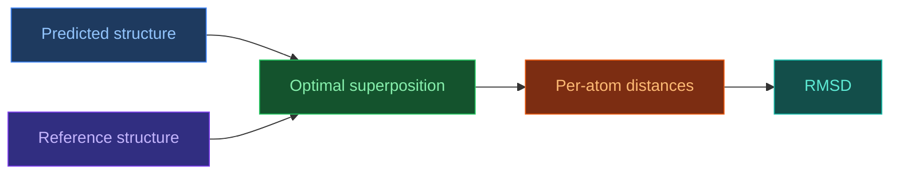

# RMSD — Root Mean Square Deviation

[[Home|Home]] > [[EN/Index|Concepts]] > Structural Bioinformatics
🇺🇦 [[UA/2. Концепції/2.3. Структурна-Біоінформатика/2.3.1. RMSD|Українська]]

> **RMSD** is one of the standard structural similarity metrics. It measures the average squared positional deviation between matched atoms after optimal rigid-body superposition.

## Why RMSD is useful

RMSD is convenient because it yields a single intuitive value in angstroms corresponding to average spatial error.
It is commonly used for:

- prediction accuracy assessment;
- docked pose evaluation;
- MD trajectory analysis;
- benchmark comparison of structure-prediction methods.

## Mathematical definition

$$\mathrm{RMSD}=\sqrt{\frac{1}{N}\sum_{i=1}^{N}\left\|\mathbf{r}_i^{\mathrm{pred}}-\mathbf{r}_i^{\mathrm{ref}}\right\|^2}$$

where:

- $N$ is the number of matched atoms;
- $\mathbf{r}_i \in \mathbb{R}^3$ is an atomic coordinate.

## Why optimal superposition is required

Without alignment, RMSD would mix real local errors with arbitrary global rotations and translations.
Therefore one first solves a rigid-body fitting problem:

$$(\hat{R}, \hat{\mathbf{t}})=\arg\min_{R\in SO(3),\,\mathbf{t}} \sum_i \left\|R\mathbf{r}_i^{\mathrm{pred}}+\mathbf{t}-\mathbf{r}_i^{\mathrm{ref}}\right\|^2$$

The classical solution is given by the `Kabsch` algorithm via `SVD`.

## Common RMSD variants

| Variant | Atoms used | When it is useful |
|---|---|---|
| `Cα RMSD` | `Cα` only | Fast protein fold comparison |
| `Backbone RMSD` | `N`, `Cα`, `C`, `O` | Global backbone geometry |
| `All-atom RMSD` | All heavy atoms | Detailed model evaluation |
| `Ligand RMSD` | Ligand atoms | Docking-pose quality |
| `Interface RMSD` | Interface atoms | Complex-quality assessment |

## Practical interpretation

| RMSD | Typical interpretation |
|---|---|
| `< 1 Å` | Nearly identical structures |
| `1–2 Å` | Very high accuracy |
| `2–4 Å` | Overall shape retained, local deviations visible |
| `> 4 Å` | Major structural disagreement |

For ligand docking, a common rule of thumb is:

$$\mathrm{Ligand\ RMSD} < 2\ \text{\AA}$$

as an indicator of a correct or nearly correct pose.

## Strengths of RMSD

- **Intuitive scale**: values in angstroms are easy to interpret.
- **Simplicity**: the metric is easy to compute and compare across studies.
- **Broad applicability**: it can be used for proteins, ligands, nucleic acids, and complexes.

## Limitations of RMSD

- **Sensitivity to outliers**: one poorly modeled loop can distort the whole score.
- **Dependence on superposition**: different alignment choices can slightly affect the value.
- **Weak local interpretability**: a single number does not tell where the error lies.
- **System-size dependence**: the same RMSD value means different things for a small ligand and a large protein.

## RMSD versus other metrics

| Metric | What it captures better |
|---|---|
| [[EN/2. Concepts/2.3. Structural-Bioinformatics/2.3.1. RMSD]] | Global average deviation after superposition |
| [[EN/2. Concepts/2.3. Structural-Bioinformatics/2.3.2. lDDT]] | Local quality without global alignment |
| [[EN/2. Concepts/2.3. Structural-Bioinformatics/2.3.3. DockQ]] | Interface quality in complexes |
| `TM-score` | Fold-level similarity with weaker length dependence |

## TM-score as an important complement

TM-score depends less strongly on protein length and better reflects topological similarity:

$$\mathrm{TM\text{-}score}=\max_{(R,t)}\left[\frac{1}{L}\sum_i \frac{1}{1+(d_i/d_0)^2}\right]$$

That is why RMSD and TM-score are often best interpreted together rather than separately.

## Related Notes

- [[EN/2. Concepts/2.3. Structural-Bioinformatics/2.3.2. lDDT|lDDT]]
- [[EN/2. Concepts/2.3. Structural-Bioinformatics/2.3.3. DockQ|DockQ]]
- [[EN/1. AlphaFold3/1.3. Results/1.3.2. Confidence Scores|Confidence Scores]]

> Kabsch (1976). *A solution for the best rotation to relate two sets of vectors*. Acta Crystallographica A.
> DOI: [10.1107/S0567739476001873](https://doi.org/10.1107/S0567739476001873)

> Zhang and Skolnick (2004). *Scoring function for automated assessment of protein structure template quality*. Proteins.
> DOI: [10.1002/prot.20264](https://doi.org/10.1002/prot.20264)
