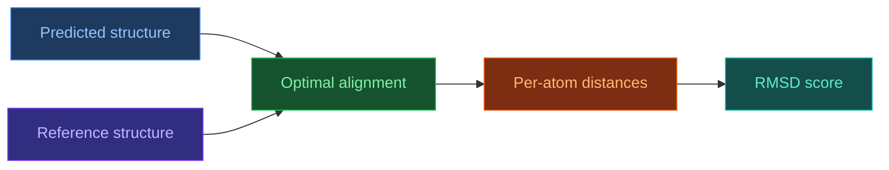

# RMSD — Root Mean Square Deviation

[[Home|Home]] > [[EN/Index|Concepts]] > Structural Bioinformatics
🇺🇦 [[UA/2. Концепції/2.3. Структурна-Біоінформатика/2.3.1. RMSD|Українська]]

## Definition

RMSD measures average Euclidean deviation between matched atoms after optimal superposition.

$$\mathrm{RMSD}=\sqrt{\frac{1}{N}\sum_{i=1}^{N}\lVert r_i^{pred}-r_i^{ref}\rVert^2}$$

## Optimal superposition

RMSD should be computed after alignment (e.g., Kabsch algorithm).

## RMSD variants

| Variant | Atoms used | Typical use |
|---|---|---|
| C-alpha RMSD | CA only | quick backbone comparison |
| Backbone RMSD | N, CA, C, O | fold geometry |
| All-atom RMSD | all heavy atoms | detailed model quality |

## Practical thresholds

| RMSD (A) | Interpretation |
|---:|---|
| < 2 | highly accurate |
| 2-5 | moderate deviation |
| > 5 | major structural shift |

## RMSD limitations

- sensitive to outliers
- depends on alignment
- can penalize flexible regions too strongly

## TM-score

TM-score complements RMSD for fold-level comparison and is less length-dependent.

## Related Notes

- [[EN/2. Concepts/2.3. Structural-Bioinformatics/2.3.2. lDDT|lDDT]]
- [[EN/2. Concepts/2.3. Structural-Bioinformatics/2.3.3. DockQ|DockQ]]
