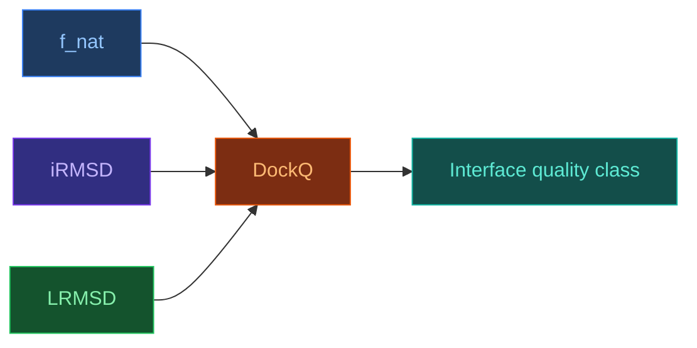

# DockQ — Composite Docking Quality Metric

[[Home|Home]] > [[EN/Index|Concepts]] > Structural Bioinformatics
🇺🇦 [[UA/2. Концепції/2.3. Структурна-Біоінформатика/2.3.3. DockQ|Українська]]

## Definition

DockQ combines interface metrics into one normalized score for complex prediction quality.

## Components

DockQ integrates:
- fraction of native contacts
- interface RMSD (iRMSD)
- ligand RMSD (LRMSD)

## Quality scale

| DockQ | Interpretation |
|---:|---|
| > 0.80 | high-quality interface |
| 0.49-0.80 | medium |
| < 0.49 | low |

## DockQ v2

DockQ v2 extends usage to broader complex types and modern benchmark settings.

## AF3 results with DockQ

AF3 reports strong improvements on difficult interaction categories versus earlier generations.

## PoseBusters for ligand-protein

PoseBusters is often used alongside docking metrics for ligand pose validity checks.

## Related Notes

- [[EN/2. Concepts/2.3. Structural-Bioinformatics/2.3.1. RMSD|RMSD]]
- [[EN/1. AlphaFold3/1.3. Results/1.3.1. Accuracy Across Complex Types|Accuracy Results]]
