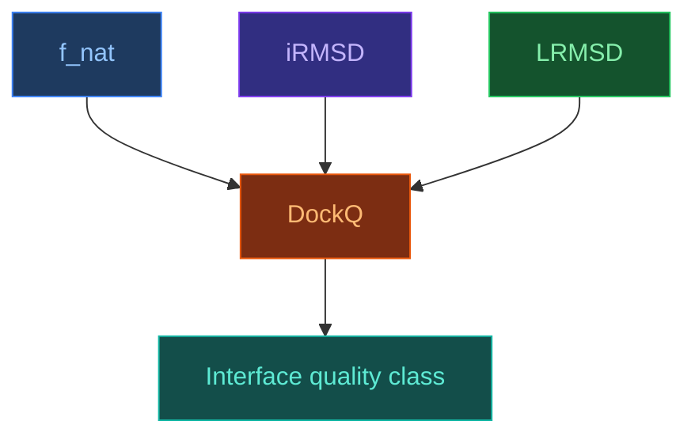

# DockQ — complex interface quality metric

[[Home|Home]] > [[EN/Index|Concepts]] > Structural Bioinformatics
🇺🇦 [[UA/2. Концепції/2.3. Структурна-Біоінформатика/2.3.3. DockQ|Українська]]

> **DockQ** is a composite metric for docking and complex-prediction quality that combines native-contact preservation and two RMSD-like terms into a single score between `0` and `1`.

## Why DockQ is needed

For complexes, a single metric is often not enough:

- `RMSD` captures coordinate deviation;
- `f_nat` captures preservation of native interface contacts;
- `iRMSD` focuses on the geometry of the interface itself.

DockQ is useful because it turns these signals into one consistent scale closer to the practical question:

"does this prediction recover the correct interface?"

## Formal definition

In the basic form:

$$\mathrm{DockQ}=\frac{f_{\mathrm{nat}}+\frac{1}{1+(i\mathrm{RMSD}/1.5)^2}+\frac{1}{1+(L\mathrm{RMSD}/8.5)^2}}{3}$$

where:

- $f_{\mathrm{nat}}$ is the fraction of native contacts;
- $i\mathrm{RMSD}$ is interface RMSD;
- $L\mathrm{RMSD}$ is ligand RMSD after receptor superposition.

## DockQ components

## Intuition behind the components

- **`f_nat`** asks whether the prediction preserved real contacts between partners.
- **`iRMSD`** checks whether interface atoms are geometrically placed correctly.
- **`LRMSD`** measures whether the ligand or partner chain is placed correctly after receptor alignment.

This combination is more useful than any single component alone.

## Typical quality scale

| DockQ | Typical interpretation |
|---|---|
| `< 0.23` | Incorrect interface |
| `0.23–0.49` | Acceptable |
| `0.49–0.80` | Medium quality |
| `> 0.80` | High quality |

## DockQ v2

`DockQ v2` extends the logic of the metric to:

- protein multimers;
- nucleic-acid complexes;
- small-molecule binding models.

This matters because modern benchmarks increasingly go beyond classical protein-protein docking.

## Properties of DockQ

- **Interface-centered**: it focuses on whether the interaction is correct, not only the full structure.
- **Normalized `0..1` scale**: convenient for benchmark comparison.
- **Composite logic**: balances contact preservation with geometric deviation.
- **Useful for ranking**: practical for docking predictions and multimer models.

## Limitations

- **Not a full physical metric**: a good DockQ score does not guarantee correct binding energetics.
- **Depends on interface and contact definitions**.
- **May miss chemistry-specific defects**: ligand cases still need additional checks for stereochemistry and clashes.

## DockQ together with other metrics

| Metric | What it captures better |
|---|---|
| [[EN/2. Concepts/2.3. Structural-Bioinformatics/2.3.1. RMSD]] | Global or pose-level deviation |
| [[EN/2. Concepts/2.3. Structural-Bioinformatics/2.3.2. lDDT]] | Local geometric quality |
| [[EN/2. Concepts/2.3. Structural-Bioinformatics/2.3.3. DockQ]] | Interface correctness |
| `PoseBusters` | Chemical plausibility of ligand poses |

## Why DockQ matters for AlphaFold 3

For AF3, DockQ matters because the model is often evaluated on interaction tasks rather than only on monomer geometry.
In those settings, interface quality is more informative than a single global RMSD number.

## Related Notes

- [[EN/2. Concepts/2.3. Structural-Bioinformatics/2.3.1. RMSD|RMSD]]
- [[EN/2. Concepts/2.3. Structural-Bioinformatics/2.3.2. lDDT|lDDT]]
- [[EN/2. Concepts/2.1. Biology/2.1.3. Ligands and Small Molecules|Ligands and Small Molecules]]
- [[EN/1. AlphaFold3/1.3. Results/1.3.1. Accuracy Across Complex Types|Accuracy Across Complex Types]]

> Basu and Wallner (2016). *DockQ: A Quality Measure for Protein-Protein Docking Models*. PLOS ONE.
> DOI: [10.1371/journal.pone.0161879](https://doi.org/10.1371/journal.pone.0161879)

> Sverrisson et al. (2023). *DockQ v2: Improved automatic quality measure for protein multimers, nucleic acids and small molecule binding models*.
> DOI: [10.48550/arXiv.2310.09580](https://doi.org/10.48550/arXiv.2310.09580)
