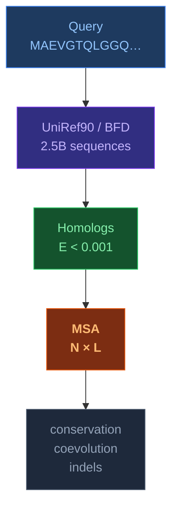
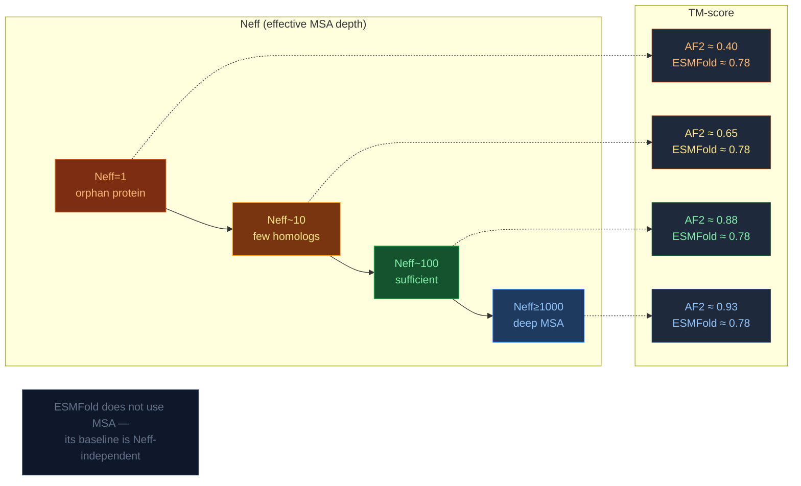

# MSA — Multiple Sequence Alignment

[[Home|Home]] > [[EN/Index|Concepts]] > Structural Bioinformatics
🇺🇦 [[UA/2. Концепції/2.3. Структурна-Біоінформатика/2.3.4. MSA|Українська]]

> **MSA** — alignment of three or more evolutionarily related sequences to detect conserved residues, functional sites, and coevolving pairs. The primary evolutionary input for AlphaFold 2 and AlphaFold 3.

---

## What is an MSA?



## MSA construction algorithms

| Algorithm | Type | Complexity | Used in AF |
|---|---|---|---|
| **Needleman-Wunsch** | Global (pairwise) | $O(mn)$ | — |
| **Smith-Waterman** | Local (pairwise) | $O(mn)$ | — |
| **HHblits** | Profile-HMM | $O(N \cdot L^2)$ | ✅ AF2, AF3 |
| **Jackhmmer** | Iterative | $O(k \cdot N \cdot L)$ | ✅ AF2, AF3 |
| **ColabFold MMseqs2** | Fast LSH | $O(N)$ | ✅ ColabFold |

## Coevolutionary signal

**Key idea**: if residues $i$ and $j$ interact, mutations in one are compensated by mutations in the other:

$$C_{ij} = \langle x_i x_j \rangle - \langle x_i \rangle\langle x_j \rangle$$

where $x_i$ is the amino acid at position $i$ in the MSA. The matrix $C$ after DCA/MI analysis produces a contact map.

### Mutual Information (MI)

$$\text{MI}(i,j) = \sum_{a,b} p_{ij}(a,b)\log\frac{p_{ij}(a,b)}{p_i(a)\,p_j(b)}$$

AF2 / AF3 learn **directly** from the MSA — no explicit MI computation is needed.

## MSA depth: how many homologs are needed?



$N_\text{eff}$ — effective sequence count (accounting for redundancy):

$$N_\text{eff} = \sum_i \frac{1}{\sum_j \mathbf{1}[\text{seq\_id}(i,j) > 80\%]}$$

## AF3 and MSA: fewer blocks, smarter use

Compared to AF2, AF3 **reduced MSA's role**:

| | AF2 | AF3 |
|---|---|---|
| MSA blocks | 48 | **4** |
| Pair blocks | 48 | **48** |
| MSA subsample | 512 rows | 1024 rows |
| Without MSA | Very poor | Acceptable (pLM compensation) |

Rationale: the pair representation ($z_{ij}$) already encodes coevolutionary signal. MSA is less necessary when pair representation is sufficiently deep.

## MSA file formats

```text
# A3M format (HHblits / ColabFold output):
>query
MAEVGTQLGGQVATNLGLKL
>UniRef90_P12345 homolog1
MAEVGTQLGGQVATNLGLKL
>UniRef90_Q98765 homolog2
MAEVGTQaaLGGQVATNLGLKL   ← lowercase = insertion relative to query
>UniRef90_A11111 homolog3
MAEVG--LGGQVATNLGLKL     ← '-' = gap in an aligned column
```

- **A3M** — compressed MSA format; lowercase marks insertions, `-` marks gaps in aligned columns, and `.` may appear as a placeholder in insert-only columns
- **FASTA** — standard; all positions retained
- **Stockholm** — with annotations (Pfam, Rfam)

> Remmert et al. (2012). *HHblits: lightning-fast iterative protein sequence searching by HMM-HMM alignment*. Nat Methods 9.
> DOI: [10.1038/nmeth.1818](https://doi.org/10.1038/nmeth.1818)

---

## Related Notes

- [[EN/2. Concepts/2.2. Machine-Learning/2.2.3. Protein Language Models|Protein Language Models]]
- [[EN/1. AlphaFold3/1.2. Architecture/1.2.2. Pairformer|Pairformer]]
- [[EN/1. AlphaFold3/1.2. Architecture/1.2.5. Model Training|Model Training]]
- [[EN/1. AlphaFold3/1.2. Architecture/1.2.6. Featurization|Featurization]]
- [[EN/1. AlphaFold3/1.5. Resources/1.5.6. Working with A3M Files|Working with A3M Files]]
