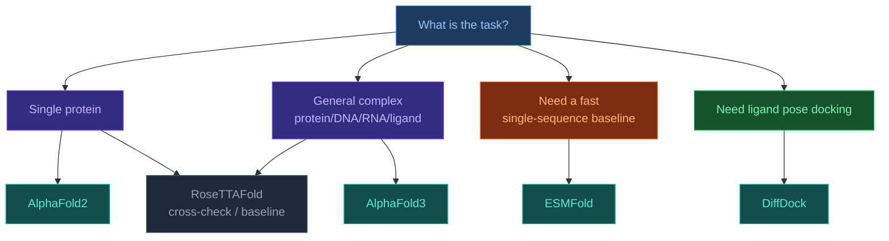

# 3.0. Models Overview

[[Home]] > Models
🇺🇦 [[UA/3. Моделі/3.0. Огляд моделей|Українська]]

Comparative overview of the main models used for protein structure prediction, multimolecular complexes, and ligand docking.

## Why a dedicated models overview is needed

There is no single universally best model for every structural biology task.
Different systems are optimized for different regimes:

- `single-chain structure prediction`;
- `complex prediction`;
- `single-sequence fast inference`;
- `ligand pose prediction`;
- `structure-conditioned sequence design`.

So model choice should depend not only on "overall accuracy", but on the input modality, desired output, compute budget, and whether the main goal is a physically plausible ligand pose or a full biomolecular complex.

## Main model families

| Model | Primary task | Core idea | Strengths | Limitations |
|---|---|---|---|---|
| [[EN/3. Models/3.1. AlphaFold2]] | Protein structure | Evoformer + structure module | Very strong baseline for proteins | Less general for broad multimolecular settings |
| [[EN/3. Models/3.2. AlphaFold3]] | Protein/DNA/RNA/ligand complexes | Unified multimolecular modeling + diffusion | One framework across many entity types | High compute cost and more complex interpretation |
| [[EN/3. Models/3.3. RoseTTAFold]] | Proteins and some complexes | Three-track 1D/2D/3D integration | Strong academic baseline and independent cross-check | Often behind newer systems on harder tasks |
| [[EN/3. Models/3.4. ESMFold]] | Fast sequence-to-structure | pLM + structure head without full MSA | Fast single-sequence inference | Usually lower accuracy on difficult cases |
| [[EN/3. Models/3.5. DiffDock]] | Small-molecule docking | Generative diffusion over ligand pose space | Strong specialized docking method | Does not replace a general biomolecular complex model |

## A rough selection heuristic

## Properties that actually separate these models

- **Input signal type**: sequence only, sequence + MSA, sequence + ligand description, or pocket-aware geometry.
- **Output type**: full 3D complex, monomer structure, ligand pose, or designed sequence.
- **Inductive bias**: attention, three-track fusion, diffusion, pLM priors, or geometric reasoning.
- **Speed and memory**: the fastest baseline and the most general high-accuracy model are usually not the same system.
- **Generalization regime**: some models are excellent on proteins but weaker on nucleic-acid or ligand-heavy cases.

## Practical scenarios

### When to use `AlphaFold2`

- when the task is mainly about a single protein;
- when a proven and interpretable baseline is needed;
- when multimolecular context is not the main challenge.

### When to use `AlphaFold3`

- when the complex mixes proteins, nucleic acids, ligands, modifications, or ions;
- when a single integrated model is preferred over multiple specialized tools;
- when heavier inference is acceptable.

### When to use `ESMFold`

- when a fast single-sequence prediction is needed;
- when MSA is weak, expensive, or unavailable;
- when the goal is screening rather than final structural validation.

### When to use `DiffDock`

- when the task is specifically ligand pose docking;
- when a protein pocket is known and plausible candidate poses are needed;
- when full-complex modeling will be handled elsewhere in the pipeline.

### When to use `RoseTTAFold`

- when an independent alternative to AlphaFold-style pipelines is useful;
- when you want to check whether a conclusion reproduces under another architecture;
- when a strong academic baseline is needed.

## Limits of this overview

- A compact table necessarily simplifies reality: performance depends strongly on target class and benchmark.
- A high aggregate score does not mean a model is best for every protein family or ligand class.
- In practice, strong workflows often combine several models instead of relying on only one.

## Related Notes

- [[EN/3. Models/3.1. AlphaFold2|AlphaFold2]]
- [[EN/3. Models/3.2. AlphaFold3|AlphaFold3]]
- [[EN/3. Models/3.3. RoseTTAFold|RoseTTAFold]]
- [[EN/3. Models/3.4. ESMFold|ESMFold]]
- [[EN/3. Models/3.5. DiffDock|DiffDock]]

> Jumper et al. (2021). *Highly accurate protein structure prediction with AlphaFold*. Nature.
> DOI: [10.1038/s41586-021-03819-2](https://doi.org/10.1038/s41586-021-03819-2)

> Abramson et al. (2024). *Accurate structure prediction of biomolecular interactions with AlphaFold 3*. Nature.
> DOI: [10.1038/s41586-024-07487-w](https://doi.org/10.1038/s41586-024-07487-w)

> Baek et al. (2021). *Accurate prediction of protein structures and interactions using a three-track neural network*. Science.
> DOI: [10.1126/science.abj8754](https://doi.org/10.1126/science.abj8754)

> Lin et al. (2023). *Evolutionary-scale prediction of atomic-level protein structure with a language model*. Science.
> DOI: [10.1126/science.ade2574](https://doi.org/10.1126/science.ade2574)

> Corso et al. (2023). *DiffDock: Diffusion Steps, Twists, and Turns for Molecular Docking*. ICLR.
> DOI: [10.48550/arXiv.2210.01776](https://doi.org/10.48550/arXiv.2210.01776)
