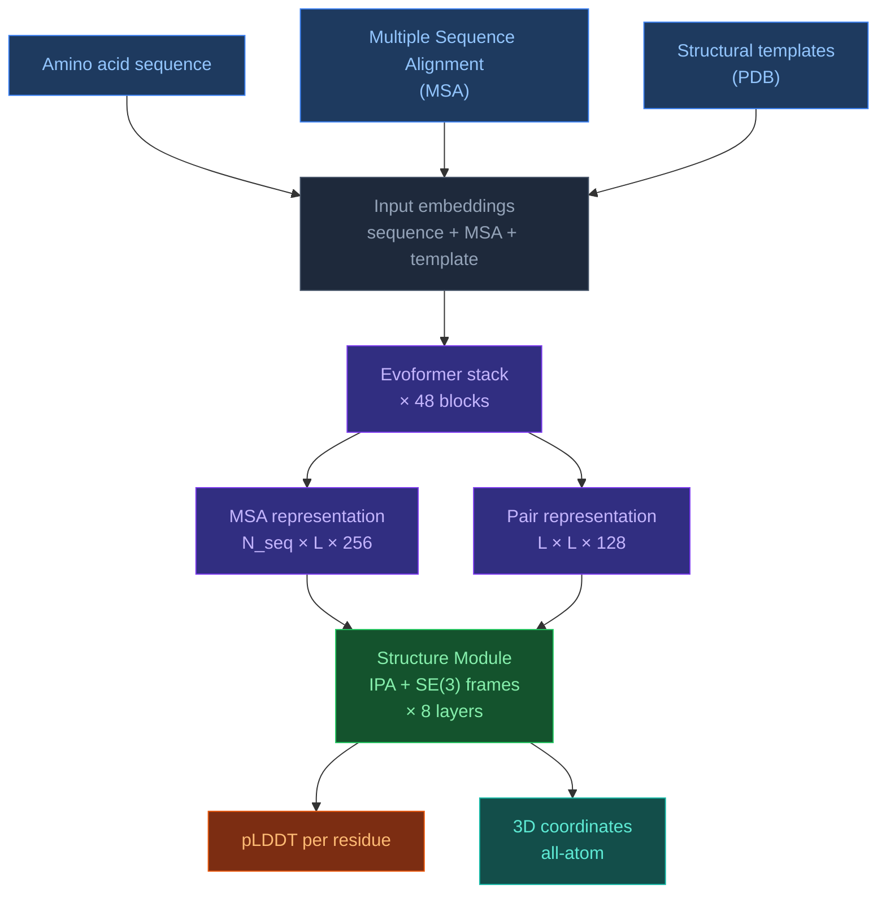

# 3.1. AlphaFold2

[[Home|Home]] > [[EN/3. Models/3.0. Models Overview|Models]] > AlphaFold2
🇺🇦 [[UA/3. Моделі/3.1. AlphaFold2|Українська]]

> AlphaFold2 (2021) was the first model to achieve near-experimental accuracy in protein structure prediction, winning CASP14 with a median GDT score of 92.4.

---

## Architecture

### Key components

**Evoformer** — the core innovation of AF2. A 48-block transformer that jointly updates two representations in every block:
- **MSA representation** `(N_seq × L × 256)` — captures evolutionary patterns across homologs
- **Pair representation** `(L × L × 128)` — captures spatial relationships between all residue pairs

Key operations per Evoformer block:

| Operation | Acts on | Purpose |
|---|---|---|
| Row-wise gated self-attention | MSA rows | Cross-sequence attention with pair bias |
| Column-wise self-attention | MSA columns | Per-position evolutionary mixing |
| MSA transition (MLP) | MSA | Non-linear update |
| Outer product mean | MSA → Pair | Projects MSA signal into pair space |
| Triangle multiplicative update | Pair | Enforces triangle inequality on distances |
| Triangle self-attention | Pair | Global pair reasoning |
| Pair transition (MLP) | Pair | Non-linear update |

**Structure Module** — converts pair/single representations into 3D coordinates using:
- **Invariant Point Attention (IPA)** — SE(3)-equivariant attention over rigid frames
- **Backbone frames** — each residue represented as a rigid body $(R_i, t_i) \in SE(3)$
- **Side-chain torsion angles** — predicted by a separate network on top of single representation
- **8 recycling iterations** with gradient stopping between cycles

### Input features

| Feature | Dimension | Source |
|---|---|---|
| Sequence one-hot | `L × 21` | Raw sequence |
| MSA one-hot | `N_seq × L × 23` | HHblits / Jackhmmer |
| MSA pair features | `L × L × 88` | Derived from MSA statistics |
| Template features | `L × L × 88` | PDB structural templates |
| Residue index | `L` | Positional |

---

## Strengths

| Strength | Detail |
|---|---|
| Near-experimental accuracy | Median GDT 92.4 at CASP14, TM-score > 0.9 for most targets |
| Confident monomer prediction | pLDDT and PAE are well-calibrated |
| Open weights | ColabFold and LocalColabFold allow free access |
| Fast MSA search with ColabFold | MMseqs2 reduces MSA time from hours to minutes |
| Well-studied | Large body of downstream tools (AF2-Multimer, AF2-design, etc.) |

## Limitations

| Limitation | Detail |
|---|---|
| Proteins only | No ligands, nucleic acids, or small molecules |
| MSA-dependent | Accuracy drops sharply for orphan sequences (no homologs) |
| Static structure | Predicts one conformation — no dynamics or ensemble |
| Multimer accuracy | AF2-Multimer works but weaker than AF3 on antibody/antigen |
| No covalent modifications | Cannot handle post-translational modifications |
| Template bias | May over-rely on structural templates for easy targets |

---

## AF2 vs AF3 — key differences

| Aspect | AlphaFold2 | AlphaFold3 |
|---|---|---|
| Molecular scope | Proteins only | Proteins, DNA, RNA, ligands, ions |
| Output module | IPA + torsion angles | Diffusion module |
| Trunk | Evoformer | Pairformer (no MSA rows in trunk) |
| MSA role | Central (48-block joint update) | Input encoding only |
| Confidence | pLDDT, PAE | pLDDT, PAE, pTM, ipTM, pDE |
| Ligand docking | ✗ | ✓ (PoseBusters 76.4%) |

---

> Jumper et al. (2021). *Highly accurate protein structure prediction with AlphaFold*. Nature, 596, 583–589.
> DOI: [10.1038/s41586-021-03819-2](https://doi.org/10.1038/s41586-021-03819-2)
