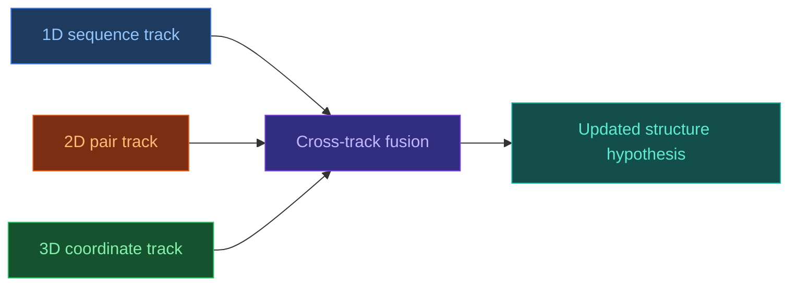

# 3.3. RoseTTAFold

[[Home|Home]] > [[EN/3. Models/3.0. Models Overview|Models]] > RoseTTAFold
🇺🇦 [[UA/3. Моделі/3.3. RoseTTAFold|Українська]]

`RoseTTAFold` is a neural model for structure prediction that jointly integrates 1D, 2D, and 3D protein representations through a `three-track` architecture.

## Why RoseTTAFold was an important step

Before RoseTTAFold, it was already clear that pure sequence-only reasoning was not enough for high-accuracy structure prediction.
What was needed was an architecture able to exchange information between:

- sequence-level features;
- pairwise geometry;
- 3D coordinate reasoning.

RoseTTAFold became important because it explicitly fused these three levels inside a single model.

## Architectural idea

The three "tracks" correspond to different representation types:

- a `1D track` for sequence information;
- a `2D track` for pair or distance-like information;
- a `3D track` for coordinate-level reasoning.

## Properties

- **Three-level integration**: sequence, pair, and coordinate reasoning are coupled rather than separated into hard stages.
- **Strong academic baseline**: RoseTTAFold is often useful as an independent cross-check against AlphaFold-like systems.
- **Practical utility for structure solving**: it has been useful in cryo-EM and crystallography-assisted scenarios.
- **Historical importance**: it demonstrated how powerful joint 1D/2D/3D reasoning can be.

## When RoseTTAFold is useful

- when an independent second opinion on a structure is valuable;
- when a strong but not necessarily newest baseline is needed;
- when a research workflow prioritizes reproducibility and comparative analysis.

## Limitations

- **Often lower performance than the strongest newer models**: especially on harder modern benchmarks.
- **Not an AF3-level generalist**: RoseTTAFold was not designed as a unified multimolecular framework.
- **Task-dependent quality**: monomers, complexes, and specialized interaction settings have different difficulty profiles.

## Comparison with nearby approaches

| Model | Similarity to RoseTTAFold | Key difference |
| --- | --- | --- |
| [[EN/3. Models/3.1. AlphaFold2]] | Also a high-accuracy protein structure model | Different trunk design with stronger Evoformer-style processing |
| [[EN/3. Models/3.2. AlphaFold3]] | Also performs joint structural reasoning | AF3 covers far more molecule types and uses diffusion-based generation |
| [[EN/3. Models/3.4. ESMFold]] | Also serves as a practical baseline | ESMFold relies more heavily on single-sequence pLM priors |

## Related Notes

- [[EN/3. Models/3.1. AlphaFold2|AlphaFold2]]
- [[EN/3. Models/3.2. AlphaFold3|AlphaFold3]]
- [[EN/3. Models/3.4. ESMFold|ESMFold]]
- [[EN/2. Concepts/2.2. Machine-Learning/2.2.1. Transformers|Transformers]]

> Baek et al. (2021). *Accurate prediction of protein structures and interactions using a three-track neural network*. Science.
> DOI: [10.1126/science.abj8754](https://doi.org/10.1126/science.abj8754)
