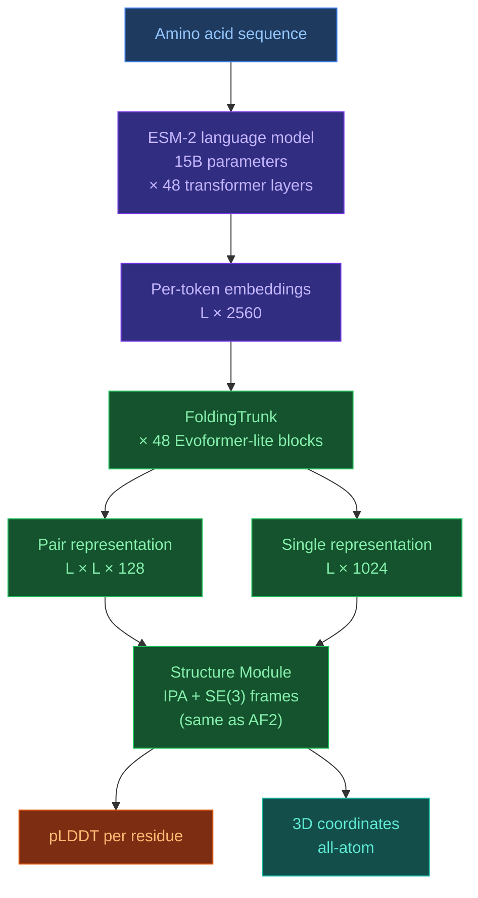

# 3.4. ESMFold

[[Home|Home]] > [[EN/3. Models/3.0. Models Overview|Models]] > ESMFold
🇺🇦 [[UA/3. Моделі/3.4. ESMFold|Українська]]

> ESMFold (2022) is the first high-accuracy structure predictor that requires no MSA — it derives evolutionary information entirely from the ESM-2 protein language model (15B parameters).

---

## Architecture

### Key components

**ESM-2 (language model trunk)** — a 15B-parameter transformer pretrained on 250M protein sequences via masked language modeling (MLM). It encodes evolutionary context implicitly in its weights, eliminating the need for explicit MSA computation.

| ESM-2 variant | Parameters | Layers | Hidden dim |
| --- | --- | --- | --- |
| ESM-2 (used in ESMFold) | 15B | 48 | 5120 |
| ESM-2 medium | 650M | 33 | 1280 |
| ESM-2 small | 8M | 6 | 320 |

**FoldingTrunk** — a lightweight Evoformer-like stack that takes ESM-2 token embeddings and builds pair/single representations. Key differences from AF2 Evoformer:

- No MSA rows — single sequence only
- Fewer recycling iterations (4 vs 8 in AF2)
- Pair representation initialized from outer product of ESM-2 embeddings

**Structure Module** — identical to AF2: IPA + SE(3) rigid frames + torsion angle prediction.

### Inference pipeline

| Stage | Time (L=300) | Notes |
| --- | --- | --- |
| ESM-2 forward pass | ~0.5 s (GPU) | Bottleneck for long sequences |
| FoldingTrunk | ~0.3 s | Evoformer-lite, 48 blocks |
| Structure Module | ~0.1 s | IPA, 8 layers |
| **Total** | **~1 s** | vs ~10–60 s for AF2 + MSA |

---

## Strengths

| Strength | Detail |
| --- | --- |
| No MSA required | Single sequence in → structure out, ~1 s per protein |
| Massive throughput | Suitable for proteome-scale screening (millions of sequences) |
| Orphan sequences | Works on proteins with no evolutionary homologs |
| Simple deployment | No HHblits/Jackhmmer/databases needed |
| Strong embeddings | ESM-2 representations useful beyond folding (fitness, function) |
| Open weights | Meta AI released model weights publicly |

## Limitations

| Limitation | Detail |
| --- | --- |
| Accuracy gap | ~5–10% below AF2 on CAMEO/CASP benchmarks for average targets |
| No ligands or complexes | Proteins only, no small molecules or nucleic acids |
| Large GPU memory | ESM-2 15B requires ~45 GB VRAM (A100 recommended) |
| Long sequences | Quadratic memory in pair representation; struggles above L≈700 |
| No explicit coevolution | Loses pairwise residue contact signal present in real MSAs |
| Static prediction | Single conformation, no ensemble or dynamics |

---

## ESMFold vs AF2 vs AF3

| Aspect | ESMFold | AlphaFold2 | AlphaFold3 |
| --- | --- | --- | --- |
| MSA required | ✗ | ✓ | Optional |
| Speed | ~1 s | ~10–60 s | ~60–300 s |
| Accuracy (monomers) | Good | Excellent | Excellent |
| Ligand docking | ✗ | ✗ | ✓ |
| Nucleic acids | ✗ | ✗ | ✓ |
| GPU memory | ~45 GB | ~8 GB | ~16 GB |
| Open weights | ✓ | ✓ | ✗ (server only) |

---

> Lin et al. (2023). *Evolutionary-scale prediction of atomic-level protein structure with a language model*. Science, 379(6637), 1123–1130.
> DOI: [10.1126/science.ade2574](https://doi.org/10.1126/science.ade2574)
