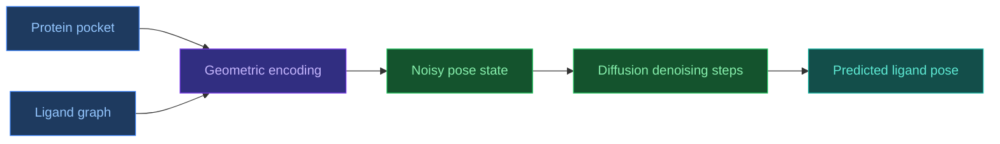

# 3.5. DiffDock

[[Home|Home]] > [[EN/3. Models/3.0. Models Overview|Models]] > DiffDock
🇺🇦 [[UA/3. Моделі/3.5. DiffDock|Українська]]

`DiffDock` is a diffusion-based ligand docking model that generates plausible small-molecule poses in a protein pocket as a stochastic refinement problem over translation, rotation, and torsional degrees of freedom.

## Why DiffDock matters

Classical docking usually combines:

- explicit or heuristic search over pose space;
- a scoring function;
- reranking.

DiffDock shifts the framing from manual search toward generative modeling:
instead of hard-coded exploration, the model learns to generate binding poses directly as a distribution over possible configurations.

## Architectural idea

The model treats docking as a generative process over ligand pose space:

- translation;
- rotation;
- torsion angles.

## Properties

- **Generative docking**: pose prediction is treated as generation rather than only regression or search.
- **Explicit uncertainty handling**: the model can produce multiple candidate poses instead of a single answer.
- **Geometric naturalness**: it operates over physically meaningful docking degrees of freedom.
- **Strong specialization**: this is not a general biomolecular complex predictor, but a focused docking method.

## Best-use scenarios

- when the main task is ligand pose prediction in a known or predicted pocket;
- when a modern baseline for small-molecule docking is needed;
- when generating several plausible binding configurations is valuable for downstream analysis.

## Limitations

- **Narrow task definition**: DiffDock does not replace a broad generalist model such as AF3.
- **Pocket quality matters**: poor pocket geometry or context degrades the predicted pose.
- **Docking is not full binding physics**: a good pose does not guarantee correct affinity or real conformational dynamics.
- **Further validation is often needed**: MD, rescoring, or experiment may still be required in high-stakes settings.

## Comparison with nearby approaches

| Approach | Similarity | Difference |
| --- | --- | --- |
| Classical docking (`Vina`-style) | Same endpoint of ligand pose prediction | Usually based on search + scoring instead of generative diffusion |
| [[EN/3. Models/3.2. AlphaFold3]] | Also handles ligand-containing systems | AF3 models a broader complex, not just docking pose |
| [[EN/2. Concepts/2.2. Machine-Learning/2.2.2. Diffusion Models]] | Same generative principle | DiffDock is a specialized docking-space application of diffusion |

## Related Notes

- [[EN/2. Concepts/2.2. Machine-Learning/2.2.2. Diffusion Models|Diffusion Models]]
- [[EN/2. Concepts/2.1. Biology/2.1.3. Ligands and Small Molecules|Ligands and Small Molecules]]
- [[EN/3. Models/3.2. AlphaFold3|AlphaFold3]]

> Corso et al. (2023). *DiffDock: Diffusion Steps, Twists, and Turns for Molecular Docking*. ICLR.
> DOI: [10.48550/arXiv.2210.01776](https://doi.org/10.48550/arXiv.2210.01776)
