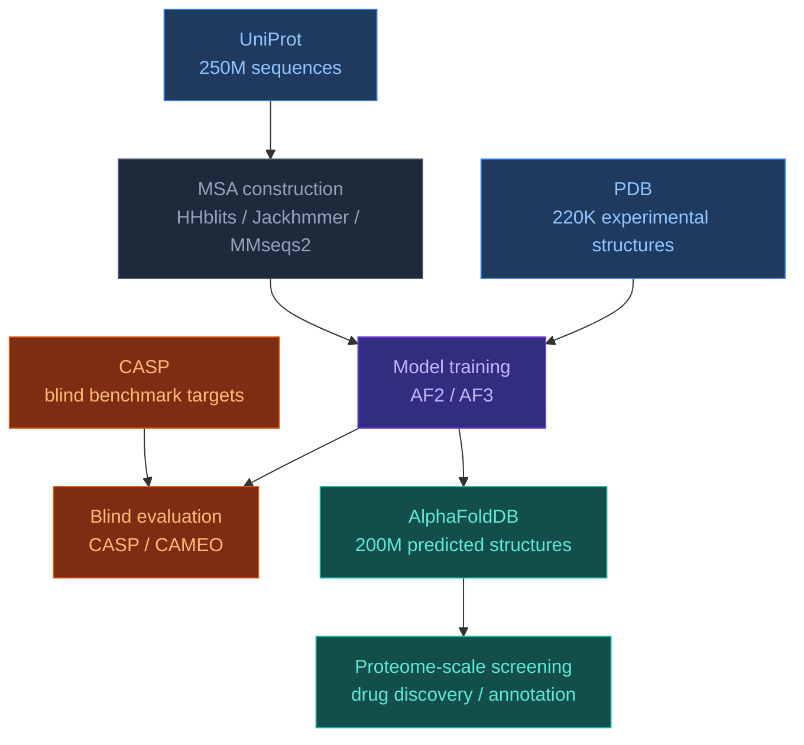

# 4.0. Datasets Overview

[[Home]] > Datasets
🇺🇦 [[UA/4. Датасети/4.0. Огляд датасетів]]

Core data sources for structural bioinformatics and AF3 pipelines.

---

## Dataset map

## Quick comparison

| Dataset | Type | Size | Open | Ligands | Complexes | AF role |
|---|---|---|---|---|---|---|
| [[EN/4. Datasets/4.1. PDB]] | Experimental | ~220K structures | ✓ | ✓ | ✓ | Training ground truth |
| [[EN/4. Datasets/4.2. UniProt]] | Sequences | ~250M entries | ✓ | — | — | MSA + sequence input |
| [[EN/4. Datasets/4.3. AlphaFoldDB]] | Predicted | ~200M structures | ✓ | ✗ | ✗ | Downstream screening |
| [[EN/4. Datasets/4.4. CASP]] | Benchmark | ~100–150 targets/round | ✓ | ✗ | Partial | Blind evaluation |

## When to use which

| Task | Primary source | Notes |
|---|---|---|
| Get sequence for modeling | UniProt | Stable accession IDs, FASTA download |
| Validate structure against experiment | PDB | Use resolution ≤ 3.5 Å structures |
| Fast structural hypothesis (no PDB entry) | AlphaFoldDB | Check pLDDT — ignore orange regions |
| Benchmark a new method | CASP / CAMEO | Blind targets only |
| Build MSA for AF pipeline | UniRef90/UniRef50 | Via HHblits or MMseqs2 |
| Ligand docking ground truth | PDB | Filter by ligand validation (PoseBusters) |
