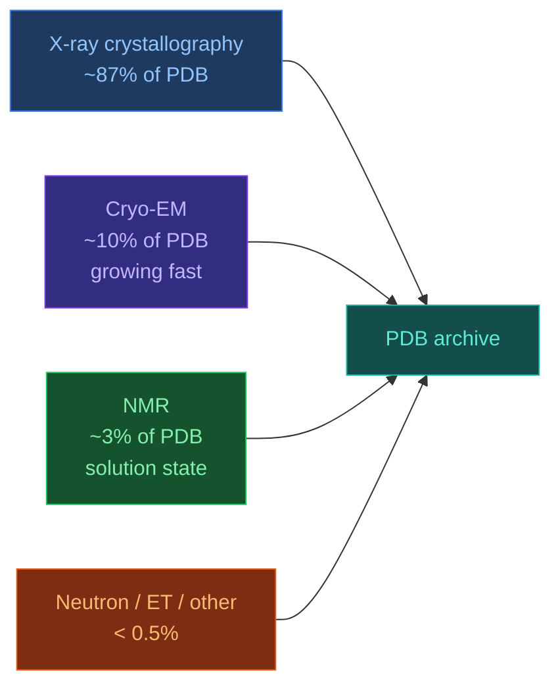

# 4.1. PDB

[[Home|Home]] > [[EN/4. Datasets/4.0. Datasets Overview|Datasets]] > PDB
🇺🇦 [[UA/4. Датасети/4.1. PDB|Українська]]

> The Protein Data Bank (1971) is the world's single repository of experimentally determined 3D structures of biological macromolecules. As of 2025 it holds over **220,000 structures**.

---

## Scale and coverage

| Metric | Value (2025) |
|---|---|
| Total structures | ~220,000 |
| Unique proteins (UniProt-mapped) | ~60,000 |
| Structures with ligands | ~160,000 |
| Structures with nucleic acids | ~12,000 |
| New depositions per year | ~15,000 |
| Primary format | mmCIF (legacy: PDB) |

## Experimental methods

| Method | Resolution range | Strengths | Weaknesses |
|---|---|---|---|
| X-ray crystallography | 0.5–3.5 Å | High resolution, ligand positions | Requires crystal, static snapshot |
| Cryo-EM | 1.5–6 Å | Large complexes, no crystal needed | Lower res for small proteins |
| NMR | N/A (distance constraints) | Solution dynamics, flexible regions | Size limit ~50 kDa |

## Role in AlphaFold training

AF2 and AF3 both use PDB as the primary source of **ground truth structures** for supervised training:

| Use | Detail |
|---|---|
| Training set | PDB structures with resolution ≤ 3.5 Å |
| Validation set | Structures released after training cutoff |
| Template search | HHsearch against PDB70 (representative subset) |
| Ligand CCD library | Chemical Component Dictionary — defines all ligands in PDB |
| MSA templates | Structural alignments via HHblits/HHsearch |

AF3 training cutoff: **2021-09-30**. Structures deposited after this date serve as unseen test cases.

## Data quality considerations

| Issue | Impact | Mitigation |
|---|---|---|
| Resolution bias | Low-res structures introduce coordinate noise | Filter ≤ 3.5 Å for training |
| Crystallographic artifacts | Crystal packing can distort loops/termini | Use multiple chains, ensemble averaging |
| Missing residues | Flexible regions often absent from density | Mask or predict de novo |
| Ligand completeness | Some ligands modeled poorly or absent | Use CCD + validation tools (PoseBusters) |
| Redundancy | Many near-identical structures | Cluster at 30–70% sequence identity |

## Strengths vs limitations

| Strengths | Limitations |
|---|---|
| Only source of experimental 3D ground truth | Biased toward stable, crystallizable proteins |
| Covers proteins, DNA, RNA, ligands, ions | Under-represents membrane proteins, IDPs |
| Open access, standardized formats | Legacy PDB format has known limitations |
| Actively curated (validation reports) | Deposition quality varies widely |
| Linked to UniProt, GO, EC numbers | Limited time-resolved / dynamics data |

---

> RCSB PDB: [https://www.rcsb.org](https://www.rcsb.org)
> PDBe (EBI): [https://www.ebi.ac.uk/pdbe](https://www.ebi.ac.uk/pdbe)
> Berman et al. (2000). *The Protein Data Bank*. Nucleic Acids Research, 28(1), 235–242.
