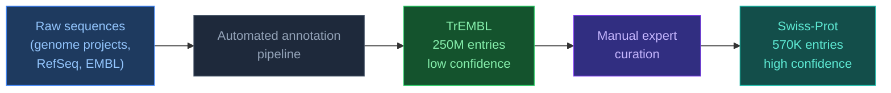

# 4.2. UniProt

[[Home|Home]] > [[EN/4. Datasets/4.0. Datasets Overview|Datasets]] > UniProt
🇺🇦 [[UA/4. Датасети/4.2. UniProt|Українська]]

> UniProt (2002) is the central hub for protein sequence and functional annotation data. It integrates Swiss-Prot (manually curated) and TrEMBL (computationally annotated) into a single knowledgebase.

---

## Scale and coverage

| Metric | Value (2025) |
|---|---|
| UniProtKB/Swiss-Prot (curated) | ~570,000 entries |
| UniProtKB/TrEMBL (automated) | ~250,000,000 entries |
| Unique organisms covered | >1,000,000 |
| Linked PDB structures | ~200,000 |
| API requests per day | ~100,000,000 |

## Swiss-Prot vs TrEMBL

| Feature | Swiss-Prot | TrEMBL |
|---|---|---|
| Curation | Manual by experts | Automated rules |
| Annotation quality | High | Variable |
| Size | ~570K | ~250M |
| Functional data | Complete GO, EC, pathways | Partial |
| Update frequency | Continuous | With each UniProt release |

## Role in AlphaFold pipelines

| Use | Detail |
|---|---|
| Sequence input | UniProt FASTA as primary sequence source |
| MSA construction | UniRef90/UniRef50 used by HHblits and Jackhmmer |
| Functional context | GO terms, EC numbers for interpreting predictions |
| Proteome-scale runs | Full proteome FASTA downloads for batch prediction |
| ID mapping | Cross-reference PDB ↔ UniProt ↔ Ensembl |

UniRef clusters used in AF MSA search:

| Database | Clustering | Size | Use |
|---|---|---|---|
| UniRef100 | No clustering | ~300M | Raw homolog search |
| UniRef90 | 90% identity | ~150M | HHblits primary search |
| UniRef50 | 50% identity | ~60M | Distant homolog search |

## Strengths vs limitations

| Strengths | Limitations |
|---|---|
| Most complete protein sequence resource | TrEMBL quality highly variable |
| Stable accession IDs (e.g., P04637) | Swiss-Prot covers only ~0.2% of known sequences |
| Rich cross-references (PDB, GO, KEGG) | Annotation lag for newly sequenced organisms |
| REST API + programmatic FASTA download | Some entries have conflicting annotations |
| UniRef clusters for efficient MSA search | Isoforms and variants require careful handling |

---

> UniProt Consortium (2023). *UniProt: the Universal Protein Knowledgebase in 2023*. Nucleic Acids Research, 51(D1), D523–D531.
> UniProt portal: [https://www.uniprot.org](https://www.uniprot.org)
