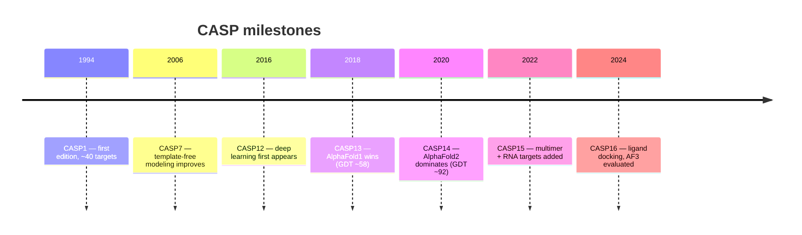

# 4.4. CASP

[[Home|Home]] > [[EN/4. Datasets/4.0. Datasets Overview|Datasets]] > CASP
🇺🇦 [[UA/4. Датасети/4.4. CASP|Українська]]

> CASP (Critical Assessment of Structure Prediction, 1994–present) is the gold-standard blind benchmark for protein structure prediction. Targets are withheld until predictions are submitted, ensuring unbiased evaluation.

---

## CASP editions and key milestones

| Edition | Year | Key result |
| --- | --- | --- |
| CASP13 | 2018 | AlphaFold1 — GDT median ~58, first major DL win |
| CASP14 | 2020 | AlphaFold2 — GDT median **92.4**, solved the problem |
| CASP15 | 2022 | Multimer targets, RNA, focus on interfaces |
| CASP16 | 2024 | Ligand docking, protein-nucleic complexes |

## Evaluation metrics used in CASP

| Metric | Measures | Range | Good threshold |
| --- | --- | --- | --- |
| GDT_TS | Global Distance Test (% Cα within 1/2/4/8 Å) | 0–100 | > 90 excellent |
| TM-score | Template Modeling score (topology) | 0–1 | > 0.5 same fold |
| RMSD | Root Mean Square Deviation (Cα) | 0–∞ Å | < 2 Å good |
| lDDT | Local Distance Difference Test | 0–100 | > 90 high quality |
| DockQ | Interface quality for complexes | 0–1 | > 0.23 acceptable |

## Target categories

| Category | Description | Example targets |
| --- | --- | --- |
| TBM | Template-based modeling (homolog exists) | Globular proteins with PDB templates |
| FM | Free modeling (no homologs) | Novel folds, de novo design |
| TBM-hard | Hard templates, distant homologs | Low sequence identity (<30%) |
| Multimer | Protein complexes | Homo/heterodimers, assemblies |
| RNA | RNA structure prediction | Added in CASP15 |
| Ligand | Ligand docking into predicted structures | Added in CASP16 |

## CASP vs CAMEO

| Aspect | CASP | CAMEO |
| --- | --- | --- |
| Frequency | Every 2 years | Continuous (weekly) |
| Target source | PDB pre-publication | PDB new depositions |
| Blind evaluation | ✓ strict | ✓ automated |
| Target count | ~100–150 per edition | ~thousands per year |
| Participant interaction | Active submission period | Fully automated server |
| Focus | Cutting-edge methods | Real-world server performance |

## Strengths vs limitations

| Strengths | Limitations |
| --- | --- |
| Truly blind evaluation | Infrequent (every 2 years) |
| Community standard, widely cited | Small target set (~100–150) |
| Expert assessors per category | Biased toward PDB-depositable proteins |
| Covers diverse target classes | Membrane proteins under-represented |
| Historical record since 1994 | Evaluation lag — results months after submission |

---

> Moult et al. (2023). *Critical assessment of methods of protein structure prediction (CASP) — Round XV*. Proteins, 91(12), 1539–1556.
> CASP portal: [https://predictioncenter.org](https://predictioncenter.org)
