# AF3 Python Implementation Summary

[[Home|Home]]

## What matters before you start

`AlphaFold 3` is not just one `model.py` file, but a full stack:

- data preparation (FASTA/mmCIF/MSA/templates/ligands),
- featureization,
- trunk model (`Pairformer`),
- structural generator (diffusion over 3D coordinates),
- post-processing, ranking, and quality assessment.

In practice, a modular Python design works best: each stage is an isolated component with a clear I/O contract.

## Main Python implementation approaches

| Approach | When to choose | Advantages | Risks/limitations |
|---|---|---|---|
| `Inference-first` (existing stack + pipeline adaptation) | Need fast practical results | Lowest R&D risk, shortest time-to-result | Less architectural control |
| `AF3-like modular reimplementation` | Need research flexibility | Fine-grained component control, ablations | High validation cost |
| `Hybrid` (ready embeddings + custom diffusion head) | Need speed/control balance | Good trade-off between performance and control | Integration complexity |
| `Train-from-scratch` | Large-scale academic/industrial resources | Maximum independence | Very high compute/data cost, long cycle |

## Recommended Python stack

- `PyTorch` for model training/inference.
- `numpy` for core tensor preprocessing.
- `biopython`, `gemmi` for structural bioformat parsing.
- `rdkit` for ligand features.
- `pydantic` or `dataclasses` for strict stage-level I/O schemas.
- `hydra` or `omegaconf` for experiment configuration management.

## Baseline pipeline architecture

```mermaid
flowchart LR
    IN["Input<br/>FASTA / mmCIF / ligands"]:::input --> FEAT["Featureization<br/>sequence, pair, ligand"]:::trunk
    FEAT --> TRUNK["Pairformer trunk"]:::diffusion
    TRUNK --> DIFF["3D diffusion sampler"]:::confidence
    DIFF --> RANK["Ranking + confidence"]:::output
    RANK --> OUT["Final structures + metrics"]:::output

    classDef input fill:#1e3a5f,stroke:#3b82f6,color:#93c5fd
    classDef trunk fill:#312e81,stroke:#7c3aed,color:#c4b5fd
    classDef diffusion fill:#14532d,stroke:#22c55e,color:#86efac
    classDef confidence fill:#7c2d12,stroke:#ea580c,color:#fdba74
    classDef output fill:#134e4a,stroke:#14b8a6,color:#5eead4
    classDef neutral fill:#1e293b,stroke:#475569,color:#94a3b8
```



## Minimal Python component design

```python
from dataclasses import dataclass
import torch


@dataclass
class Batch:
    seq_tokens: torch.Tensor          # [B, L]
    pair_features: torch.Tensor       # [B, L, L, C_pair]
    atom_init: torch.Tensor           # [B, N_atoms, 3]
    mask: torch.Tensor                # [B, L]


class Pairformer(torch.nn.Module):
    def forward(self, batch: Batch) -> dict:
        # returns single/pair latent representations
        return {"single": ..., "pair": ...}


class DiffusionHead(torch.nn.Module):
    def forward(self, latents: dict, x_t: torch.Tensor, t: torch.Tensor) -> torch.Tensor:
        # predicts noise / velocity in coordinate space
        return ...


class AF3LikePipeline:
    def __init__(self, trunk: Pairformer, diff_head: DiffusionHead):
        self.trunk = trunk
        self.diff_head = diff_head

    @torch.no_grad()
    def sample(self, batch: Batch, num_steps: int = 200):
        latents = self.trunk(batch)
        x_t = torch.randn_like(batch.atom_init)
        for step in reversed(range(num_steps)):
            t = torch.full((x_t.shape[0],), step, device=x_t.device, dtype=torch.long)
            pred = self.diff_head(latents, x_t, t)
            # scheduler update: x_t -> x_{t-1}
            x_t = x_t - pred  # placeholder
        return x_t
```

## Practical implementation strategy (recommended)

1. `Data contract first`: lock down `Batch` formats and target metrics.
2. `Featureization first`: build a stable FASTA/mmCIF/ligand-to-tensor pipeline.
3. `Frozen trunk + trainable head`: initially train only diffusion/ranking blocks.
4. `Progressive unfreezing`: gradually unfreeze trunk for domain adaptation.
5. `Evaluation loop`: compute RMSD/lDDT/DockQ automatically for each run.

## Required metrics

- `RMSD` for global coordinate deviation.
- `lDDT / pLDDT` for local geometry quality.
- `DockQ` for interface quality in complexes.
- `Clash/contact checks` for physical plausibility.

## Common implementation errors

- Unstable parsing (`mmCIF`/chain mapping/altloc) corrupts training data.
- Index mismatches between sequence-level and atom-level tensors.
- Starting end-to-end training too early without a validated data pipeline.
- Missing `validation by complex type` splits (protein-only, protein-ligand, protein-RNA, etc.).

## Conclusion

For an AF3-like Python stack, the most effective path is:
`modular architecture + strict data contracts + staged training`.
This reduces technical risk and accelerates iteration versus a monolithic `train-from-scratch` effort.

## Related Notes

- [[EN/1. AlphaFold3/1.2. Architecture/1.2.6. Featurization|Featurization]]
- [[EN/1. AlphaFold3/1.2. Architecture/1.2.2. Pairformer|Pairformer]]
- [[EN/1. AlphaFold3/1.2. Architecture/1.2.3. Diffusion Module|Diffusion Module]]
- [[EN/2. Concepts/2.3. Structural-Bioinformatics/2.3.1. RMSD|RMSD]]
- [[EN/2. Concepts/2.3. Structural-Bioinformatics/2.3.2. lDDT|lDDT]]
- [[EN/2. Concepts/2.3. Structural-Bioinformatics/2.3.3. DockQ|DockQ]]
