# AF3 Python Implementation Summary

[[Home|Home]]

## Що важливо перед стартом

`AlphaFold 3` — це не просто один `model.py`, а повний стек:
- підготовка даних (FASTA/mmCIF/MSA/templates/ligands),
- феатуризація (featureization),
- trunk-модель (`Pairformer`),
- структурний генератор (diffusion over 3D coordinates),
- постпроцесинг, ранжування, оцінка якості.

Практично в Python найкраще працює модульний підхід: кожен етап як окремий компонент з чітким I/O-контрактом.

## Головні підходи до імплементації на Python

| Підхід | Коли обирати | Переваги | Ризики/обмеження |
|---|---|---|---|
| `Inference-first` (готовий стек + адаптація пайплайну) | Потрібен швидкий практичний результат | Найменший R&D ризик, швидкий time-to-result | Менший контроль над архітектурою |
| `AF3-like modular reimplementation` | Потрібна дослідницька гнучкість | Контроль над компонентами, абляції | Високі витрати на валідацію |
| `Hybrid` (готові ембеддинги + власний diffusion head) | Потрібен компроміс швидкості/контролю | Баланс продуктивності та керованості | Інтеграційна складність |
| `Train-from-scratch` | Академічні/індустріальні ресурси великого масштабу | Максимальна незалежність | Дуже дорогі compute/data, тривалий цикл |

## Рекомендований Python-стек

- `PyTorch` — тренування/інференс моделей.
- `numpy` — базова тензорна підготовка.
- `biopython`, `gemmi` — парсинг біоструктурних форматів.
- `rdkit` — феатури лігандів.
- `pydantic` або `dataclasses` — строгі схеми I/O між етапами.
- `hydra` або `omegaconf` — керування конфігураціями експериментів.

## Базова архітектура пайплайну

```mermaid
flowchart LR
    IN["Input<br/>FASTA / mmCIF / ligands"]:::input --> FEAT["Featureization<br/>sequence, pair, ligand"]:::trunk
    FEAT --> TRUNK["Pairformer trunk"]:::diffusion
    TRUNK --> DIFF["3D diffusion sampler"]:::confidence
    DIFF --> RANK["Ranking + confidence"]:::output
    RANK --> OUT["Final structures + metrics"]:::output

    classDef input fill:#1e3a5f,stroke:#3b82f6,color:#93c5fd
    classDef trunk fill:#312e81,stroke:#7c3aed,color:#c4b5fd
    classDef diffusion fill:#14532d,stroke:#22c55e,color:#86efac
    classDef confidence fill:#7c2d12,stroke:#ea580c,color:#fdba74
    classDef output fill:#134e4a,stroke:#14b8a6,color:#5eead4
    classDef neutral fill:#1e293b,stroke:#475569,color:#94a3b8
```



## Мінімальний дизайн компонентів у Python

```python
from dataclasses import dataclass
import torch


@dataclass
class Batch:
    seq_tokens: torch.Tensor          # [B, L]
    pair_features: torch.Tensor       # [B, L, L, C_pair]
    atom_init: torch.Tensor           # [B, N_atoms, 3]
    mask: torch.Tensor                # [B, L]


class Pairformer(torch.nn.Module):
    def forward(self, batch: Batch) -> dict:
        # returns single/pair latent representations
        return {"single": ..., "pair": ...}


class DiffusionHead(torch.nn.Module):
    def forward(self, latents: dict, x_t: torch.Tensor, t: torch.Tensor) -> torch.Tensor:
        # predicts noise / velocity in coordinate space
        return ...


class AF3LikePipeline:
    def __init__(self, trunk: Pairformer, diff_head: DiffusionHead):
        self.trunk = trunk
        self.diff_head = diff_head

    @torch.no_grad()
    def sample(self, batch: Batch, num_steps: int = 200):
        latents = self.trunk(batch)
        x_t = torch.randn_like(batch.atom_init)
        for step in reversed(range(num_steps)):
            t = torch.full((x_t.shape[0],), step, device=x_t.device, dtype=torch.long)
            pred = self.diff_head(latents, x_t, t)
            # scheduler update: x_t -> x_{t-1}
            x_t = x_t - pred  # placeholder
        return x_t
```

## Практична стратегія реалізації (recommended)

1. `Data contract first`: зафіксувати формати `Batch` та target-метрик.
2. `Featureization first`: стабільний пайплайн FASTA/mmCIF/ligands до тензорів.
3. `Frozen trunk + trainable head`: спочатку тренувати лише diffusion/ranking блок.
4. `Progressive unfreezing`: поступово розморожувати trunk для domain adaptation.
5. `Evaluation loop`: автоматично рахувати RMSD/lDDT/DockQ по кожному експерименту.

## Які метрики обов'язкові

- `RMSD` — глобальне відхилення координат.
- `lDDT / pLDDT` — локальна якість геометрії.
- `DockQ` — якість інтерфейсів у комплексах.
- `Clash/contact checks` — фізична правдоподібність.

## Типові помилки імплементації

- Нестабільний parsing (`mmCIF`/chain mapping/altloc) ламає train data.
- Невідповідність індексів між sequence-level і atom-level тензорами.
- Занадто ранній end-to-end тренінг без перевіреного data pipeline.
- Відсутність розділення на `validation by complex type` (protein-only, protein-ligand, protein-RNA тощо).

## Висновок

Для Python-імплементації AF3-подібного стеку найефективніший шлях:
`модульна архітектура + строгі data contracts + поетапне тренування`.
Це зменшує технічний ризик і прискорює ітерації порівняно з повним монолітним `train-from-scratch`.

## Related Notes

- [[EN/1. AlphaFold3/1.2. Architecture/1.2.6. Featurization|Featurization]]
- [[EN/1. AlphaFold3/1.2. Architecture/1.2.2. Pairformer|Pairformer]]
- [[EN/1. AlphaFold3/1.2. Architecture/1.2.3. Diffusion Module|Diffusion Module]]
- [[EN/2. Concepts/2.3. Structural-Bioinformatics/2.3.1. RMSD|RMSD]]
- [[EN/2. Concepts/2.3. Structural-Bioinformatics/2.3.2. lDDT|lDDT]]
- [[EN/2. Concepts/2.3. Structural-Bioinformatics/2.3.3. DockQ|DockQ]]
