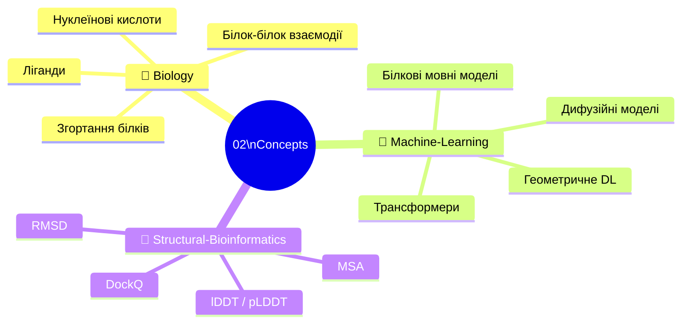
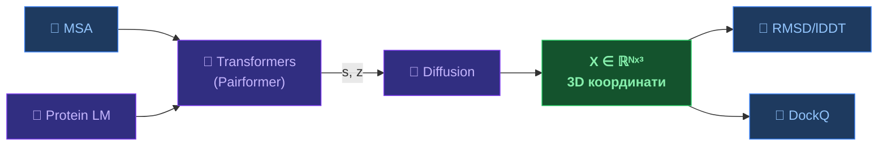

# 🧠 02 — Концепції

[[🏠 Головна]] | 🇬🇧 [[EN/01_AlphaFold3/Home|English]]

Тематичний довідник: фундаментальні поняття біології, ML та структурної біоінформатики в основі AlphaFold 3.

---

---

## 🧬 Biology

| Тема | Ключові поняття | Зв'язок з AF3 |
|------|-----------------|---------------|
| [[UA/02_Концепції/Біологія/Згортання білків\|Згортання білків]] | Levinthal, воронка, вторинна структура | AF3 генерує координати напряму |
| [[UA/02_Концепції/Біологія/Білок-білок взаємодії\|Білок-білок взаємодії]] | BSA, ΔG_bind, інтерфейс, ipTM | AF3 → 76.6% DockQ high |
| [[UA/02_Концепції/Біологія/Ліганди та малі молекули\|Ліганди та малі молекули]] | K_d, Ro5, кишеня, докінг | AF3 → 76.4% PoseBusters |
| [[UA/02_Концепції/Біологія/Нуклеїнові кислоти\|Нуклеїнові кислоти]] | ДНК/РНК структура, мотиви | AF3 — перша генеральна модель |

## 🤖 Machine Learning

| Тема | Ключові поняття | Зв'язок з AF3 |
|------|-----------------|---------------|
| [[UA/02_Концепції/Машинне-Навчання/Трансформери\|Трансформери]] | MHA, Pairformer, IPA, SE(3) | Pairformer = 48 блоків |
| [[UA/02_Концепції/Машинне-Навчання/Дифузійні моделі\|Дифузійні моделі]] | DDPM, DDIM, Score SDE | → [[UA/01_AlphaFold3/Архітектура/Дифузійні моделі — теорія та застосування\|детальна нотатка]] |
| [[UA/02_Концепції/Машинне-Навчання/Білкові мовні моделі\|Білкові мовні моделі]] | ESM-2, MLM, embeddings | Input embedder у AF3 |
| [[UA/02_Концепції/Машинне-Навчання/Геометричне глибоке навчання\|Геометричне DL]] | E(3)/SE(3), EGNN, еквіваріантність | IPA у diffusion module |

## 📐 Structural Bioinformatics

| Тема | Формула | Поріг |
|------|---------|-------|
| [[UA/02_Концепції/Структурна-Біоінформатика/RMSD\|RMSD]] | $\sqrt{\tfrac{1}{N}\sum\|r_i^\text{pred}-r_i^\text{true}\|^2}$ | < 2 Å ✅ |
| [[UA/02_Концепції/Структурна-Біоінформатика/lDDT\|lDDT / pLDDT]] | Збережені контакти при 4 порогах | > 90 ✅, < 50 ⚠️ |
| [[UA/02_Концепції/Структурна-Біоінформатика/DockQ\|DockQ]] | $(f_\text{nat} + f_\text{iRMSD} + f_\text{LRMSD})/3$ | > 0.8 ✅ |
| [[UA/02_Концепції/Структурна-Біоінформатика/MSA\|MSA]] | Вирівнювання + коеволюція | $N_\text{eff} > 100$ |

---

## 🔗 Концепти → AF3

