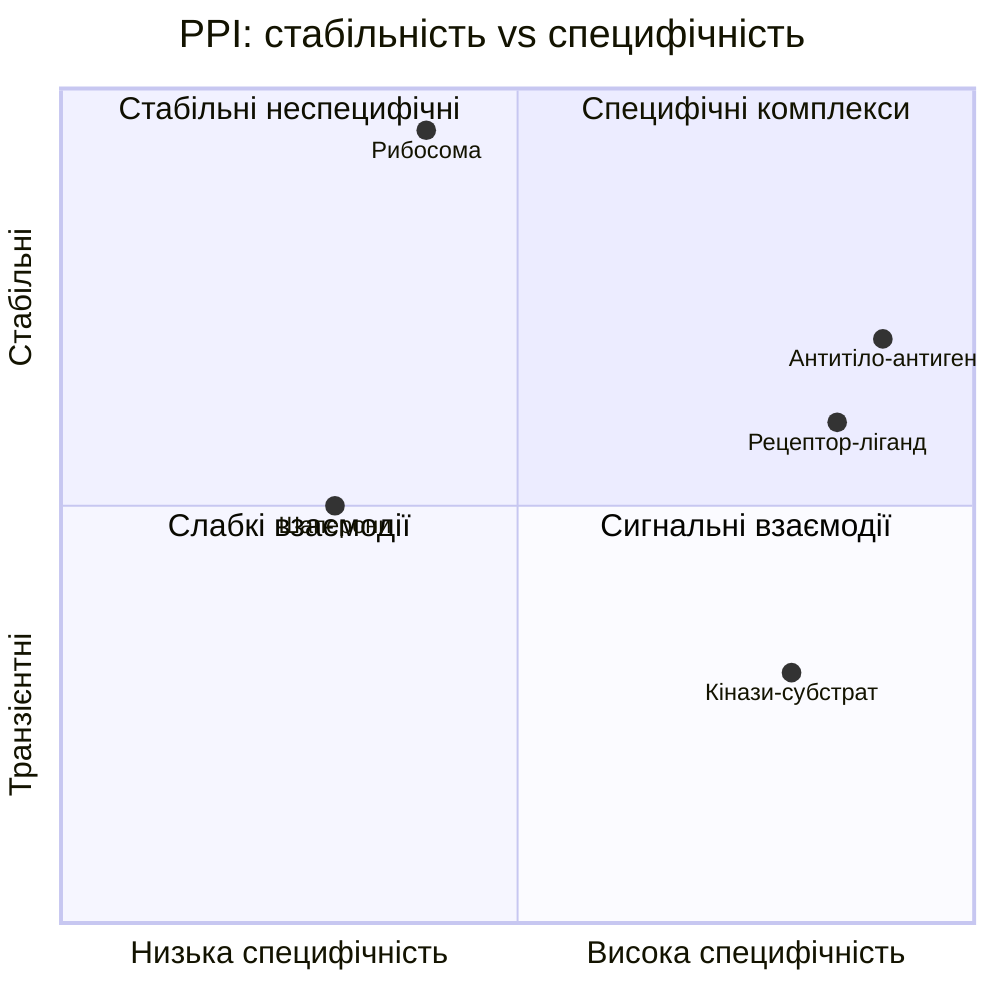
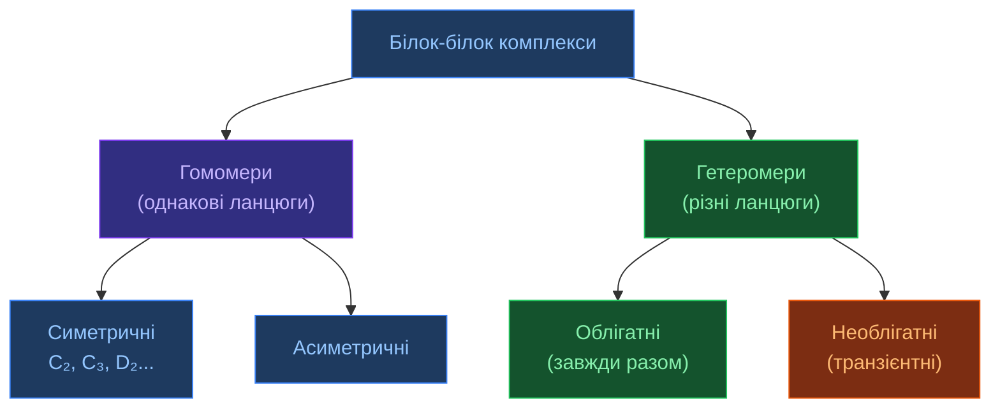

# Білок-білок взаємодії (PPI)

[[UA/02_Концепції/Індекс]] > Biology

> Більшість клітинних функцій виконується не окремими білками, а **макромолекулярними комплексами**. PPI — основа сигналізації, транскрипції, реплікації, імунної відповіді.

---

## Типи PPI за стабільністю

## Інтерфейс взаємодії

Площа інтерфейсу (BSA — Buried Surface Area):

$$\mathrm{BSA} = \frac{1}{2}\bigl[\mathrm{SASA}(A) + \mathrm{SASA}(B) - \mathrm{SASA}(AB)\bigr]$$

| Тип комплексу | BSA (Ų) | Приклад |
|---------------|----------|---------|
| Слабка взаємодія | 500–1000 | Сигнальні пептиди |
| Типовий гетеродимер | 1000–2000 | Більшість PPI |
| Великий стабільний | 2000–5000 | Антиген-антитіло |
| Постійний комплекс | >5000 | Рибосома, протеасома |

## Ключові фізичні сили на інтерфейсі

$$\Delta G_\text{bind} = \Delta G_\text{elec} + \Delta G_\text{vdW} + \Delta G_\text{hphob} + \Delta G_\text{HB} + \Delta G_\text{sol}$$

**Гарячі точки (hot spots)** — залишки, мутація яких знижує афінність $> 2$ ккал/моль. Зазвичай: Trp, Arg, Tyr.

## Класифікація за симетрією

## AlphaFold 3 і PPI

AF3 досягає **ipTM > 0.8** на складних гетеромерних комплексах. Ключові метрики:

| Метрика | Що вимірює | Порогові значення |
|---------|------------|------------------|
| **ipTM** | Точність інтерфейсу (predicted TM-score) | >0.8 ✅, 0.6–0.8 ⚠️, <0.6 ❌ |
| **pDockQ** | Впевненість у якості докінгу | >0.5 ✅ |
| **PAE on interface** | Помилка позиціонування на інтерфейсі (Å) | <5 Å ✅ |

> Berman et al. PDB. DOI: [10.1093/nar/28.1.235](https://doi.org/10.1093/nar/28.1.235)
> Evans et al. (2022). *Protein complex prediction with AlphaFold-Multimer*.
> DOI: [10.48550/arXiv.2109.22paym](https://doi.org/10.1101/2021.10.04.463034)

---

## Пов'язані нотатки

- [[UA/02_Концепції/Біологія/Згортання білків]]
- [[UA/02_Концепції/Структурна-Біоінформатика/DockQ]]
- [[UA/01_AlphaFold3/Результати/Точність по типах комплексів]]
