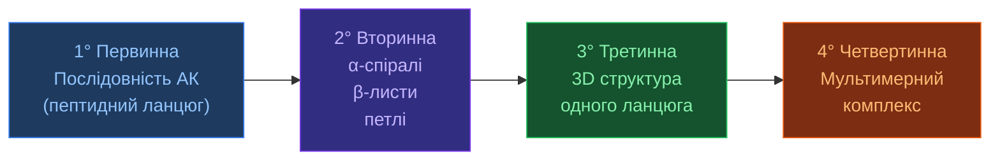
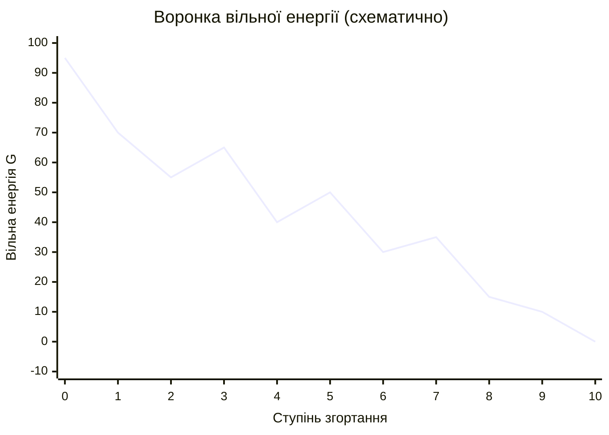

# Згортання білків (Protein Folding)

[[UA/02_Концепції/Індекс]] > Biology

> **Проблема згортання білків** — одна з найфундаментальніших у молекулярній біології: як лінійна послідовність амінокислот визначає унікальну тривимірну структуру?

---

## Рівні структурної організації

## Рушійні сили згортання

Згортання визначається мінімізацією вільної енергії $\Delta G$:

$$\Delta G_\text{fold} = \Delta H - T\Delta S$$

Основні внески:
- **Гідрофобний ефект** — гідрофобні залишки ховаються всередину (домінує)
- **Водневі зв'язки** — стабілізують вторинну структуру ($\sim$2–10 ккал/моль)
- **Ван-дер-Ваальсові взаємодії** — щільна упаковка ядра
- **Електростатика** — сольові містки, диполі
- **Дисульфідні зв'язки** — ковалентна стабілізація (позаклітинні білки)

## Парадокс Левінталя

Якби білок перебирав конформації випадково:

$$t \sim 10^{300} \text{ років} \quad \text{(при } 10^{10} \text{ конформацій/с)}$$

Реальне згортання: **мілісекунди до секунд** → існують шляхи згортання (folding funnels).

## Воронка вільної енергії

## Типи вторинної структури

| Структура | Φ (°) | Ψ (°) | Водневі зв'язки | Частота |
|-----------|--------|--------|------------------|---------|
| α-спіраль | −57 | −47 | i ↔ i+4 | ~31% |
| β-лист паралельний | −119 | +113 | між ланцюгами | ~20% |
| β-лист антипаралельний | −139 | +135 | між ланцюгами | ~20% |
| 3₁₀-спіраль | −49 | −26 | i ↔ i+3 | ~3% |
| Петлі/coil | варіює | варіює | — | ~26% |

## Зв'язок з AlphaFold 3

AF3 **не передбачає** торсійні кути напряму (як AF2), а генерує атомні координати через дифузію:

$$\mathbf{X}_0 \in \mathbb{R}^{N_\text{atoms}\times3} \xleftarrow{\text{дифузія}} \mathbf{X}_T \sim \mathcal{N}(0,\mathbf{I})$$

Це дозволяє AF3 моделювати **структурний безлад** (IDR-регіони) природно — вони не мають єдиної конформації.

> Anfinsen (1973). *Principles that govern the folding of protein chains*. Science 181.
> DOI: [10.1126/science.181.4096.223](https://doi.org/10.1126/science.181.4096.223)

> Dill & MacCallum (2012). *The Protein-Folding Problem, 50 Years On*. Science 338.
> DOI: [10.1126/science.1219021](https://doi.org/10.1126/science.1219021)

---

## Пов'язані нотатки

- [[UA/02_Концепції/Біологія/Білок-білок взаємодії]]
- [[UA/02_Концепції/Структурна-Біоінформатика/RMSD]]
- [[UA/02_Концепції/Структурна-Біоінформатика/lDDT]]
- [[UA/01_AlphaFold3/Архітектура/Дифузійний модуль]]
