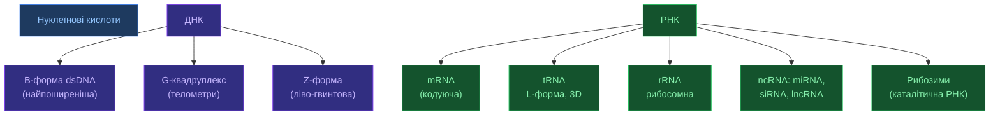

# Нуклеїнові кислоти

[[UA/02_Концепції/Індекс]] > Biology

> ДНК і РНК — не просто носії інформації. Їх тривимірна структура критична для функції: рибозими, aptamers, G-квадруплекси, shRNA — усе залежить від фолдингу.

---

## Структурна організація

## Ключові структурні відмінності ДНК/РНК

| Властивість | ДНК | РНК |
|------------|-----|-----|
| Цукор | 2'-дезоксирибоза | Рибоза (2'-OH) |
| Основи | A, T, G, C | A, U, G, C |
| Спіраль | B-форма (переважно) | A-форма |
| Ланцюжність | Зазвичай дволанцюгова | Зазвичай одноланцюгова |
| Стабільність | Висока | Нижча (2'-OH) |
| Каталіз | Ні | Так (рибозими) |

## Вторинна структура РНК

$$\Delta G_\text{fold}^\text{RNA} = \sum_i \Delta G_i^\text{stack} + \sum_j \Delta G_j^\text{loop} + \Delta G^\text{init}$$

Типові мотиви:
- **Stem-loop / hairpin** — найпоширеніший елемент
- **Bulge** — непарні основи всередині дуплексу
- **Internal loop** — непарні основи з обох сторін
- **Junction** — з'єднання трьох і більше стемів
- **Pseudoknot** — перехресні водневі зв'язки

## AlphaFold 3 і нуклеїнові кислоти

AF3 — **перша генеральна модель** для ДНК/РНК без окремого тренування:

| Тип | Точність AF3 | Метрика |
|-----|-------------|---------|
| ДНК | ~70% | RMSD < 2Å на тест-сеті |
| РНК | ~40% | lDDT-RNA |
| Білок-ДНК | покращення vs AF2 | DockQ |
| Білок-РНК | покращення vs AF2 | DockQ |

**Обмеження**: РНК — найважча задача для AF3. Еволюційних даних (MSA) менше, варіабельність структур вища.

> Leontis & Westhof (2001). *Geometric nomenclature and classification of RNA base pairs*. RNA 7.
> DOI: [10.1017/S1355838201002515](https://doi.org/10.1017/S1355838201002515)

> Jumper et al. (2021). *AlphaFold2*. Nature 596.
> DOI: [10.1038/s41586-021-03819-2](https://doi.org/10.1038/s41586-021-03819-2)

---

## Пов'язані нотатки

- [[UA/02_Концепції/Біологія/Згортання білків]]
- [[UA/02_Концепції/Структурна-Біоінформатика/MSA]]
- [[UA/01_AlphaFold3/Результати/Точність по типах комплексів]]
- [[UA/01_AlphaFold3/Обмеження/Обмеження моделі]]
