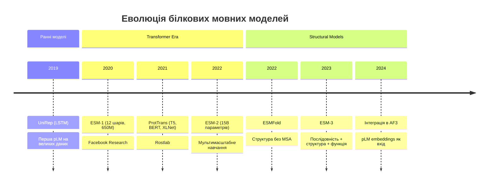
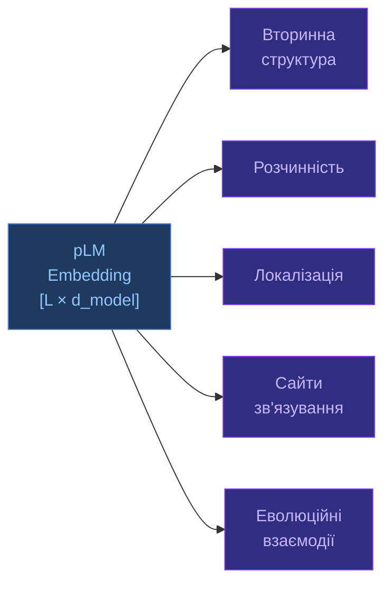

# Білкові мовні моделі (pLM)

[[UA/02_Концепції/Індекс]] > Machine-Learning

> **Білкова мовна модель** навчається на мільйонах послідовностей без структурних даних і вивчає «граматику» білкового коду — еволюційно збережені закономірності.

---

## Від NLP до білків

Аналогія:

| NLP | Білки |
|-----|-------|
| Символи (A–Z) | Амінокислоти (20 стандартних) |
| Слова | Мотиви, домени |
| Речення | Білкові ланцюги |
| Граматика | Еволюційні обмеження |
| Маскований токен | Замаскований залишок (MLM) |

## Архітектурна еволюція

## ESM-2: архітектура

ESM-2 — трансформер-encoder, навчений на **Masked Language Modeling (MLM)**:

$$\mathcal{L}_\text{MLM} = -\mathbb{E}\!\left[\log p_\theta(x_i \mid x_{\setminus i})\right]$$

де $x_{\setminus i}$ — послідовність з замаскованим залишком $i$.

| Модель | Параметри | Шари | Dim | GPU RAM |
|--------|-----------|------|-----|---------|
| ESM-2 8M | 8M | 6 | 320 | <1 GB |
| ESM-2 150M | 150M | 30 | 640 | 2 GB |
| ESM-2 650M | 650M | 33 | 1280 | 8 GB |
| **ESM-2 15B** | **15B** | 48 | 5120 | **~180 GB** |

> Lin et al. (2023). *Evolutionary-scale prediction of atomic-level protein structure with a language model*. Science 379.
> DOI: [10.1126/science.ade2574](https://doi.org/10.1126/science.ade2574)

## Що кодують pLM embeddings?

Embeddings (репрезентації) kодують:

## pLM в AlphaFold 3

AF3 **не використовує ESM напряму**, але концепцію pLM використовує через:
- **Input embedder**: токенізація амінокислот + позиційне кодування
- Схожа ідея: навчання на великих послідовнісних даних

Натомість AF3 покладається на **MSA** для еволюційних сигналів — але зменшив роль MSA (4 блоки проти 48 у AF2).

ESM-2/ESMFold можуть передбачати структуру **без MSA** — компроміс: швидкість за рахунок точності.

> Rives et al. (2021). *Biological structure and function emerge from scaling unsupervised learning to 250 million protein sequences*. PNAS 118.
> DOI: [10.1073/pnas.2016239118](https://doi.org/10.1073/pnas.2016239118)

---

## Пов'язані нотатки

- [[UA/02_Концепції/Машинне-Навчання/Трансформери]]
- [[UA/02_Концепції/Структурна-Біоінформатика/MSA]]
- [[UA/01_AlphaFold3/Архітектура/Загальна архітектура AF3]]
