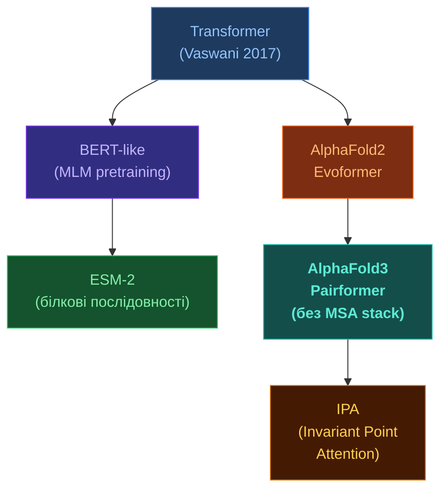

# Трансформери в структурній біології

[[UA/02_Концепції/Індекс]] > Machine-Learning

> **Трансформер** — архітектура нейромережі на основі механізму уваги (attention). У структурній біології замінив рекурентні мережі завдяки паралелізму та здатності моделювати далекі взаємодії.

---

## Механізм уваги

### Self-Attention

$$\text{Attention}(Q,K,V) = \text{softmax}\!\left(\frac{QK^\top}{\sqrt{d_k}}\right)V$$

де $Q = XW_Q$, $K = XW_K$, $V = XW_V$ — лінійні проекції входу $X$.

### Multi-Head Attention (MHA)

$$\text{MHA}(X) = \text{Concat}(\text{head}_1,\ldots,\text{head}_h)\,W_O$$

$$\text{head}_i = \text{Attention}(XW_Q^i,\,XW_K^i,\,XW_V^i)$$

Складність: $O(N^2 d)$ — квадратична по довжині послідовності.

## Стандартний трансформер vs біологічні варіанти

## Pairformer в AlphaFold 3

Pairformer — ключова зміна AF3 проти AF2 (де був Evoformer).

### Що змінилось

| Компонент | AlphaFold 2 (Evoformer) | AlphaFold 3 (Pairformer) |
|-----------|------------------------|--------------------------|
| MSA обробка | 48 блоків MSA + pair | 4 блоки MSA + **48 блоків pair** |
| Основний фокус | MSA → pair | pair (парні взаємодії) |
| Нові типи молекул | Тільки білки | Білки + ДНК + РНК + ліганди |
| Pair attention | Row/column-wise | **Pair bias + triangle updates** |

### Pair Representation Update

$$z_{ij} \leftarrow z_{ij} + \text{TriangleAtt}(z) + \text{TriangleMult}(z) + \text{Transition}(z)$$

Triangle attention моделює геометрію: якщо $i$–$j$ і $j$–$k$ взаємодіють, то $i$–$k$ теж має бути пов'язані (трикутна нерівність у структурному просторі).

## Invariant Point Attention (IPA)

IPA — attention у $SE(3)$-еквіваріантному просторі, що використовується у дифузійному модулі AF3:

$$a_{ij} = \text{softmax}\!\left(\frac{q_i^\top k_j}{d} + b_{ij} - \frac{\gamma}{2}\sum_p \bigl\|T_i\mathbf{q}_i^p - T_j\mathbf{k}_j^p\bigr\|^2\right)$$

де $T_i = (R_i, \mathbf{t}_i) \in SE(3)$ — рамка залишку $i$, $\mathbf{q}_i^p$ — точкові запити в локальній системі.

IPA **інваріантна** до глобального обертання/зміщення системи.

> Vaswani et al. (2017). *Attention Is All You Need*. NeurIPS.
> DOI: [10.48550/arXiv.1706.03762](https://doi.org/10.48550/arXiv.1706.03762)

> Jumper et al. (2021). *AlphaFold2*. Nature 596.
> DOI: [10.1038/s41586-021-03819-2](https://doi.org/10.1038/s41586-021-03819-2)

---

## Пов'язані нотатки

- [[UA/01_AlphaFold3/Архітектура/Pairformer]]
- [[UA/02_Концепції/Машинне-Навчання/Геометричне глибоке навчання]]
- [[UA/02_Концепції/Машинне-Навчання/Білкові мовні моделі]]
