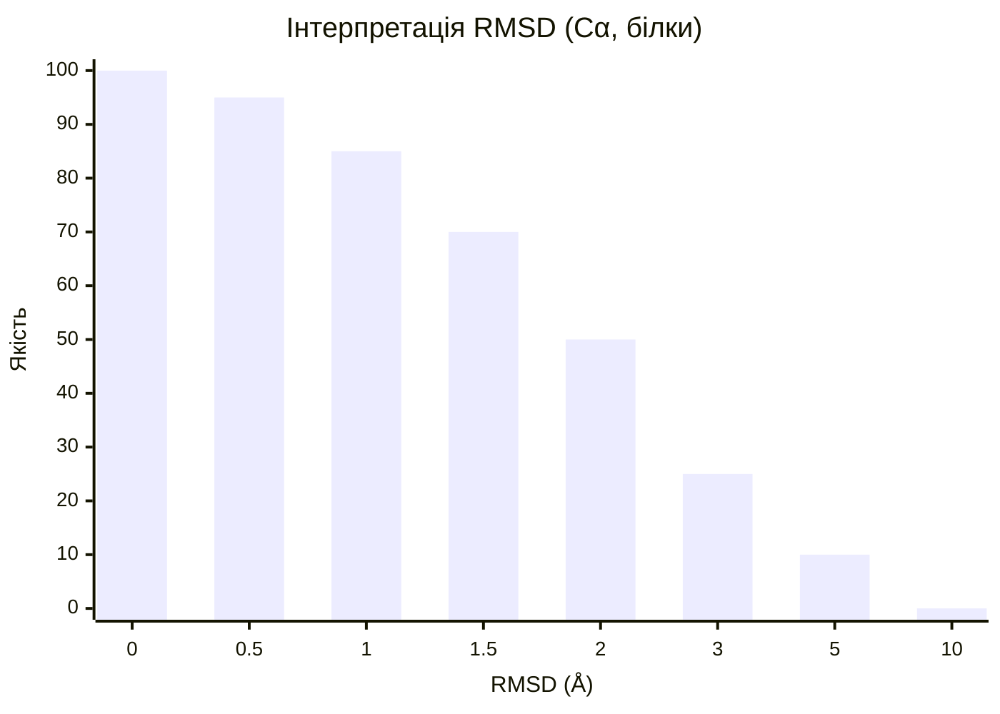

# RMSD — Root Mean Square Deviation

[[UA/02_Концепції/Індекс]] > Structural-Bioinformatics

> **RMSD** — найпоширеніша міра структурного відхилення. Вимірює середнє відхилення атомних позицій між двома структурами після оптимального накладання.

---

## Визначення

$$\text{RMSD} = \sqrt{\frac{1}{N}\sum_{i=1}^{N}\|\mathbf{r}_i^\text{pred} - \mathbf{r}_i^\text{true}\|^2}$$

де $N$ — кількість атомів, $\mathbf{r}_i\in\mathbb{R}^3$ — координата $i$-го атома.

## Оптимальне накладання (Superposition)

Перед обчисленням RMSD структури суміщаються через **жорстке перетворення** $\in SE(3)$:

$$(\hat{R}, \hat{\mathbf{t}}) = \arg\min_{R\in SO(3),\,\mathbf{t}} \sum_i \|R\mathbf{r}_i^\text{pred} + \mathbf{t} - \mathbf{r}_i^\text{true}\|^2$$

Рішення — **алгоритм Кабша** (через SVD кросс-коваріаційної матриці):

$$H = \sum_i (\mathbf{r}_i^\text{pred} - \bar{\mathbf{r}}^\text{pred})^\top (\mathbf{r}_i^\text{true} - \bar{\mathbf{r}}^\text{true})$$
$$H = U\Sigma V^\top \implies \hat{R} = VU^\top$$

## Варіанти RMSD

| Назва | Атоми | Застосування |
|-------|-------|-------------|
| **Backbone RMSD** | N, Cα, C, O | Глобальна складка |
| **Cα RMSD** | Тільки Cα | Стандарт для порівняння складок |
| **All-atom RMSD** | Усі важкі атоми | Детальна точність + бічні ланцюги |
| **Ligand RMSD** | Атоми ліганду | Якість докінгу (поріг: 2 Å) |
| **Interface RMSD** | Атоми на інтерфейсі | Якість комплексу |

## Порогові значення

| RMSD | Інтерпретація |
|------|--------------|
| < 1 Å | ✅ Відмінна точність (майже еквівалентна кристалографії) |
| 1–2 Å | ✅ Хороша (складка вірна, деталі відрізняються) |
| 2–4 Å | ⚠️ Прийнятна (основна складка правильна) |
| > 4 Å | ❌ Погана (суттєво інша структура) |

**Для лігандів**: поріг < 2 Å = правильна поза (PoseBusters, CASP-D)

## Обмеження RMSD

RMSD **чутливий** до:
- Локальних гнучких ділянок (петлі з великим RMSD псують загальну оцінку)
- Порядку накладання — глобальне суміщення може приховати локальні помилки

Тому RMSD **доповнюють** через lDDT, TM-score, GDT_TS.

## TM-score (Temple Mobility Score)

TM-score нормалізований і менш чутливий до довжини:

$$\text{TM-score} = \max_{(R,t)}\left[\frac{1}{L}\sum_i \frac{1}{1 + (d_i/d_0)^2}\right]$$

де $d_0 = 1.24\sqrt[3]{L-15} - 1.8$ (нормування по $L$).

- TM-score > 0.5 → та ж топологічна складка
- TM-score > 0.8 → дуже схожі структури

> Kabsch (1976). *A solution for the best rotation to relate two sets of vectors*. Acta Cryst A32.
> DOI: [10.1107/S0567739476001873](https://doi.org/10.1107/S0567739476001873)

> Zhang & Skolnick (2004). *Scoring function for automated assessment of protein structure template quality*. Proteins 57.
> DOI: [10.1002/prot.20264](https://doi.org/10.1002/prot.20264)

---

## Пов'язані нотатки

- [[UA/02_Концепції/Структурна-Біоінформатика/lDDT]]
- [[UA/02_Концепції/Структурна-Біоінформатика/DockQ]]
- [[UA/01_AlphaFold3/Результати/Ступінь впевненості]]
