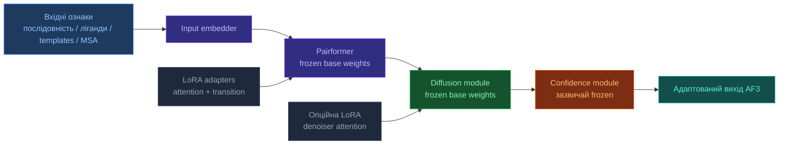

<!-- markdownlint-disable MD013 -->

# Загальна архітектура AF3

[[UA/Головна]] > Архітектура
🇬🇧 [[EN/1. AlphaFold3/1.2. Architecture/1.2.1. AF3 Architecture Overview|English]]

---

## Загальна схема

AF3 успадковує загальну структуру AF2, але з великими змінами в кожному компоненті:

```text
Вхід (послідовності, ліганди, ковалентні зв'язки)
  ↓
Input Embedder (3 блоки)
  ↓ ← Template Module (2 блоки)
  ↓ ← MSA Module (4 блоки)  ← зменшено порівняно з AF2
  ↓
Pairformer (48 блоків)  ← замінює Evoformer
  ↓
Diffusion Module (3 + 24 + 3 блоки)  ← замінює Structure Module
  ↓
Confidence Module (4 блоки)
  ↓
Вихід: 3D координати атомів
```

## Ключові відмінності від AF2

| Компонент | AF2 | AF3 |
|---|---|---|
| Основний блок обробки | Evoformer | **Pairformer** |
| Генерація структури | Structure Module (торсійні кути) | **Diffusion Module** (прямі координати) |
| Обробка MSA | Центральна | Значно спрощена (4 блоки) |
| Хімічна узагальненість | Лише білки/комплекси | Усі типи молекул |
| Параметризація залишків | Рамки + торсійні кути | Безпосередні координати атомів |

## AF3 + LoRA у власному форку

`LoRA` не входить до опублікованого inference-пайплайна AF3, але у власному форку її можна додати як параметр-ефективний шар адаптації поверх frozen ваг AF3.

### Основна ідея

Замість оновлення повних матриць ваг форк лишає базові ваги frozen і навчає невеликі low-rank оновлення:

$$W' = W + \Delta W, \qquad \Delta W = \frac{\alpha}{r}BA$$

Найприродніше це робити в transformer-подібних лінійних проекціях trunk-частини AF3.

### Куди LoRA ставити в першу чергу

| Компонент AF3 | Перший кандидат для LoRA | Чому це найстабільніша стартова точка |
|---|---|---|
| Pairformer | `Q/K/V/O` проекції single-attention | найближчий аналог стандартної адаптації трансформерів |
| Pairformer transitions | лінійні шари feed-forward / transition | невеликий зсув домену часто можна поглинути тут |
| Diffusion module | attention-проекції всередині denoiser-а | корисно на другому етапі, але чутливіше через накопичення помилок |
| Confidence head | зазвичай спочатку лишають frozen | так простіше не зламати калібрування оцінки впевненості |

### Принципова схема для форка



### Практична стратегія форка

1. Заморозити всю базову модель AF3.
2. Додати `LoRA` лише до attention і transition-проекцій у Pairformer.
3. Навчати форк на вузькому домені або task-specific датасеті.
4. Додавати LoRA в diffusion-attention лише якщо trunk-only адаптації недостатньо.
5. Окремо перевіряти confidence і structural quality після адаптації.

### Чому варто починати з Pairformer

- Pairformer є головним latent-processing trunk AF3.
- Його attention і transition-шари — найпряміший аналог стандартних transformer-блоків.
- LoRA в trunk зсуває внутрішній conditioning, який далі потрапляє в diffusion module, не втручаючись одразу в усю denoising-динаміку.

### Основні ризики

- Якщо занадто агресивно ставити LoRA в diffusion module, помилки denoising можуть накопичуватись між timestep-ами.
- Вузький адаптаційний датасет може переcпеціалізувати інтерфейси, ligand placement або контакти з нуклеїновими кислотами.
- Confidence-прогнози можуть втратити калібрування навіть тоді, коли геометрія на цільовому домені покращується.

## Інші PEFT-методи для AF3-подібних моделей

`LoRA` — лише один представник ширшого сімейства `PEFT` (`parameter-efficient fine-tuning`). Для `AF3`-подібних моделей важлива не лише кількість нових параметрів, а й **у яке саме місце системи входить адаптація**: у trunk `Pairformer`, у diffusion-denoiser або в confidence/output шари.

### Швидке порівняння

| Метод | Основна ідея | Найкраща перша точка в AF3-подібних моделях | Головний плюс | Головний мінус |
|---|---|---|---|---|
| `AdaLoRA` | адаптивний розподіл low-rank бюджету | Pairformer attention + transitions | краще розподіляє параметри між шарами | складніший за звичайний LoRA |
| `DoRA` | розділяє зміну напряму і масштабу ваг | Pairformer attention / MLP-проекції | може бути стабільнішим за LoRA при сильнішому доменному зсуві | трохи складніший шлях адаптації |
| `IA3` | навчає channel-wise вектори масштабування | attention і feed-forward канали | дуже дешевий за числом параметрів | слабша місткість, ніж у LoRA/adapters |
| `BitFit` | навчає тільки bias-параметри | верхні блоки Pairformer | найпростіший baseline | часто занадто слабкий для структурної адаптації |
| Bottleneck adapters | вставляє малі trainable MLP-блоки | після Pairformer attention або transitions | вища виразність | важчий за LoRA/IA3 |
| Prefix / prompt tuning | навчає додаткові conditioning tokens або вектори | вхідний conditioning перед trunk | мінімально втручається в базові ваги | менш природний для структурних моделей |
| Partial fine-tuning | розморожує частину оригінальних шарів | верхній Pairformer або обмежений diffusion-attention | прямий і сильний метод | найвищі витрати пам'яті й ризик overfitting |

### 1. AdaLoRA

`AdaLoRA` виходить із тієї ж low-rank ідеї, що й `LoRA`, але не тримає однаковий rank у кожному шарі. Вона перерозподіляє adaptation budget на користь тих шарів, які в процесі навчання виявляються важливішими.

#### Чому AdaLoRA може допомогти в AF3-подібних моделях

- Не всі блоки Pairformer однаково важливі для конкретного доменного зсуву.
- Для одних задач потрібніше змінювати pair-to-single coupling, для інших — верхні trunk-блоки.
- Адаптивний rank корисний, коли на старті незрозуміло, де саме сидить потрібна зміна.

#### Де найкраще застосовувати AdaLoRA

- Починати з Pairformer attention і transition-проекцій.
- На перших експериментах тримати diffusion module frozen.
- Брати тоді, коли plain `LoRA` виглядає недопараметризованим у частині шарів і надлишковим в інших.

#### Плюси AdaLoRA

- Краща параметрична ефективність, ніж однаковий rank для всіх шарів.
- Гнучкіше поводиться при нерівномірному доменному зсуві по trunk-у.
- Хороший наступний крок після базового plain `LoRA`.

#### Мінуси AdaLoRA

- Складніше зрозуміти і налаштувати, ніж fixed-rank `LoRA`.
- Вищий ризик нестабільності навчання на малому датасеті.
- Важче інтерпретувати, які саме структурні властивості модель змінила.

### 2. DoRA

`DoRA` можна розглядати як LoRA-подібний метод, який розділяє зміну напряму ваг і зміну їх масштабу. На практиці це інколи робить адаптацію менш грубою, ніж один low-rank residual.

#### Чому DoRA може допомогти в AF3-подібних моделях

- AF3-подібний trunk уже містить багаті geometry-aware priors.
- Часто моделі треба не повністю переписати ознаки, а обережно перенаправити вже наявні.
- Тому magnitude-aware адаптація може бути вигідною при помірному, але нетривіальному доменному зсуві.

#### Де найкраще застосовувати DoRA

- Pairformer attention-проекції.
- Pairformer transition MLP.
- За потреби найвищі diffusion-attention блоки, але лише після перевірки trunk-адаптації.

#### Плюси DoRA

- Часто стабільніший за plain `LoRA`, коли адаптація має бути делікатною.
- Краще зберігає pretrained-структуру при зміні task behavior.
- Корисний проміжний варіант між `LoRA` і повноцінними adapters.

#### Мінуси DoRA

- Складніший за `LoRA` для реалізації у власному форку.
- Менше стандартних інструментів і прикладів.
- Якщо доменний зсув дуже малий або дуже великий, виграш може бути невеликим.

### 3. IA3

`IA3` не додає повний low-rank residual. Натомість метод навчає multiplicative scaling factors для внутрішніх каналів, зазвичай в attention і feed-forward шляхах.

#### Чому IA3 може допомогти в AF3-подібних моделях

- AF3-подібні trunk-моделі дорогі, тож дуже дешевий метод адаптації корисний, коли потрібно багато доменних варіантів.
- Channel reweighting може вистачати, якщо цільовий домен відрізняється головно акцентами, а не базовою структурною логікою.

#### Де найкраще застосовувати IA3

- Pairformer single-attention канали.
- Feed-forward / transition канали у верхніх trunk-блоках.
- Як дуже дешевий baseline перед `LoRA` або adapters.

#### Плюси IA3

- Надзвичайно мала кількість trainable параметрів.
- Низькі накладні витрати на пам'ять і простий deployment.
- Хороший baseline, щоб перевірити, чи достатньо лише м'якого reweighting.

#### Мінуси IA3

- Нижча виразність, ніж у `LoRA`, `DoRA` чи bottleneck adapters.
- Може бути занадто слабким для ligand-heavy, nucleic-acid-heavy або сильно зміщених interface-розподілів.
- Якщо моделі потрібна нова геометрична поведінка, одного channel scaling недостатньо.

### 4. BitFit

`BitFit` оновлює тільки bias-терми і лишає всі основні матриці ваг frozen.

#### Чому BitFit може допомогти в AF3-подібних моделях

- Це найпростіший можливий baseline адаптації.
- Якщо навіть `BitFit` дає виграш, значить задачі може вистачати невеликого recentering pretrained-активацій.

#### Де найкраще застосовувати BitFit

- Верхні Pairformer-блоки.
- За потреби confidence-шари, якщо головна проблема — drift калібрування.

#### Плюси BitFit

- Мінімальна складність реалізації.
- Дуже дешевий у навчанні й зберіганні.
- Корисний як контрольний експеримент проти сильніших методів.

#### Мінуси BitFit

- Зазвичай занадто слабкий для суттєвої структурної адаптації.
- Малоймовірно, що цього вистачить для зміни docking behavior або multimolecular interaction patterns.
- Може тихо провалюватись: тренування виглядає стабільним, а геометрія майже не поліпшується.

### 5. Bottleneck adapters

Bottleneck adapters вставляють невеликий trainable модуль, зазвичай down-projection, нелінійність і up-projection, у residual stream.

#### Чому bottleneck adapters можуть допомогти в AF3-подібних моделях

- Вони дають більше нелінійної місткості, ніж LoRA-подібні методи.
- Це важливо, якщо новий домен вимагає не просто малого перенаправлення ознак.
- Для AF3-подібних моделей це привабливо тоді, коли pair-геометрію або cross-entity context треба сильніше переписати.

#### Де найкраще застосовувати bottleneck adapters

- Після Pairformer attention-блоків.
- Після transition-блоків у верхніх або середніх trunk-шарах.
- Обережно всередині diffusion-attention блоків через чутливість багаторазового denoising.

#### Плюси bottleneck adapters

- Виразніші за `LoRA` або `IA3`.
- Краще переносять великі доменні зсуви.
- Легше прицільно ставити в конкретні блоки, ніж робити partial full fine-tuning.

#### Мінуси bottleneck adapters

- Вищий параметричний і memory cost.
- Більший ризик порушити pretrained latent geometry.
- Більш інвазивна зміна архітектури власного форка.

### 6. Prefix tuning і prompt-like conditioning

У мовних моделях prefix tuning навчає додаткові virtual tokens. У AF3-подібних моделях найближчий аналог — невеликий навчуваний набір conditioning-векторів, доданих перед trunk-ом або всередині нього.

#### Чому prefix tuning може допомогти в AF3-подібних моделях

- Метод змінює вхідний conditioning, а не переписує велику кількість внутрішніх ваг.
- Це може бути корисно, коли адаптація стосується насамперед task mode, data regime або ідентичності домену.

#### Де найкраще застосовувати prefix tuning

- Навчувані domain tokens перед обробкою входу Pairformer-ом.
- Навчувані conditioning-вектори для окремих типів комплексів або сімейств лігандів.

#### Плюси prefix tuning

- Мінімально втручається в pretrained ваги.
- Чітко відділяє базову модель від task conditioning.
- Привабливий варіант, коли багато доменів мають спільний geometry engine.

#### Мінуси prefix tuning

- Менш природний підхід, ніж для autoregressive transformer-ів.
- Важче гарантувати, що conditioning достатньо сильно пройде крізь Pairformer і diffusion.
- Часто слабший за пряму trunk-адаптацію для структурних задач.

### 7. Partial fine-tuning

`Partial fine-tuning` не є `PEFT` у вузькому сенсі, але на практиці це часто найсильніший близький baseline: розморозити лише вибрану частину оригінальних ваг AF3-подібної моделі.

#### Чому partial fine-tuning може допомогти в AF3-подібних моделях

- Деяким доменам просто потрібна більша місткість, ніж можуть дати адаптери.
- Розморожування лише верхніх Pairformer-блоків дозволяє змінювати високорівневу interaction logic, зберігаючи нижчі геометричні priors.

#### Де найкраще застосовувати partial fine-tuning

- Верхні Pairformer-блоки.
- Обмежену кількість diffusion-attention шарів після перевірки trunk-адаптації.
- Confidence head лише тоді, коли головна проблема — калібрування під доменним зсувом.

#### Плюси partial fine-tuning

- Сильніша адаптаційна місткість, ніж у більшості PEFT-методів.
- Простий концептуальний baseline.
- Часто легше відлагоджувати, ніж каскад адаптерних механізмів.

#### Мінуси partial fine-tuning

- Значно вищі витрати пам'яті.
- Вищий ризик overfitting на вузьких структурних датасетах.
- Більша ймовірність пошкодити pretrained геометрію або confidence calibration.

### Практична рекомендація для AF3-подібних форків

Для більшості проєктів адаптації AF3-подібних моделей розумний порядок такий:

1. `BitFit` або `IA3` як мінімальний baseline.
2. `LoRA` як базовий практичний метод.
3. `AdaLoRA` або `DoRA`, якщо plain `LoRA` виявляється занадто жорстким.
4. Bottleneck adapters, якщо доменний зсув великий і LoRA-подібні методи замалі.
5. Partial fine-tuning лише після перевірки дешевших методів.

Коротко: що сильніше цільовий домен вимагає **reweighting**, то більше вистачає `IA3`-подібних методів; що сильніше треба **переписувати latent geometry та interaction logic**, то більше варто рухатись до adapters або selective unfreezing.

## Recycling

Модель використовує **iterative recycling**: частина результатів попереднього проходу повертається на вхід наступного проходу, щоб поступово уточнювати геометрію комплексу.

### Навіщо `recycling` потрібен

Одного проходу часто недостатньо, бо структура має кілька рівнів складності одночасно:

- локальна хімія й стереогеометрія;
- packing усередині ланцюга;
- глобальне взаємне розміщення доменів;
- міжланцюгові та protein-ligand / protein-RNA інтерфейси.

На ранньому проході модель може правильно вловити лише частину сигналу, але ще не повністю узгодити всі рівні одразу.
`Recycling` дає змогу використати вже побудовану проміжну гіпотезу структури як підказку для наступного кроку уточнення.

### Що саме відбувається

На високому рівні цикл виглядає так:


Ідея не в тому, що модель "починає з нуля" кілька разів, а в тому, що вона повторно використовує власний попередній структурний контекст.

### Чому це працює

- **Глобальна узгодженість зростає поступово**: після першого проходу вже видно, які домени, ланцюги або ліганди розміщені правдоподібно, а які ще ні.
- **Локальні й глобальні помилки можна коригувати по черзі**: одна ітерація може покращити backbone packing, наступна — інтерфейс або ligand placement.
- **Модель отримує власну "гіпотезу світу" назад на вхід**: це схоже на ітеративне self-conditioning.
- **Для складних комплексів це особливо корисно**, бо там помилка в одному місці часто тягне за собою помилки в інших.

### Інтуїція

Рециклінг можна уявити як багаторазове редагування чернетки:

1. перший прохід дає грубу, але вже осмислену структуру;
2. наступний прохід бачить цю чернетку;
3. модель уточнює погано узгоджені контакти, packing і геометрію;
4. фінальна відповідь стає стабільнішою, ніж після одного проходу.

### Де ще використовується подібна ідея

- **AlphaFold2** також використовує `recycling` як важливу частину ітеративного покращення структури.
- **AlphaFold-Multimer** зберігає цю саму логіку для complex prediction.
- **Diffusion-моделі** в ширшому сенсі теж працюють ітеративно: стан об'єкта багаторазово уточнюється через послідовність denoising-кроків.

Отже, `recycling` в AF3 — це окремий шар ітеративного `refinement` поверх `already learned structural reasoning`, а не просто "повторний запуск" моделі без нової інформації.

> Abramson et al. (2024). *Accurate structure prediction of biomolecular interactions with AlphaFold 3*. Nature.
> DOI: [10.1038/s41586-024-07487-w](https://doi.org/10.1038/s41586-024-07487-w)
> Jumper et al. (2021). *Highly accurate protein structure prediction with AlphaFold*. Nature.
> DOI: [10.1038/s41586-021-03819-2](https://doi.org/10.1038/s41586-021-03819-2)
> Hu et al. (2021). *LoRA: Low-Rank Adaptation of Large Language Models*. arXiv.
> DOI: [10.48550/arXiv.2106.09685](https://doi.org/10.48550/arXiv.2106.09685)

---

## Пов'язані нотатки

- [[UA/1. AlphaFold3/1.2. Архітектура/1.2.2. Pairformer]]
- [[UA/1. AlphaFold3/1.2. Архітектура/1.2.3. Дифузійний модуль]]
- [[UA/1. AlphaFold3/1.2. Архітектура/1.2.5. Навчання моделі]]
- [[UA/2. Концепції/2.2. Машинне-Навчання/2.2.1. Трансформери]]
- [[UA/2. Концепції/2.2. Машинне-Навчання/2.2.2. Дифузійні моделі]]

## Теги

`#архітектура` `#нейромережа` `#трансформер`
