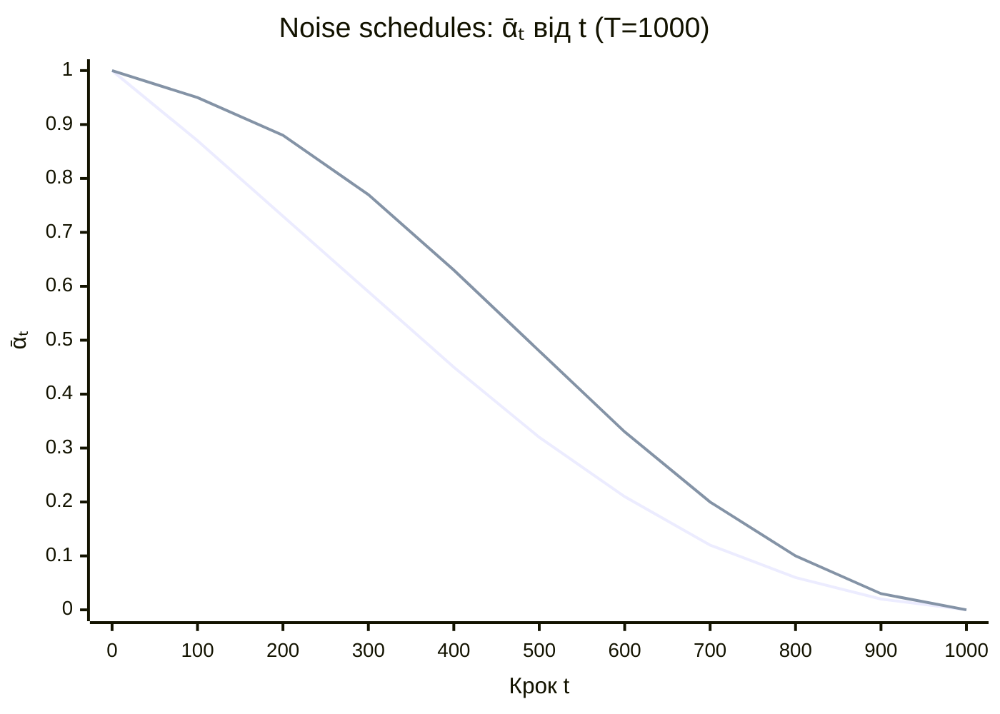
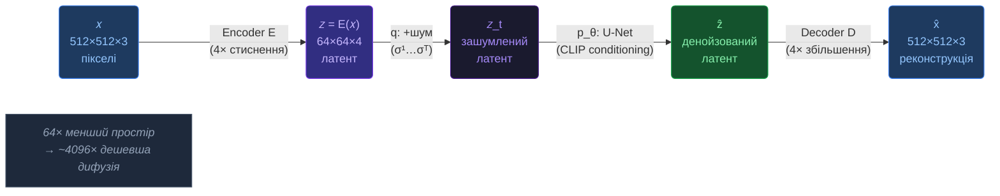
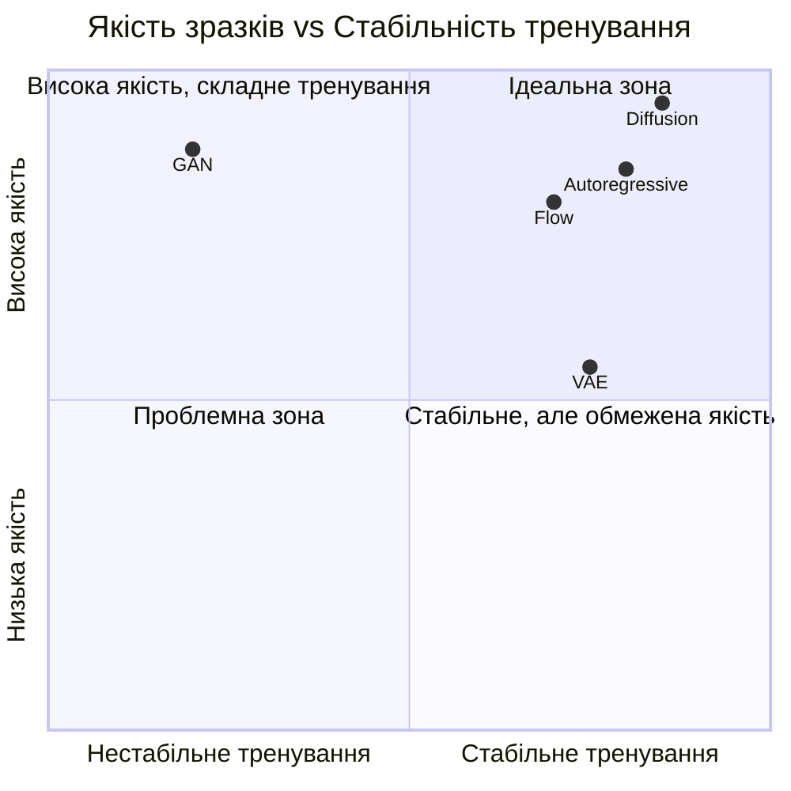
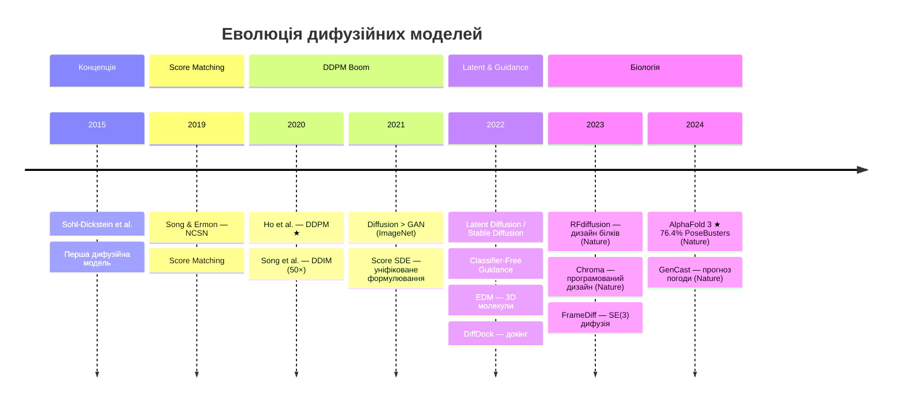
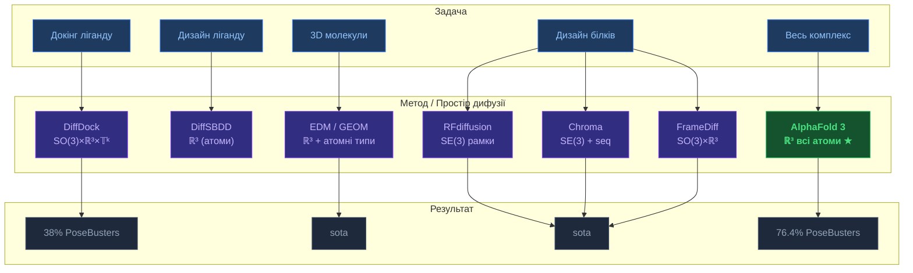
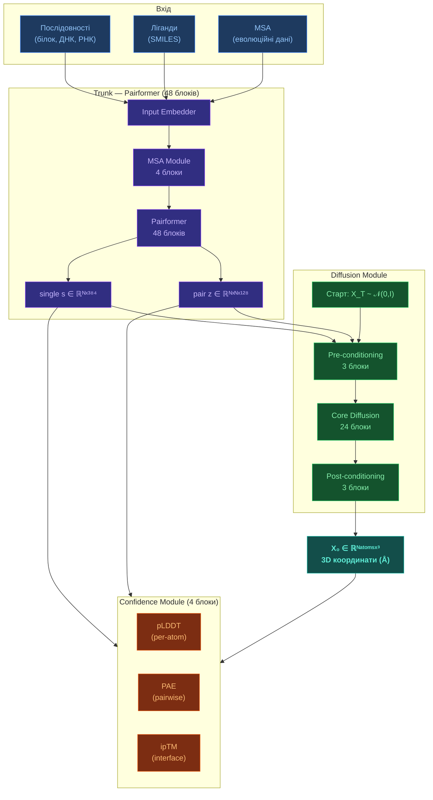
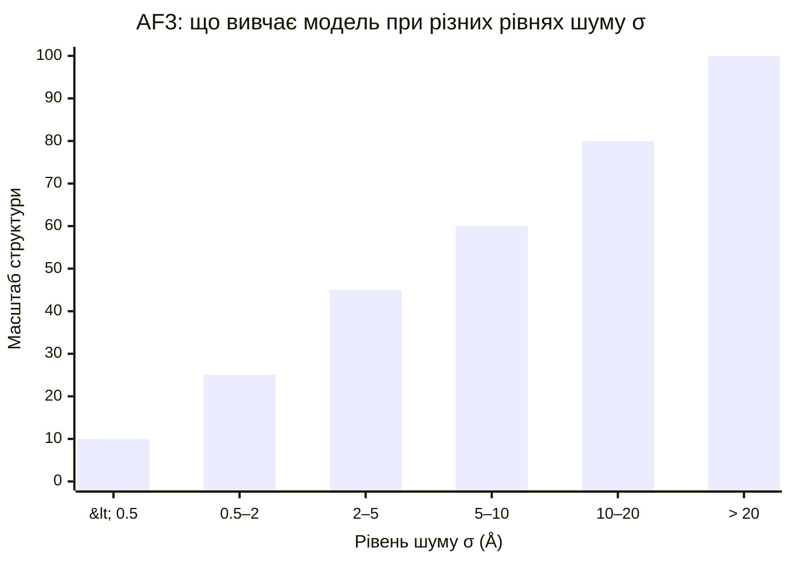

---
cssclasses:
  - math-note
tags:
  - дифузія
  - ddpm
  - score-matching
  - sde
  - генеративні-моделі
  - структурна-біологія
  - latex
---

# Дифузійні моделі — теорія та застосування

[[🏠 Головна]] > [[UA/1. AlphaFold3/1.2. Архітектура/1.2.3. Дифузійний модуль]]
🇬🇧 [[EN/1. AlphaFold3/1.2. Architecture/1.2.4. Diffusion Models — Theory and Applications|English version]]

---

## Що таке дифузійна модель?

**Дифузійна модель** — клас генеративних моделей, що навчаються породжувати дані через зворотний процес поступового видалення шуму. Ідея запозичена з нерівноважної термодинаміки: так само як тепло розсіює впорядкований стан у хаос — дифузія перетворює реальні дані на гауссівський шум, а нейромережа вчиться повертати цей процес.

> Sohl-Dickstein et al. (2015). *Deep Unsupervised Learning using Nonequilibrium Thermodynamics*. ICML 2015.
> DOI: [10.48550/arXiv.1503.03585](https://doi.org/10.48550/arXiv.1503.03585)

> Ho et al. (2020). *Denoising Diffusion Probabilistic Models*. NeurIPS 2020.
> DOI: [10.48550/arXiv.2006.11239](https://doi.org/10.48550/arXiv.2006.11239)

---

## Загальна схема: прямий і зворотний процес

```mermaid
flowchart LR
    x0("𝑥₀<br/>чисті дані"):::clean
    x1("𝑥₁<br/>шум β₁"):::noisy1
    x2("𝑥₂<br/>шум β₂"):::noisy2
    x3("𝑥₃<br/>шум β₃"):::noisy3
    xT("𝑥_T<br/>𝒩(0,I)"):::pure

    x0 -- "q(x₁|x₀)<br/>+β₁ шум" --> x1
    x1 -- "q(x₂|x₁)<br/>+β₂ шум" --> x2
    x2 -- "q(x₃|x₂)<br/>+β₃ шум" --> x3
    x3 -. "..." .-> xT

    xT -- "p_θ(x_{T-1}|x_T)<br/>εθ(xT,T)" --> x3r("𝑥_{T-1}"):::rev
    x3r -- "p_θ(x_{t-1}|x_t)<br/>εθ видаляє шум" --> x1r("𝑥₁"):::rev
    x1r -- "p_θ(x₀|x₁)<br/>εθ(x₁,1)" --> x0r("𝑥₀<br/>генерація"):::rclean

    classDef clean    fill:#1e3a5f,stroke:#3b82f6,color:#93c5fd
    classDef noisy1   fill:#1e3040,stroke:#475569,color:#94a3b8
    classDef noisy2   fill:#1a2535,stroke:#334155,color:#64748b
    classDef noisy3   fill:#151e2d,stroke:#1e293b,color:#475569
    classDef pure     fill:#0f172a,stroke:#1e293b,color:#334155
    classDef rev      fill:#1a2e1a,stroke:#16a34a,color:#86efac
    classDef rclean   fill:#14532d,stroke:#22c55e,color:#4ade80
```




---

## Математична основа

### Прямий процес (forward diffusion)

Прямий процес $q$ додає гауссівський шум до $x_0$ за $T$ кроків:

$$q(x_t \mid x_{t-1}) \;=\; \mathcal{N}\!\Bigl(x_t;\;\sqrt{1-\beta_t}\,x_{t-1},\;\beta_t\,\mathbf{I}\Bigr)$$

де $\beta_t$ — **noise schedule** (від $\beta_1\approx10^{-4}$ до $\beta_T\approx0.02$).

**Ключова властивість** — $x_t$ виражається через $x_0$ без ітерацій:

$$\boxed{\;q(x_t \mid x_0) \;=\; \mathcal{N}\!\Bigl(x_t;\;\sqrt{\bar\alpha_t}\;x_0,\;(1-\bar\alpha_t)\,\mathbf{I}\Bigr)\;}$$

де $\displaystyle\bar\alpha_t = \prod_{i=1}^{t}(1-\beta_i)$. Явна формула зашумлення:

$$x_t \;=\; \sqrt{\bar\alpha_t}\;x_0 \;+\; \underbrace{\sqrt{1-\bar\alpha_t}}_{\text{масштаб шуму}}\;\boldsymbol\varepsilon, \qquad \boldsymbol\varepsilon\sim\mathcal{N}(0,\mathbf{I})$$

### Noise schedules



### Зворотний процес (reverse denoising)

$$p_\theta(x_{t-1}\mid x_t) \;=\; \mathcal{N}\!\bigl(x_{t-1};\;\mu_\theta(x_t,t),\;\Sigma_\theta(x_t,t)\bigr)$$

Середнє зворотного кроку через передбачений шум $\varepsilon_\theta(x_t,t)$:

$$\mu_\theta(x_t,t) \;=\; \frac{1}{\sqrt{\alpha_t}}\!\left(x_t \;-\; \frac{\beta_t}{\sqrt{1-\bar\alpha_t}}\;\varepsilon_\theta(x_t,t)\right)$$

### Функція втрат

$$\boxed{\;\mathcal{L}_\text{simple} \;=\; \mathbb{E}_{t,\,x_0,\,\boldsymbol\varepsilon}\!\left[\,\bigl\|\boldsymbol\varepsilon \;-\; \varepsilon_\theta\!\bigl(\sqrt{\bar\alpha_t}\,x_0\,+\,\sqrt{1-\bar\alpha_t}\,\boldsymbol\varepsilon,\;t\bigr)\bigr\|^2\,\right]\;}$$


---

## Ключові варіанти та покращення

### DDIM — прискорена генерація

DDPM потребує $T\approx1000$ кроків; **DDIM** генерує за **10–50 кроків** без перенавчання:

$$x_{t-1} \;=\; \sqrt{\bar\alpha_{t-1}}\underbrace{\!\left(\frac{x_t-\sqrt{1-\bar\alpha_t}\,\varepsilon_\theta}{\sqrt{\bar\alpha_t}}\right)}_{\widehat{x}_0} \;+\; \sqrt{1-\bar\alpha_{t-1}-\sigma_t^2}\;\varepsilon_\theta \;+\; \sigma_t\boldsymbol\varepsilon$$

- $\sigma_t = 0$ → **DDIM** (детермінований, у 50× швидше)
- $\sigma_t = \sqrt{\beta_t}$ → **DDPM** (стохастичний)

> Song et al. (2020). *Denoising Diffusion Implicit Models*. ICLR 2021.
> DOI: [10.48550/arXiv.2010.02502](https://doi.org/10.48550/arXiv.2010.02502)

### Score-Based моделі та SDE-формулювання

$$\text{Прямий SDE:}\quad dx \;=\; f(x,t)\,dt \;+\; g(t)\,dW$$

$$\text{Зворотний SDE:}\quad dx \;=\; \Bigl[f(x,t) \;-\; g^2(t)\,\nabla_x\log p_t(x)\Bigr]dt \;+\; g(t)\,d\bar W$$

Зв'язок: $\;s_\theta(x_t,t) = -\varepsilon_\theta(x_t,t)\,/\,\sqrt{1-\bar\alpha_t}$

> Song & Ermon (2019). DOI: [10.48550/arXiv.1907.05600](https://doi.org/10.48550/arXiv.1907.05600)
> Song et al. (2021). DOI: [10.48550/arXiv.2011.13456](https://doi.org/10.48550/arXiv.2011.13456)

### Latent Diffusion Models (LDM)



> Rombach et al. (2022). CVPR. DOI: [10.48550/arXiv.2112.10752](https://doi.org/10.48550/arXiv.2112.10752)

### Classifier-Free Guidance (CFG)

$$\tilde\varepsilon_\theta(x_t,c) \;=\; \varepsilon_\theta(x_t,\varnothing) \;+\; w\cdot\Bigl(\varepsilon_\theta(x_t,c)-\varepsilon_\theta(x_t,\varnothing)\Bigr)$$

- $w=1$: умовна генерація · $w>1$: підсилення умови · $w=0$: безумовна

> Ho & Salimans (2022). DOI: [10.48550/arXiv.2207.12598](https://doi.org/10.48550/arXiv.2207.12598)


---

## Порівняння генеративних моделей



| Модель | Якість | Різноманітність | Інференс | Тренування |
|--------|--------|-----------------|----------|------------|
| **Diffusion** | ✅ Найвища | ✅ Відмінна | ❌ $T$ кроків | ✅ Стабільне |
| GAN | ✅ Висока | ⚠️ Mode collapse | ✅ Один крок | ❌ Нестабільне |
| VAE | ⚠️ Розмита | ✅ Добра | ✅ Швидко | ✅ Стабільне |
| Flow | ✅ Точна | ✅ Добра | ⚠️ Середньо | ⚠️ Invertibility |
| Autoregressive | ✅ Висока | ✅ Добра | ❌ Послідовно | ✅ Стабільне |

> Dhariwal & Nichol (2021). *Diffusion Models Beat GANs on Image Synthesis*. NeurIPS 2021.
> DOI: [10.48550/arXiv.2105.05233](https://doi.org/10.48550/arXiv.2105.05233)

---

## Хронологія розвитку




---

## Застосування у структурній біології та хімії

### Ландшафт методів



### 1. AlphaFold 3

$$p_\theta(\mathbf{X}_0 \mid s, z) = \int p_\theta(\mathbf{X}_0 \mid \mathbf{X}_T,s,z)\;p(\mathbf{X}_T)\;d\mathbf{X}_T$$

$s\in\mathbb{R}^{N\times384}$ — single repr., $z\in\mathbb{R}^{N\times N\times128}$ — pair repr.

> DOI: [10.1038/s41586-024-07487-w](https://doi.org/10.1038/s41586-024-07487-w)

### 2. DiffDock

$s_\theta(x_t,t,\mathcal{P}) \approx \nabla_x\log p_t(\text{поза}\mid\text{кишеня }\mathcal{P})$ у просторі $\mathrm{SO}(3)\times\mathbb{R}^3\times\mathbb{T}^k$

> DOI: [10.48550/arXiv.2210.01776](https://doi.org/10.48550/arXiv.2210.01776)

### 3. RFdiffusion

$R_t = R_0\cdot\exp\!\bigl(\sqrt{t}\;\Omega\bigr)$, де $\Omega\sim\mathrm{IGSO}(3)$ — шум на групі обертань $SO(3)$

> DOI: [10.1038/s41586-023-06415-8](https://doi.org/10.1038/s41586-023-06415-8)

### 4. Equivariant Diffusion (EDM)

$$\mathcal{L} = \mathbb{E}\!\left[\bigl\|\boldsymbol\varepsilon-\varepsilon_\theta(\mathbf{x}_t,\mathbf{h}_t,t)\bigr\|^2\right], \quad \mathbf{x}\in\mathbb{R}^{N\times3},\;\mathbf{h}\in\mathbb{R}^{N\times d}$$

Еквіваріантна до $E(3)$: обертання молекули → обертання виходу.

> DOI: [10.48550/arXiv.2203.17003](https://doi.org/10.48550/arXiv.2203.17003)

### 5. Chroma та RoseTTAFold All-Atom

> DOI: [10.1038/s41586-023-06728-8](https://doi.org/10.1038/s41586-023-06728-8) · [10.1126/science.adl2528](https://doi.org/10.1126/science.adl2528)


---

## Застосування поза біологією

| Система | Архітектура | Backbone | Рік |
|---------|-------------|----------|-----|
| DALL-E 2 | CLIP + DDPM | U-Net | 2022 |
| **Stable Diffusion** | LDM + CLIP | U-Net | 2022 |
| Imagen | Cascaded + T5 | U-Net | 2022 |
| **FLUX.1** | Flow matching | DiT Transformer | 2024 |
| **GenCast** | Diffusion | Graph + Transformer | 2024 |

> Imagen: DOI [10.48550/arXiv.2205.11487](https://doi.org/10.48550/arXiv.2205.11487)
> GenCast: DOI [10.1038/s41586-024-08252-9](https://doi.org/10.1038/s41586-024-08252-9) — перевищує ECMWF ENS у $97.2\%$ показників на 15 днів
> MRI: DOI [10.48550/arXiv.2111.08005](https://doi.org/10.48550/arXiv.2111.08005) — прискорення у $4\text{–}8\times$
> DiffWave: DOI [10.48550/arXiv.2009.09761](https://doi.org/10.48550/arXiv.2009.09761)

---

## Як дифузія працює в AF3 — детально

### Архітектура пайплайну AF3



### Noise schedule в AF3

$$\log\sigma \;\sim\; \mathcal{N}(\mu_P,\,\sigma_P^2), \qquad \mu_P=-1.2,\quad \sigma_P=1.5$$

$$\mathbf{X}_\text{noisy} \;=\; \mathbf{X}_\text{true} \;+\; \sigma\,\boldsymbol\varepsilon, \qquad \boldsymbol\varepsilon\sim\mathcal{N}(0,\mathbf{I})$$


### Мультимасштабне навчання



| Рівень σ | Масштаб | Що вивчається |
|----------|---------|---------------|
| $< 0.5$ Å | Атомний | Довжини зв'язків, валентні кути, планарність пептидів |
| $0.5$–$5$ Å | Локальний | Конформація бічних ланцюгів ($\chi$-кути), петлі, кільця |
| $5$–$20$ Å | Доменний | Відносне розташування доменів, субодиниці |
| $> 20$ Å | Глобальний | Орієнтація ланцюгів, стехіометрія мультимерів |

### Conditioning від Pairformer

$$\varepsilon_\theta\!\bigl(\mathbf{X}_t,\;\sigma,\;\underbrace{s\in\mathbb{R}^{N\times384}}_{\text{single repr.}},\;\underbrace{z\in\mathbb{R}^{N\times N\times128}}_{\text{pair repr.}}\bigr) \;\approx\; \frac{\mathbf{X}_t - \mathbf{X}_0}{\sigma}$$

### Інференс — зворотній процес

```python
# AF3 inference (спрощений псевдокод)
X = torch.randn(N_atoms, 3) * sigma_max       # чистий гауссів шум

for sigma in logspace(sigma_max, sigma_min, steps=200):
    X0_pred = model(X, sigma, s, z)           # передбачення X₀
    score   = (X0_pred - X) / sigma**2        # ∇ log p(X)
    X       = X - step_size * score           # Euler/Heun крок
    X      += noise_scale * randn_like(X)     # Langevin шум

return X   # 3D координати атомів (Å)
```

### Генеративність і невизначеність

$$p_\theta(\mathbf{X}_0) = \int p_\theta(\mathbf{X}_0\mid\mathbf{X}_T)\;p(\mathbf{X}_T)\;d\mathbf{X}_T$$

- **pLDDT $< 50$** — справжній структурний безлад, не помилка. Локальна стереохімія все одно правильна.
- Множинні seeds → різні конформації з розподілу $p_\theta$
- **Антитіла**: точність зростає до 1000 seeds ($p = 2\times10^{-5}$)

---

## Пов'язані нотатки

- [[UA/1. AlphaFold3/1.2. Архітектура/1.2.3. Дифузійний модуль]]
- [[UA/1. AlphaFold3/1.2. Архітектура/1.2.1. Загальна архітектура AF3]]
- [[UA/1. AlphaFold3/1.2. Архітектура/1.2.5. Навчання моделі]]
- [[UA/1. AlphaFold3/1.3. Результати/1.3.2. Ступінь впевненості]]
- [[UA/1. AlphaFold3/1.4. Обмеження/1.4.1. Обмеження моделі]]
