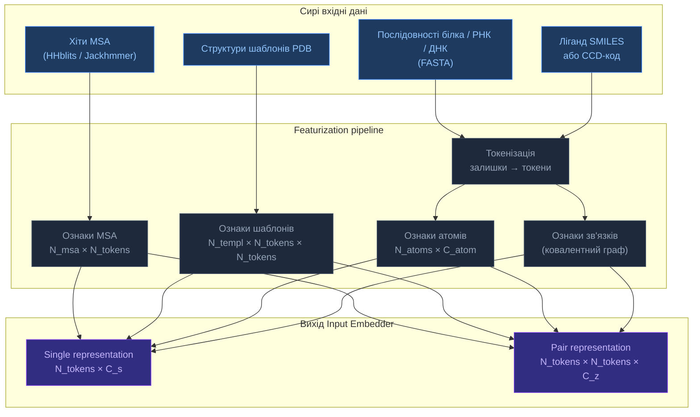
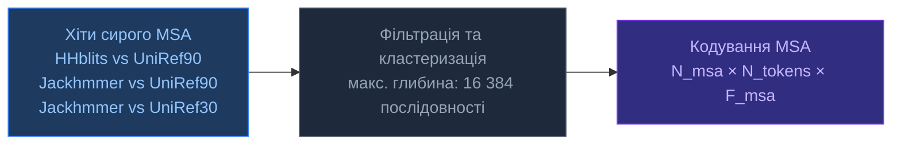
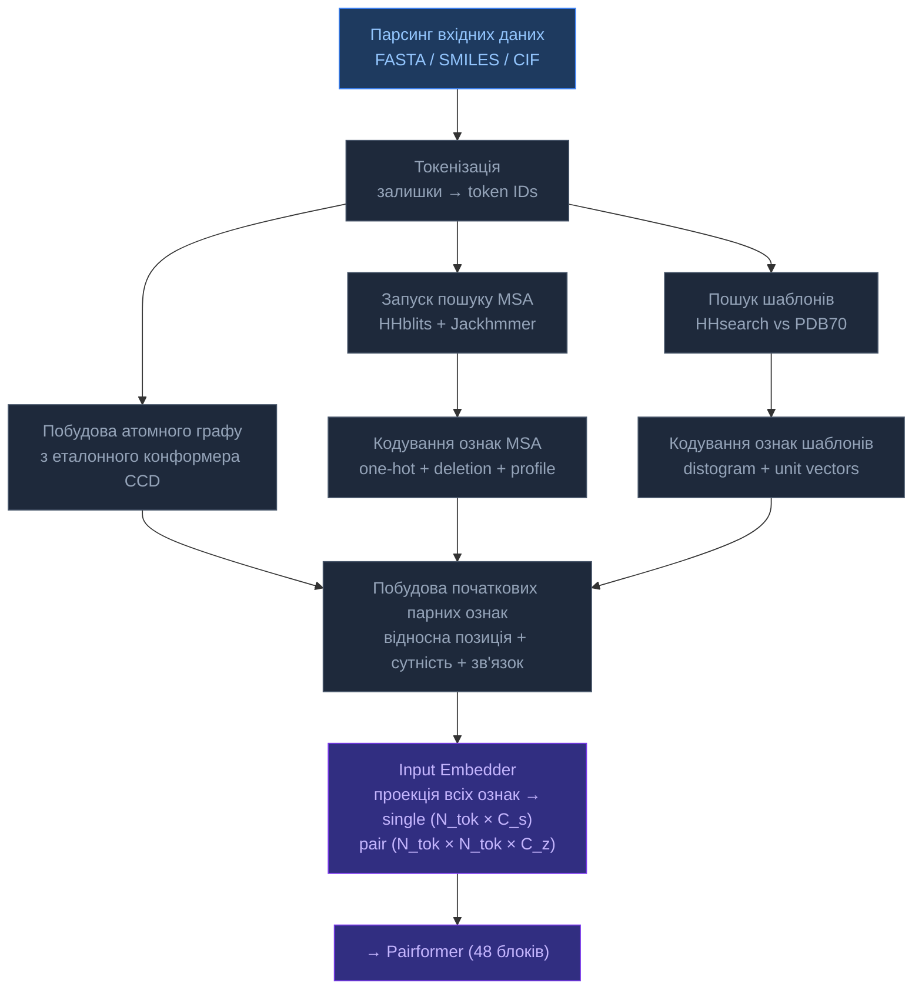

# 1.2.6. Featurization

[[UA/Головна]] > [[UA/1. AlphaFold3/1.2. Архітектура/1.2.1. Загальна архітектура AF3|Архітектура]]
🇬🇧 [[EN/1. AlphaFold3/1.2. Architecture/1.2.6. Featurization|English]]

> **Featurization** — процес перетворення сирих біологічних вхідних даних (послідовності, ліганди, шаблони, MSA) у числові тензорні представлення, з якими може працювати нейронна мережа AF3. Це перший і структурно найскладніший етап пайплайну.

---

## Загальний огляд: що входить, що виходить



---

## 1. Токенізація

AF3 використовує схему **токен на залишок / токен на атом ліганду** — на відміну від суто залишкового підходу AF2.

| Тип сутності | Гранулярність токена | Примітка |
|---|---|---|
| Стандартна амінокислота | 1 токен / залишок | 20 стандартних + unknown + gap = 22 типи |
| Модифікована амінокислота | 1 токен / залишок | Відображається на CCD або unknown |
| Нуклеотид РНК | 1 токен / нуклеотид | A, C, G, U + unknown |
| Нуклеотид ДНК | 1 токен / нуклеотид | DA, DC, DG, DT + unknown |
| Ліганд (мала молекула) | 1 токен / **важкий атом** | Кожен атом — окремий токен |
| Іон | 1 токен | Однатомна сутність |
| Вода | Виключена | Не моделюється явно |

---

## 2. Вхідні ознаки на токен

### 2.1 Ознаки послідовності

| Ознака | Розмір | Опис |
|---|---|---|
| `restype` | 32 | One-hot по типу залишку/нуклеотиду/атому |
| `token_index` | 1 | Ціла позиція в ланцюгу |
| `entity_id` | 1 | До якого ланцюга/сутності належить токен |
| `sym_id` | 1 | Індекс симетричної копії (для гомо-олігомерів) |
| `residue_index` | 1 | Номер залишку з послідовності |
| `is_protein` / `is_rna` / `is_dna` / `is_ligand` | 4 × 1 | Прапорці типу сутності |

### 2.2 Ознаки атомів (токен → атоми)

Кожен токен пов'язаний з **еталонним атомним фреймом** з CCD (Chemical Component Dictionary):

| Ознака | Опис |
|---|---|
| `ref_pos` | Ідеальні 3D координати атомів з CCD (Å) — визначають локальний фрейм |
| `ref_mask` | Які атоми присутні в цьому токені |
| `ref_element` | One-hot елемента (H, C, N, O, S, P, …) — 128 елементів |
| `ref_charge` | Формальний заряд кожного атома |
| `ref_atom_name_chars` | 4 one-hot символи назви атома (CA, CB, N, …) |

---

## 3. Ознаки MSA

Multiple Sequence Alignment надає **сигнал еволюційної коваріації**:



| Ознака | Розмір | Опис |
|---|---|---|
| `msa` | N_msa × N_tok × 32 | One-hot тип залишку для кожного рядка MSA |
| `has_deletion` | N_msa × N_tok × 1 | Бінарний: чи є gap після цієї позиції |
| `deletion_value` | N_msa × N_tok × 1 | Логарифмічна кількість делецій |
| `profile` | N_tok × 32 | Частота амінокислот по кожній позиції |
| `deletion_mean` | N_tok × 1 | Середня кількість делецій по позиції |

**Ключова відмінність AF3 від AF2:** MSA обробляється лише **4 блоками MSA стека** (проти 48 в Evoformer AF2). MSA збагачує початкове single representation, але не оновлює спільно pair representation протягом усього trunk.

---

## 4. Ознаки шаблонів

| Ознака | Розмір | Опис |
|---|---|---|
| `template_restype` | N_templ × N_tok × 32 | Тип залишку в шаблоні |
| `template_pseudo_beta_mask` | N_templ × N_tok × 1 | Маска для Cβ позицій |
| `template_backbone_frame_mask` | N_templ × N_tok × 1 | Прапорці валідних backbone фреймів |
| `template_distogram` | N_templ × N_tok × N_tok × 39 | Бінарні Cβ–Cβ відстані (2–22 Å, 38 бінів + far) |
| `template_unit_vector` | N_templ × N_tok × N_tok × 3 | Напрямок між атомами Cβ |
| `template_sequence_mask` | N_templ × N_tok × 1 | Вирівняні vs пропущені позиції |

---

## 5. Початкові парні ознаки

| Ознака | Розмір | Джерело |
|---|---|---|
| Відносне позиційне кодування | N_tok × N_tok × 64 | Обрізані різниці індексів залишків |
| Кодування сутності + ланцюга | N_tok × N_tok × C | Той самий ланцюг? Та сама сутність? |
| Бін відстані токенів | N_tok × N_tok × 39 | Бінована відстань по послідовності |
| Ознаки зв'язків | N_tok × N_tok × 1 | Чи два токени ковалентно зв'язані? |

---

## 6. Граф ковалентних зв'язків

AF3 явно кодує **ковалентні зв'язки** між атомами — критично для `ligand featurization`.

| Ознака | Опис |
|---|---|
| `bonds` | Розріджений список ребер: (atom_i, atom_j, bond_type) |
| Типи зв'язків | Одинарний, подвійний, потрійний, ароматичний |
| Джерело | CCD-визначення для стандартних залишків і лігандів |
| Міжланцюгові зв'язки | Дисульфідні містки, глікозидні зв'язки, координація металів |

---

## 7. Де AF3 розташовується серед ligand embedding methods

Ligand **featurization** в AF3 можна розглядати як одну з конкретних відповідей на ширшу задачу ligand embedding.

| Сімейство embeddings | Який об'єкт бачить модель | Яку інформацію добре зберігає | Типове обмеження |
|---|---|---|---|
| `Fingerprints` | один глобальний вектор молекули | наявність субструктур, дешевий retrieval | слабка геометрія і немає pocket context |
| `SMILES embeddings` | 1D послідовність токенів | мотиви рядка, масштабоване language-model pretraining | геометрія враховується лише опосередковано |
| `Graph embeddings` | граф атомів і зв'язків | локальну хімію, topology зв'язків | слабше працюють без 3D геометрії |
| `3D geometric embeddings` | конформер з координатами | відстані, стереохімію, pose constraints | залежать від якості конформера |
| `AF3 ligand featurization` | токени важких атомів + bond graph + pair features | тип атома, заряд, еталонні координати, ковалентний граф, biomolecular context | немає явного solvent або повного electronic-structure treatment |

Концептуально AF3 найближчий до **pocket-conditioned geometric graph representation**:

- атоми ліганду стають окремими токенами, а не одним глобальним вектором молекули;
- зберігаються тип атома, елемент, заряд, назви атомів і еталонні координати;
- ковалентна зв'язність передається через явний bond graph;
- ligand-токени взаємодіють із protein, RNA та DNA токенами через спільні pair features і той самий trunk.

Тому AF3 значно багатший за простий fingerprint або plain `SMILES` embedding, але все ще набагато легший за physics-based embedding methods на кшталт `QM/MM`, де активна область рахується на дорожчому рівні теорії всередині моделі оточення.

---

## Повний `Featurization` pipeline (покроково)



---

## 8. Як запустити `Featurization` (практично)

### 8.1 Підготовка вхідних даних

```python
# Мінімальний вхід: словник з описом кожного ланцюга
input_dict = {
    "sequences": [
        {
            "proteinChain": {
                "sequence": "MTEYKLVVVGAGGVGKSALTIQLIQNHFVDE",
                "count": 1
            }
        },
        {
            "ligand": {
                "ccdCodes": ["ATP"]   # або "smiles": "..."
            }
        }
    ]
}
```

Допустимі типи вхідних ланцюгів:

| Тип | Ключ | Формат |
|---|---|---|
| Білок | `proteinChain` | Однолітерна послідовність АК |
| РНК | `rnaSequence` | Послідовність A/C/G/U |
| ДНК | `dnaSequence` | Послідовність A/C/G/T |
| Ліганд (CCD) | `ligand` → `ccdCodes` | 3-літерний CCD код, напр. `ATP`, `HEM` |
| Ліганд (SMILES) | `ligand` → `smiles` | SMILES рядок |
| Іон | `ligand` → `ccdCodes` | напр. `MG`, `ZN`, `CA` |

### 8.2 Пошук MSA (локальний пайплайн)

```bash
# Крок 1: HHblits проти UniRef90
hhblits -i query.fasta \
        -d /databases/UniRef90 \
        -oa3m query_uniref90.a3m \
        -n 3 -e 0.001

# Крок 2: HHblits проти UniRef30 (дальні гомологи)
hhblits -i query.fasta \
        -d /databases/UniRef30 \
        -oa3m query_uniref30.a3m \
        -n 3 -e 0.001

# Крок 3: Jackhmmer проти UniProt
jackhmmer --noali --F1 0.0005 --F2 0.00005 --F3 0.0000005 \
          --incE 0.0001 -E 0.0001 --cpu 8 -N 1 \
          query.fasta /databases/uniprot_sprot.fasta \
          -A query_uniprot.sto
```

### 8.3 Пошук шаблонів

```bash
# Побудова HHM профілю з MSA
hhmake -i query_uniref90.a3m -o query.hhm

# Пошук у PDB70
hhsearch -i query.hhm \
         -d /databases/pdb70 \
         -o query_templates.hhr \
         -z 500 -b 500 -B 500 -Z 500
```

### 8.4 Розміри тензорів `Featurization`

Для комплексу: L_prot залишків білка + N_lig важких атомів ліганду → `N_tok = L_prot + N_lig`

| Тензор | Форма | dtype |
|---|---|---|
| `single` (після Input Embedder) | `N_tok × 384` | float32 |
| `pair` (після Input Embedder) | `N_tok × N_tok × 128` | float32 |
| `msa` | `N_msa × N_tok × 64` | float32 |
| `atom_positions` (еталон) | `N_atoms × 3` | float32 |
| `atom_mask` | `N_atoms` | bool |

---

## 9. Ключові відмінності від `Featurization` в AF2

| Аспект | AF2 | AF3 |
|---|---|---|
| Токен = | Залишок | Залишок **або** важкий атом ліганду |
| Кодування ліганду | Не підтримується | Еталонний конформер CCD + атомні ознаки |
| Блоки MSA у trunk | 48 (повний Evoformer) | 4 (окремий MSA модуль, потім відкидається) |
| Ознаки шаблонів | Distogram + торсійні кути | Distogram + unit vectors (без торсій) |
| Ознаки зв'язків | Неявні (через граф залишків) | Явний граф ковалентних зв'язків |
| Ознаки атомів | Через розширення торсійних кутів | На кожен атом: елемент, заряд, назва |
| Підтримка нуклеїнових кислот | Частково (AF2-Multimer) | Нативно: ДНК, РНК, модифіковані основи |

---

> Abramson et al. (2024). *Accurate structure prediction of biomolecular interactions with AlphaFold 3*. Nature, 630, 493–500.
> DOI: [10.1038/s41586-024-07487-w](https://doi.org/10.1038/s41586-024-07487-w)

---

## 10. `Featurization` на Python

Нижче — відтворення кроків `Featurization` в AF3 стандартними Python-бібліотеками. Корисно для розуміння пайплайну, побудови кастомного `preprocessing` або роботи з відкритими AF3-сумісними реалізаціями.

### 10.1 Встановлення залежностей

Усі функції `Featurization` у розділах 10 і 11 залежать від чотирьох бібліотек. `numpy` відповідає за всі тензорні операції. `rdkit` генерує 3D конформери для лігандів зі SMILES рядків. `gemmi` читає mmCIF та legacy PDB файли і надає доступ до CCD для зв'язків. `biopython` — опціональна залежність, яка використовується деякими MSA-обгортками.

```python
# pip install numpy biopython rdkit-pypi gemmi
import numpy as np
from rdkit import Chem
from rdkit.Chem import AllChem
import gemmi
```

### 10.2 Токенізація — білкова послідовність

AF3 представляє кожну амінокислоту як цілочисельний індекс із 22-символьного алфавіту: 20 стандартних залишків, невідомий символ `X` (індекс 20) та символ пропуску `-` (індекс 21). `tokenize_sequence` відображає сирий рядок на цей масив цілих чисел; `one_hot_sequence` розгортає його в матрицю `(L, 22)` float32, де кожен рядок має рівно одну `1.0`. Ця матриця є ознакою `protein_restype`, яка надходить до `Input Embedder` (вхідного ембеддера) AF3.

```python
RESTYPE_ORDER = {
    'A':0,'R':1,'N':2,'D':3,'C':4,'Q':5,'E':6,'G':7,'H':8,'I':9,
    'L':10,'K':11,'M':12,'F':13,'P':14,'S':15,'T':16,'W':17,'Y':18,
    'V':19,'X':20,'-':21,
}
NUM_RES_TYPES = 22

def tokenize_sequence(seq: str) -> np.ndarray:
    """
    Перетворює рядок білкової послідовності на масив цілочисельних токенів.

    Відображає кожен символ амінокислоти на індекс у RESTYPE_ORDER (0–19 для
    стандартних залишків, 20 для невідомого 'X', 21 для пропуску '-').
    Невідомі символи мовчки отримують індекс 20 ('X').

    Args:
        seq: Білкова послідовність в однолітерному коді.
             Регістронезалежна; будь-який символ не з RESTYPE_ORDER → 'X'.

    Returns:
        np.ndarray форми (L,) та dtype int32, де L = len(seq).

    Example:
        tokenize_sequence("ACD")  →  array([0, 4, 3], dtype=int32)
    """
    return np.array(
        [RESTYPE_ORDER.get(aa, RESTYPE_ORDER['X']) for aa in seq.upper()],
        dtype=np.int32
    )

def one_hot_sequence(seq: str) -> np.ndarray:
    """
    One-hot кодує білкову послідовність за 22-типовим алфавітом AF3.

    Викликає tokenize_sequence, потім розміщує 1.0 у позиції
    [position, token_index] у нульовій матриці (L, 22).
    Кодування сумісне з вхідною ознакою 'restype' AF3.

    Args:
        seq: Рядок білкової послідовності (будь-який регістр).

    Returns:
        np.ndarray форми (L, 22) та dtype float32.
        Стовпці 0–19: стандартні амінокислоти (порядок як у RESTYPE_ORDER).
        Стовпець 20: невідомий / нестандартний залишок ('X').
        Стовпець 21: символ пропуску ('-').

    Example:
        one_hot_sequence("AG")
        → array([[1,0,...,0],   # A на позиції 0
                 [0,0,...,0,1,...]], shape=(2,22))
    """
    tokens = tokenize_sequence(seq)
    oh = np.zeros((len(tokens), NUM_RES_TYPES), dtype=np.float32)
    oh[np.arange(len(tokens)), tokens] = 1.0
    return oh

seq = "MTEYKLVVVGAGGVGKSALTIQLIQNHFVDE"
print(one_hot_sequence(seq).shape)   # (31, 22)
```

### 10.3 Токенізація — атоми ліганду зі SMILES

На відміну від залишків, атоми ліганду не відображаються на фіксований алфавіт — вони описуються типом елемента, формальним зарядом і 3D позицією. AF3 призначає один токен на кожен важкий атом, тому ліганд з N важкими атомами вносить N токенів у повну токенну послідовність. Еталонна 3D геометрія береться з MMFF94-мінімізованого конформера, згенерованого RDKit (відповідає ідеальному конформеру CCD для стандартних залишків). Зв'язність кодується як неспрямований список ребер у форматі COO, де кожен зв'язок зберігається в обох напрямках.

```python
ELEMENT_ORDER = {
    'H':0,'C':1,'N':2,'O':3,'S':4,'P':5,
    'F':6,'Cl':7,'Br':8,'I':9,'other':10
}

def tokenize_ligand(smiles: str) -> dict:
    """
    Перетворює SMILES рядок на ознаки важких атомів для AF3.

    Пайплайн:
        1. Парсинг SMILES через RDKit → об'єкт RWMol.
        2. Додавання явних водневих атомів (потрібно для 3D embed).
        3. Embed через ETKDGv3 (дистанційна геометрія) для початкових 3D координат.
        4. Мінімізація силовим полем MMFF94 для отримання еталонного конформера
           (відповідає ідеальному конформеру CCD у стандартних залишках AF3).
        5. Видалення водневих атомів — AF3 феатуризує лише важкі атоми.
        6. Збір елемента, заряду та 3D позиції кожного атома;
           побудова неспрямованого COO-графу зв'язків.

    Кодування типів зв'язків:
        1 = одинарний, 2 = подвійний, 3 = потрійний, 4 = ароматичний.
    Кожен зв'язок зберігається в обох напрямках.

    Args:
        smiles: Коректний SMILES рядок (ізомерна та ароматична нотація підтримуються).

    Returns:
        dict з ключами:
            'atom_elements' : (N,)      int32   — індекс ELEMENT_ORDER на атом.
            'atom_charges'  : (N,)      int32   — формальний заряд на атом.
            'ref_pos'       : (N, 3)    float32 — MMFF-оптимізовані координати (Å).
            'bond_index'    : (2, 2*B)  int64   — список ребер COO, неспрямований.
            'bond_type'     : (2*B,)    int32   — тип зв'язку для кожного ребра.
        де N = кількість важких атомів, B = кількість зв'язків.

    Raises:
        ValueError: Якщо RDKit не може розпарсити SMILES рядок.
        RuntimeError: Якщо 3D embed провалюється.

    Example:
        feats = tokenize_ligand("c1ccccc1")   # бензол
        feats['ref_pos'].shape    # (6, 3)
        feats['bond_index'].shape # (2, 12)
    """
    mol = Chem.MolFromSmiles(smiles)
    mol = Chem.AddHs(mol)
    AllChem.EmbedMolecule(mol, AllChem.ETKDGv3())
    AllChem.MMFFOptimizeMolecule(mol)
    mol = Chem.RemoveHs(mol)          # лише важкі атоми

    conf = mol.GetConformer()
    elements, charges, positions = [], [], []
    for atom in mol.GetAtoms():
        elements.append(ELEMENT_ORDER.get(atom.GetSymbol(), 10))
        charges.append(atom.GetFormalCharge())
        p = conf.GetAtomPosition(atom.GetIdx())
        positions.append([p.x, p.y, p.z])

    bond_type_map = {
        Chem.rdchem.BondType.SINGLE: 1, Chem.rdchem.BondType.DOUBLE: 2,
        Chem.rdchem.BondType.TRIPLE: 3, Chem.rdchem.BondType.AROMATIC: 4,
    }
    src, dst, btypes = [], [], []
    for bond in mol.GetBonds():
        i, j = bond.GetBeginAtomIdx(), bond.GetEndAtomIdx()
        bt = bond_type_map.get(bond.GetBondType(), 1)
        src += [i, j]; dst += [j, i]; btypes += [bt, bt]

    return {
        'atom_elements': np.array(elements,  dtype=np.int32),
        'atom_charges':  np.array(charges,   dtype=np.int32),
        'ref_pos':       np.array(positions, dtype=np.float32),
        'bond_index':    np.array([src, dst], dtype=np.int64),
        'bond_type':     np.array(btypes,    dtype=np.int32),
    }

atp_smiles = "c1nc(c2c(n1)n(cn2)[C@@H]3[C@@H]([C@@H]([C@H](O3)COP(=O)(O)OP(=O)(O)OP(=O)(O)O)O)O)N"
lig = tokenize_ligand(atp_smiles)
print(lig['ref_pos'].shape)    # (N_важких_атомів, 3)
print(lig['bond_index'].shape) # (2, N_зв'язків * 2)
```

### 10.4 Парсинг MSA — формат A3M

A3M файл — це FASTA-варіант, що генерується `HHblits` або `Jackhmmer`. Великі літери та `-` позначають вирівняні колонки, що відповідають токенним позиціям `query`. Малі літери позначають інсерції — залишки, присутні в гомолозі, але відсутні в `query` — вони виключаються з токенного представлення. Натомість їх кількість накопичується та зберігається як `log`-масштабована ознака `deletion_value` для наступної вирівняної позиції. `parse_a3m` зчитує сирий файл, зберігаючи регістр; `encode_msa` виконує посимвольне декодування, доповнює рядки до `query_len`, `one-hot` кодує результат і обчислює `profile` усередненням по всіх рядках MSA.

```python
def parse_a3m(path: str) -> tuple[list[str], list[str]]:
    """
    Парсить файл вирівнювання множинних послідовностей у форматі A3M.

    Формат A3M — варіант FASTA де:
        - Великі літери та '-' — вирівняні (токенні) колонки.
        - Малі літери — інсерції відносно query-послідовності,
          які не відповідають жодній токенній позиції query.

    Функція зберігає великий і малий регістр, щоб encode_msa()
    могла розрізняти інсерції та вирівняні позиції.

    Args:
        path: Шлях до .a3m файлу, згенерованого HHblits або Jackhmmer.

    Returns:
        Кортеж (names, sequences) де:
            names     : list[str] — заголовки FASTA (без '>').
            sequences : list[str] — рядки послідовностей (змішаний регістр).
        Обидва списки однакової довжини; індекс 0 завжди є query.

    Notes:
        - Багаторядкові послідовності конкатенуються автоматично.
        - Порожні рядки ігноруються.
        - Функція НЕ видаляє малолітерні інсерції; передайте вивід
          до encode_msa() для цього кроку.
    """
    names, seqs, name, buf = [], [], None, []
    with open(path) as fh:
        for line in fh:
            line = line.rstrip()
            if line.startswith('>'):
                if name is not None:
                    seqs.append(''.join(buf))
                name = line[1:]; names.append(name); buf = []
            else:
                buf.append(line)
    if name is not None:
        seqs.append(''.join(buf))
    return names, seqs

def encode_msa(seqs: list[str], query_len: int) -> dict:
    """
    Кодує послідовності A3M MSA у числові тензори ознак стилю AF3.

    Для кожної послідовності функція:
        1. Ітерує посимвольно.
        2. Пропускає малі літери (інсерції), накопичуючи лічильник
           'pending' для наступної вирівняної позиції.
        3. Для '-' (делеція): додає токен 21, has_deletion=1,
           записує log1p(pending) як deletion_value.
        4. Для великих літер: додає індекс RESTYPE_ORDER,
           has_deletion=0, записує log1p(pending).
        5. Доповнює або обрізає кожен рядок до query_len позицій.

    Перетворення log1p стискує кількість делецій в обмежений діапазон,
    зберігаючи різницю між 0 та >0 делеціями.

    Args:
        seqs:      Список сирих A3M послідовностей з parse_a3m().
                   Індекс 0 має бути query (лише великі літери, без '-').
        query_len: Кількість токенних позицій у query-послідовності.
                   Всі вихідні масиви доповнюються/обрізаються до цієї довжини.

    Returns:
        dict з ключами:
            'msa'            : (N, L, 22)  float32 — one-hot тип залишку.
            'has_deletion'   : (N, L)      int32   — 1 якщо делеція передує позиції.
            'deletion_value' : (N, L)      float32 — log1p(кількість делецій).
            'profile'        : (L, 22)     float32 — середнє one-hot по N рядках.
        де N = len(seqs), L = query_len.

    Notes:
        - Послідовності довші за query_len мовчки обрізаються.
        - Для уникнення OOM обмежте вхід до ~2048 послідовностей.
    """
    msa_t, has_d, del_v = [], [], []
    for seq in seqs:
        tokens, h_del, d_val, pending = [], [], [], 0
        for ch in seq:
            if ch.islower():
                pending += 1
            elif ch == '-':
                tokens.append(21); h_del.append(1)
                d_val.append(float(np.log1p(pending))); pending = 0
            else:
                tokens.append(RESTYPE_ORDER.get(ch.upper(), 20))
                h_del.append(0)
                d_val.append(float(np.log1p(pending))); pending = 0
        pad = query_len - len(tokens)
        tokens  = (tokens  + [21]  * max(pad, 0))[:query_len]
        h_del   = (h_del   + [0]   * max(pad, 0))[:query_len]
        d_val   = (d_val   + [0.0] * max(pad, 0))[:query_len]
        msa_t.append(tokens); has_d.append(h_del); del_v.append(d_val)

    msa_arr = np.array(msa_t, dtype=np.int32)
    oh = np.zeros((*msa_arr.shape, NUM_RES_TYPES), dtype=np.float32)
    oh[np.arange(msa_arr.shape[0])[:, None],
       np.arange(query_len)[None, :],
       msa_arr] = 1.0

    return {
        'msa':            oh,
        'has_deletion':   np.array(has_d, dtype=np.int32),
        'deletion_value': np.array(del_v, dtype=np.float32),
        'profile':        oh.mean(axis=0),
    }

# Використання:
# names, seqs = parse_a3m("query.a3m")
# msa_feats   = encode_msa(seqs[:2048], query_len=31)
```

### 10.5 Ознаки шаблонів — Cβ дистограма

Дистограма — це `one-hot`-кодована матриця попарних відстаней. Для кожної пари залишків `(i, j)` обчислюється евклідова відстань Cβ–Cβ і розміщується в один із 38 рівномірних бінів від 2 до 22 Å, плюс бін переповнення для пар далі 22 Å — 39 каналів загалом. Це основний геометричний сигнал, який `Template Embedder` (ембеддер шаблонів) AF3 використовує для внесення структурних знань шаблону в початкове `pair representation` (парне представлення). `get_cb_positions` витягує координати зі структури, використовуючи Cα як `fallback` (резервний варіант) для гліцину і `NaN` для залишків, відсутніх у моделі.

```python
def get_cb_positions(cif_path: str, chain_id: str = 'A') -> np.ndarray:
    """
    Витягує координати Cβ (або Cα для гліцину) з mmCIF/PDB структури.

    Cβ є стандартним псевдоатомом для представлення позиції залишку у
    ознаках шаблону AF3, бо відображає напрям бічного ланцюга без
    необхідності повних координат бічного ланцюга. Гліцин не має Cβ,
    тому використовується Cα — та сама конвенція, що й в AF2/AF3.

    Для кожного залишку полімерного ланцюга функція намагається:
        1. Атом 'CB' (всі залишки, крім Gly).
        2. Атом 'CA' (fallback для Gly та будь-якого залишку без CB).
        3. Якщо ні того ні іншого: вставляє рядок [NaN, NaN, NaN].

    Args:
        cif_path: Шлях до mmCIF або legacy PDB файлу (gemmi підтримує обидва).
        chain_id: Однолітерний ідентифікатор ланцюга (за замовчуванням 'A').

    Returns:
        np.ndarray форми (L, 3) та dtype float32, де L — кількість
        полімерних залишків у вказаному ланцюзі.
        Рядки з відсутніми атомами містять np.nan в усіх трьох координатах.

    Notes:
        - NaN рядки передаються в cb_distogram() та backbone_unit_vectors()
          як замасковані (нульові) пари.
        - Ітерація через get_polymer() автоматично виключає воду та HETATM.
    """
    st = gemmi.read_structure(cif_path)
    positions = []
    for res in st[0][chain_id]:
        atom = res.find_atom('CB', '\0') or res.find_atom('CA', '\0')
        if atom:
            p = atom.pos
            positions.append([p.x, p.y, p.z])
        else:
            positions.append([np.nan, np.nan, np.nan])
    return np.array(positions, dtype=np.float32)

def cb_distogram(cb_pos: np.ndarray,
                 min_d: float = 2.0,
                 max_d: float = 22.0,
                 n_bins: int = 38) -> np.ndarray:
    """
    Обчислює one-hot бінову матрицю відстаней Cβ–Cβ (ознака шаблону AF3).

    Відстані бінуються в n_bins рівномірних бінів у діапазоні [min_d, max_d]
    плюс один бін переповнення для пар далі max_d ('far' бін).
    Це відповідає 38 бінам відстаней від 2 до 22 Å у статті AF3,
    загалом 39 каналів.

    Args:
        cb_pos: (L, 3) float32 масив Cβ/Cα позицій з get_cb_positions().
                Рядки NaN = відсутні залишки.
        min_d:  Нижня межа першого біну в Å (за замовчуванням 2.0).
        max_d:  Верхня межа останнього регулярного біну в Å (за замовчуванням 22.0).
        n_bins: Кількість регулярних бінів відстаней (за замовчуванням 38).
                Загальна кількість каналів виводу = n_bins + 1.

    Returns:
        np.ndarray форми (L, L, n_bins+1) та dtype float32.
        distogram[i, j, k] = 1.0 якщо Cβ–Cβ відстань між залишками i та j
        потрапляє до біну k, інакше 0.0.
        Пари з NaN залишком повністю обнуляються.

    Notes:
        - Отримана дистограма є симетричною: dg[i,j] == dg[j,i].
        - Власні пари (i == j, відстань = 0) потрапляють до біну 0.
    """
    diff = cb_pos[:, None] - cb_pos[None, :]
    dist = np.sqrt(np.nansum(diff**2, axis=-1))
    bins = np.linspace(min_d, max_d, n_bins + 1)
    idx  = np.clip(np.digitize(dist, bins) - 1, 0, n_bins)
    L    = len(cb_pos)
    dg   = np.zeros((L, L, n_bins + 1), dtype=np.float32)
    dg[np.arange(L)[:, None], np.arange(L)[None, :], idx] = 1.0
    dg[np.isnan(dist)] = 0.0
    return dg   # (L, L, 39)
```

### 10.6 Початкові парні ознаки — відносне позиційне кодування

`Pair representation` (парне представлення) — це тензор `(L, L, C_z)`, що фіксує попарні стосунки між кожною комбінацією токенів. Одна з його початкових компонент — відносне позиційне кодування: для кожної пари `(i, j)` різниця індексів `i − j` обрізається до `[−max_rel, +max_rel]` і `one-hot` кодується. Це дає моделі трансляційно-інваріантне відчуття близькості в послідовності без абсолютних позицій. Пари, розділені більш ніж `max_rel` позиціями, потрапляють до одного граничного біну — модель дізнається, що велика відстань у послідовності є єдиною категорією. Для гетерогенних вхідних даних (білкові залишки + атоми ліганду) токени ліганду отримують великі `sentinel`-індекси (спеціальні службові індекси), тому пари білок–ліганд завжди потрапляють до граничного біну.

```python
def relative_position_encoding(seq_len: int,
                                max_rel: int = 32) -> np.ndarray:
    """
    Будує відносне позиційне кодування AF3 для початкового pair representation.

    Обчислює знакову різницю між кожною парою індексів залишків,
    обрізає до [-max_rel, max_rel], потім one-hot кодує результат
    у 2*max_rel+1 бінів. Це дає моделі трансляційно-інваріантне відчуття
    відстані за послідовністю без абсолютних позицій.

    Пари, розділені більш ніж max_rel позиціями, відображаються на той
    самий граничний бін — модель дізнається, що 'далеко в послідовності'
    є однією категорією.

    Args:
        seq_len: Загальна кількість токенів L (залишки + важкі атоми ліганду).
        max_rel: Половинна ширина вікна обрізання (за замовчуванням 32, як у AF3).
                 Вивід має 2*max_rel+1 каналів.

    Returns:
        np.ndarray форми (L, L, 2*max_rel+1) та dtype float32.
        rel_pos[i, j, k] = 1.0 якщо clip(i-j, -max_rel, max_rel)+max_rel == k.

    Example:
        rpe = relative_position_encoding(seq_len=5, max_rel=2)
        # rpe.shape == (5, 5, 5)
        # rpe[0, 0] == [0, 0, 1, 0, 0]  (diff=0, центральний бін)
        # rpe[0, 4] == [1, 0, 0, 0, 0]  (diff=-4, обрізано до -2, бін 0)
    """
    idx  = np.arange(seq_len)
    diff = np.clip(idx[:, None] - idx[None, :], -max_rel, max_rel)
    diff += max_rel
    n_bins = 2 * max_rel + 1
    oh = np.zeros((seq_len, seq_len, n_bins), dtype=np.float32)
    oh[np.arange(seq_len)[:, None],
       np.arange(seq_len)[None, :],
       diff] = 1.0
    return oh   # (31, 31, 65) при seq_len=31, max_rel=32
```

### 10.7 Повний словник ознак — збираємо разом

`build_feature_dict` — єдина точка входу, яка з'єднує всі попередні функції. Вона завжди генерує ознаки послідовності та відносного позиційного кодування. Три опціональні вхідні дані — SMILES ліганду, шлях до A3M з MSA, шлях до `mmCIF` шаблону — обробляються лише якщо надані, тому можна вільно комбінувати їх у будь-якому порядку. Повернутий плаский словник відображає назви ознак безпосередньо на `numpy` масиви, відтворюючи тензорний словник, який AF3 `Input Embedder` (вхідний ембеддер) отримує на вхід. Зверніть увагу: токени атомів ліганду тут ще не конкатенуються з токенами білка — ця конкатенація відбувається всередині `Input Embedder`.

```python
def build_feature_dict(
    protein_seq:       str,
    ligand_smiles:     str | None = None,
    msa_a3m_path:      str | None = None,
    template_cif_path: str | None = None,
) -> dict:
    """
    Збирає повний AF3-сумісний словник ознак із сирих вхідних даних.

    Головна точка входу пайплайну розділу 10. Викликає всі функції
    нижнього рівня по порядку і об'єднує їх виводи в єдиний плаский
    словник, що відтворює структуру тензорного словника, який передається
    до AF3 `Input Embedder` (вхідного ембеддера).

    Args:
        protein_seq:       Рядок білкової послідовності (обов'язково).
        ligand_smiles:     SMILES рядок для малої молекули ліганду.
                           None → ознаки ліганду не додаються.
        msa_a3m_path:      Шлях до A3M файлу від HHblits/Jackhmmer.
                           None → MSA ознаки відсутні (режим no_msa).
        template_cif_path: Шлях до mmCIF/PDB шаблонної структури.
                           None → дистограма шаблону відсутня.

    Returns:
        dict з підмножиною наступних ключів залежно від вхідних даних:
            'protein_restype'       : (L, 22)      float32
            'rel_pos_encoding'      : (L, L, 65)   float32
            'ligand_atom_elements'  : (N_lig,)      int32    ← якщо ліганд задано
            'ligand_atom_charges'   : (N_lig,)      int32    ← якщо ліганд задано
            'ligand_ref_pos'        : (N_lig, 3)    float32  ← якщо ліганд задано
            'ligand_bond_index'     : (2, 2*B)      int64    ← якщо ліганд задано
            'ligand_bond_type'      : (2*B,)        int32    ← якщо ліганд задано
            'msa'                   : (N, L, 22)    float32  ← якщо MSA задано
            'has_deletion'          : (N, L)        int32    ← якщо MSA задано
            'deletion_value'        : (N, L)        float32  ← якщо MSA задано
            'profile'               : (L, 22)       float32  ← якщо MSA задано
            'template_distogram'    : (L, L, 39)    float32  ← якщо шаблон задано

    Notes:
        - L = len(protein_seq). Атоми ліганду НЕ включені до L тут;
          конкатенація N_tok = L + N_lig відбувається всередині Input Embedder.
        - MSA обмежується до 2048 рядків внутрішньо.
    """
    feats = {}
    L = len(protein_seq)

    # 1. One-hot білка + відносне позиційне кодування
    feats['protein_restype']  = one_hot_sequence(protein_seq)   # (L, 22)
    feats['rel_pos_encoding'] = relative_position_encoding(L)   # (L, L, 65)

    # 2. Ознаки атомів ліганду
    if ligand_smiles:
        lig = tokenize_ligand(ligand_smiles)
        feats.update({f'ligand_{k}': v for k, v in lig.items()})

    # 3. MSA ознаки
    if msa_a3m_path:
        names, seqs = parse_a3m(msa_a3m_path)
        feats.update(encode_msa(seqs[:2048], L))

    # 4. Дистограма шаблону
    if template_cif_path:
        cb = get_cb_positions(template_cif_path)
        feats['template_distogram'] = cb_distogram(cb)   # (L, L, 39)

    return feats


# Демо (без MSA/шаблону)
feats = build_feature_dict(
    protein_seq   = "MTEYKLVVVGAGGVGKSALTIQLIQNHFVDE",
    ligand_smiles = "c1ccc(cc1)C(=O)O",   # бензойна кислота
)
for k, v in feats.items():
    shape = v.shape if hasattr(v, 'shape') else type(v).__name__
    print(f"  {k:<35s} {shape}")
# protein_restype                     (31, 22)
# rel_pos_encoding                    (31, 31, 65)
# ligand_atom_elements                (7,)
# ligand_ref_pos                      (7, 3)
# ligand_bond_index                   (2, 14)
```

---

## 11. `Featurization` лише з FASTA та mmCIF

### 11.0 Що можливо без пошуку MSA?

FASTA дає послідовність; mmCIF дає експериментальні (або передбачені) 3D координати. Разом вони покривають **усі кроки `Featurization`, крім еволюційного MSA**.

| Група ознак | Лише FASTA | FASTA + mmCIF | Потребує MSA |
|---|---|---|---|
| One-hot послідовності (`restype`) | ✅ | ✅ | — |
| Відносне позиційне кодування | ✅ | ✅ | — |
| Метадані токена/сутності | ✅ | ✅ | — |
| Ознаки атомів ліганду + граф зв'язків | ✅ (якщо є SMILES) | ✅ (з HETATM) | — |
| Cβ дистограма (шаблон) | ❌ | ✅ | — |
| Unit vectors backbone | ❌ | ✅ | — |
| pLDDT (якщо AlphaFoldDB) | ❌ | ✅ | — |
| MSA профіль + коеволюційний сигнал | ❌ | ❌ | ✅ HHblits/Jackhmmer |
| `has_deletion` / `deletion_value` | ❌ | ❌ | ✅ |

**AF3 server підтримує режим `no_msa`** — подача послідовності без MSA коректна і модель деградує плавно (нижча точність для «сирітських» білків, прийнятна для добре вивчених цілей з хорошими шаблонами).

---

### 11.1 Парсинг FASTA

`parse_fasta` навмисно мінімалістична: обробляє всі поширені варіанти FASTA (один запис, multi-запис, багаторядкові послідовності) без валідації символів залишків. Нестандартні символи передаються без змін і мовчки відображаються на невідомий токен `X` під час токенізації. Функція повертає список пар `(header, sequence)`, щоб викликач сам обирав який запис обробляти — за угодою першим завжди є query.

```python
from pathlib import Path

def parse_fasta(path: str) -> list[tuple[str, str]]:
    """
    Парсить FASTA або multi-FASTA файл у пари (header, sequence).

    Обробляє найпоширеніші варіанти FASTA:
        - Однозаписові файли.
        - Multi-запис файли (один запис на рядок '>header').
        - Багаторядкові послідовності (рядки конкатенуються на запис).
        - Порожні рядки між записами (ігноруються).
        - Змішаний регістр (послідовність конвертується у верхній).

    Args:
        path: Абсолютний або відносний шлях до FASTA файлу (UTF-8 текст).

    Returns:
        list пар (header, sequence) де:
            header   : str — все після '>' на рядку заголовку,
                       без початкових/кінцевих пробілів.
            sequence : str — конкатенована послідовність у верхньому регістрі,
                       без пробілів.
        Повертає порожній список якщо файл не містить записів.

    Notes:
        - Не валідує символи послідовності; нестандартні символи
          зберігаються і відображаться на 'X' при токенізації.
        - Рядки заголовку можуть містити довільні метадані
          (формат UniProt, NCBI тощо) — повертається лише сирий рядок.

    Example:
        records = parse_fasta("query.fasta")
        header, seq = records[0]
        # header → "sp|P01116|RASK_HUMAN KRAS ..."
        # seq    → "MTEYKLVVVGAGGVGKSALT..."
    """
    records = []
    header, buf = None, []
    for line in Path(path).read_text().splitlines():
        line = line.strip()
        if not line:
            continue
        if line.startswith('>'):
            if header is not None:
                records.append((header, ''.join(buf)))
            header, buf = line[1:], []
        else:
            buf.append(line.upper())
    if header is not None:
        records.append((header, ''.join(buf)))
    return records

# Приклад
records = parse_fasta("query.fasta")
for header, seq in records:
    print(f">{header}  len={len(seq)}")
    print(f"  {seq[:60]}{'...' if len(seq) > 60 else ''}")
```

---

### 11.2 Витягнути послідовність з mmCIF (перевірка відповідності FASTA)

Перед побудовою ознак шаблону важливо переконатися, що послідовність у `mmCIF` збігається з `FASTA`. Невідповідності трапляються часто: кристалічні структури нерідко пропускають невпорядковані петлі, що є в канонічній послідовності, а рекомбінантні конструкції можуть містити теги експресії, відсутні в канонічному записі. `sequence_from_mmcif` спочатку читає таблицю `_entity_poly`, яка зберігає повну канонічну послідовність включно з відсутніми залишками. Якщо пошук не вдається, функція перебирає змодельовані залишки як `fallback` (резервний варіант). Перехресна перевірка виявляє невідповідності заздалегідь, ще до того як виникне потреба в доповненні або обрізанні нижче за потоком.

```python
import gemmi

def sequence_from_mmcif(cif_path: str, chain_id: str = 'A') -> str:
    """
    Витягує канонічну однолітерну послідовність амінокислот з mmCIF файлу.

    Двоетапна стратегія:
        1. Основний шлях: читає таблицю '_entity_poly' яка містить повну
           канонічну послідовність включно з залишками, відсутніми в моделі
           (невпорядковані ділянки, теги експресії тощо). Це авторитетна
           послідовність, що має збігатися з відповідним записом UniProt/FASTA.
        2. `Fallback` (резервний шлях): якщо підходящий полімерний `entity` не знайдений, ітерує
           по залишках моделі у вказаному ланцюзі та відображає трилітерні
           коди через базу gemmi. Нестандартні залишки → 'X'.

    Args:
        cif_path: Шлях до mmCIF файлу (legacy PDB також підтримується gemmi).
        chain_id: Однолітерний ідентифікатор ланцюга для `fallback`-шляху.
                  Ігнорується якщо основний шлях успішний.

    Returns:
        str — однолітерна амінокислотна послідовність.
        Нестандартні залишки представлені як 'X'.
        Довжина дорівнює повній канонічній послідовності (основний шлях)
        або кількості змодельованих залишків (`fallback`-шлях).

    Notes:
        - Використовуйте цю функцію для перехресної перевірки довжини
          послідовності перед побудовою ознак шаблону.
        - Невідповідність зазвичай вказує на відсутню густину (петлі)
          або усічену конструкцію.
    """
    st = gemmi.read_structure(cif_path)

    # Пріоритет: повна послідовність з заголовку mmCIF
    for entity in st.entities:
        if entity.entity_type == gemmi.EntityType.Polymer:
            if entity.polymer_type in (
                gemmi.PolymerType.PeptideL,
                gemmi.PolymerType.PeptideD,
            ):
                return ''.join(
                    gemmi.Entity.first_conformer_sequence(entity)
                )

    # Fallback: реконструкція з моделі
    chain = st[0][chain_id]
    seq = []
    for res in chain.get_polymer():
        one = gemmi.find_tabulated_residue(res.name).one_letter_code
        seq.append(one if one != ' ' else 'X')
    return ''.join(seq)

# Перевірка відповідності
_, fasta_seq = parse_fasta("query.fasta")[0]
mmcif_seq    = sequence_from_mmcif("structure.cif", chain_id="A")

if fasta_seq == mmcif_seq:
    print("✅ FASTA та mmCIF послідовності збігаються")
else:
    print(f"⚠️  Невідповідність: FASTA={len(fasta_seq)}, mmCIF={len(mmcif_seq)}")
```

---

### 11.3 Витягнути ознаки атомів із mmCIF

Якщо ліганд присутній у mmCIF як HETATM запис, окремий SMILES рядок не потрібен — усі координати атомів, типи елементів та формальні заряди вже є у файлі. `extract_ligand_features_from_mmcif` обробляє HETATM залишки: пропускає воду, збирає важкі атоми та намагається знайти граф зв'язків у CCD через gemmi. Якщо CCD запис не знайдений (наприклад, для пропрієтарного або нестандартного ліганду), функція все одно повертає координати та ознаки атомів — граф зв'язків просто залишається порожнім, а не генерує виключення.

Замінює крок пошуку в CCD: позиції атомів, елементи, заряди та зв'язки беруться безпосередньо з файлу структури.

```python
import numpy as np
import gemmi

def extract_ligand_features_from_mmcif(cif_path: str) -> list[dict]:
    """
    Витягує ознаки лігандів (HETATM / не-полімер) з mmCIF файлу.

    Ітерує по всіх ланцюгах і залишках першої моделі, відбираючи
    сутності типу NonPolymer. Молекули води (HOH/WAT/H2O) пропускаються.
    Водневі атоми виключаються — AF3 феатуризує лише важкі атоми.

    Для кожного залишку ліганду намагається знайти зв'язність у CCD
    (Chemical Component Dictionary), вбудованому в бібліотеку gemmi.
    Якщо CCD запис не знайдений (нестандартні або пропрієтарні ліганди),
    координати та ознаки атомів все одно повертаються, але
    bond_index/bond_type будуть порожніми масивами.

    Типи зв'язків з CCD value_order:
        SING → 1, DOUB → 2, TRIP → 3, AROM / DELOC → 4.
    Кожен зв'язок зберігається в обох напрямках (неспрямований COO формат).

    Args:
        cif_path: Шлях до mmCIF або legacy PDB файлу.

    Returns:
        list словників, по одному на кожен не-водний залишок ліганду:
            'ccd_code'      : str            — 3-літерна CCD назва залишку.
            'ref_pos'       : (N, 3) float32 — координати важких атомів (Å).
            'atom_elements' : (N,)   int32   — індекс ELEMENT_ORDER на атом.
            'atom_charges'  : (N,)   int32   — формальний заряд на атом.
            'bond_index'    : (2, 2*B) int64 — неспрямований список ребер COO.
            'bond_type'     : (2*B,) int32   — тип зв'язку для кожного ребра.
        де N = важкі атоми, B = зв'язки. Повертає [] якщо лігандів немає.

    Notes:
        - Кілька копій того самого ліганду (напр. два ATP) дають окремі записи.
        - Координати беруться зі спостережуваної структури, а не з ідеального
          конформера CCD — це забезпечує реалістичнішу початкову геометрію.
    """
    ELEMENT_ORDER = {
        'H':0,'C':1,'N':2,'O':3,'S':4,'P':5,
        'F':6,'CL':7,'BR':8,'I':9
    }
    BOND_ORDER_MAP = {
        gemmi.BondType.Single:   1,
        gemmi.BondType.Double:   2,
        gemmi.BondType.Triple:   3,
        gemmi.BondType.Aromatic: 4,
        gemmi.BondType.Deloc:    4,
    }

    st, results = gemmi.read_structure(cif_path), []

    for chain in st[0]:
        for res in chain:
            if res.entity_type != gemmi.EntityType.NonPolymer:
                continue
            if res.name in ('HOH', 'WAT', 'H2O'):
                continue

            heavy = [a for a in res if a.element != gemmi.Element('H')]
            if not heavy:
                continue

            positions, elements, charges = [], [], []
            name_to_idx = {}
            for i, atom in enumerate(heavy):
                el = atom.element.name.upper()
                elements.append(ELEMENT_ORDER.get(el, 10))
                charges.append(int(atom.charge))
                p = atom.pos
                positions.append([p.x, p.y, p.z])
                name_to_idx[atom.name] = i

            src, dst, btypes = [], [], []
            try:
                ccd = gemmi.cif.read(
                    gemmi.expand_if_pdbid(res.name)
                ).find_block(res.name)
                if ccd:
                    for row in ccd.find('_chem_comp_bond.',
                                        ['atom_id_1','atom_id_2','value_order']):
                        a1, a2, order = row[0], row[1], row[2].upper()
                        if a1 in name_to_idx and a2 in name_to_idx:
                            i, j = name_to_idx[a1], name_to_idx[a2]
                            bt = {'SING':1,'DOUB':2,'TRIP':3,'AROM':4}.get(order,1)
                            src += [i,j]; dst += [j,i]; btypes += [bt,bt]
            except Exception:
                pass   # невідомий ліганд — зв'язки пропускаємо

            results.append({
                'ccd_code':      res.name,
                'ref_pos':       np.array(positions, dtype=np.float32),
                'atom_elements': np.array(elements,  dtype=np.int32),
                'atom_charges':  np.array(charges,   dtype=np.int32),
                'bond_index':    np.array([src,dst],dtype=np.int64)
                                 if src else np.zeros((2,0),dtype=np.int64),
                'bond_type':     np.array(btypes, dtype=np.int32)
                                 if btypes else np.zeros(0,dtype=np.int32),
            })

    return results
```

---

### 11.4 Ознаки шаблону з mmCIF (само-шаблон)

Дистограма сама по собі кодує відстань, але не напрямок. `backbone_unit_vectors` обчислює одиничний вектор від кожного залишку `j` до залишку `i`, додаючи напрямкову інформацію. Разом дистограма та одиничні вектори дають `Template Embedder` (ембеддеру шаблонів) повний геометричний опис `backbone` (основного ланцюга) — еквівалентний тому, що AF3 отримав би від пошуку шаблону в PDB. `plddt_from_mmcif` зчитує `per-residue confidence scores` (оцінки впевненості для кожного залишку) з поля `B-factor`, яке AlphaFoldDB використовує для зберігання `pLDDT`. Проста евристика (всі значення ≤ 100) відрізняє `pLDDT` від реальних кристалографічних `B`-факторів. Масив `pLDDT` не є прямим входом `Featurization`, але корисний для маскування низько-впевнених ділянок перед подальшим аналізом.

```python
def backbone_unit_vectors(cb_pos: np.ndarray) -> np.ndarray:
    """
    Обчислює попарні Cβ–Cβ одиничні вектори напрямку для всіх пар залишків.

    Це друга ознака шаблону AF3 поряд з дистограмою. Якщо дистограма
    кодує *як далеко* два залишки, одиничний вектор кодує *в якому напрямку*
    один знаходиться відносно іншого. Разом вони дають `Template Embedder`
    повну локальну геометричну картину `backbone` шаблону.

    Алгоритм:
        1. Обчислення різницевих векторів: diff[i,j] = cb_pos[i] - cb_pos[j].
        2. Обчислення евклідових норм; заміна нулів на 1.0 щоб уникнути NaN
           на діагоналі (власні пари) без впливу на недіагональні значення.
        3. Ділення diff на норми для отримання одиничних векторів.
        4. Обнулення будь-якої пари (i, j) де хоча б один залишок має NaN.

    Args:
        cb_pos: (L, 3) float32 масив з get_cb_positions().
                Рядки NaN представляють залишки, відсутні в структурі.

    Returns:
        np.ndarray форми (L, L, 3) та dtype float32.
        unit[i, j] — одиничний вектор від залишку j до залишку i.
        Власні пари (i == j) дають нульовий вектор після маскування.
        Пари з відсутнім залишком повністю обнуляються.

    Notes:
        - Конвенція напрямку (i − j) відповідає визначенню AF3 статті.
        - Тензор НЕ є симетричним: unit[i,j] = −unit[j,i].
    """
    diff = cb_pos[:, None, :] - cb_pos[None, :, :]
    dist = np.sqrt(np.nansum(diff**2, axis=-1, keepdims=True))
    dist = np.where(dist == 0, 1.0, dist)
    unit = diff / dist
    mask  = ~np.isnan(cb_pos).any(axis=-1)
    valid = mask[:, None] & mask[None, :]
    unit[~valid] = 0.0
    return unit.astype(np.float32)


def plddt_from_mmcif(cif_path: str,
                     chain_id: str = 'A') -> np.ndarray | None:
    """
    Витягує `pLDDT confidence scores` (оцінки впевненості) з колонки `B-factor` у `mmCIF` файлі.

    AlphaFoldDB та `AF3 server` зберігають `pLDDT` в ізотропному `B-factor`
    (`b_iso`) кожного `Cα` атому в діапазоні [0, 100]. Функція зчитує ці
    значення та застосовує евристику для розрізнення AF-передбачень
    від експериментальних структур з реальними `B`-факторами.

    Евристика:
        Якщо всі не-NaN значення B-factor лежать у [0, 100], трактувати
        їх як pLDDT та повернути масив. Інакше повернути None.

    Args:
        cif_path: Шлях до `mmCIF` файлу (вивід AlphaFoldDB або `AF3 server`).
        chain_id: Однолітерний ідентифікатор ланцюга (за замовчуванням 'A').

    Returns:
        np.ndarray форми (L,) та dtype float32 зі значеннями pLDDT,
        або None якщо B-фактори не є pLDDT scores.
        Залишки з відсутнім Cα отримують np.nan.

    Notes:
        - pLDDT НЕ є прямим входом до `Featurization` pipeline AF3;
          це корисна діагностика для маскування низько-впевнених ділянок.
    """
    st    = gemmi.read_structure(cif_path)
    chain = st[0][chain_id]
    vals  = []
    for res in chain.get_polymer():
        ca = res.find_atom('CA', '\0')
        vals.append(ca.b_iso if ca else float('nan'))
    arr = np.array(vals, dtype=np.float32)
    if np.nanmax(arr) <= 100.0 and np.nanmin(arr) >= 0.0:
        return arr
    return None
```

---

### 11.5 Повний пайплайн — лише FASTA + mmCIF

`featurize_from_fasta_and_mmcif` — єдиний виклик, що запускає весь пайплайн без MSA. Функція приймає шлях до `FASTA` та `mmCIF`, оркеструє всі функції розділів 11.1–11.4 у правильному порядку та обробляє одну практичну складність: невідповідність довжин послідовностей. Якщо структура коротша за `FASTA` (невпорядковані залишки, усічені конструкції), відсутні позиції доповнюються рядками `NaN` для Cβ, що поширюються в дистограму та одиничні вектори як нульові (замасковані) пари. Ознака `template_seq_mask` фіксує, які позиції мають реальні координати, щоб шари уваги нижче за потоком могли відрізняти присутні залишки від відсутніх.

```python
def featurize_from_fasta_and_mmcif(
    fasta_path:  str,
    mmcif_path:  str,
    chain_id:    str = 'A',
    max_rel_pos: int = 32,
) -> dict:
    """
    Будує повний AF3-сумісний словник ознак лише з FASTA та mmCIF файлів.

    Головна точка входу пайплайну розділу 11 (без MSA). Покриває всі
    кроки `Featurization`, які не потребують пошуку у зовнішніх базах даних.
    Підходить для:
        - Офлайн / ізольованих середовищ.
        - Швидкого прототипування та налагодження.
        - Повторного `Featurization` існуючих структур (напр. записів AlphaFoldDB).
        - Локальної підготовки `AF3 no_msa`-запусків (`server submissions`, тобто відправок на сервер).

    Кроки пайплайну (по порядку):
        1. Парсинг FASTA → рядок послідовності та довжина L.
        2. Побудова protein_restype (L, 22) та rel_pos_encoding (L, L, 65).
        3. Витяг Cβ позицій з mmCIF; вирівнювання довжини до L з FASTA
           доповненням NaN або обрізкою при невідповідності.
        4. Обчислення template_distogram (L, L, 39) та
           template_unit_vectors (L, L, 3) з Cβ позицій.
        5. Побудова template_seq_mask (L,): 1.0 де є Cβ, 0.0 де NaN.
        6. Спроба зчитати pLDDT з B-factor (лише AlphaFoldDB).
        7. Витяг ознак лігандів з усіх HETATM залишків.

    Args:
        fasta_path:  Шлях до FASTA файлу з принаймні одним записом.
                     Використовується лише перший запис.
        mmcif_path:  Шлях до mmCIF (або legacy PDB) файлу структури.
                     Може бути: PDB запис, AlphaFoldDB передбачення,
                     або вивід `AF3 server` (серверної версії AF3).
        chain_id:    Ланцюг для витягу backbone та ознак лігандів.
                     За замовчуванням 'A'; має збігатись з mmCIF.
        max_rel_pos: Половинна ширина для відносного позиційного кодування
                     (за замовчуванням 32). Дає 2*max_rel_pos+1 = 65 каналів.

    Returns:
        dict з ключами:
            'protein_restype'       : (L, 22)      float32
            'rel_pos_encoding'      : (L, L, 65)   float32
            'template_cb_pos'       : (L, 3)        float32
            'template_distogram'    : (L, L, 39)   float32
            'template_unit_vectors' : (L, L, 3)    float32
            'template_seq_mask'     : (L,)          float32
            'plddt'                 : (L,) float32 або None
            'ligands'               : list[dict]

    Raises:
        ValueError: Якщо FASTA файл порожній або нечитабельний.

    Notes:
        - MSA ознаки навмисно відсутні. Модель AF3 деградує плавно без них;
          втрата точності найбільша для 'сирітських' білків без структурного
          шаблону, мінімальна для добре вивчених цілей.
        - Невідповідність довжин FASTA та mmCIF обробляється доповненням NaN
          або обрізкою з попередженням (без виключення).
        - Граф зв'язків ліганду може бути неповним для невідомих CCD кодів;
          функція продовжує роботу, а не викидає виключення.
    """
    # ── 1. Послідовність з FASTA ───────────────────────────────────
    records = parse_fasta(fasta_path)
    if not records:
        raise ValueError(f"Не знайдено послідовностей у {fasta_path}")
    header, seq = records[0]
    L = len(seq)
    print(f"Послідовність: {header}  ({L} залишків)")

    # ── 2. Ознаки послідовності ────────────────────────────────────
    feats = {
        'protein_restype':  one_hot_sequence(seq),
        'rel_pos_encoding': relative_position_encoding(L, max_rel_pos),
    }

    # ── 3. Backbone ознаки з mmCIF ─────────────────────────────────
    cb_pos    = get_cb_positions(mmcif_path, chain_id=chain_id)
    mmcif_seq = sequence_from_mmcif(mmcif_path, chain_id=chain_id)

    if len(mmcif_seq) != L:
        print(f"⚠  Невідповідність: FASTA={L}, mmCIF={len(mmcif_seq)}")
        pad = L - len(cb_pos)
        if pad > 0:
            cb_pos = np.vstack([
                cb_pos,
                np.full((pad, 3), np.nan, dtype=np.float32)
            ])
        else:
            cb_pos = cb_pos[:L]

    seq_mask = (~np.isnan(cb_pos).any(axis=-1)).astype(np.float32)

    feats['template_cb_pos']       = cb_pos
    feats['template_distogram']    = cb_distogram(cb_pos)
    feats['template_unit_vectors'] = backbone_unit_vectors(cb_pos)
    feats['template_seq_mask']     = seq_mask

    # ── 4. pLDDT (якщо AlphaFoldDB mmCIF) ─────────────────────────
    plddt = plddt_from_mmcif(mmcif_path, chain_id=chain_id)
    if plddt is not None:
        feats['plddt'] = plddt[:L]
        print(f"pLDDT: mean={float(np.nanmean(plddt)):.1f}  "
              f"min={float(np.nanmin(plddt)):.1f}  "
              f"max={float(np.nanmax(plddt)):.1f}")
    else:
        feats['plddt'] = None
        print("pLDDT: не виявлено (реальні B-фактори або відсутні)")

    # ── 5. Ознаки лігандів з HETATM ────────────────────────────────
    feats['ligands'] = extract_ligand_features_from_mmcif(mmcif_path)
    for lig in feats['ligands']:
        n = len(lig['atom_elements'])
        b = lig['bond_index'].shape[1] // 2
        print(f"Ліганд {lig['ccd_code']}: {n} важких атомів, {b} зв'язків")

    # ── 6. Підсумок ────────────────────────────────────────────────
    print("\nФорми ознак:")
    for k, v in feats.items():
        if k == 'ligands':
            print(f"  {'ligands':<35s} {len(v)} записів")
        elif v is None:
            print(f"  {k:<35s} None")
        else:
            print(f"  {k:<35s} {v.shape}")

    return feats


# ── Використання ────────────────────────────────────────────────
feats = featurize_from_fasta_and_mmcif(
    fasta_path = "query.fasta",
    mmcif_path = "AF-P01116-F1-model_v4.cif",   # KRAS з AlphaFoldDB
    chain_id   = "A",
)

# Очікуваний вивід для KRAS (189 залишків):
# Послідовність: sp|P01116|RASK_HUMAN  (189 залишків)
# pLDDT: mean=88.3  min=41.2  max=98.1
# Ліганд GDP: 27 важких атомів, 28 зв'язків
#
# Форми ознак:
#   protein_restype                     (189, 22)
#   rel_pos_encoding                    (189, 189, 65)
#   template_cb_pos                     (189, 3)
#   template_distogram                  (189, 189, 39)
#   template_unit_vectors               (189, 189, 3)
#   template_seq_mask                   (189,)
#   plddt                               (189,)
#   ligands                             1 записів
```

---

### 11.6 Що відсутнє порівняно з повним `Featurization` в AF3

| Група ознак | FASTA + mmCIF | Повний AF3 |
|---|---|---|
| One-hot послідовності | ✅ | ✅ |
| Відносне позиційне кодування | ✅ | ✅ |
| Cβ дистограма шаблону | ✅ (з mmCIF) | ✅ (з PDB пошуку) |
| Unit vectors backbone | ✅ | ✅ |
| Ознаки атомів ліганду | ✅ (з HETATM) | ✅ (з CCD) |
| Граф зв'язків ліганду | ⚠️ частковий (CCD може не знайти невідомі) | ✅ |
| pLDDT (якщо AlphaFoldDB) | ✅ (B-factor колонка) | N/A |
| **MSA профіль** | ❌ | ✅ |
| **`has_deletion`** | ❌ | ✅ |
| **Коеволюційний сигнал** | ❌ | ✅ |

Відсутні MSA ознаки мають найбільший вплив на **«сирітські» білки** (без відомих гомологів). Для білків з хорошим структурним покриттям в AlphaFoldDB або PDB, режим `no_msa` дає якісні передбачення — дистограма шаблону компенсує відсутній еволюційний сигнал.

---

### 11.7 Які додаткові дані потрібні для повного режиму MSA?

Запуск AF3 з MSA ознаками вимагає трьох зовнішніх баз даних послідовностей та двох інструментів пошуку. Без них доступний лише пайплайн `no_msa` з розділів 11.1–11.6.

#### Бази даних

| База даних | Розмір на диску | Використовується | Призначення |
|---|---|---|---|
| UniRef90 | ~150 GB | HHblits (прохід 1) | Основний пошук гомологів, кластери високої ідентичності |
| UniRef30 | ~50 GB | HHblits (прохід 2) | Ширше покриття, більш дальні гомологи |
| UniProt | ~300 GB | Jackhmmer | Повна еволюційна глибина, рідкісні гомологи |
| PDB70 | ~10 GB | HHsearch | Пошук структурних шаблонів |

Загальна потреба у сховищі: **~500–600 GB**.

#### Інструменти пошуку

```bash
# HHblits — ітеративний пошук профіль-проти-профілю
hhblits -i query.fasta -d /data/UniRef90/UniRef90 \
        -oa3m query_uniref90.a3m -n 3 -e 0.001 -cpu 8

# Другий прохід по UniRef30
hhblits -i query.fasta -d /data/UniRef30/UniRef30 \
        -oa3m query_uniref30.a3m -n 3 -e 0.001 -cpu 8

# Jackhmmer — пошук HMM-проти-послідовності по повному UniProt
jackhmmer --cpu 8 -N 1 --noali \
          --tblout query_uniprot.tbl \
          -A query_uniprot.sto \
          query.fasta /data/UniProt/uniprot.fasta

# Конвертація Stockholm → A3M
reformat.pl sto a3m query_uniprot.sto query_uniprot.a3m

# HHsearch — пошук шаблонів по PDB70
hhsearch -i query_uniref90.a3m -d /data/pdb70/pdb70 \
         -o templates.hhr -cpu 8
```

#### Вихідні файли, що надходять до `Featurization`

| Файл | Форма після кодування | Куди надходить |
|---|---|---|
| `query_uniref90.a3m` | `(N₁, L, 22)` | `encode_msa()` |
| `query_uniref30.a3m` | `(N₂, L, 22)` | `encode_msa()` |
| `query_uniprot.a3m` | `(N₃, L, 22)` | `encode_msa()` |
| `templates.hhr` + PDB70 | `(N_templ, L, L, 39)` | Template Embedder |

Три A3M файли об'єднуються і обмежуються до 2048 послідовностей перед викликом `encode_msa()`. AF3 використовує лише 4 MSA блоки (проти 48 Evoformer блоків у AF2), тому ефект від збільшення кількості послідовностей швидко вичерпується після ~512.

#### Ознаки, що з'являються в MSA режимі і відсутні в `no_msa`

| Ознака | Форма тензора | Що кодує |
|---|---|---|
| `msa` | `(N, L, 22)` | Ідентичність залишків у всіх гомологах |
| `has_deletion` | `(N, L)` | Чи передує інсерція вирівняній позиції |
| `deletion_value` | `(N, L)` | log1p-масштабована кількість інсерцій |
| `profile` | `(L, 22)` | Частота амінокислот на позицію по всьому MSA |

#### Практична альтернатива — `ColabFold MSA server`

Якщо локальне встановлення баз неможливе, `ColabFold MSA server` надає готові A3M файли без будь-якого локального налаштування:

```python
import requests

def fetch_msa_colabfold(sequence: str, email: str) -> str:
    """
    Отримує A3M MSA з ColabFold MMseqs2 сервера.
    Повертає сирий A3M рядок. Безкоштовно для некомерційного використання.
    API: https://colabfold.mmseqs.com
    """
    url = "https://api.colabfold.com/msa"
    resp = requests.post(url, json={
        "q":     sequence,
        "mode":  "env",      # UniRef30 + ColabFoldDB
        "email": email,
    })
    resp.raise_for_status()
    return resp.text

# Використання
a3m_text = fetch_msa_colabfold(
    sequence = "MTEYKLVVVGAGGVGKSALTIQLIQNHFVDE",
    email    = "you@example.com",
)
with open("query_colabfold.a3m", "w") as f:
    f.write(a3m_text)

# Потім передати в існуючий пайплайн:
names, seqs = parse_a3m("query_colabfold.a3m")
msa_feats   = encode_msa(seqs[:2048], query_len=31)
```

---

> Abramson et al. (2024). *Accurate structure prediction of biomolecular interactions with AlphaFold 3*. Nature, 630, 493–500.
> DOI: [10.1038/s41586-024-07487-w](https://doi.org/10.1038/s41586-024-07487-w)

> Weininger (1988). *SMILES, a chemical language and information system. 1. Introduction to methodology and encoding rules*. Journal of Chemical Information and Computer Sciences.
> DOI: [10.1021/ci00057a005](https://doi.org/10.1021/ci00057a005)

> Rogers and Hahn (2010). *Extended-Connectivity Fingerprints*. Journal of Chemical Information and Modeling.
> DOI: [10.1021/ci100050t](https://doi.org/10.1021/ci100050t)

> Gilmer et al. (2017). *Neural Message Passing for Quantum Chemistry*. ICML.
> DOI: [10.48550/arXiv.1704.01212](https://doi.org/10.48550/arXiv.1704.01212)

> Corso et al. (2023). *DiffDock: Diffusion Steps, Twists, and Turns for Molecular Docking*. ICLR.
> DOI: [10.48550/arXiv.2210.01776](https://doi.org/10.48550/arXiv.2210.01776)

> Cheng et al. (2020). *Application of Quantum Computing to Biochemical Systems: A Look to the Future*. Frontiers in Chemistry.
> DOI: [10.3389/fchem.2020.587143](https://doi.org/10.3389/fchem.2020.587143)

## Пов'язані нотатки

- [[UA/2. Концепції/2.1. Біологія/2.1.3. Ліганди та малі молекули|Ліганди та малі молекули]]
- [[UA/1. AlphaFold3/1.2. Архітектура/1.2.1. Загальна архітектура AF3|Загальна архітектура AF3]]
- [[UA/1. AlphaFold3/1.2. Архітектура/1.2.2. Pairformer|Pairformer]]
- [[UA/1. AlphaFold3/1.5. Ресурси/1.5.3. Робота з FASTA файлами|Робота з FASTA файлами]]
- [[UA/2. Концепції/2.3. Структурна-Біоінформатика/2.3.4. MSA|MSA]]
