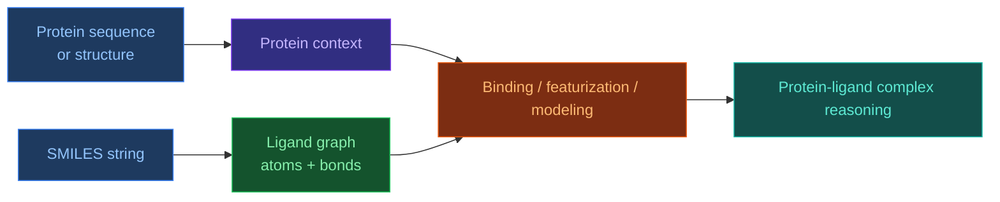

# Робота з SMILES файлами

[[UA/Головна]] > Ресурси
🇬🇧 [[EN/1. AlphaFold3/1.5. Resources/1.5.5. Working with SMILES Files|English]]

> Правильна назва формату: **SMILES** (`Simplified Molecular Input Line Entry System`), а не `SMILE`. Це текстове представлення хімічної структури, яке дозволяє кодувати молекулу одним рядком.

## Що таке SMILES і навіщо він потрібний

SMILES потрібний для компактного, машиночитаного запису молекули без потреби одразу зберігати повні 3D-координати.
Він зручний тому, що в одному рядку можна закодувати:

- атомний склад;
- порядок зв'язків;
- розгалуження;
- кільця;
- ароматичність;
- за потреби стереохімію.

Це робить SMILES стандартним форматом для:

- баз даних малих молекул;
- обміну лігандами між cheminformatics-інструментами;
- пошуку, фільтрації та canonicalization;
- побудови графа атомів і зв'язків перед `ML featurization`.

## Як SMILES влаштований

На концептуальному рівні SMILES є лінійним записом молекулярного графа.

- Атоми записуються символами елементів: `C`, `N`, `O`, `Cl`.
- Зв'язки можуть бути явними: `-`, `=`, `#`, або неявними.
- Розгалуження задають дужками: `CC(O)C`.
- Кільця позначають цифрами: `C1CCCCC1`.
- Стереохімію можна вказувати через `@`, `/`, `\`.

## Короткі приклади

| Молекула | SMILES | Що видно з рядка |
|---|---|---|
| Етанол | `CCO` | два карбони й термінальний кисень |
| Бензен | `c1ccccc1` | ароматичне кільце |
| Оцтова кислота | `CC(=O)O` | карбоніл + гідроксил |
| Гліцин | `NCC(=O)O` | амін + карбоксил |

## Як практично працювати зі SMILES

### 1. Перевірка синтаксису

Найперше потрібно перевірити, чи рядок коректно парситься.
У Python це найчастіше роблять через `RDKit`.

```python
from rdkit import Chem

smiles = "CC(=O)O"
mol = Chem.MolFromSmiles(smiles)

if mol is None:
    raise ValueError("Invalid SMILES")

print("Atoms:", mol.GetNumAtoms())
print("Bonds:", mol.GetNumBonds())
```

### 2. Canonical SMILES

Одна й та сама молекула може мати кілька валідних SMILES-рядків.
Тому часто використовують **canonical SMILES** для стандартизації.

```python
from rdkit import Chem

smiles = "OC(=O)C"
mol = Chem.MolFromSmiles(smiles)
canonical = Chem.MolToSmiles(mol, canonical=True)
print(canonical)  # CC(=O)O
```

### 3. Генерація 2D/3D-представлення

SMILES сам по собі не містить повноцінної експериментальної 3D-геометрії.
Але з нього можна:

- побудувати molecular graph;
- згенерувати 2D depiction;
- оцінити 3D conformer алгоритмічно.

```python
from rdkit import Chem
from rdkit.Chem import AllChem

smiles = "c1ccccc1O"
mol = Chem.MolFromSmiles(smiles)
mol = Chem.AddHs(mol)
AllChem.EmbedMolecule(mol, randomSeed=7)
AllChem.UFFOptimizeMolecule(mol)

print("Conformers:", mol.GetNumConformers())
```

## Що SMILES не кодує добре або не кодує взагалі

SMILES дуже корисний, але це не повний замінник структурного файлу.

Він не дає напряму:

- експериментальної 3D-пози;
- контексту binding pocket;
- білкового оточення;
- надійної інформації про preferred bound conformation;
- повного сольватного або протонаційного стану в конкретному середовищі.

Тому SMILES добре описує **хімію молекули**, але не весь біофізичний контекст зв'язування.

## Як SMILES пов'язаний з білками

SMILES не описує білок, але описує малу молекулу, яка з білком взаємодіє.
У зв'язці `protein + ligand` маємо два різні типи вхідних даних:

- білок зазвичай задають послідовністю (`FASTA`) або структурою (`mmCIF`);
- ліганд часто задають через `SMILES`, `CCD code` або готові 3D координати.

Тобто SMILES є способом дати моделі або пайплайну **хімічну ідентичність ліганду**, тоді як білок задає **біологічний контекст мішені**.



## Як SMILES пов'язаний з AlphaFold 3

У контексті AF3 або AF3-подібних пайплайнів SMILES важливий як вхід для **ligand featurization**.
Практична логіка така:

1. SMILES парситься в molecular graph.
2. Із графа витягуються атоми, типи зв'язків, заряди та інші ознаки.
3. Ці ознаки перетворюються на тензорні представлення ліганду.
4. Далі модель розглядає ligand-представлення разом із білковим контекстом.

У цій базі знань це вже відображено в нотатці про `Featurization`: ліганд може заходити як `SMILES` або як `CCD code`, а далі токенізується на рівні атомів. Для AF3 це важливо, бо модель працює не лише з білками, а й з `multimolecular systems`, де мала молекула є повноцінною частиною комплексу.

## Коли краще використовувати SMILES, а коли mmCIF / CCD

| Формат | Коли зручний | Що дає |
|---|---|---|
| `SMILES` | коли є лише хімічна формула молекули | граф атомів і зв'язків |
| `CCD code` | коли ліганд стандартний і є в PDB CCD | стандартну хімічну довідку |
| `mmCIF` | коли вже є конкретна структура комплексу | реальні координати атомів у контексті |

Отже:

- `SMILES` хороший для опису **що це за молекула**;
- `mmCIF` хороший для опису **де саме ця молекула знаходиться в структурі**.

## Додаткові приклади використання SMILES

- пошук аналогів у хімічних базах;
- генерація molecular descriptors;
- побудова fingerprint-представлень;
- training data для ligand ML-моделей;
- підготовка вхідних даних для docking або ligand-aware structure modeling.

## Пов'язані нотатки

- [[UA/2. Концепції/2.1. Біологія/2.1.3. Ліганди та малі молекули|Ліганди та малі молекули]]
- [[UA/1. AlphaFold3/1.2. Архітектура/1.2.6. Featurization|Featurization]]
- [[UA/1. AlphaFold3/1.5. Ресурси/1.5.4. Робота з mmCIF файлами|Робота з mmCIF файлами]]
- [[UA/3. Моделі/3.5. DiffDock|DiffDock]]

> Weininger (1988). *SMILES, a chemical language and information system. 1. Introduction to methodology and encoding rules*. Journal of Chemical Information and Computer Sciences.
> DOI: [10.1021/ci00057a005](https://doi.org/10.1021/ci00057a005)

> O'Boyle (2012). *Open Babel: An open chemical toolbox*. Journal of Cheminformatics.
> DOI: [10.1186/1758-2946-3-33](https://doi.org/10.1186/1758-2946-3-33)

> Abramson et al. (2024). *Accurate structure prediction of biomolecular interactions with AlphaFold 3*. Nature.
> DOI: [10.1038/s41586-024-07487-w](https://doi.org/10.1038/s41586-024-07487-w)
