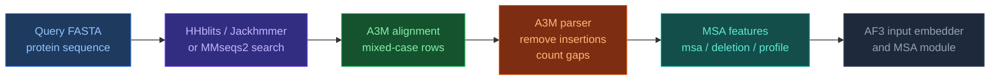

# Робота з A3M файлами

[[UA/Головна]] > Ресурси
🇬🇧 [[EN/1. AlphaFold3/1.5. Resources/1.5.6. Working with A3M Files|English]]

> **A3M** (`alignment format`) — компактний формат для `multiple sequence alignment` (множинного вирівнювання послідовностей, MSA), який типово генерують `HHblits`, інструменти `HHsuite` або пайплайни `MMseqs2`/`ColabFold`. На відміну від звичайного `FASTA`, він зберігає не лише вирівняні колонки, а й інсерції відносно `query` через `mixed case` (змішаний регістр).

## Що таке A3M і навіщо він потрібний

`A3M` зручний тоді, коли потрібно передати моделі або `downstream`-скриптам (наступним крокам пайплайна) не просто список гомологів, а саме **вирівнювання відносно `query`-послідовності**.

Практично це потрібно для трьох задач:

- компактно зберігати MSA без явного роздування вставок у всіх рядках;
- відокремлювати `aligned columns` (вирівняні колонки) від інсерцій, які не відповідають токенним позиціям `query`;
- будувати ознаки для `AlphaFold`-подібних пайплайнів: `msa`, `has_deletion`, `deletion_value`, `profile`.

Для AF2/AF3-пайплайнів це особливо корисно, бо модель працює не з "красивим текстовим `alignment` (вирівнюванням)", а з тензорним представленням, де кожна позиція повинна збігатися з довжиною `query`.



## Як читати синтаксис A3M

| Елемент | Значення в A3M | Що робити під час `Featurization` |
| --- | --- | --- |
| Великі літери `A-Z` | вирівняні залишки, що відповідають колонкам `query` | зберігати як токени |
| Малі літери `a-z` | інсерції в гомолозі відносно `query` | не робити окремими токенами; накопичувати як `insertion count` (лічильник інсерцій) |
| `-` | гап (пропуск) у вирівняній колонці | кодувати як `gap / deletion token` (токен пропуску / делеції) |
| `.` | опційний `placeholder` (заповнювач) в `insert-only` колонках у деяких інструментах | зазвичай ігнорувати |
| `>` | початок нового запису | новий рядок MSA |

Ключова ідея: довжина сирого рядка `A3M` не обов'язково дорівнює довжині `query`, бо малі літери не є окремими `query positions` (позиціями `query`).

## Короткий приклад

```text
>query
MKTAYIAKQRQISFVKSHFSRQDILD
>hit_exact
MKTAYIAKQRQISFVKSHFSRQDILD
>hit_with_insertion
MKTAYIAKQRQISFVKSHFasRQDILD
>hit_with_gap
MKTA-IAKQRQISFVKSHFSRQDILD
```

Тут:

- `hit_exact` повністю збігається з `query`;
- у `hit_with_insertion` символи `as` — це **інсерція** між двома вирівняними колонками;
- у `hit_with_gap` символ `-` означає відсутність залишку в одній із вирівняних колонок.

Після декодування до `query`-осі:

- малі літери вилучаються з токенного ряду;
- `-` зберігається як `gap` (пропуск);
- кількість вилучених малих літер переноситься в ознаку `deletion_value` для наступної вирівняної позиції.

## Чим A3M відрізняється від FASTA і Stockholm

| Формат | Що зберігає | Типовий сценарій |
| --- | --- | --- |
| `FASTA` | окремі послідовності без `alignment`-семантики | сирі білкові або нуклеотидні послідовності |
| `A3M` | компактне MSA з `mixed-case` вставками | `HHblits`, `HHsearch`, `ColabFold`, AF2/AF3 `preprocessing` (попередня обробка) |
| `Stockholm` | MSA + анотації по колонках і сімейству | Pfam/Rfam, `curated alignments` (куровані вирівнювання) |

Отже, `A3M` — це радше **інженерний формат для моделей і `search pipelines` (пошукових пайплайнів)**, а `Stockholm` — формат для багатших анотацій і `curated MSA` (курованих вирівнювань).

## Практичний парсинг у Python

Найнебезпечніша помилка під час роботи з `A3M` — зробити `upper()` для всього файла. Це знищує інформацію про інсерції.

```python
def parse_a3m(path: str) -> list[tuple[str, str]]:
    """
    Reads an A3M file and preserves mixed case.
    Returns [(header, raw_sequence), ...].
    """
    records = []
    header = None
    buf = []

    with open(path, "r") as fh:
        for line in fh:
            line = line.rstrip()
            if not line:
                continue
            if line.startswith(">"):
                if header is not None:
                    records.append((header, "".join(buf)))
                header = line[1:]
                buf = []
            else:
                buf.append(line)

    if header is not None:
        records.append((header, "".join(buf)))
    return records


def decode_a3m_row(raw_seq: str) -> tuple[str, list[int]]:
    """
    Converts one raw A3M row to:
      1. aligned sequence on the query axis;
      2. insertion counts before each aligned position.
    """
    aligned = []
    insertions = []
    pending = 0

    for ch in raw_seq:
        if ch.islower():
            pending += 1
        elif ch == ".":
            continue
        else:
            aligned.append(ch)
            insertions.append(pending)
            pending = 0

    return "".join(aligned), insertions


records = parse_a3m("query.a3m")
query_header, query_raw = records[0]

for header, raw_seq in records[:3]:
    aligned, ins = decode_a3m_row(raw_seq)
    print(header)
    print("aligned:", aligned)
    print("insertions_before_cols:", ins[:10])
```

Ця схема відповідає базовій логіці `AF3`-стилю:

- `aligned` стає рядком довжини `query_len`;
- `-` лишається окремим токеном;
- `insertions` можна перетворити на `log1p`-масштабовану ознаку `deletion_value`.

## Типові операції з A3M

```bash
# Stockholm -> A3M
reformat.pl sto a3m query.sto query.a3m

# A3M -> alignment FASTA without Stockholm annotations
reformat.pl a3m fas query.a3m query.aln.fasta

# Filter redundant rows by sequence identity
hhfilter -i query.a3m -o query_id90.a3m -id 90 -cov 75

# Build HHM profile from A3M
hhmake -i query.a3m -o query.hhm
```

На практиці це означає:

- `reformat.pl` зручно використовувати для конверсій між MSA-форматами;
- `hhfilter` зменшує надлишковість MSA перед побудовою ознак;
- `hhmake` перетворює `A3M` у профільний `HMM`, потрібний для `HHsearch`-сумісних кроків.

## Звідки беруть A3M на практиці

Сам `.a3m` файл зазвичай не "скачують як готовий датасет", а **генерують пошуком по великих `sequence databases` (базах послідовностей)** або отримують від сервісу, який цей пошук уже виконав.

| Джерело | Як отримують A3M | Коли це зручно |
| --- | --- | --- |
| `UniRef90` | `HHblits` пошук по кластерах високої ідентичності | швидкий старт, близькі гомологи |
| `UniRef30` | другий `HHblits` прохід по більш грубих кластерах | дальші гомологи, ширше покриття |
| `UniProt` | `Jackhmmer` → `Stockholm` → `reformat.pl sto a3m` | максимальна еволюційна глибина |
| `ColabFold MMseqs2 server` | сервіс повертає готовий `A3M` | коли не хочеться ставити локальні бази на сотні GB |
| `curated family alignments` | існуючий `Stockholm`/`FASTA`-`alignment` конвертують у `A3M` | ручні або `domain-specific` MSA-пайплайни |

Практично це виглядає так:

- `UniRef90` і `UniRef30` дають основну масу білкових гомологів для AF-подібних пайплайнів;
- `UniProt` корисний, коли потрібні рідкісні або слабші гомологи;
- `ColabFold` корисний як найпростіший шлях "послідовність → готовий `.a3m`";
- `curated alignments` доречні, коли у вас вже є сімейний MSA і потрібно лише перевести його в робочий інженерний формат.

### Мінімальний практичний набір джерел

Якщо мета просто отримати `.a3m` для одного білка, зазвичай достатньо одного з двох сценаріїв:

1. `ColabFold MMseqs2 server` — найпростіший варіант без локальної інфраструктури.
2. `HHblits` + `UniRef90`/`UniRef30` — якщо потрібен локальний, відтворюваний пайплайн.

Якщо потрібна максимальна повнота:

1. `HHblits` по `UniRef90`;
2. `HHblits` по `UniRef30`;
3. `Jackhmmer` по `UniProt`;
4. об'єднання й фільтрація отриманих `.a3m`.

## Як A3M використовується в AlphaFold 3

У `AF3` роль `MSA` менша, ніж в `AF2`, але `A3M` усе ще важливий як проміжний формат між `sequence search` (пошуком послідовностей) і тензорними ознаками.

Практичний ланцюжок такий:

1. `HHblits`, `Jackhmmer` або `MMseqs2` знаходять гомологи.
2. Пошуковий інструмент повертає `A3M` або формат, який легко конвертується в `A3M`.
3. Перший рядок (`query`) визначає `query axis`.
4. Нижній регістр видаляється з токенного представлення, але не губиться семантично.
5. Пайплайн обчислює `msa`, `has_deletion`, `deletion_value`, `profile`.
6. Ці ознаки надходять в `input embedder` і скорочений `MSA module`.

Для `AF3`-подібних реалізацій це означає, що `A3M` потрібний не як кінцевий "людський" формат, а як **міст між `evolutionary search` (еволюційним пошуком) і `numeric Featurization`**.

## Обмеження і типові помилки

- Не слід трактувати `A3M` як звичайний `FASTA`: `mixed case` (змішаний регістр) тут має зміст.
- Не слід бездумно прибирати `-`, якщо вам потрібна відповідність `query`-позиціям.
- Не всі візуалізатори однаково добре показують різницю між великими й малими літерами.
- `A3M` зручний переважно для білкових MSA; для `richly annotated family alignments` (сімейних вирівнювань з багатими анотаціями) частіше зручніший `Stockholm`.
- Якщо `query` не стоїть у першому рядку, багато `downstream`-скриптів (наступних кроків пайплайна) працюватимуть некоректно або двозначно.

## Пов'язані нотатки

- [[UA/2. Концепції/2.3. Структурна-Біоінформатика/2.3.4. MSA|MSA]]
- [[UA/1. AlphaFold3/1.2. Архітектура/1.2.6. Featurization|Featurization]]
- [[UA/1. AlphaFold3/1.5. Ресурси/1.5.3. Робота з FASTA файлами|Робота з FASTA файлами]]
- [[UA/1. AlphaFold3/1.5. Ресурси/1.5.4. Робота з mmCIF файлами|Робота з mmCIF файлами]]
- [[UA/4. Датасети/4.2. UniProt|UniProt]]

> Remmert et al. (2012). *HHblits: lightning-fast iterative protein sequence searching by HMM-HMM alignment*. Nature Methods.
> DOI: [10.1038/nmeth.1818](https://doi.org/10.1038/nmeth.1818)

> Mirdita et al. (2022). *ColabFold: making protein folding accessible to all*. Nature Methods.
> DOI: [10.1038/s41592-022-01488-1](https://doi.org/10.1038/s41592-022-01488-1)

> Abramson et al. (2024). *Accurate structure prediction of biomolecular interactions with AlphaFold 3*. Nature.
> DOI: [10.1038/s41586-024-07487-w](https://doi.org/10.1038/s41586-024-07487-w)
