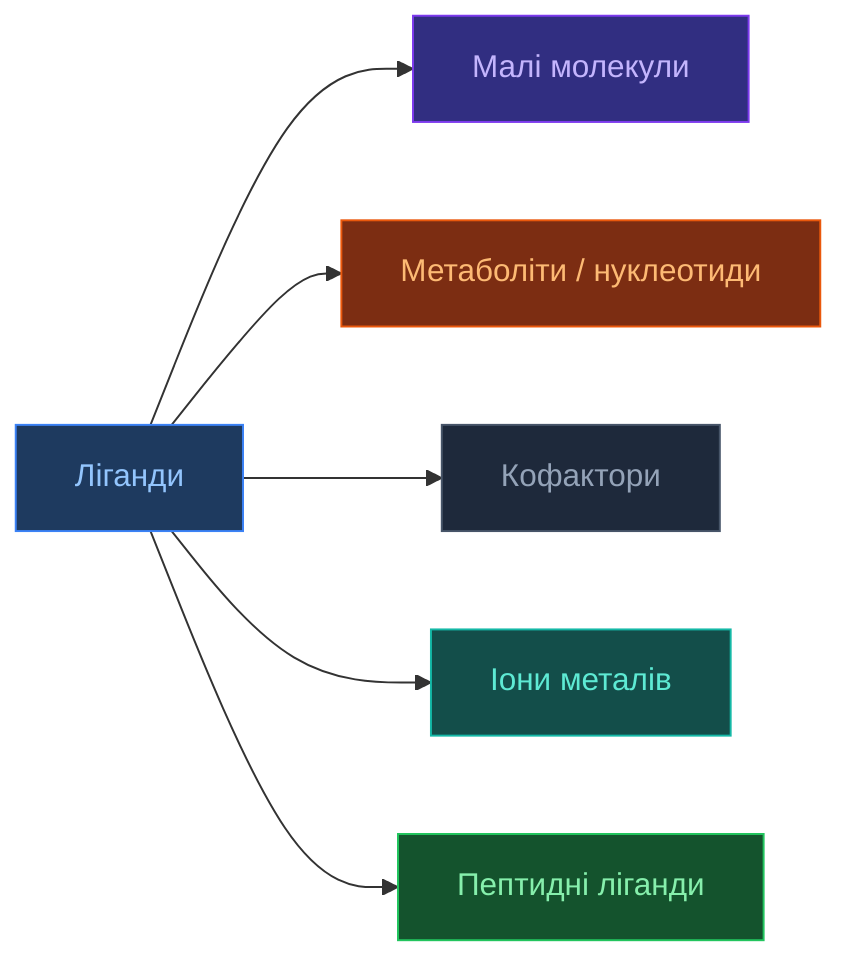
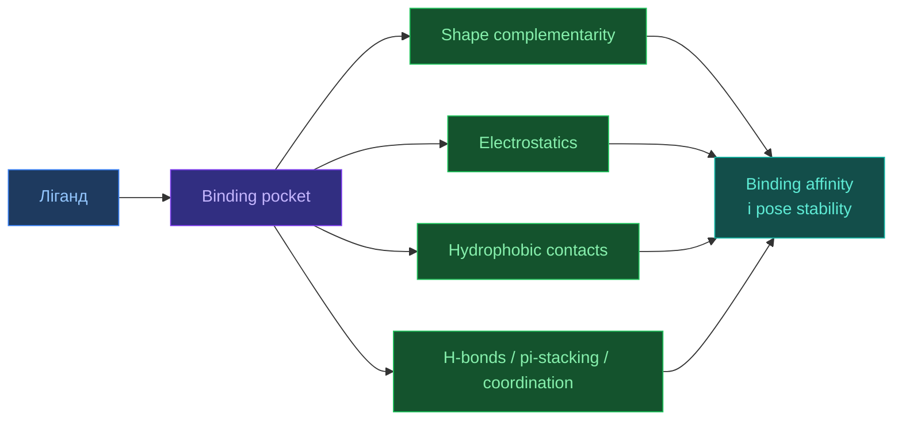
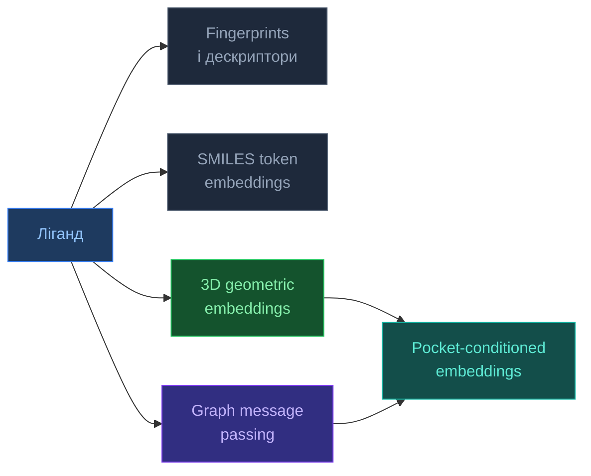

# Ліганди та малі молекули

[[UA/Головна]] > [[UA/Індекс|Концепції]] > Біологія
🇬🇧 [[EN/2. Concepts/2.1. Biology/2.1.3. Ligands and Small Molecules|English]]

> **Ліганд** — це молекула або іон, що зв'язується з біомолекулярною мішенню: білком, нуклеїновою кислотою або комплексом. Для структурної біології ліганд важливий не лише як "пасажир", а як активний фактор, що змінює конформацію, функцію, стабільність і специфічність системи.

## Чому ліганди настільки важливі

У багатьох біологічних системах функція визначається не тільки самою макромолекулою, а її станом після зв'язування ліганду.
Ліганд може:

- активувати або інгібувати фермент;
- стабілізувати конкретну конформацію білка;
- запускати сигналізацію через receptor binding;
- слугувати кофактором, без якого реакція не відбувається;
- змінювати специфічність білок-білкових або білок-нуклеїнових взаємодій.

Тому protein structure без ligand context часто не дає повної картини функції.

## Що вважають лігандом

У широкому сенсі ligand — це не лише `drug-like small molecule`.
До лігандів належать:

- малі органічні молекули;
- метаболіти;
- нуклеотиди (`ATP`, `GTP`, `NAD+`);
- кофактори (`heme`, `FAD`, `PLP`);
- іони (`Zn2+`, `Mg2+`, `Ca2+`);
- короткі пептиди;
- іноді навіть інші макромолекулярні партнери, якщо дивитися на систему з боку receptor-ligand логіки.

## Основні класи

| Клас | Типовий розмір | Приклади | Типова роль |
| --- | --- | --- | --- |
| `Drug-like small molecules` | ~150–600 Да | інгібітори кіназ, anti-infectives | модулювання білка |
| `Metabolites` | малі–середні | ATP, glucose, SAM | клітинна хімія |
| `Cofactors` | малі–середні | heme, FAD, NAD+ | каталіз, electron transfer |
| `Ions` | 1 атом | Zn2+, Mg2+, Ca2+ | каталіз, стабілізація, координація |
| `Peptide ligands` | кілька–десятки АК | гормони, сигнальні пептиди | receptor binding |

## Чому ligand binding відбувається

Зв'язування не є "магічним прилипанням", а наслідком зниження вільної енергії системи:

$$\Delta G_{\text{bind}} = \Delta H - T\Delta S$$

а також:

$$\Delta G_{\text{bind}} = RT \ln K_d$$

або еквівалентно:

$$\Delta G_{\text{bind}} = -RT \ln K_a$$

де:

- $K_d$ — константа дисоціації;
- $K_a$ — константа асоціації.

Чим менший $K_d$, тим сильніша афінність.

## Інтерпретація афінності

| Афінність | Типовий $K_d$ | Інтуїція |
| --- | --- | --- |
| Дуже слабка | `> 1 mM` | фрагменти, нестабільне зв'язування |
| Слабка | `1–100 µM` | ранні хіти |
| Помірна | `0.1–1 µM` | оптимізовані lead-compounds |
| Висока | `1–100 nM` | сильні drug-like binders |
| Дуже висока | `< 1 nM` | дуже тісне зв'язування |

## Які сили тримають ліганд у кишені

Ligand binding майже завжди є сумою кількох внесків:

- shape complementarity;
- hydrophobic effect;
- hydrogen bonds;
- electrostatics;
- pi-stacking;
- cation-pi interactions;
- metal coordination;
- desolvation balance.

## Binding pocket

Кишеня зв'язування важлива не менше за сам ligand.
Її зазвичай описують через:

- об'єм і форму;
- полярність;
- наявність donor/acceptor sites;
- гідрофобне ядро;
- присутність структурних вод або металів;
- конформаційну гнучкість.

Одна з головних причин складності docking-задачі полягає в тому, що pocket часто не є жорстким: білок може підлаштовуватися під ligand.

## Drug-likeness і правило Ліпінського

Для багатьох пероральних молекул корисною евристикою є `Rule of Five`:

$$M_w \leq 500,\quad \log P \leq 5,\quad \mathrm{HBD} \leq 5,\quad \mathrm{HBA} \leq 10$$

де:

- `HBD` — hydrogen bond donors;
- `HBA` — hydrogen bond acceptors.

Це не "закон природи", а практичне правило для medicinal chemistry.
Винятків багато:

- macrocycles;
- natural products;
- transporter-dependent compounds;
- covalent inhibitors;
- peptide-like drugs.

## Основні підходи до моделювання ligand binding

| Підхід | Що робить | Сильні сторони | Обмеження |
| --- | --- | --- | --- |
| `Classical docking` | Шукає pose у pocket + scoring | Швидкість, інтерпретованість | Часто спрощена фізика |
| [[UA/3. Моделі/3.5. DiffDock]] | Генерує poses через diffusion | Кілька plausible poses, modern generative setup | Все ще вузька docking-задача |
| [[UA/3. Моделі/3.2. AlphaFold3]] | Моделює цілий biomolecular complex | Єдиний контекст для protein + ligand + інші сутності | Важчий generalist-підхід |
| `MD / free-energy methods` | Уточнює динаміку й енергії | Краща фізична деталізація | Дорого й повільно |

## Два значення терміна `embedding` у хімії

У моделюванні молекул і лігандів слово **embedding** вживають у двох різних, але пов'язаних сенсах:

- **Representation-learning embedding**: вектор, тензор, стан графа або геометричне латентне представлення, яким ML-модель кодує молекулу чи ліганд.
- **Physics-based embedding**: розбиття біохімічної системи на активну область і оточення, які рахуються на різних рівнях теорії, як у `QM/MM`, `ONIOM`, fragment methods або density-based embedding.

Доданий тут огляд Frontiers присвячений переважно другому значенню: `embedding` як multiscale-стратегії для великих біохімічних систем. Для AF3 і docking-моделей, однак, користувачі частіше мають на увазі перше значення: як саме ліганд кодується до або всередині нейронної мережі.

## Основні методи embedding для молекул і лігандів

| Сімейство методів | Основний об'єкт | Що добре кодує | Головна слабкість | Типове застосування |
| --- | --- | --- | --- | --- |
| `Fingerprints / descriptors` | Глобальний bit-vector або feature vector молекули | субструктури, прості physchem priors, дешевий similarity search | слабке врахування 3D і protein context | screening, QSAR baselines |
| `SMILES token embeddings` | 1D послідовність токенів | синтаксис, повторювані мотиви, масштабоване pretraining | неоднозначна 3D геометрія, чутливість до порядку атомів | generative chemistry, sequence-style pretraining |
| `Graph neural embeddings` | граф атомів і зв'язків | локальна хімія, topology зв'язків, контекст сусідів | для whole-molecule задач потрібен pooling, без 3D ознак є межі | property prediction, ligand encoders |
| `3D geometric embeddings` | конформер з координатами | стереохімію, відстані, просторові обмеження | залежать від якості конформації | docking, pose scoring, conformation-aware prediction |
| `Pocket-conditioned embeddings` | ліганд разом із рецепторним контекстом | complementarity у binding site, pose-dependent interactions | складніше навчання, залежність від якості pocket | docking, pose generation, complex modeling |

На практиці сучасні ligand-пайплайни часто комбінують ці підходи, а не вибирають лише один. Наприклад, система може стартувати зі `SMILES`, побудувати molecular graph, згенерувати конформер, а далі порахувати pocket-conditioned representation відносно білкової кишені.

## AF3 і ліганди

AF3 важливий тим, що ligand не є зовнішнім додатком до білка, а входить у спільне представлення комплексу.
Це дозволяє:

- моделювати ligand binding у контексті всієї системи;
- враховувати взаємний вплив між ligand pose і protein conformation;
- працювати зі змішаними системами `protein + nucleic acid + ligand`.

На практиці AF3 особливо цікавий як unified complex predictor, тоді як спеціалізовані docking-методи на кшталт [[UA/3. Моделі/3.5. DiffDock]] зберігають перевагу в чітко визначеній ligand-docking постановці.

## Чому ліганди залишаються складною задачею

- **Хімічна різноманітність**: ligand space значно різноманітніший за alphabet поліпептидів.
- **Конформаційна свобода**: торсійні кути сильно ускладнюють пошук правильної pose.
- **Protein flexibility**: pocket може змінювати форму під час зв'язування.
- **Solvent effects**: вода й іони часто критично впливають на binding.
- **Стереохімія**: формально схожа pose може бути хімічно неправдоподібною.

## Додаткові приклади використання ligand-концепції

- **Ферментологія**: субстрат, продукт, конкурентний інгібітор.
- **Сигналізація**: гормон або small-molecule agonist/antagonist для рецептора.
- **Структурна стабілізація**: гем, метал, кофермент.
- **Drug discovery**: hit finding, lead optimization, pose refinement.
- **Chemical biology**: probe molecules для вимкнення або маркування білка.

## Пов'язані нотатки

- [[UA/2. Концепції/2.3. Структурна-Біоінформатика/2.3.3. DockQ|DockQ]]
- [[UA/2. Концепції/2.3. Структурна-Біоінформатика/2.3.1. RMSD|RMSD]]
- [[UA/3. Моделі/3.5. DiffDock|DiffDock]]
- [[UA/3. Моделі/3.2. AlphaFold3|AlphaFold3]]
- [[UA/1. AlphaFold3/1.2. Архітектура/1.2.6. Featurization|Featurization]]
- [[UA/1. AlphaFold3/1.5. Ресурси/1.5.5. Робота з SMILES файлами|Робота з SMILES файлами]]
- [[UA/1. AlphaFold3/1.3. Результати/1.3.1. Точність по типах комплексів|Точність по типах комплексів]]
- [[UA/1. AlphaFold3/1.5. Ресурси/1.5.4. Робота з mmCIF файлами|Робота з mmCIF файлами]]

> Lipinski et al. (2001). *Experimental and computational approaches to estimate solubility and permeability in drug discovery and development settings*. Advanced Drug Delivery Reviews.
> DOI: [10.1016/S0169-409X(00)00129-0](https://doi.org/10.1016/S0169-409X(00)00129-0)

> Abramson et al. (2024). *Accurate structure prediction of biomolecular interactions with AlphaFold 3*. Nature.
> DOI: [10.1038/s41586-024-07487-w](https://doi.org/10.1038/s41586-024-07487-w)

> Corso et al. (2023). *DiffDock: Diffusion Steps, Twists, and Turns for Molecular Docking*. ICLR.
> DOI: [10.48550/arXiv.2210.01776](https://doi.org/10.48550/arXiv.2210.01776)

> Weininger (1988). *SMILES, a chemical language and information system. 1. Introduction to methodology and encoding rules*. Journal of Chemical Information and Computer Sciences.
> DOI: [10.1021/ci00057a005](https://doi.org/10.1021/ci00057a005)

> Rogers and Hahn (2010). *Extended-Connectivity Fingerprints*. Journal of Chemical Information and Modeling.
> DOI: [10.1021/ci100050t](https://doi.org/10.1021/ci100050t)

> Gilmer et al. (2017). *Neural Message Passing for Quantum Chemistry*. ICML.
> DOI: [10.48550/arXiv.1704.01212](https://doi.org/10.48550/arXiv.1704.01212)

> Cheng et al. (2020). *Application of Quantum Computing to Biochemical Systems: A Look to the Future*. Frontiers in Chemistry.
> DOI: [10.3389/fchem.2020.587143](https://doi.org/10.3389/fchem.2020.587143)
