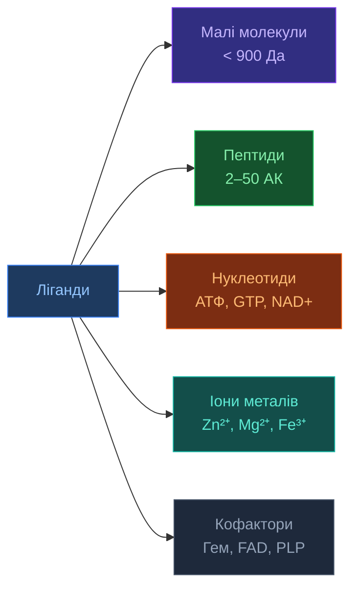
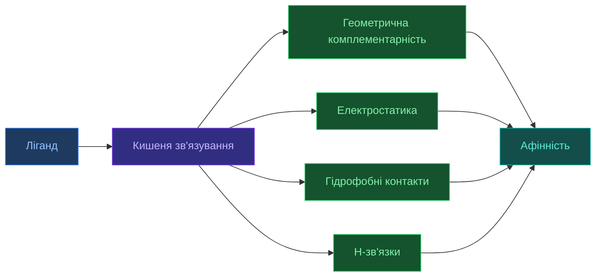

# Ліганди та малі молекули

[[UA/Головна]] > [[UA/Індекс|Концепції]] > Біологія
🇬🇧 [[EN/2. Concepts/2.1. Biology/2.1.3. Ligands and Small Molecules|English]]

> **Ліганд** — мала молекула (зазвичай $M_w < 900$ Да), що зв'язується з білком у специфічному сайті та змінює його активність. Основа сучасної фармакології.

---

## Класифікація лігандів

## Термодинаміка зв'язування

$$\Delta G_\text{bind} = -RT\ln K_d = \Delta H - T\Delta S$$

де $K_d$ — константа дисоціації:

$$K_d = \frac{[\text{Protein}][\text{Ligand}]}{[\text{Complex}]}$$

| Афінність | $K_d$ | Приклад |
|-----------|--------|---------|
| Дуже слабка | $> 1$ мМ | Фрагменти |
| Слабка | $1–100$ мкМ | Початкові хіти |
| Помірна | $0.1–1$ мкМ | Оптимізовані сполуки |
| Висока | $1–100$ нМ | Більшість ліків |
| Дуже висока | $< 1$ нМ | Антитіла, деякі ліки |

## Правило Ліпінського (Rule of Five)

Для перорально активних ліків:

$$M_w \leq 500\ \text{Да} \quad \log P \leq 5 \quad \text{HBD} \leq 5 \quad \text{HBA} \leq 10$$

де HBD = донори H-зв'язків, HBA = акцептори H-зв'язків.

> Lipinski et al. (2001). DOI: [10.1016/S0169-409X(00)00129-0](https://doi.org/10.1016/S0169-409X(00)00129-0)

## Сайт зв'язування (Binding Pocket)

Кишеня зв'язування характеризується:
- **Об'єм** (ų): типово 200–1000 ų для drug-like ліганду
- **Druggability score** — чи підходить для зв'язування малої молекули
- **Гідрофобність** — більшість кишень мають гідрофобне ядро
- **Специфічні фармакофорні точки** — H-донори/акцептори, заряди

## AF3 і ліганди: революція

AF3 — **перша модель**, що передбачає положення ліганду без кристалографічних даних:

| Метрика | AF3 | Попередники |
|---------|-----|-------------|
| PoseBusters (428 комплексів) | **76.4%** | ~20–30% |
| Хімічна валідність пози | **~99%** | <80% |
| RMSD < 2 Å | ~60% | ~30% |

Ліганди представлені як **граф атомів + зв'язків** і обробляються нарівні з амінокислотами.

> Abramson et al. (2024). Nature 630. DOI: [10.1038/s41586-024-07487-w](https://doi.org/10.1038/s41586-024-07487-w)

---

## Пов'язані нотатки

- [[UA/2. Концепції/2.3. Структурна-Біоінформатика/2.3.3. DockQ]]
- [[UA/2. Концепції/2.3. Структурна-Біоінформатика/2.3.1. RMSD]]
- [[UA/1. AlphaFold3/1.3. Результати/1.3.1. Точність по типах комплексів]]
- [[UA/1. AlphaFold3/1.5. Ресурси/1.5.4. Робота з mmCIF файлами]]
